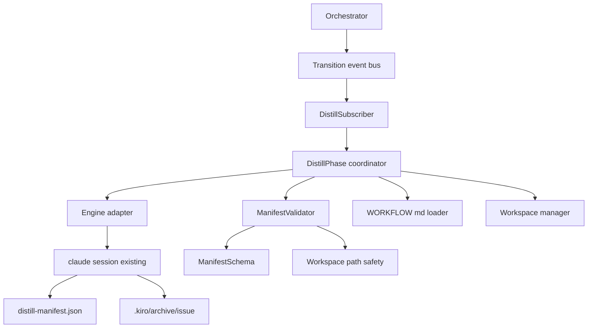
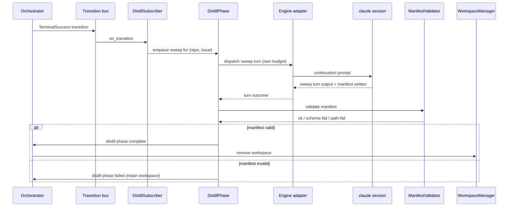
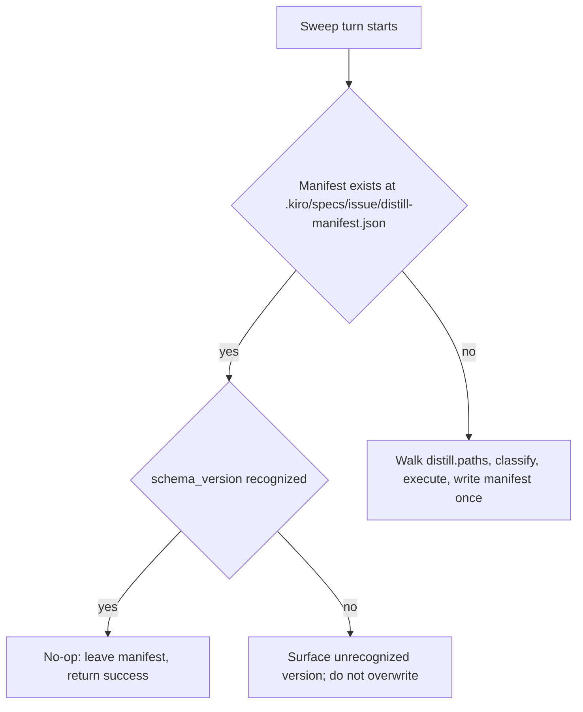

---
refs:
  id: design:roki-distill-postmerge
  kind: design
  title: "roki-distill-postmerge Design"
  spec: roki-distill-postmerge
  implements:
    - requirements:roki-distill-postmerge
---

# Design Document

## Overview

**Purpose**: roki-distill-postmerge adds a post-terminal-state phase to the roki-mvp per-issue state machine. After an issue reaches `TerminalSuccess` (driven by the agent observing Linear `Done`/PR merge), the daemon dispatches a single bounded sweep turn that has the agent classify and route flow-type artifacts (kiro `design.md` and `tasks.md`, superpowers specs, plan outputs, scratch notes) into one of three dispositions — delete, archive, distill — and write a manifest. The daemon validates the manifest against a stable JSON-Schema and against roki-mvp's path-safety invariants before allowing terminal cleanup of the workspace.

**Users**: A solo developer or small team operator already running roki-mvp who wants flow-type artifacts handled deterministically post-merge without manually grooming `.kiro/specs/<issue>/`, `.superpowers/specs/`, `plans/`, or `notes/` after each ticket.

**Impact**: Inserts a new phase between roki-mvp's `TerminalSuccess` transition and its existing post-terminal workspace deletion. roki-mvp must publish a vetoable hook on the existing transition into `TerminalSuccess` (or a thin extension to allow a deferred-cleanup gate); this spec subscribes to that hook and gates cleanup until manifest validation passes. No other roki-mvp boundary changes.

### Goals
- A post-terminal phase in the orchestrator that runs exactly once per `(repo, issue)` per terminal transition and gates workspace deletion.
- A constrained sweep turn dispatched against the existing per-issue Claude Code session, with its own turn budget separate from the implementation phase.
- A stable, version-tagged manifest schema at `.kiro/specs/<issue>/distill-manifest.json` with three dispositions: `delete`, `archive`, `distill`.
- Daemon-side validation of manifest schema and path safety before terminal cleanup. No LLM judgment daemon-side.
- Idempotent re-run: existing valid manifest is honored; the agent skips re-execution and the daemon proceeds straight to cleanup.
- Stable archive path scheme rooted at `.kiro/archive/<issue>/`, mirroring the original relative path beneath the archive root.
- Configurable artifact discovery via `WORKFLOW.md` `distill.paths` and classification via `distill.routes`, both under roki-mvp's reserved extension namespace.

### Non-Goals
- Cross-issue project-level distillation passes (deferred).
- Auto-commit / auto-PR for distill outputs (deferred to a follow-up).
- Real-time distillation during the run (out of scope by design).
- Pre-implementation distill (lives in roki-spec-gate).
- Daemon-side LLM judgment of any kind.
- Daemon-side merge detection via `gh` or GitHub API; merge detection is the agent's job.

## Boundary Commitments

### This Spec Owns
- The post-terminal phase and its activation policy: subscribing to roki-mvp's transition events, enqueuing one sweep turn on `TerminalSuccess`, gating workspace deletion until validation succeeds.
- The sweep turn dispatch: turn-budget enforcement separate from the implementation phase, stall-window reuse from roki-mvp's engine policy, single-turn semantics.
- The manifest schema (`schema_version`, `entries[]`, `summary{}`) published in `SPEC.md` and validated by a daemon-side JSON-Schema enforcer.
- Daemon-side validation logic that combines manifest schema validation and path-safety enforcement using roki-mvp's workspace path-safety module.
- The stable archive path scheme `.kiro/archive/<issue>/` and its mirroring rule for relative paths.
- The `WORKFLOW.md` extension keys `distill.paths` and `distill.routes` (additive under the existing reserved extension namespace).
- The distill phase failure state, the operator-recovery contract, and the structured log events for activation, sweep start/completion, manifest validation, and cleanup gating.

### Out of Boundary
- Artifact classification rules themselves; `distill.routes` content is operator policy, not this spec's concern.
- The agent-side sweep skill that walks paths, classifies, and writes the manifest. This spec references that skill as an open design point and does not over-specify it; the agent is expected to use a kiro/superpowers skill (TBD) that consumes `distill.paths` and `distill.routes` and produces the manifest.
- Linear writes, PR creation, GitHub state probing — same boundaries as roki-mvp.
- Cross-issue distillation, auto-commit, real-time distill, pre-impl distill.
- Modifications to the `TerminalSuccess` transition itself; this spec hooks the seam, it does not change merge or `Done` behavior.
- Any new daemon-side polling source for merge detection.

### Allowed Dependencies
- **roki-mvp** for: orchestrator transition event bus and subscription hooks, `WORKFLOW.md` loader and the reserved extension namespace, workspace manager and its path-safety module, engine adapter (for dispatching the sweep turn against the existing Claude Code session), structured logging pipeline.
- **roki-mvp's `linear_graphql` proxy tool** is not consumed by this phase; the sweep turn does not need Linear writes.
- **External**: `jsonschema` (Rust) for manifest validation (already declared in roki-mvp's stack for `WORKFLOW.md` schema validation; reused here).
- **External**: no new crates introduced specifically by this spec.

### Revalidation Triggers
Changes that should force dependent specs or operators to re-check integration:
- Any change to the manifest `schema_version` or the manifest fields enumerated in `SPEC.md`.
- Any change to the disposition set (currently `delete`, `archive`, `distill`).
- Any change to the archive path scheme or to the path-safety allowlist composition.
- Any change to the `distill.paths` or `distill.routes` schema shape under `WORKFLOW.md`'s extension namespace.
- Any change to which transition is the activation point, or to the gating semantics on workspace deletion.
- Any change to the sweep turn-budget contract that breaks the implementation-phase budget separation.

## Architecture

### Existing Architecture Analysis

roki-mvp publishes four extension seams this spec relies on:

1. **Transition event bus and subscription hooks** (`orchestrator/events.rs`, `orchestrator/hooks.rs`): the spec subscribes to `TerminalSuccess` transitions on `(repo, issue)` keys and uses the vetoable hook contract to gate the subsequent transition into the deleted-workspace state.
2. **WORKFLOW.md loader extension namespace** (`workflow/schema.rs`): the schema reserves an `extension.*` namespace where downstream specs add additive keys; `distill.paths` and `distill.routes` land under that namespace and round-trip through `WorkflowPolicy.extension`.
3. **Workspace path-safety module** (`workspace/mod.rs`, `workspace/layout.rs`): the spec reuses the canonical-path containment check rather than reimplementing it. Allowed roots are extended to include any operator-configured project archive root.
4. **Engine adapter** (`engine/mod.rs`): the spec dispatches the sweep turn against the same long-lived `claude --print --output-format stream-json` session that ran the implementation, so no new subprocess lifecycle is introduced.

The roki-mvp state diagram already shows `TerminalSuccess` as a terminal state followed by workspace deletion. This spec adds a phase between those two points; in implementation terms, that becomes a deferred-cleanup gate (no new state required) that consults the distill phase status.

### Architecture Pattern & Boundary Map



**Architecture Integration**:
- **Selected pattern**: Subscriber + phase coordinator over roki-mvp's hexagonal core. The phase is a tokio task driven by transition events; it owns no state machine of its own beyond an in-memory map of active distill phases keyed `(repo, issue)`.
- **Domain boundaries**: subscriber/phase coordinator (this spec) vs orchestrator core (roki-mvp). The phase consumes the engine adapter and the workspace manager through their existing traits; it does not modify them.
- **Existing patterns preserved**: ports-and-adapters; subscription-with-error-isolation; `WORKFLOW.md` extension via additive keys.
- **New components rationale**: a `DistillPhase` coordinator is needed because the work is not a state but a bounded async operation gated on a specific transition. A `ManifestValidator` is separated from the phase coordinator so the validation logic can be unit-tested in isolation and re-used if the operator triggers a manual re-validation flow.
- **Steering compliance**: Rust 2024 + tokio, no new persistent storage, kiro skills as personal skills (the agent-side sweep skill is referenced, not vendored).

### Technology Stack

| Layer | Choice / Version | Role in Feature | Notes |
|-------|------------------|-----------------|-------|
| Runtime | Rust 2024 + tokio 1.x | Async phase coordinator and subscriber | Reuses roki-mvp's runtime |
| Logging | tracing | Structured per-`(repo, issue)` distill events | Reuses roki-mvp's pipeline and redaction |
| Schema | jsonschema (Rust) | Validate manifest JSON against published schema | Already declared in roki-mvp's stack |
| Filesystem | std fs / tokio fs | Read manifest, canonicalize paths for safety check | std behavior; no new dependency |
| Workflow | liquid + serde_yaml | `WORKFLOW.md` extension keys for `distill.*` | Reuses roki-mvp's loader |
| Engine | tokio process (via roki-mvp engine adapter) | Sweep turn dispatched against existing session | No new subprocess lifecycle |

> No new crates are introduced. Manifest schema validation reuses the same `jsonschema` integration roki-mvp uses for `WORKFLOW.md`.

## File Structure Plan

### Directory Structure

```
src/
├── distill/
│   ├── mod.rs                       # Phase coordinator entry, subscriber wiring
│   ├── subscriber.rs                # TransitionSubscriber impl, hook registration
│   ├── phase.rs                     # DistillPhase async coordinator (per (repo, issue))
│   ├── dispatch.rs                  # Sweep turn dispatch via engine adapter
│   ├── manifest.rs                  # Manifest types, deserialization, summary checks
│   ├── schema.rs                    # ManifestSchema (JSON-Schema, version table)
│   ├── validator.rs                 # ManifestValidator: schema + path safety
│   ├── archive.rs                   # Stable archive path scheme constants and helpers
│   └── workflow_ext.rs              # distill.paths / distill.routes types under extension namespace
├── workflow/
│   └── schema.rs                    # MODIFIED: register distill.paths / distill.routes keys
├── orchestrator/
│   └── mod.rs                       # MODIFIED: wire DistillSubscriber and gate cleanup on phase status
SPEC.md                              # MODIFIED: append manifest schema and distill phase contract
WORKFLOW.example.md                  # MODIFIED: example distill.paths / distill.routes block
tests/
├── integration_distill_phase.rs     # End-to-end: terminal -> sweep -> validation -> cleanup
├── integration_distill_idempotency.rs
├── integration_distill_failure.rs   # Schema and path-safety failure paths
└── unit_distill_validator.rs
```

> The `distill/` module is self-contained: only `workflow/schema.rs` and `orchestrator/mod.rs` need light edits to register the extension keys and wire the subscriber. Everything else lives behind the `distill::` namespace.

### Modified Files
- `src/workflow/schema.rs` — Register `distill.paths` (list of workspace-relative path patterns) and `distill.routes` (list of `{ pattern, disposition, archive_root? }` rules) under the existing extension namespace. Additive only; existing consumers are unaffected.
- `src/orchestrator/mod.rs` — Construct and register `DistillSubscriber` at startup; route the deferred-cleanup gate decision through the distill phase status before invoking `WorkspaceManager::remove`.
- `SPEC.md` — Append the manifest schema (v1), the distill phase contract, the archive path scheme, and the `WORKFLOW.md` `distill.*` keys.
- `WORKFLOW.example.md` — Document a worked `distill.paths` and `distill.routes` example.

## System Flows

### Distill phase activation and gating



> The deferred-cleanup gate is a thin check the orchestrator performs before invoking `WorkspaceManager::remove`: when a `(repo, issue)` reaches `TerminalSuccess`, cleanup is held until the distill phase status for that key is `Complete`. Failure leaves the workspace in place and surfaces a structured log event.

### Sweep turn idempotency check (agent-side flow informally diagrammed)



## Requirements Traceability

| Requirement | Summary | Components | Interfaces | Flows |
|-------------|---------|------------|------------|-------|
| 1.1, 1.2, 1.3, 1.4, 1.5 | Phase activation, single-shot per terminal transition, no Linear/GitHub writes, cancellation on revert, structured logs | DistillSubscriber, DistillPhase, Orchestrator (deferred-cleanup gate) | TransitionSubscriber trait, DistillPhaseStatus | Distill phase activation and gating |
| 2.1, 2.2, 2.3, 2.4 | Merge detection lives agent-side; daemon adds no new GitHub source | DistillSubscriber, TrackerAdapter (unchanged) | Existing roki-mvp tracker contract | n/a |
| 3.1, 3.2, 3.3, 3.4, 3.5 | Sweep turn dispatch with own budget, stall window reuse, failure handling, logging | DistillPhase, SweepDispatcher, EngineAdapter | Engine trait reused; WorkerContext.sweep_budget | Distill phase activation and gating |
| 4.1, 4.2, 4.3, 4.4, 4.5 | `distill.paths` and `distill.routes` extension keys; defaults; hot reload; validation fallback | WorkflowExt (workflow_ext.rs), WorkflowLoader | WorkflowPolicy.extension.distill | n/a |
| 5.1, 5.2, 5.3, 5.4, 5.5 | Three dispositions; default-conservative archive; optional review.md / requirements.md inputs | (Agent-side; manifest types + validator constrain) ManifestEntry, DispositionEnum | Manifest schema | Sweep turn idempotency check |
| 6.1, 6.2, 6.3, 6.4, 6.5 | Disposition execution semantics on disk; failure entries recorded; no out-of-bounds writes | (Agent-side; validator enforces) | Manifest schema, path-safety contract | n/a |
| 7.1, 7.2, 7.3, 7.4, 7.5 | Manifest at fixed path; `schema_version`; `entries[]`; `summary{}`; single-write | Manifest, ManifestSchema | JSON-Schema v1 | n/a |
| 8.1, 8.2, 8.3, 8.4, 8.5 | Daemon-side validation: schema + path safety; failure retains workspace; no LLM | ManifestValidator, ManifestSchema, PathSafety reuse | Validator API | Distill phase activation and gating |
| 9.1, 9.2, 9.3, 9.4, 9.5 | Idempotent re-run; existing valid manifest is honored; unrecognized version is failure | DistillPhase, ManifestValidator | Manifest schema_version field | Sweep turn idempotency check |
| 10.1, 10.2, 10.3, 10.4, 10.5 | Stable archive path scheme; mirroring; no overwrite of prior archive; daemon validates scheme | Archive helpers, ManifestValidator | Archive path constants | n/a |
| 11.1, 11.2, 11.3, 11.4, 11.5 | Path-safety containment for sweep writes; allowlist includes optional project archive root; symlink/canonicalization defenses | ManifestValidator, roki-mvp Workspace path safety | Path-safety contract | n/a |
| 12.1, 12.2, 12.3, 12.4, 12.5 | Failure retention of workspace; failure observable as state; no auto-redispatch; operator-recovery flow; sufficient diagnostic context | DistillPhase, Orchestrator, Logging | DistillPhaseStatus enum | Distill phase activation and gating |
| 13.1, 13.2, 13.3, 13.4, 13.5 | Structured logs for every phase step; `(repo, issue)` + correlation id; redaction; manifest summary in validation log; never log artifact contents | Logging, ManifestValidator | tracing fields | n/a |

## Components and Interfaces

| Component | Domain/Layer | Intent | Req Coverage | Key Dependencies (P0/P1) | Contracts |
|-----------|--------------|--------|--------------|--------------------------|-----------|
| DistillSubscriber | Orchestrator integration | Subscribe to transition events; enqueue sweeps on `TerminalSuccess` | 1.1, 1.4, 1.5 | Orchestrator (P0), DistillPhase (P0) | Service, Event |
| DistillPhase | Phase coordinator | Drive the per-`(repo, issue)` sweep + validation + gating lifecycle | 1.1, 1.2, 3.1, 3.4, 8.1, 9.3, 12.1, 12.3 | EngineAdapter (P0), WorkflowLoader (P0), ManifestValidator (P0), WorkspaceManager (P1) | Service, State |
| SweepDispatcher | Engine integration | Send the sweep continuation prompt and observe the bounded turn | 3.1, 3.2, 3.3, 3.4, 3.5 | EngineAdapter (P0) | Service |
| Manifest | Data | Typed manifest deserialization + summary checks | 7.1, 7.3, 7.4, 7.5 | serde (P0) | State |
| ManifestSchema | Data | Published JSON-Schema v1 with version registry | 7.1, 7.2, 8.1, 9.4 | jsonschema (P0) | State |
| ManifestValidator | Validation | Schema + path-safety validation; emits typed validation outcome | 8.1, 8.2, 8.3, 8.4, 8.5, 10.5, 11.3, 11.4, 11.5 | ManifestSchema (P0), Workspace path safety (P0), Config (P1) | Service |
| WorkflowExt | Workflow extension | Types and parser for `distill.paths` and `distill.routes` under extension namespace | 4.1, 4.2, 4.3, 4.4, 4.5 | WorkflowLoader (P0) | State |
| ArchivePath | Filesystem helper | Stable archive path scheme `.kiro/archive/<issue>/`; mirroring rules | 10.1, 10.2, 10.4, 10.5 | Workspace layout (P0) | State |
| DistillLogging | Logging | Structured event names and field shapes for distill phase | 13.1, 13.2, 13.3, 13.4, 13.5 | tracing (P0) | Service |

### Distill phase

#### DistillSubscriber

| Field | Detail |
|-------|--------|
| Intent | Subscribe to `TerminalSuccess` transitions; enqueue sweep; handle cancellations |
| Requirements | 1.1, 1.4, 1.5 |

**Responsibilities & Constraints**
- Subscribe via roki-mvp's hook API at daemon startup.
- On `TerminalSuccess` transition, hand the `(repo, issue)` and correlation id to `DistillPhase::enqueue`.
- On any transition that takes the issue out of `TerminalSuccess` before enqueue completes, cancel the pending enqueue.
- Subscriber failures must be isolated per roki-mvp's contract (logged, do not abort orchestrator).

**Dependencies**
- Inbound: roki-mvp Orchestrator transition bus (P0)
- Outbound: DistillPhase (P0)

**Contracts**: Service [x] / API [ ] / Event [x] / Batch [ ] / State [ ]

##### Service Interface (Rust trait sketch)

```rust
pub struct DistillSubscriber {
    phase: Arc<DistillPhase>,
}

#[async_trait::async_trait]
impl TransitionSubscriber for DistillSubscriber {
    async fn on_transition(&self, event: &TransitionEvent) -> Result<(), SubscriberError> {
        if matches!(event.next, WorkerState::TerminalSuccess) {
            self.phase.enqueue(event.repo.clone(), event.issue.clone(), event.correlation_id).await?;
        }
        Ok(())
    }

    async fn veto(&self, _event: &TransitionEvent) -> Result<VetoDecision, SubscriberError> {
        // Distill is not a vetoable subscriber on TerminalSuccess; gating happens via cleanup deferral.
        Ok(VetoDecision::Allow)
    }
}
```

#### DistillPhase

| Field | Detail |
|-------|--------|
| Intent | Coordinate sweep dispatch, manifest validation, and cleanup gating per `(repo, issue)` |
| Requirements | 1.1, 1.2, 3.1, 3.4, 8.1, 9.3, 12.1, 12.3 |

**Responsibilities & Constraints**
- Maintain an in-memory `HashMap<(RepoId, IssueId), DistillPhaseStatus>` keyed on the workspace key.
- On `enqueue`: if a status already exists and is `Complete`, accept the existing manifest as authoritative and signal cleanup-eligible without dispatching a turn (Req 9.3); if `Failed`, do nothing automatically (Req 12.3); otherwise dispatch via `SweepDispatcher` and validate.
- On a successful validation, set status `Complete`. The orchestrator's deferred-cleanup gate consults this map by `(RepoId, IssueId)` and proceeds to `WorkspaceManager::remove` only when status is `Complete`.
- On any failure, set status `Failed { reason }`, retain the workspace, log, and do not retry automatically.

**Dependencies**
- Inbound: DistillSubscriber (P0)
- Outbound: SweepDispatcher (P0), ManifestValidator (P0), WorkflowLoader (P0), Orchestrator deferred-cleanup gate (P1)

**Contracts**: Service [x] / API [ ] / Event [ ] / Batch [ ] / State [x]

##### Service Interface

```rust
pub struct DistillPhase {
    statuses: Mutex<HashMap<(RepoId, IssueId), DistillPhaseStatus>>,
    dispatcher: Arc<SweepDispatcher>,
    validator: Arc<ManifestValidator>,
    workflow: Arc<dyn WorkflowLoader>,
}

pub enum DistillPhaseStatus {
    Pending,
    Running { correlation_id: CorrelationId },
    Complete,
    Failed { reason: DistillFailure },
}

pub enum DistillFailure {
    SweepTurnFailed { outcome: WorkerOutcome },
    ManifestMissing,
    SchemaInvalid { field_path: String },
    PathUnsafe { offending_path: PathBuf },
    ArchiveSchemeViolated { offending_path: PathBuf },
    UnrecognizedSchemaVersion { version: String },
}

impl DistillPhase {
    pub async fn enqueue(
        &self,
        repo: RepoId,
        issue: IssueId,
        correlation_id: CorrelationId,
    ) -> Result<(), DistillError>;

    pub fn status(&self, repo: &RepoId, issue: &IssueId) -> DistillPhaseStatus;
}
```

- Preconditions: a workspace for `(repo, issue)` exists; the engine session is alive or restartable.
- Postconditions: status is exactly one of `Complete` or `Failed`; on `Complete`, the manifest exists and is schema- and path-valid; on `Failed`, the workspace is retained.
- Invariants: at most one in-flight sweep per `(repo, issue)` at any time.

**Implementation Notes**
- Integration: DistillPhase is constructed once at orchestrator startup and shared via `Arc`. The orchestrator's existing pre-cleanup hook (or an extension thereof, see "Existing Architecture Analysis") is the gate that checks `DistillPhase::status` before calling `WorkspaceManager::remove`.
- Validation: idempotency check (Req 9) is performed by reading the manifest once before dispatching; if a recognized manifest is present, the dispatcher is skipped.
- Risks: a `TerminalSuccess` transition that immediately reverts (Req 1.4) could race the enqueue; the cancellation path uses an `mpsc` cancellation token per `(repo, issue)` and the dispatcher checks the token before sending the prompt.

#### SweepDispatcher

Implementation note: `SweepDispatcher::dispatch(ctx)` constructs a `WorkerContext` with `max_turns = workflow.distill.sweep_max_turns` (defaulted to a small integer like 4) and re-uses roki-mvp's stall window. It sends a single sweep continuation prompt naming the manifest path and the `distill.paths` / `distill.routes` policy snapshot, then awaits `WorkerOutcome` on the engine event sink. Any non-`CleanExit` outcome maps to `DistillFailure::SweepTurnFailed`. The dispatcher does not interpret stream-json events beyond what roki-mvp already exposes.

#### ManifestValidator

| Field | Detail |
|-------|--------|
| Intent | Validate the manifest JSON against the schema and validate every path it names against path-safety + archive-scheme |
| Requirements | 8.1, 8.2, 8.3, 8.4, 8.5, 10.5, 11.3, 11.4, 11.5 |

**Responsibilities & Constraints**
- Read `.kiro/specs/<issue>/distill-manifest.json` from the workspace.
- Validate `schema_version` against the version registry (`v1` is the only recognized value at MVP).
- Validate the JSON shape against the published JSON-Schema for that version.
- For every `entries[].original_path`, `entries[].destination_path`, and any `archive_root` overrides: canonicalize and assert containment under workspace root or any project archive root declared in `WORKFLOW.md`'s `distill.routes` for that repo.
- For `archive`-disposition entries, additionally assert the destination path begins with the resolved `.kiro/archive/<issue>/` (or any explicitly configured archive root) and mirrors the original relative path.
- Never read the artifacts referenced by the manifest. Validator MAY stat them only to verify symlink/canonicalization defenses (Req 11.5).

**Contracts**: Service [x] / API [ ] / Event [ ] / Batch [ ] / State [ ]

##### Service Interface

```rust
pub struct ManifestValidator {
    schema_registry: ManifestSchema,
    path_safety: Arc<dyn WorkspacePathSafety>, // reused from roki-mvp
}

pub struct ValidationInput<'a> {
    pub workspace_root: &'a Path,
    pub project_archive_roots: &'a [PathBuf],
    pub manifest_path: &'a Path,
}

impl ManifestValidator {
    pub async fn validate(&self, input: ValidationInput<'_>) -> Result<ValidatedManifest, DistillFailure>;
}

pub struct ValidatedManifest {
    pub schema_version: String,
    pub summary: ManifestSummary,
    // entries are not surfaced here; validator does not inspect contents beyond what schema requires.
}
```

- Preconditions: workspace exists; manifest file exists at the documented path (else `DistillFailure::ManifestMissing`).
- Postconditions: returning `Ok(ValidatedManifest)` guarantees the manifest is schema-valid and every path in it lies inside an allowed root after canonicalization; the archive-disposition entries comply with the archive scheme.
- Invariants: no LLM calls, no artifact-content reads, no Linear/GitHub network I/O.

**Implementation Notes**
- Integration: `path_safety` is the same trait roki-mvp's `WorkspaceManager` exposes; a thin wrapper extends the allowlist by `project_archive_roots`.
- Validation: jsonschema validation runs first; on success, path canonicalization runs over every path-typed field declared by the schema.
- Risks: a manifest that lists an absolute path inside the workspace but under an unexpected location is allowed (it's still inside the root). That is an intentional minimal contract; route-correctness is the operator's `distill.routes` problem.

#### Manifest and ManifestSchema

##### Manifest data shape (v1)

```rust
#[derive(Deserialize)]
pub struct Manifest {
    pub schema_version: String,           // "v1"
    pub generated_at: String,             // ISO-8601 timestamp
    pub repo: String,
    pub issue: String,
    pub entries: Vec<ManifestEntry>,
    pub summary: ManifestSummary,
}

#[derive(Deserialize)]
pub struct ManifestEntry {
    pub original_path: String,            // workspace-relative
    pub disposition: Disposition,
    pub destination_path: Option<String>, // workspace-relative; required for archive/distill
    pub deletion_marker: Option<bool>,    // required for delete
    pub rule_source: String,              // "default-archive" or rule id from distill.routes
    pub timestamp: String,                // ISO-8601
    pub failure_reason: Option<String>,   // present iff this entry's disposition execution failed
}

#[derive(Deserialize)]
#[serde(rename_all = "lowercase")]
pub enum Disposition { Delete, Archive, Distill }

#[derive(Deserialize)]
pub struct ManifestSummary {
    pub deleted: u32,
    pub archived: u32,
    pub distilled: u32,
    pub failed: u32,
}
```

##### Schema versioning

`ManifestSchema` holds a `BTreeMap<String, JsonSchema>` keyed by `schema_version`. The MVP ships exactly `"v1"`. Unknown versions are rejected (`DistillFailure::UnrecognizedSchemaVersion`). Future versions are added without removing old ones; downstream agents detect support via `schema_version`.

#### WorkflowExt (`distill.paths`, `distill.routes`)

Implementation note: under the existing `WorkflowPolicy.extension` namespace, register two additive keys:

```yaml
distill:
  paths:
    - ".kiro/specs/{{ issue }}/"
    - ".superpowers/specs/{{ issue }}/"
    - "plans/"
    - "notes/"
  routes:
    - { id: "kiro-tasks", pattern: ".kiro/specs/*/tasks.md", disposition: "delete" }
    - { id: "kiro-design", pattern: ".kiro/specs/*/design.md", disposition: "archive" }
    - { id: "plan-output", pattern: "plans/**/*.md", disposition: "archive" }
  sweep_max_turns: 4
  project_archive_roots: []
```

The schema validates types and enumerates `disposition` values (`delete`, `archive`, `distill`); other validation (e.g., glob correctness) is deferred to the agent. Hot reload through roki-mvp's loader applies on the next sweep without daemon restart.

#### ArchivePath helpers

Implementation note: a small module exposes `archive_root(workspace: &Path, issue: &IssueId) -> PathBuf` returning `<workspace>/.kiro/archive/<sanitized_issue>/`, plus a mirror function `archive_destination(archive_root: &Path, original: &Path) -> PathBuf` that asserts `original` is workspace-relative and returns `archive_root.join(original)`. The validator uses these helpers when checking archive-disposition entries.

## Data Models

### Domain Model

This spec introduces no persistent domain model. The runtime in-memory model has one aggregate:

- **DistillPhaseStatus** keyed by `(RepoId, IssueId)`, owning the current status (`Pending`, `Running`, `Complete`, `Failed`) and a correlation id when running. The map is reset on daemon restart; recovery rebuilds it by inspecting workspaces for an existing manifest (Req 9.3).

The on-disk artifact owned by this spec is the `distill-manifest.json` written by the agent. The daemon reads it; the daemon does not write it.

### Logical Data Model

- **Manifest** is a single JSON document at `.kiro/specs/<issue>/distill-manifest.json`. Single-write, complete-document, no streaming or partial states.
- **WORKFLOW.md `distill.*` keys** are configuration, not data; they round-trip through `WorkflowPolicy.extension` and are read fresh per sweep.

### Data Contracts & Integration

- **Manifest schema**: published as JSON-Schema in `SPEC.md` for `schema_version: "v1"`. Backward-compatible additions are allowed under future `v2`, etc.; `v1` itself does not change post-MVP.
- **`distill.paths` / `distill.routes`**: validated structurally at WORKFLOW.md load time; semantic validity (do paths actually match anything) is the agent's concern.
- **No event schema additions**: the spec relies entirely on roki-mvp's existing transition event payload.

## Error Handling

### Error Strategy

All distill failures are typed via `DistillFailure` and surface in two places:
1. As a status entry on `DistillPhase` for the affected `(repo, issue)`.
2. As structured tracing log events with the same `(repo, issue, correlation_id)` context fields roki-mvp uses.

The orchestrator treats `DistillPhaseStatus::Failed` as a hold on workspace deletion; nothing escalates the issue to a new state, in keeping with the "post-terminal phase, not a new state" decision.

### Error Categories and Responses

- **Sweep turn failures** (`SweepTurnFailed`): non-clean exit, stall, or budget exhaustion → mark `Failed`, retain workspace, log `WorkerOutcome` for diagnosis. No automatic retry (Req 12.3); operator decides.
- **Manifest missing**: the sweep finished cleanly but no manifest landed at the expected path → `Failed { ManifestMissing }`. Operator must investigate the agent or re-run.
- **Schema invalid**: `Failed { SchemaInvalid { field_path } }`; log the offending path. The original manifest is left in place for inspection.
- **Path unsafe / archive scheme violated**: `Failed { PathUnsafe }` or `Failed { ArchiveSchemeViolated }`; log the offending path.
- **Unrecognized schema version**: `Failed { UnrecognizedSchemaVersion { version } }`; the existing manifest is not overwritten (Req 9.4).
- **Cancellation**: if `TerminalSuccess` is reverted (Req 1.4), drop the pending enqueue silently with one cancellation log event; no `Failed` status is recorded.

### Monitoring

Every distill phase decision logs through tracing with structured fields (`repo`, `issue`, `correlation_id`, `event_name`, `outcome`, `schema_version` when known). The redaction layer roki-mvp already publishes is reused; no new secrets are introduced here.

## Testing Strategy

### Unit Tests
- `ManifestValidator` returns `SchemaInvalid` for a manifest missing `schema_version`, with the offending field path captured.
- `ManifestValidator` returns `PathUnsafe` for a manifest entry whose `destination_path` canonicalizes outside the workspace root and outside any configured `project_archive_roots`.
- `ManifestValidator` returns `ArchiveSchemeViolated` for an `archive`-disposition entry whose destination does not begin with `.kiro/archive/<issue>/`.
- `ArchivePath::archive_destination` rejects an `original_path` that is absolute or contains parent-segment traversal.
- `DistillPhase::enqueue` is a no-op when status is already `Complete` (idempotent acceptance per Req 9.3).
- WorkflowExt schema validation rejects an unknown disposition value and accepts the documented set.

### Integration Tests
- Happy path: a fake `claude` session emits a sweep continuation that writes a v1 manifest with one entry per disposition; assert that `DistillPhaseStatus` becomes `Complete` and that the orchestrator's deferred-cleanup gate proceeds to `WorkspaceManager::remove`.
- Idempotent re-run: pre-seed a workspace with a recognized manifest, fire `TerminalSuccess`, assert no sweep turn is dispatched and cleanup proceeds.
- Schema failure: agent writes a manifest missing `entries`, assert status `Failed { SchemaInvalid }`, workspace retained, no cleanup invocation.
- Path-safety failure: agent writes a manifest pointing at `../escape.md`; assert `Failed { PathUnsafe }` and that no file outside the workspace was touched.
- Cancellation race: enqueue a sweep, then synthesize a transition out of `TerminalSuccess` before dispatch; assert dispatcher never sends a prompt and one cancellation log event is emitted.

### E2E Tests
- Same fake-Linear + fake-`claude` harness roki-mvp uses, extended to drive `Discovered -> Active -> AwaitingReview -> TerminalSuccess`, then a sweep turn, then a clean cleanup. Assert: workspace removed, manifest seen by the test before removal, structured logs for each distill event.
- Failure E2E: same harness with a fake `claude` that exits non-cleanly during the sweep turn; assert workspace retained and `DistillPhaseStatus::Failed { SweepTurnFailed }`.

### Performance / Load (informational)
- Sweep turn budget cap: assert that no sweep continuation prompts are sent past `sweep_max_turns`.
- Validator throughput: validating a manifest with 1k entries completes well within the stall window; this is informational and not a target.

## Optional Sections

### Security Considerations

- Path safety reuses roki-mvp's canonicalization-based containment with the symlink defense already in place; the validator additionally extends the allowlist with `project_archive_roots` from `WORKFLOW.md`. No new secrets are introduced.
- The agent runs under the same `workspace-write` sandbox roki-mvp configures; no elevation occurs for the sweep.
- Manifest contents are structured paths and short rule ids only; no artifact contents are logged.
- Misclassification risk (an artifact with secrets being archived rather than deleted) is bounded by the workspace+archive containment; the operator may configure stricter `distill.routes` or extend the redaction layer if needed.

### Performance & Scalability

- One additional bounded turn per terminal transition; sweep budgets are small (default 4) and stall detection reuses the implementation phase's window. Validator work is local file I/O plus jsonschema, both bounded by manifest size.
- No new long-lived tasks. `DistillPhase` is one tokio task per active `(repo, issue)` sweep; the per-key map is in-memory and small.

### Open Design Points

- **Agent-side sweep skill**: the specific kiro/superpowers skill the agent invokes during the sweep turn is intentionally not pinned here. The contract this spec exposes is the manifest schema and the `distill.paths`/`distill.routes` inputs; any skill that produces a v1 manifest from those inputs is acceptable. A future change can name a specific skill without changing this design's daemon-side contracts.
- **Deferred-cleanup gate seam in roki-mvp**: this design assumes roki-mvp exposes (or extends) a pre-cleanup hook the orchestrator consults before `WorkspaceManager::remove`. If roki-mvp instead chooses to model the gate as a vetoable transition into a dedicated `Cleaning` state, the only change here is which subscriber hook `DistillPhase` plugs into; the rest of this design is unaffected.
