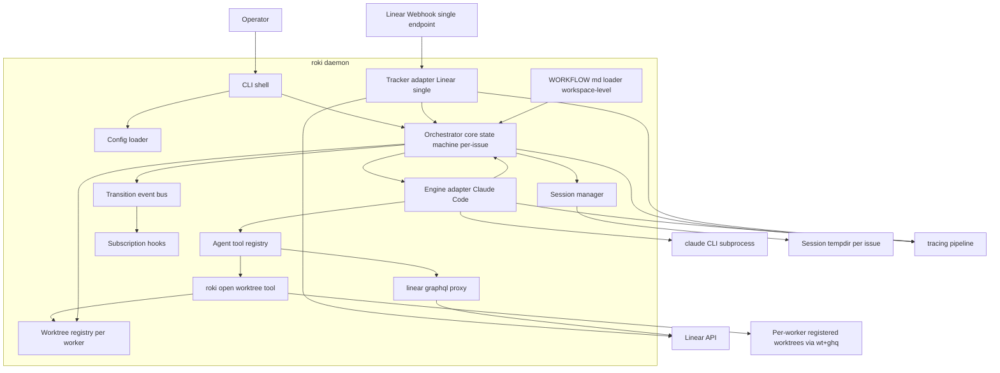
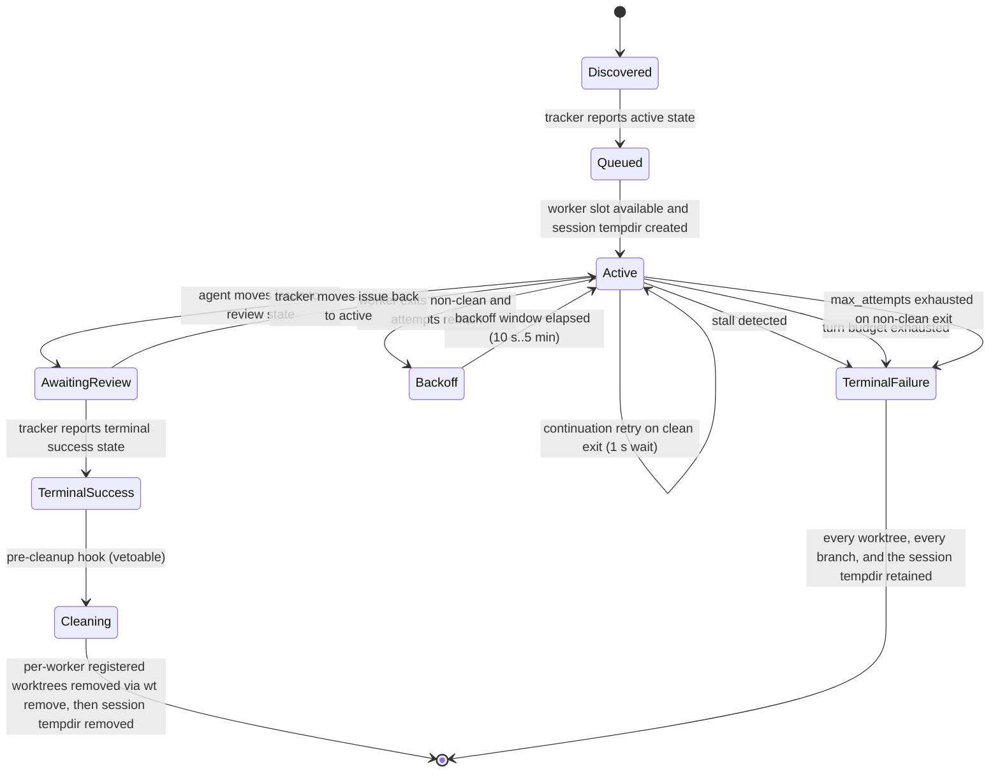
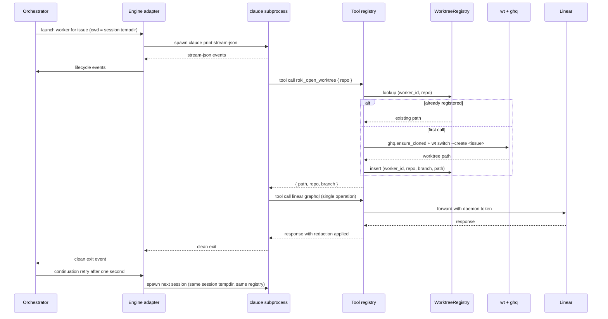

# Design Document

> **Sidecar designs**: detailed locked decisions for major scope shifts live alongside this file:
> - [`design-bootstrap.md`](design-bootstrap.md) — startup composition, signal handling, secrets pipeline (task 5.1).
> - [`design-worktree-workspace.md`](design-worktree-workspace.md) — `wt` + `ghq` external CLI dependencies, branch sanitization, worktree path layout (task 6.1).
> - [`design-agent-driven-repo-selection.md`](design-agent-driven-repo-selection.md) — agent-driven repo allowlist, `roki_open_worktree` tool, single workspace-level webhook + tracker + `WORKFLOW.md`, per-issue (no-`(repo, issue)`) state keying, session tempdir + `WorktreeRegistry` decomposition (task 7.1).
> - [`design-retry-policy.md`](design-retry-policy.md) — `max_attempts` retry budget on non-clean exits; stalls and turn-budget exhaustion bypass the retry loop (task 3.7).
>
> When the sidecars conflict with this document, the sidecars win — they capture the as-of post-7.1 contract and this document's prose is being kept in sync as part of the requirements/tasks resync.

## Overview

**Purpose**: roki-mvp delivers the symphony-parity vertical slice of roki: a single Rust daemon that observes Linear, allocates per-issue sessions, and supervises long-lived `claude --print --output-format stream-json` subprocesses that perform implementation work. The daemon owns the per-issue session tempdir, the per-worker registry of git worktrees the agent has opened, the subprocess lifecycle, and the cleanup pass — but it never mutates Linear, never opens pull requests, never edits code.

**Users**: A solo developer or small team operator who runs roki locally as a long-running daemon, configures an allowlist of Git repositories under it, and supervises Linear-driven implementation work across all of them from one process.

**Impact**: Establishes the foundational orchestrator and the four extension seams (state-machine hooks, agent tool registry, single workspace-level `WORKFLOW.md` schema, workspace path layout) that the four downstream specs (roki-spec-gate, roki-review-gate, roki-observability, roki-distill-postmerge) plug into. Without this MVP, none of the downstream specs has anywhere to attach.

### Goals
- A `roki` Rust 2024 binary that runs as a daemon, configurable via CLI plus a config file, with structured tracing logs.
- Multi-repo through agent-driven repo selection: the daemon publishes an allowlist of repos identified by `ghq` identifiers; the agent calls `roki_open_worktree` whenever it decides to operate in a configured repo. Per-issue state is keyed by Linear issue id alone; cross-repo tickets fall out for free.
- Long-lived `claude --print --output-format stream-json` subprocess per active issue with bounded loops (`max_turns`, configurable retry budget on non-clean exit, exponential backoff between launches, continuation retry on clean exit, stall detection).
- Single workspace-level `WORKFLOW.md` (Liquid + Markdown front matter) policy loader with hot reload and schema validation.
- In-memory orchestrator state machine with stable extension points (subscription hooks, agent tool registry including `roki_open_worktree`, `WORKFLOW.md` schema) for downstream specs.
- Restart recovery via Linear + filesystem reconciliation across both per-issue session tempdirs and per-repo `git worktree list` output; no persistent database.
- Language-agnostic `SPEC.md` at the repo root describing the contract.

### Non-Goals
- Linear writes, PR creation, code edits — all delegated to the agent.
- Persistent state stores (SQLite, sled, etc.).
- kiro-spec gate enforcement, kiro-review gate enforcement, HTTP/TUI observability, post-merge distill — deferred to the four follow-up specs.
- Container or VM isolation; multi-host SSH workers; auto-merge; Windows support.

## Boundary Commitments

### This Spec Owns
- The `roki` binary entry point, CLI parsing (clap, including `--config` / `--bind` / `--port` / `--dangerously-skip-permissions`), tokio runtime, tracing pipeline, the bootstrap composition order documented in `design-bootstrap.md`.
- The in-memory orchestrator: per-issue state machine keyed by Linear issue id alone, transition event bus, subscriber registry with documented vetoable transitions, retry-budget loop driving `Active → Backoff → Active` for non-clean exits.
- The Linear adapter: a single workspace-level webhook receiver, a single workspace-level polling fallback (≤ 5 min cadence), tracker normalization (issue model — no repo association at the tracker boundary), 429 backoff, read-only on the daemon side.
- The per-issue session lifecycle: ephemeral session tempdir under the platform-appropriate user cache root as the worker's CWD; per-worker registered set of agent-opened worktrees keyed by `RepoId`; cleanup on `Cleaning` walks the registry and removes each worktree before removing the session tempdir; `TerminalFailure` retains all worktrees, branches, and the session tempdir.
- The Claude Code engine adapter: subprocess launch, stream-JSON parser, lifecycle event mapping, `max_turns` enforcement, stall-by-event-inactivity detection (routes to `TerminalFailure`), turn-budget exhaustion (routes to `TerminalFailure`), one-second continuation retry on clean exit, configurable `max_attempts` retry budget on non-clean exit (default 3, range 1–10) with exponential backoff between launches bounded between 10 s and 5 min, prelude-forwarding for `WorkerContext.additional_context`.
- The single workspace-level `WORKFLOW.md` loader: front-matter parsing, Liquid render, JSON-Schema validation, hot reload with last-known-good fallback (startup validation failure is a hard refusal at the daemon level — there is no per-repo override to fall through to).
- The agent tool registry contract and the built-in `linear_graphql` proxy tool (one operation per call, daemon-owned credentials, redaction) plus the built-in `roki_open_worktree` tool (strict allowlist, idempotent, branch hard-locked to the issue id, `ghq` + `wt` shellouts, typed error taxonomy).
- The default permission strategy and sandbox knobs (`workspace-write` + reject elicitations as default; `--settings` allowlist or `--dangerously-skip-permissions` fallback, with the workspace-level `WORKFLOW.md` allowed to override sandbox/elicitation policy).
- `SPEC.md` at the repository root, language-agnostic.

### Out of Boundary
- Any logic that performs Linear writes, PR creation, branch management, or code edits — that work belongs to the agent, full stop.
- kiro-spec gate enforcement (deferred to roki-spec-gate, plugs into the state-machine subscription hook).
- kiro-review gate enforcement (deferred to roki-review-gate, plugs into the state-machine subscription hook).
- HTTP API, ratatui TUI, structured state introspection beyond logs (deferred to roki-observability).
- Post-merge flow-document classification and distill (deferred to roki-distill-postmerge).
- Persistent storage of run history, run analytics, multi-tenant orchestration, multi-host workers, container isolation, auto-merge, Windows.

### Allowed Dependencies
- Rust 2024 + tokio for async runtime.
- clap for CLI argument parsing.
- tracing + tracing-subscriber for structured logs.
- reqwest for Linear HTTPS calls; axum for the single workspace-level webhook receiver only (no broader HTTP surface).
- liquid (or compatible) for `WORKFLOW.md` body templating; serde_yaml or toml for front matter; a JSON-Schema validator (jsonschema or similar) for schema enforcement.
- notify (or compatible) for filesystem hot-reload watching.
- Claude Code installed locally with kiro skills available under `~/.claude/skills/kiro-*` (operator concern, not bundled).
- The `wt` (worktrunk) and `ghq` external CLIs installed on `$PATH` (operator concern; daemon hard-refuses to start if either is absent).
- The `gh` CLI is invoked only by the agent inside the worktree, not by the daemon.

### Revalidation Triggers
Changes that should force dependent specs to re-check integration:
- Any change to the orchestrator state set, including the retry-loop intermediate states, or to the documented vetoable-transition list.
- Any breaking change to the agent tool registry contract or to `linear_graphql` / `roki_open_worktree` semantics (input shape, output shape, error taxonomy, idempotency, allowlist enforcement).
- Any breaking change to the workspace-level `WORKFLOW.md` schema (additions are additive and safe; removals or type changes are breaking).
- Any change to the session-tempdir layout, the worktree path layout, the branch sanitization rule, or the per-worker registered worktree set's invariants.
- Any change to the lifecycle event taxonomy emitted by the engine adapter.
- Any change to subscriber error-isolation semantics.
- Any change to the published read-side traits (`OrchestratorRead`, `TrackerRefresh`) consumed by roki-observability.
- Any change to the pre-cleanup hook contract consumed by roki-distill-postmerge.
- Any change to the `WorkerContext` field set or the prelude-forwarding mechanism for `additional_context`.

### Cross-Spec Extension Surface

roki-mvp publishes the following stable extension surface for downstream specs. Every entry on this list is a contract: breaking changes here trigger the revalidation triggers above.

- **State-machine subscription hooks** (`SubscriberHooks`) with the documented vetoable-transition list (`Queued -> Active`, `AwaitingReview -> TerminalSuccess`, `TerminalSuccess -> Cleaning`).
- **Pre-cleanup hook** (`Cleaning` interim state, see "Per-issue worker lifecycle"): downstream specs may register vetoable observers for `TerminalSuccess -> Cleaning` to perform deferred work (e.g., distill) before the workspace is removed.
- **Read-side traits**: `OrchestratorRead` (snapshot + per-issue lookup) and `TrackerRefresh` (nudge). Both are read-only / nudge-only and grant no state-mutation rights; observability and similar specs depend on these.
- **Agent tool registry** (`Registry::register`): downstream specs may register additional read-only tools without forking the core.
- **`WorkflowPolicy.extension`** (typed as `serde_json::Value`): downstream specs deserialize their own slice of the policy from a reserved sub-namespace. The MVP loader round-trips unknown keys without interpreting them. Reserved namespaces:
  - `extension.gates.spec.*` (roki-spec-gate)
  - `extension.gates.review.*` (roki-review-gate)
  - `extension.server.*` (roki-observability)
  - `extension.distill.*` (roki-distill-postmerge)
- **`WorkerContext.additional_context`** (typed as `Option<serde_json::Value>`): an additive optional field reserved for downstream gates and specs to inject prelude context into the worker session (for example, roki-review-gate's `.review-findings.json`). The engine adapter forwards this value through the workspace prelude / Claude session prompt envelope; the MVP itself does not interpret the contents. `WorkerContext` is extensible by additional optional additive fields under the same forwarding contract; removing or retyping fields is a breaking change.

## Architecture

### Architecture Pattern & Boundary Map



**Architecture Integration**:
- **Selected pattern**: Hexagonal / ports-and-adapters around an in-memory orchestrator core. Adapters (tracker, engine, session manager, worktree registry, workflow loader) implement narrow traits; the orchestrator depends only on those traits. Symphony-aligned: long-lived agent session, no DB, `WORKFLOW.md` as user-facing policy.
- **Domain boundaries**: CLI shell vs orchestrator core; tracker adapter vs orchestrator; engine adapter vs orchestrator; session manager + worktree registry vs orchestrator; workflow loader vs orchestrator; agent tool registry as its own seam.
- **Existing patterns preserved**: Symphony's small-daemon thesis (no DB, agent owns writes, long-lived stdio session, `WORKFLOW.md`).
- **New components rationale**: Agent-driven repo selection (allowlist + `roki_open_worktree`) replaces deterministic operator-side routing — the agent classifies the ticket on its first turn and the daemon serves whichever subset of the allowlist it picks; cross-repo tickets fall out as multiple tool calls. Per-issue keying replaces `(repo, issue)` keying. Explicit subscription hooks remain the deliberate divergence from symphony to support the four downstream specs.
- **Steering compliance**: Rust 2024 + tokio, no SQLite, kiro skills as personal skills, macOS + Linux only.

### Technology Stack

| Layer | Choice / Version | Role in Feature | Notes |
|-------|------------------|-----------------|-------|
| CLI | clap 4.x | Argument parsing for `roki run` and subcommands | Derive macros for subcommand structure |
| Runtime | Rust 2024 + tokio 1.x | Async orchestration, subprocess supervision | Multi-threaded scheduler |
| Logging | tracing + tracing-subscriber | Structured logs with per-issue context (and per-repo where applicable, e.g., `roki_open_worktree` outcomes) | JSON output supported via subscriber |
| HTTP client | reqwest 0.12+ | Linear GraphQL calls from `linear_graphql` proxy and tracker adapter | rustls TLS by default |
| HTTP server | axum 0.7+ | Linear webhook receiver only — no broader API surface | Bound to localhost or operator-configured interface |
| Templating | liquid | `WORKFLOW.md` body rendering | Front matter parsed separately |
| Front matter | serde_yaml or toml | YAML or TOML front matter on `WORKFLOW.md` | Single format selected at MVP — see decision below |
| Schema | jsonschema (Rust) | Validate parsed `WORKFLOW.md` policy shape | Fails closed with last-known-good fallback on hot reload |
| File watcher | notify | Hot reload of `WORKFLOW.md` | Debounced |
| GraphQL | hand-rolled or graphql_client | Linear GraphQL request envelope | Hand-rolled is acceptable to keep dependencies small |
| Config | serde + figment or hand-rolled | Layered config (file + env + flags) | Linear token loaded from env or secret file, never committed |

> Front-matter format choice: MVP picks YAML for ergonomic reasons (Liquid + YAML pairs commonly in static site tooling), but the loader trait does not leak the choice; the policy struct after parsing is format-agnostic so a future change to TOML is non-breaking for downstream specs.

## File Structure Plan

### Directory Structure

The repository is a Cargo workspace from day one. The MVP ships a single member crate, `crates/roki-daemon/`, but the workspace layout is committed up front so downstream specs (notably roki-observability) can add `crates/roki-tui/` and `crates/roki-api-types/` as pure-additive members without restructuring.

```
SPEC.md                              # Language-agnostic contract
Cargo.toml                           # [workspace] root, members = ["crates/roki-daemon"]
WORKFLOW.example.md                  # Bundled default workflow file
crates/
└── roki-daemon/                     # The MVP daemon crate (sole initial workspace member)
    ├── Cargo.toml                   # name = "roki", binary entry
    ├── src/
    │   ├── main.rs                  # Binary entry, tokio runtime bootstrap
    │   ├── cli.rs                   # clap definitions; --config/--bind/--port/--dangerously-skip-permissions
    │   ├── runtime.rs               # Bootstrap composition (see design-bootstrap.md)
    │   ├── config/
    │   │   ├── mod.rs               # Config struct (with [linear], [workflow], [server] blocks)
    │   │   └── repos.rs             # Allowlist of `RepoConfig { repo: String }` ghq identifiers
    │   ├── orchestrator/
    │   │   ├── mod.rs               # Orchestrator entry, lifecycle ownership
    │   │   ├── state.rs             # State enum + retry-loop intermediates, transition table, vetoable set
    │   │   ├── core.rs              # Per-issue worker actor, retry-budget loop
    │   │   ├── events.rs            # Transition event types, event bus
    │   │   ├── hooks.rs             # Subscription registry, error isolation, pre-cleanup hook
    │   │   ├── read.rs              # OrchestratorRead implementation (snapshot/issue)
    │   │   ├── tracker_bridge.rs    # NormalizedIssue → orchestrator inbox; dedup keyed (issue, target_state)
    │   │   └── recovery.rs          # Restart reconciliation across Linear + sessions + worktrees
    │   ├── tracker/
    │   │   ├── mod.rs               # Tracker trait, TrackerRefresh trait, normalized issue model
    │   │   ├── linear.rs            # Linear GraphQL client (single workspace-level), polling, 429 backoff
    │   │   └── webhook.rs           # axum-based single-endpoint webhook receiver, HMAC verify
    │   ├── engine/
    │   │   ├── mod.rs               # Engine adapter trait
    │   │   ├── claude.rs            # Claude Code subprocess launcher and supervisor; prelude forwarding
    │   │   ├── stream.rs            # stream-json line parser, typed lifecycle events
    │   │   └── policy.rs            # max_turns, stall detection, max_attempts retry budget, backoff, continuation retry
    │   ├── session/                 # (post-7.1) Session tempdir lifecycle
    │   │   └── mod.rs               # SessionManager: per-IssueId tempdir under user cache root
    │   ├── worktrees/               # (post-7.1) Per-worker WorktreeRegistry tracking agent-opened worktrees
    │   │   └── mod.rs
    │   ├── workflow/
    │   │   ├── mod.rs               # Single workspace-level WORKFLOW.md loader, hot reload coordinator
    │   │   ├── parse.rs             # Front matter + Liquid + Markdown parse
    │   │   └── schema.rs            # JSON-Schema for the policy shape (incl. max_attempts)
    │   ├── tools/
    │   │   ├── mod.rs               # Agent tool registry trait, registration API
    │   │   ├── linear_graphql.rs    # Single-operation proxy tool, redaction
    │   │   ├── roki_open_worktree.rs # Agent-driven repo open: ghq + wt + WorktreeRegistry insert; idempotent
    │   │   ├── wt.rs                # WtTool trait + RealWt subprocess shellout (worktrunk)
    │   │   └── ghq.rs               # GhqTool trait + RealGhq subprocess shellout
    │   ├── permissions.rs           # Sandbox + permission-strategy resolution
    │   ├── logging.rs               # Tracing init, redaction layer
    │   └── shutdown.rs              # Signal handling, bounded shutdown windows
    └── tests/
        ├── integration_orchestrator.rs
        ├── integration_engine_adapter.rs
        ├── integration_workflow_loader.rs
        ├── integration_session_and_worktrees.rs
        ├── integration_tracker.rs
        ├── integration_tools_registry.rs
        ├── integration_open_worktree_allowlist.rs
        ├── e2e_bootstrap.rs
        ├── e2e_happy_path.rs
        ├── e2e_failure_retry.rs
        ├── e2e_vetoable_transition.rs
        └── e2e_recovery.rs
```

> The `routing.rs` module that existed in pre-7.1 layouts is removed; agent-driven repo selection makes it unnecessary. The pre-7.1 `workspace/{mod.rs,layout.rs}` modules are split into `session/` (worker CWD) and `worktrees/` (agent-opened registry).

> Each module owns one clear responsibility. Cross-module imports follow the dependency direction: `config` → `orchestrator/state` → `orchestrator/worker` (via traits in `tracker`, `engine`, `workspace`, `workflow`, `tools`). Adapters never import from `orchestrator/worker`; they implement traits the orchestrator consumes.
>
> Cargo workspace rationale: keeping the daemon at `crates/roki-daemon/` from day one means roki-observability can add `crates/roki-tui/` (ratatui front end) and `crates/roki-api-types/` (shared HTTP type crate) as pure-additive workspace members without moving any roki-mvp source files. The workspace `Cargo.toml` lists `members = ["crates/roki-daemon"]` initially; downstream specs append entries to that list.

### Modified Files
- (Greenfield: there are no existing source files to modify. The `.gitignore` and `CLAUDE.md` already in the repo are unaffected.)

## System Flows

### Daemon bootstrap

`runtime::run` (task 5.1, finalised in 7.1f) composes the architecture
in a fixed order so secrets are added to the redaction list before any
structured event is emitted, refusal modes land before any resource is
held, and the HTTP surface comes up regardless of Linear's reachability.
The full sequence is documented under `SPEC.md §9.7`; the reference
implementation lives in
`crates/roki-daemon/src/runtime.rs::run_with_shutdown`. Composition order:

1. Load config (`--config <path>` overrides `./roki.toml`; CLI flags
   `--bind` / `--port` / `--dangerously-skip-permissions` override the
   file).
2. Resolve secrets (Linear token + the single workspace-level webhook
   HMAC secret from `[linear].webhook_secret_env`; an optional
   `[linear].webhook_secret_file` test seam takes precedence) and
   reinitialise the redaction-aware tracing pipeline with the secret list.
3. Install OS signal handlers wired to a shared `ShutdownSignal`.
4. Resolve the `claude` binary (config override → `$PATH` discovery →
   hard refusal). Refuse to start if `wt` or `ghq` is not on `$PATH`.
5. Load the single workspace-level `WORKFLOW.md` from `[workflow].path`;
   build `SessionManager`, `WorktreeRegistry`, `PermissionResolver`, the
   `ClaudeEngineAdapter`, and the `RealWt` / `RealGhq` adapters.
6. Run `Orchestrator::with_recovery(...)` to drive the restart-recovery
   scan (§Recovery) and obtain the configured orchestrator. Attach a
   `DefaultWorkerToolFactory` carrying the daemon-wide `linear_graphql`
   tool plus the `[[repos]]` allowlist so every per-issue worker
   registry receives a fresh `OpenWorktreeTool` bound to that worker's
   `IssueId`.
7. Start one workspace-level `LinearTracker` (no per-repo fan-out — the
   poller queries every active issue the API token can see).
8. Mount the single `POST /linear/webhook` route on a single
   `axum::Router` with a workspace-level `WebhookState`. Bind the HTTP
   server at `[server].bind:[server].port`; a port conflict is a hard
   refusal.
9. Funnel polling + webhook streams through `TrackerBridge` into the
   orchestrator inbox.
10. `tokio::select!` on shutdown across orchestrator, bridge, server,
    and the single tracker; bound the wind-down at
    `SHUTDOWN_WINDOW = 30s` via `await_workers_with_window`.

`Orchestrator::with_engine_policy` and `with_tool_factory` carry the
runtime engine policy and the per-worker tool factory respectively. The
per-worker tool factory is invoked on every engine launch so each
worker subprocess receives a catalog containing both `linear_graphql`
AND a per-issue `roki_open_worktree`.

### Per-issue worker lifecycle



> Vetoable transitions (subscriber hooks may block): `Queued -> Active` (used by spec-gate), `AwaitingReview -> TerminalSuccess` (used by review-gate), `TerminalSuccess -> Cleaning` (used by distill-postmerge as a pre-cleanup hook). The retry-arc transitions (`Active → Backoff`, `Backoff → Active`, retry-exhausted `Active → TerminalFailure`) are observable but non-vetoable, matching the existing vetoable subset. All other transitions are observable but non-vetoable.
>
> **Retry budget** (see `design-retry-policy.md`): only `NonCleanExit` outcomes consume the configurable `max_attempts` budget (default 3, range 1–10) and traverse the `Active → Backoff → Active` loop. `Stalled` and `TurnBudgetExhausted` are agent-authored failures that repeat under the same prompt and budget, so they route directly to `TerminalFailure` without consuming an attempt. The session tempdir and every registered worktree are retained across the entire retry loop (no delete/recreate); the prelude / `additional_context` is re-emitted unchanged on each launch.
>
> **Cleaning** is the interim state where downstream specs perform deferred work (e.g., distill) that requires the agent's worktrees to still be present after success has been declared. The per-worker registered worktrees are removed by the daemon via `wt remove` (which does not delete branches), then the session tempdir is removed. A `Deny` vote on `TerminalSuccess → Cleaning` blocks cleanup and is logged; the operator-intervention path (manual cleanup) still applies.

### Worker invocation loop



## Requirements Traceability

| Requirement | Summary | Components | Interfaces | Flows |
|-------------|---------|------------|------------|-------|
| 1.1, 1.2, 1.3, 1.4, 1.5, 1.6, 1.7 | Daemon lifecycle, CLI, external-CLI startup checks (wt/ghq/claude) | CliShell, Runtime, Logging, Shutdown, Config | clap commands, signal handlers, `which` probes | Daemon bootstrap |
| 2.1, 2.2, 2.3, 2.4, 2.5, 2.6, 2.7 | Allowlist configuration, [linear]/[workflow]/[server] blocks, per-issue keying | Config | Config schema | Daemon bootstrap |
| 3.1, 3.2, 3.3, 3.4, 3.5, 3.6 | Linear tracker integration: single endpoint webhook + single workspace-level tracker | TrackerAdapter, WebhookReceiver, NormalizedIssue | Tracker trait | Webhook + polling fallback |
| 4.1, 4.2, 4.3, 4.4, 4.5, 4.6, 4.7 | Per-issue session and worktree lifecycle | SessionManager, WorktreeRegistry, RokiOpenWorktreeTool | Session/Worktree traits, ToolRegistry | Worker invocation loop |
| 5.1, 5.2, 5.3, 5.4, 5.5, 5.6, 5.7 | Engine adapter: stream parsing, stall, turn budget, retry budget | EngineAdapter, StreamJsonParser, EnginePolicy | Engine trait, lifecycle event types | Worker invocation loop, Per-issue worker lifecycle |
| 6.1, 6.2, 6.3, 6.4, 6.5 | Workspace-level WORKFLOW.md loader | WorkflowLoader, WorkflowSchema | WorkflowPolicy struct, schema | Daemon bootstrap |
| 7.1–7.9 | Agent tool registry, `linear_graphql`, `roki_open_worktree`, allowlist enforcement, idempotency, error taxonomy, secret redaction, registry extensibility | ToolRegistry, LinearGraphqlTool, RokiOpenWorktreeTool | Tool trait, registry API | Worker invocation loop |
| 8.1, 8.2, 8.3, 8.4, 8.5 | State machine (per-issue + retry intermediates) and extension points | Orchestrator, EventBus, SubscriberHooks, RecoveryReconciler | Hook subscription API, transition events | Per-issue worker lifecycle |
| 9.1, 9.2, 9.3, 9.4, 9.5 | Permissions and sandbox | Permissions, EngineAdapter | Permission strategy enum | n/a |
| 10.1, 10.2, 10.3, 10.4, 10.5 | Restart recovery: walk session tempdirs + per-repo `git worktree list`; 5-cell decision matrix | RecoveryReconciler, SessionManager, WorktreeRegistry, TrackerAdapter | Recovery scan API | Per-issue worker lifecycle |
| 11.1, 11.2, 11.3, 11.4 | Language-agnostic SPEC.md | SPEC.md (root) | Documented contracts | n/a |
| 12.1, 12.2, 12.3, 12.4 | Daemon observability: per-issue + per-repo (where applicable) context, retry attempts | Logging, Orchestrator, EngineAdapter, TrackerAdapter, SessionManager, WorktreeRegistry | tracing fields, redaction layer | n/a |
| 13.1 | OrchestratorRead trait published for additive consumers | Orchestrator, OrchestratorRead | `OrchestratorRead` trait | n/a |
| 13.2 | Pre-cleanup hook (`Cleaning` interim state) published for deferred-cleanup consumers | Orchestrator, SubscriberHooks | `PreCleanupHook` trait, `Cleaning` state | Per-issue worker lifecycle |
| 13.3 | TrackerRefresh nudge trait published for additive observability surfaces | TrackerAdapter | `TrackerRefresh` trait | n/a |
| 13.4 | `WorkerContext.additional_context` additive field forwarded as session prelude | EngineAdapter | `WorkerContext` schema, prelude envelope | Worker invocation loop |
| 13.5 | Reserved `WORKFLOW.md` extension namespaces published for downstream specs | WorkflowLoader, WorkflowSchema | `WorkflowPolicy.extension`, schema | n/a |

## Components and Interfaces

| Component | Domain/Layer | Intent | Req Coverage | Key Dependencies (P0/P1) | Contracts |
|-----------|--------------|--------|--------------|--------------------------|-----------|
| CliShell | CLI | Parse arguments, bootstrap config, hand control to Runtime | 1.1, 1.2, 1.6, 1.7 | Config (P0), Runtime (P0) | Service |
| Runtime | CLI | Compose the daemon (signals, secrets, loaders, server) per `design-bootstrap.md` | 1.1, 1.3, 1.4, 1.5 | Config (P0), Logging (P0), Orchestrator (P0), TrackerAdapter (P0), `which` (P0) | Service |
| Config | Config | Load and validate layered configuration: `[[repos]]` allowlist (`{ repo }` only), `[linear]`, `[workflow]`, `[server]`, secrets | 1.2, 2.1, 2.2, 2.3, 2.4, 2.5, 9.5 | filesystem (P0), env (P0) | State |
| Orchestrator | Orchestrator | Run the per-issue state machine, schedule workers, drive the retry-budget loop, isolate subscriber failures | 1.1, 1.4, 8.1, 8.2, 8.3, 8.4, 13.1, 13.2 | TrackerAdapter (P0), EngineAdapter (P0), SessionManager (P0), WorktreeRegistry (P0), WorkflowLoader (P0), EventBus (P0) | Service, Event, State |
| OrchestratorRead | Orchestrator | Read-only projection of orchestrator state for additive consumers | 13.1 | Orchestrator (P0) | Service |
| EventBus | Orchestrator | Publish transition events with isolation across subscribers | 8.2, 8.3, 8.4 | Orchestrator (P0) | Event |
| SubscriberHooks | Orchestrator | Register and dispatch subscribers; expose vetoable-transition contract and pre-cleanup hook | 8.3, 8.4, 13.2 | EventBus (P0) | Service |
| RecoveryReconciler | Orchestrator | Reconcile in-memory state on startup from Linear + session tempdirs + per-repo `git worktree list` | 8.5, 10.1, 10.2, 10.3, 10.4, 10.5 | TrackerAdapter (P0), SessionManager (P0), WorktreeRegistry (P0), GhqTool (P0) | Service |
| TrackerAdapter | Tracker | Read-only single workspace-level Linear adapter with single endpoint webhook + polling fallback and 429 backoff; publishes `TrackerRefresh` nudge trait | 3.1, 3.2, 3.3, 3.4, 3.5, 3.6, 13.3 | reqwest (P0), axum (P0), Config (P0) | Service, Event |
| WebhookReceiver | Tracker | Single endpoint `POST /linear/webhook`; HMAC-verify against the workspace-level secret; normalize payload | 3.1, 3.2, 3.5 | TrackerAdapter (P0) | API |
| SessionManager | Session | Create and remove per-issue session tempdirs under the platform-appropriate user cache root; the worker's CWD | 4.1, 4.3, 4.7, 10.1, 10.4 | filesystem (P0), `dirs` or XDG resolver (P0) | Service, State |
| WorktreeRegistry | Worktrees | Per-worker registered set of agent-opened worktrees keyed by `RepoId`; iterated on `Cleaning`, retained on `TerminalFailure` | 4.2, 4.4, 4.5, 4.6, 4.7, 10.1, 10.2, 10.3, 10.4 | filesystem (P0), WtTool (P0), GhqTool (P0) | Service, State |
| EngineAdapter | Engine | Launch and supervise long-lived `claude` subprocess; map stream-json to lifecycle events; carry the retry-budget Backoff loop | 5.1, 5.2, 5.3, 5.4, 5.5, 5.6, 5.7, 9.1, 9.2, 9.3, 9.4 | tokio process (P0), Permissions (P0), WorkflowLoader (P0), ToolRegistry (P0) | Service, Event |
| StreamJsonParser | Engine | Convert newline-delimited stream-json into typed lifecycle events | 5.2 | EngineAdapter (P0) | Service |
| EnginePolicy | Engine | Enforce `max_turns`, stall detection, `max_attempts` retry budget, exponential backoff, continuation retry | 5.3, 5.4, 5.5, 5.6 | EngineAdapter (P0), WorkflowLoader (P1) | Service |
| WorkflowLoader | Workflow | Parse front matter + Liquid body, validate single workspace-level `WORKFLOW.md` against schema, hot reload with last-known-good fallback | 6.1, 6.2, 6.3, 6.4, 6.5, 9.2 | notify (P0), liquid (P0), jsonschema (P0) | Service, State |
| WorkflowSchema | Workflow | The published policy schema (incl. `max_attempts`), extensible under reserved `extension.*` namespaces | 6.5, 13.5 | WorkflowLoader (P0) | State |
| ToolRegistry | Tools | Stable agent tool registration and dispatch; redaction enforcement | 7.1, 7.8, 7.9 | EngineAdapter (P0) | Service, API |
| LinearGraphqlTool | Tools | Single-operation Linear proxy; redact credentials | 7.1, 7.2, 7.3, 7.8 | reqwest (P0), Config (P0) | API |
| RokiOpenWorktreeTool | Tools | Agent-driven repo open: strict allowlist, idempotent, branch == issue id; ghq + wt shellouts | 7.1, 7.4, 7.5, 7.6, 7.7, 7.8 | WtTool (P0), GhqTool (P0), Config (P0), WorktreeRegistry (P0) | API |
| WtTool | Tools | `wt switch --create` and `wt remove` shellouts; branch sanitization | 4.4, 4.5 | external `wt` CLI (P0) | Service |
| GhqTool | Tools | `ghq list -p` and `ghq get` shellouts | 4.4, 10.1 | external `ghq` CLI (P0) | Service |
| Permissions | Permissions | Resolve sandbox and permission strategy from Config + workspace-level `WORKFLOW.md` per worker | 9.1, 9.2, 9.3, 9.4, 9.5 | Config (P0), WorkflowLoader (P1) | State |
| Logging | Logging | tracing init, redaction layer, per-issue context (and per-repo where applicable) | 1.5, 12.1, 12.2, 12.3, 12.4 | tracing (P0) | Service |
| Shutdown | Lifecycle | Bounded shutdown on SIGINT/SIGTERM | 1.4 | tokio signal (P0) | Service |
| SpecRoot | Documentation | Language-agnostic `SPEC.md` at the repo root | 11.1, 11.2, 11.3, 11.4 | n/a | n/a |

### Orchestrator core

#### Orchestrator

| Field | Detail |
|-------|--------|
| Intent | Own the per-issue state machine, schedule workers, and drive the retry-budget Backoff loop |
| Requirements | 1.1, 1.4, 8.1, 8.2, 8.3, 8.4 |

**Responsibilities & Constraints**
- Maintain one in-memory state instance per Linear issue identifier (no `(repo, issue)` keying — `RepoId` survives only on `WorktreeRegistry` entries the agent created).
- Drive transitions only from declared sources: tracker events, engine lifecycle events, recovery scan, operator shutdown.
- Publish a transition event for every transition (no silent transitions). Transition payloads carry the issue identifier always and the originating repository identifier as `Option<RepoId>` for arcs scoped to a specific repo (e.g., worktree cleanup).
- Drive `Active → Backoff → Active` for `NonCleanExit` outcomes until `max_attempts` is exhausted; route `Stalled` and `TurnBudgetExhausted` directly to `TerminalFailure` (see `design-retry-policy.md`).
- Isolate subscriber failures so one failing subscriber cannot stall others.
- Never call Linear write APIs and never invoke `gh` directly; engine adapter is the only path to the agent.

**Dependencies**
- Inbound: Runtime — invokes `Orchestrator::run` (P0)
- Outbound: TrackerAdapter — subscribes to normalized issue events (P0)
- Outbound: EngineAdapter — launches and supervises workers (P0)
- Outbound: SessionManager — creates the per-issue session tempdir on `Queued → Active`, removes it on `Cleaning → [*]` (P0)
- Outbound: WorktreeRegistry — iterates registered worktrees on `Cleaning` and calls `wt remove` on each before session removal (P0)
- Outbound: WorkflowLoader — reads policy at worker launch (P0)
- Outbound: EventBus — publishes transitions to SubscriberHooks (P0)

**Contracts**: Service [x] / API [ ] / Event [x] / Batch [ ] / State [x]

##### Service Interface (Rust trait sketch)

```rust
pub trait Orchestrator: Send + Sync {
    // Start the orchestrator. Returns when shutdown completes.
    async fn run(self, shutdown: ShutdownSignal) -> Result<(), OrchestratorError>;

    // Subscribe to transition events; returns a handle that, when dropped, unsubscribes.
    fn subscribe(&self, subscriber: Arc<dyn TransitionSubscriber>) -> SubscriptionHandle;

    // Register an async pre-cleanup observer invoked on the vetoable
    // TerminalSuccess -> Cleaning transition. The pre-cleanup hook is the
    // contracted extension point for deferred-cleanup work (e.g.,
    // roki-distill-postmerge) that must run while the workspace still exists.
    // A Deny result blocks workspace removal and is logged.
    fn register_pre_cleanup_hook(&self, hook: Arc<dyn PreCleanupHook>) -> SubscriptionHandle;
}

// Read-only projection of orchestrator state, published as a stable trait so
// roki-observability and similar additive specs can read state without any
// path to mutation.
pub trait OrchestratorRead: Send + Sync {
    // Snapshot the current per-issue state for all tracked workers.
    fn snapshot(&self) -> SnapshotResponse;

    // Look up a single per-issue projection.
    fn issue(&self, issue: &IssueId) -> Option<IssueState>;
}

#[async_trait]
pub trait PreCleanupHook: Send + Sync {
    async fn on_pre_cleanup(&self, ctx: &PreCleanupContext) -> Result<VetoDecision, SubscriberError>;
}

pub trait TransitionSubscriber: Send + Sync {
    // Observe a transition. Errors are logged and isolated.
    async fn on_transition(&self, event: &TransitionEvent) -> Result<(), SubscriberError>;

    // Veto a transition (only meaningful for the subset declared as vetoable).
    async fn veto(&self, event: &TransitionEvent) -> Result<VetoDecision, SubscriberError>;
}

pub enum VetoDecision { Allow, Deny { reason: String } }

pub struct TransitionEvent {
    pub issue: IssueId,
    // Repository identifier for arcs scoped to a specific repo (for example
    // `roki_open_worktree` outcomes and worktree cleanup). `None` for
    // issue-scoped arcs that don't pin a repo (Discovered → Queued etc.).
    pub repo: Option<RepoId>,
    pub previous: WorkerState,
    pub next: WorkerState,
    pub trigger: TransitionTrigger,
    pub correlation_id: CorrelationId,
}

pub enum WorkerState {
    Discovered,
    Queued,
    Active,
    AwaitingReview,
    Backoff,           // intermediate of the retry-budget loop on NonCleanExit; non-vetoable
    TerminalSuccess,
    Cleaning,          // interim state between TerminalSuccess and worktree+session removal; pre-cleanup hook target
    TerminalFailure,
}

pub enum TransitionTrigger {
    TrackerEvent,
    EngineEvent,
    RecoveryScan,
    OperatorShutdown,
    SubscriberVeto,
}
```

- Preconditions: `WorkflowLoader`, `TrackerAdapter`, `EngineAdapter`, `SessionManager`, and `WorktreeRegistry` are constructed and injected before `run`.
- Postconditions: every transition is published exactly once; no per-issue state is written to disk.
- Invariants: state is owned by exactly one task per Linear issue identifier; the state machine is deterministic given the input event sequence.

**Implementation Notes**
- Integration: tokio task per issue identifier; mpsc channels in, broadcast bus out.
- Validation: vetoable-transition list is hard-coded for MVP — `Queued -> Active`, `AwaitingReview -> TerminalSuccess`, and `TerminalSuccess -> Cleaning` are vetoable; the retry-arc transitions (`Active → Backoff`, `Backoff → Active`, retry-exhausted `Active → TerminalFailure`) are observable but non-vetoable; all other transitions are observable but non-vetoable.
- Risks: subscriber back-pressure. Mitigation: bounded broadcast channel with drop-newest-on-full and a logged drop counter per subscriber.

#### EventBus, SubscriberHooks

Implementation note: a single tokio broadcast channel for non-vetoable transitions; an explicit await-on-each-subscriber path for vetoable transitions where a `Deny` result blocks the transition. Subscriber failure on a non-vetoable event is logged and ignored. Subscriber failure on a vetoable event is treated as `Deny` to fail closed.

#### RecoveryReconciler

Implementation note: at daemon start, walk both filesystem sources and reconcile each distinct issue identifier against Linear (see `design-agent-driven-repo-selection.md` §"Restart recovery rethink"):

1. Walk session tempdirs under the platform-appropriate user cache root (`~/Library/Caches/roki/sessions/` on macOS / `~/.cache/roki/sessions/` on Linux). Each name is an `IssueId`.
2. For each configured `[[repos]]` entry, run `git worktree list --porcelain` against the local clone resolved by `ghq` and filter to branches matching the operator-configurable issue-id regex (default `^[A-Z]+-\d+$`).
3. For every distinct `IssueId` discovered (from either source), query Linear via `RecoveryLinearReader` and apply the 5-cell decision matrix:
   - **ResumeActive** — issue active in Linear + session tempdir + at least one worktree on disk.
   - **OrphanedSession** — session tempdir exists but no Linear active state and no worktrees; retain and log.
   - **OrphanedWorktree** — worktree exists but no session tempdir; retain and log.
   - **FreshQueued** — Linear issue active but nothing on disk; create a fresh session tempdir and enter Queued.
   - **NoOp** — Linear issue terminal and nothing on disk.

### Tracker

#### TrackerAdapter

| Field | Detail |
|-------|--------|
| Intent | Provide a normalized stream of issue events from Linear, hot-path via a single workspace-level webhook with a single workspace-level polling fallback |
| Requirements | 3.1, 3.2, 3.3, 3.4, 3.5, 3.6 |

**Responsibilities & Constraints**
- Single workspace-level webhook endpoint and a single workspace-level poller; no per-repo scope filtering. Every issue the API token can see produces a `NormalizedIssue` event.
- Webhook is the hot path; polling is the cold-path fallback at ≤ 5 min cadence (workspace-wide).
- 429 responses trigger exponential backoff per endpoint.
- Daemon-side adapter is read-only against Linear; writes are routed through the agent via `linear_graphql`.
- All emitted events conform to a single `NormalizedIssue` shape with no repo association at the tracker boundary; the agent classifies repo via `roki_open_worktree`.

**Dependencies**
- Inbound: Orchestrator subscribes to issue events (P0)
- Outbound: Linear API via reqwest (P0)
- Outbound: axum webhook receiver (P0)

**Contracts**: Service [x] / API [x] / Event [x] / Batch [ ] / State [ ]

##### Service Interface

```rust
pub trait Tracker: Send + Sync {
    async fn run(self, sink: TrackerEventSink, shutdown: ShutdownSignal)
        -> Result<(), TrackerError>;
}

// Published nudge-only trait for external callers (e.g., roki-observability's
// POST /api/v1/refresh handler) to request an out-of-cycle poll. The trait
// exposes no read or mutation surface beyond requesting that the next poll
// be scheduled sooner; cadence caps and 429 backoff are still enforced.
pub trait TrackerRefresh: Send + Sync {
    async fn nudge(&self) -> Result<RefreshAccepted, TrackerError>;
}

pub struct RefreshAccepted {
    pub will_poll_within: Duration,
}

pub struct NormalizedIssue {
    pub issue: IssueId,           // Linear identifier (the only key)
    pub title: String,
    pub description: String,
    pub state: IssueState,        // active | review | terminal | other
    pub labels: Vec<String>,
}
```

##### API Contract (webhook)

| Method | Endpoint | Request | Response | Errors |
|--------|----------|---------|----------|--------|
| POST | `/linear/webhook` | Linear webhook payload + `Linear-Signature` HMAC header | 204 on accepted, 204 on non-Issue payloads (acknowledged but ignored) | 401 missing/invalid signature, 400 malformed |

**Implementation Notes**
- Integration: HMAC verification against `[linear].webhook_secret_env` (single workspace-level secret) before any normalization; failures return 401 with no payload echoed.
- Validation: poll cadence enforced by a single workspace-level token bucket; 429 triggers exponential backoff with logging.
- Risks: webhook duplicate delivery. Mitigation: orchestrator transitions are idempotent keyed on `(issue, target_state)`.

### Engine

#### EngineAdapter

| Field | Detail |
|-------|--------|
| Intent | Launch and supervise long-lived `claude --print --output-format stream-json` per active issue and surface lifecycle events |
| Requirements | 5.1, 5.2, 5.3, 5.4, 5.5, 5.6, 5.7, 9.1, 9.2, 9.3, 9.4 |

**Responsibilities & Constraints**
- Spawn `claude --print --output-format stream-json` with the issue workspace as cwd.
- Pass kiro-skill-discovery flags (no `--bare`) and the resolved permission/sandbox strategy.
- Apply turn budget, stall detection, continuation retry on clean exit, exponential backoff between launches.
- Stream-json parsing must isolate parse errors per line; one bad line cannot abort the worker.

**Dependencies**
- Inbound: Orchestrator schedules launches (P0)
- Outbound: tokio process for subprocess (P0)
- Outbound: Permissions (P0), WorkflowLoader (P0), ToolRegistry (P0)

**Contracts**: Service [x] / API [ ] / Event [x] / Batch [ ] / State [ ]

##### Service Interface

```rust
pub trait Engine: Send + Sync {
    async fn launch(
        &self,
        ctx: WorkerContext,
        events: WorkerEventSink,
        shutdown: ShutdownSignal,
    ) -> Result<WorkerOutcome, EngineError>;
}

pub struct WorkerContext {
    pub issue: IssueId,
    // The worker's CWD: the per-issue session tempdir under the user cache
    // root, NOT a repo worktree. Worktrees are agent-opened on demand via the
    // `roki_open_worktree` tool and registered in `WorktreeRegistry`.
    pub session_dir: PathBuf,
    pub permission: ResolvedPermission,
    pub policy: EnginePolicy,
    pub correlation_id: CorrelationId,
    // Additive optional field reserved for downstream gates and specs to inject
    // prelude context into the worker session. The MVP engine adapter forwards
    // this value verbatim through the session prelude / Claude session prompt
    // envelope; it is not interpreted by the MVP. Re-emitted unchanged on each
    // launch in the retry-budget Backoff loop. Example consumers:
    //   - roki-review-gate injects a `.review-findings.json` summary so the
    //     agent's next session can address findings.
    // WorkerContext is extensible by additional optional additive fields under
    // the same forwarding contract; see "Cross-Spec Extension Surface".
    pub additional_context: Option<serde_json::Value>,
}

pub enum WorkerOutcome {
    CleanExit,
    NonCleanExit { code: Option<i32>, signal: Option<i32> },
    TurnBudgetExhausted,
    Stalled,
    Cancelled,
}

pub enum EngineLifecycleEvent {
    Started,
    AgentMessage,        // generic non-empty event observed
    ToolCall { name: String },
    ToolResult { name: String, ok: bool },
    Error { message: String },
    Exited(WorkerOutcome),
}
```

- Preconditions: workspace exists, `claude` binary present on `PATH`, `WorkflowPolicy` validated.
- Postconditions: a typed `EngineLifecycleEvent` stream, one terminal `Exited` event always emitted.
- Invariants: stall detection uses event-arrival inactivity, not subprocess CPU activity.

**Implementation Notes**
- Integration: `tokio::process::Command` with `kill_on_drop`; stdout reader as a line stream; stderr captured into log fields.
- Validation: max_turns enforced by the engine's continuation-prompt policy; on exhaustion, no new prompt is sent for the current invocation.
- Risks: stream-json schema drift across Claude Code versions. Mitigation: tolerant parser keyed on stable fields; unknown event types map to `AgentMessage` to keep the loop alive.
- Prelude forwarding: when `WorkerContext.additional_context` is `Some(value)`, the engine adapter forwards the value to the agent through the workspace prelude / Claude session prompt envelope (a documented JSON block prepended to the session prompt under a stable key). The MVP does not interpret the value; downstream specs own the schema of what they inject. The forwarding mechanism is additive: future fields may be added without breaking existing agents.

### Session and Worktrees

The pre-7.1 single `Workspace` trait is decomposed into two concrete components — `SessionManager` (worker CWD lifecycle) and `WorktreeRegistry` (per-worker registered set of agent-opened worktrees) — because the two concerns have different lifecycles, different triggers, and different cleanup policies. See `design-agent-driven-repo-selection.md` decision #10.

#### SessionManager

| Field | Detail |
|-------|--------|
| Intent | Create the per-issue session tempdir on `Queued → Active` and remove it on `Cleaning → [*]` |
| Requirements | 4.1, 4.3, 4.7, 10.1, 10.4 |

**Responsibilities & Constraints**
- Session tempdir path: `~/Library/Caches/roki/sessions/<issue>` on macOS / `~/.cache/roki/sessions/<issue>` on Linux (resolved via `dirs` or an XDG resolver).
- The session tempdir is the worker's CWD; it contains no git checkout. The agent opens worktrees via `roki_open_worktree` whenever it decides to operate in a configured repo.
- Creation is idempotent; the same session tempdir is re-used across the retry-budget Backoff loop without delete/recreate.
- Removal fires only on `Cleaning → [*]` AFTER every registered worktree has been removed by `WorktreeRegistry`.
- `TerminalFailure` retains the session tempdir for inspection.
- Failures bubble as typed errors carrying the offending path.

##### Service Interface

```rust
pub trait Session: Send + Sync {
    async fn create_session(&self, issue: &IssueId) -> Result<PathBuf, SessionError>;
    async fn remove_session(&self, issue: &IssueId) -> Result<(), SessionError>;
    async fn list_existing(&self) -> Result<Vec<(IssueId, PathBuf)>, SessionError>;
}
```

#### WorktreeRegistry

| Field | Detail |
|-------|--------|
| Intent | Track every agent-opened worktree per worker so the daemon can clean up on `Cleaning` and the `roki_open_worktree` tool can be idempotent |
| Requirements | 4.2, 4.4, 4.5, 4.6, 4.7, 10.1, 10.2, 10.3, 10.4 |

**Responsibilities & Constraints**
- Per-worker entries keyed by `(WorkerId, RepoId)` carrying `(branch, worktree_path)`. Branch is hard-locked to the Linear issue identifier verbatim (see `design-agent-driven-repo-selection.md` decision #2).
- Worktrees are created lazily by `RokiOpenWorktreeTool` via `WtTool::switch_create` on top of a `ghq` lookup; the registry stores the resolved path and is the source of truth for cleanup and idempotency lookups.
- Worktree path layout: `{repo_path}/../{repo_name}.{branch_sanitized}` where `repo_path` is what `ghq list -p` returns and `branch_sanitized` applies `[^A-Za-z0-9_-]` → `-` inside the `wt` adapter (the only sanitizer applied — there is no daemon-level workspace root).
- Cleanup on `Cleaning` walks the worker's entries and calls `WtTool::remove` on each (one-by-one, log per arc, subject to pre-cleanup hooks). Branches are NOT deleted — `wt remove` does not delete branches.
- `TerminalFailure` retains every entry, every worktree dir, and every branch.
- Two distinct issue ids that sanitize to the same branch (and thus collide on path) are rejected with a typed identifier-collision error returned to the agent through `RokiOpenWorktreeTool`.

##### Service Interface

```rust
pub trait WorktreeRegistry: Send + Sync {
    async fn open(&self, worker: &WorkerId, repo: &RepoId)
        -> Result<WorktreeEntry, WorktreeError>;
    async fn list(&self, worker: &WorkerId) -> Vec<WorktreeEntry>;
    async fn remove_all(&self, worker: &WorkerId) -> Result<(), WorktreeError>;
}

pub struct WorktreeEntry {
    pub repo: RepoId,
    pub branch: BranchName,   // == IssueId.as_str()
    pub path: PathBuf,
}
```

- Invariants: the resolved path is the deterministic worktree layout produced by `wt switch --create` against the `ghq`-resolved repo path. The registry never holds entries for repos outside the configured `[[repos]]` allowlist.

### Workflow loader

#### WorkflowLoader

| Field | Detail |
|-------|--------|
| Intent | Load, validate, and hot-reload the single workspace-level `WORKFLOW.md` with last-known-good fallback |
| Requirements | 6.1, 6.2, 6.3, 6.4, 6.5, 9.2 |

**Responsibilities & Constraints**
- One `WORKFLOW.md` per workspace, configured at `[workflow].path`. Per-repo overrides were removed in 7.1 (see `design-agent-driven-repo-selection.md` decision #6).
- Parse front matter (YAML), render Liquid body, validate parsed object against `WorkflowSchema`.
- Startup validation failure is a hard refusal (no per-repo override to fall through to).
- Hot reload via filesystem watcher with debounce; on validation failure during hot reload, retain the previous valid policy and log.
- Schema is additive-friendly: unknown keys under designated extension namespaces (e.g., `gates.*`) are accepted to allow downstream specs.

**Contracts**: Service [x] / API [ ] / Event [ ] / Batch [ ] / State [x]

##### Service Interface

```rust
pub trait WorkflowLoader: Send + Sync {
    fn current(&self) -> Result<WorkflowPolicy, WorkflowError>;
    async fn watch(self, shutdown: ShutdownSignal) -> Result<(), WorkflowError>;
}

pub struct WorkflowPolicy {
    pub sandbox: SandboxMode,            // workspace-write by default
    pub elicitations: ElicitationsMode,  // reject by default
    pub max_turns: u32,
    pub stall_window: Duration,
    pub backoff: BackoffPolicy,          // min 10s, max 5min
    pub max_attempts: u32,               // retry budget on NonCleanExit; default 3, range 1..=10
    // Concrete type: serde_json::Value (a JSON object at the policy root).
    // Equivalent to `BTreeMap<String, serde_json::Value>` semantically, but
    // typed as a JSON value so downstream specs can `serde_json::from_value`
    // their reserved sub-slice (e.g., policy.extension.get("gates").get("spec"))
    // into their own typed struct without coupling to MVP types.
    pub extension: serde_json::Value,
}
```

- Schema notes: the following sub-namespaces under `extension` are reserved for the canonical roki specs. The MVP loader does not interpret them; it round-trips them through the policy struct unchanged. Downstream specs may register additive sub-schemas under these namespaces and deserialize their slice (`policy.extension.gates.spec`, `policy.extension.gates.review`, `policy.extension.server`, `policy.extension.distill`):
  - `extension.gates.spec.*` — roki-spec-gate
  - `extension.gates.review.*` — roki-review-gate
  - `extension.server.*` — roki-observability
  - `extension.distill.*` — roki-distill-postmerge

### Tools

#### ToolRegistry, LinearGraphqlTool, and RokiOpenWorktreeTool

| Field | Detail |
|-------|--------|
| Intent | Stable, extensible registry that exposes audited tools to the agent; bundle the `linear_graphql` proxy and the `roki_open_worktree` agent-driven repo opener |
| Requirements | 7.1, 7.2, 7.3, 7.4, 7.5, 7.6, 7.7, 7.8, 7.9 |

**Responsibilities & Constraints**
- Each tool declares a stable name and JSON-Schema input/output. The registry hands a serialized tool catalog to the engine adapter at worker launch.
- `linear_graphql` proxy enforces a single GraphQL operation per call; multi-operation requests return a structured error to the agent.
- `roki_open_worktree` enforces a strict allowlist (every `repo` in the input must appear in `[[repos]]`); idempotent within a worker (second call with the same `repo` returns the existing path); branch name is hard-locked to the Linear issue identifier verbatim; `ghq.ensure_cloned` then `wt switch --create` then `WorktreeRegistry::open`. See `design-agent-driven-repo-selection.md` §"Agent tool: `roki_open_worktree`" for the full schema and error taxonomy.
- Linear API token is held only in `LinearGraphqlTool`; the Linear webhook secret is held only in `WebhookReceiver`; neither is reflected in any tool input/output/error visible to the agent. A redaction layer removes any accidental occurrence in error strings.

**Contracts**: Service [x] / API [x] / Event [ ] / Batch [ ] / State [ ]

##### Service Interface

```rust
pub trait Tool: Send + Sync {
    fn name(&self) -> &'static str;
    fn input_schema(&self) -> &'static str;   // JSON-Schema string
    fn output_schema(&self) -> &'static str;
    async fn call(&self, input: serde_json::Value) -> Result<serde_json::Value, ToolError>;
}

pub trait Registry: Send + Sync {
    fn register(&self, tool: Arc<dyn Tool>) -> Result<(), ToolError>;
    fn catalog(&self) -> Vec<ToolDescriptor>;
    async fn dispatch(&self, name: &str, input: serde_json::Value)
        -> Result<serde_json::Value, ToolError>;
}
```

##### API Contract (`linear_graphql`)

| Method | Endpoint | Request | Response | Errors |
|--------|----------|---------|----------|--------|
| Tool call | `linear_graphql` | `{ query: string, variables: object }` (single GraphQL operation) | Linear response payload | `MULTIPLE_OPERATIONS`, `LINEAR_HTTP_ERROR`, `RATE_LIMITED`, `REDACTION_FAILED` |

##### API Contract (`roki_open_worktree`)

| Method | Tool name | Request | Response | Errors |
|--------|-----------|---------|----------|--------|
| Tool call | `roki_open_worktree` | `{ repo: string }` (ghq identifier; must be in `[[repos]]`) | `{ path: string, repo: string, branch: string }` where `branch == issue.id` | `RepoNotInAllowlist { repo, allowed }`, `GhqResolutionFailed { repo, reason }`, `WorktreeCreationFailed { repo, branch, reason }` |

**Implementation Notes**
- Validation: parse the GraphQL document and reject if it contains more than one operation definition.
- Integration: `linear_graphql` requests are sent through the same reqwest client as the tracker, sharing 429 backoff state.
- `roki_open_worktree` flow: validate `repo` against the configured allowlist → `WorktreeRegistry` lookup for `(worker, repo)` (return existing path if present) → `GhqTool::ensure_cloned(repo)` → `WtTool::switch_create(repo_path, issue.as_str())` → `WorktreeRegistry::open` insert → return path. Tool errors are typed and never abort the worker; the agent can recover by trying a different repo.
- Risks: schema drift on the Linear side. Mitigation: the `linear_graphql` proxy is intentionally agnostic and returns Linear's response shape unchanged.

### Permissions

#### Permissions

Implementation note: at worker launch, resolve the effective permission strategy by combining the operator's selection (`--settings` allowlist or `--dangerously-skip-permissions`, with the `--dangerously-skip-permissions` CLI flag overriding both) with any sandbox/elicitation overrides declared in the single workspace-level `WORKFLOW.md`. Per-repo overrides are not supported (per-repo `WORKFLOW.md` was removed in 7.1). Always refuse to start a worker if neither strategy is present.

### Documentation

#### SpecRoot (`SPEC.md` at repo root)

Implementation note: a single `SPEC.md` at the repository root that documents, in language-agnostic prose:
- The daemon contract (lifecycle, shutdown, configuration shape with `[[repos]]` allowlist + `[linear]` + `[workflow]` + `[server]` blocks, external CLI dependencies on `wt`/`ghq`/`claude`).
- The single workspace-level `WORKFLOW.md` schema, with the reserved extension namespaces and the `max_attempts` retry-budget knob.
- The per-issue state machine (keyed by Linear issue id), the documented vetoable transitions, the retry-budget Backoff arcs, the recovery rules across session tempdirs and `git worktree list`.
- The agent tool registry contract (tool name + schema convention), the `linear_graphql` proxy semantics, and the `roki_open_worktree` semantics (allowlist enforcement, idempotency, branch-locked-to-issue-id, error taxonomy).
- The session tempdir layout, the worktree path layout, and the branch sanitization rule.
- The lifecycle event taxonomy emitted by the engine adapter.

The Rust implementation is one conformant implementation among possibly many.

## Data Models

### Domain Model

The MVP has no persistent domain model. The runtime in-memory model has these aggregates:
- **Worker** keyed by `IssueId` (the only state-machine key), owning `WorkerState`, `correlation_id`, last-event timestamp, `consecutive_failures` counter for the retry-budget loop, and current backoff window.
- **WorktreeRegistry entry** keyed by `(WorkerId, RepoId)` carrying `(branch, worktree_path)`. Repo identifiers survive only on these entries — never on the worker key itself.
- **NormalizedIssue** owned by the tracker as a snapshot per webhook or poll tick; never persisted; carries no repo association at the tracker boundary.
- **WorkflowPolicy** owned by the single workspace-level workflow loader; replaced atomically on hot reload.

No durable storage. The only on-disk state under daemon control is the per-issue session tempdir (the worker's CWD) and the agent-opened git worktrees registered against the worker — both of which are the agent's working space, not a daemon state store.

### Data Contracts & Integration

- `linear_graphql` request/response: arbitrary GraphQL document and variables in, Linear-shape JSON out, one operation per call.
- `roki_open_worktree` request/response: `{ repo }` in (allowlist-checked), `{ path, repo, branch }` out where branch is the issue id verbatim.
- Tool catalog: JSON array of `{ name, input_schema, output_schema }` shipped to the engine at launch.
- Single workspace-level `WORKFLOW.md` schema: published in `SPEC.md` and enforced by `WorkflowSchema`.

## Error Handling

### Error Strategy

Each adapter defines its own typed error enum (using `thiserror`) and converts at the orchestrator boundary into a single `OrchestratorError`. Errors are surfaced as either:
- A transition into `Backoff` or `TerminalFailure` for that issue.
- A daemon-wide refusal to start (missing `wt`/`ghq`/`claude`, missing config / `[linear]` / `[workflow]` blocks, `WORKFLOW.md` validation failure at startup, missing permission strategy).

Subscriber errors are isolated: per-subscriber error counters in tracing, never abort the orchestrator loop.

### Error Categories and Responses

- **Configuration errors** (startup): refuse to start, exit non-zero, log offending field.
- **External CLI absence** (startup): refuse to start, exit non-zero, log the missing executable (`wt`, `ghq`, or `claude`).
- **Linear errors** (runtime): transient (429, network) → exponential backoff with logging; persistent → leave issue queued, surface via logs.
- **Session/Worktree errors**: fail the affected issue, mark `TerminalFailure`, retain the session tempdir and every registered worktree for inspection if creation succeeded but a later step failed. `roki_open_worktree` typed errors (`RepoNotInAllowlist`, `GhqResolutionFailed`, `WorktreeCreationFailed`) are returned to the agent without aborting the worker.
- **Engine errors**: classify by `WorkerOutcome`. Only `NonCleanExit` consumes the configured `max_attempts` retry budget (default `3`); on each `NonCleanExit` the worker actor drives `Active → Backoff → Active` until the budget is exhausted, at which point the actor routes `Active → TerminalFailure` and retains the session tempdir + every registered worktree. `Stalled` and `TurnBudgetExhausted` are agent-authored failures that repeat under the same prompt and budget, so they route directly to `TerminalFailure` without consuming the retry budget. The session tempdir and every registered worktree are retained across the entire Backoff loop (no delete/recreate between attempts); the prelude / `additional_context` is re-emitted unchanged on each launch.
- **WORKFLOW.md errors**: at startup, refuse to start (no per-repo override to fall through to); at hot reload, retain last-known-good and log.
- **Tool errors**: structured tool errors are returned to the agent unchanged after redaction; never elevated to daemon errors.

### Monitoring

All decisions above are logged via tracing with the `issue` context field always, the `repo` context field where applicable (e.g., worktree-scoped events), `correlation_id`, and (where applicable) `attempt` / `outcome_reason` for retry-arc transitions. An event-name field downstream consumers (operator and roki-observability) can filter on.

## Testing Strategy

### Unit Tests
- Branch sanitization (in `WtTool`) rejects path-traversal and absolute paths and accepts the documented character class (`[A-Za-z0-9_-]` with everything else replaced by `-`).
- StreamJsonParser maps a representative set of stream-json line shapes to the typed lifecycle event taxonomy and skips one bad line without aborting.
- EnginePolicy enforces `max_turns`, stall window, the `max_attempts` retry budget (1–10, rejects 0), exponential backoff bounds (10s..=5min), and continuation-retry-on-clean-exit semantics.
- LinearGraphqlTool rejects multi-operation GraphQL documents with `MULTIPLE_OPERATIONS` and never echoes the API token in any field of any error variant.
- RokiOpenWorktreeTool: allowlist rejection returns `RepoNotInAllowlist { repo, allowed }`; second call within the same worker for the same repo returns the existing path without re-invoking `ghq`/`wt`; `ghq`/`wt` failure paths surface as typed tool errors and do not abort the worker.
- WorkflowLoader returns the previous valid policy and logs a structured event when a hot-reload candidate fails schema validation.

### Integration Tests
- Orchestrator restart recovery: pre-seed both session tempdirs AND `git worktree list` entries against a Linear stub, start the daemon, assert reconciliation produces the documented 5-cell outcome (`ResumeActive` / `OrphanedSession` / `OrphanedWorktree` / `FreshQueued` / `NoOp`).
- Vetoable transition path: a stub subscriber denies `Queued -> Active` for a specific issue; assert that issue stays `Queued` and the daemon emits the expected veto log event while another issue progresses normally.
- Tracker webhook + 429 backoff: simulate signed webhook delivery alongside a 429 from a polling fallback call and assert the next polling tick respects the backoff window.
- Engine adapter end-to-end with a fake `claude` binary that emits a scripted stream-json sequence, including a stall, a clean exit, and a non-clean exit, asserting the orchestrator records the corresponding state transitions and the retry-budget loop converges.
- Cross-repo worker: a single worker calls `roki_open_worktree` for two configured repos; assert both worktrees land in the registry, both get `wt remove`'d on `Cleaning`, and neither branch is deleted.
- Allowlist rejection: the agent calls `roki_open_worktree` with a repo not in `[[repos]]`; assert the typed error reaches the agent and no worktree is created.

### E2E Tests
- A fake Linear stub plus a fake `claude` binary drive a full happy path from `Discovered -> Queued -> Active -> AwaitingReview -> TerminalSuccess -> Cleaning` for a single issue, including session tempdir creation, agent-driven worktree opening via `roki_open_worktree`, and post-terminal cleanup of every registered worktree plus the session tempdir.
- Same harness drives a failure path that exhausts the retry budget and lands in `TerminalFailure` with the session tempdir, every registered worktree, and every branch retained.

### Performance / Load (informational)
- Polling cadence test: assert the workspace-level poller does not exceed once-per-five-minutes cadence under steady load.
- Subscriber back-pressure: a slow subscriber does not stall transitions for other subscribers; drop counter increments are observable in logs.

## Optional Sections

### Security Considerations

- Linear API token and Linear webhook secret are loaded from environment or operator-controlled secret files, never committed, redacted from all log output by a tracing layer that scrubs known secret strings.
- Webhook receiver HMAC-verifies the `Linear-Signature` header against the workspace-level secret before any normalization; failures return 401 with no payload echoed.
- The daemon binds the webhook receiver to `127.0.0.1:7878` by default (`[server].bind` / `[server].port`); binding to a public interface is an operator choice and is documented.
- The agent runs under `workspace-write` and rejects elicitations by default; the `--dangerously-skip-permissions` fallback (opt-in via config or the `--dangerously-skip-permissions` CLI flag) is logged at every worker launch.
- The configured `[[repos]]` allowlist is the trust boundary for `roki_open_worktree`. The tool refuses any `repo` not in the allowlist; this prevents a hijacked agent from cloning arbitrary repositories onto disk.
- Worktree branch sanitization in `WtTool` and the deterministic worktree path layout (`{repo_path}/../{repo_name}.{branch_sanitized}`) prevent agent or user input from escaping a configured repo's worktree neighborhood via crafted issue identifiers.

### Performance & Scalability

- One daemon, single host, multi-repo via allowlist. Target: tens of repos, low-tens of concurrently active issues per host. No database means restart cost is bounded by Linear fetch + session-tempdir listing + per-repo `git worktree list`.
- Polling cadence cap (≤ 5 min, single workspace-level cadence) is the dominant Linear-side load.
- Subprocess concurrency is bounded by an operator-configurable max-concurrent-workers knob (defaulted to a small integer).
