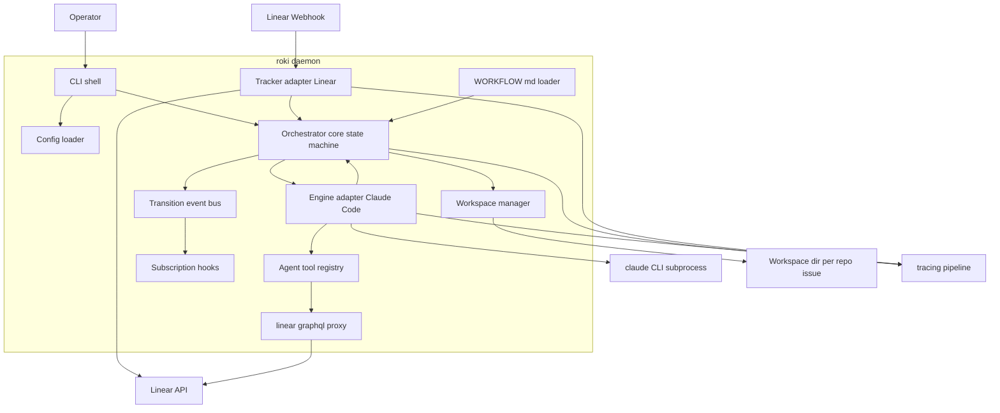
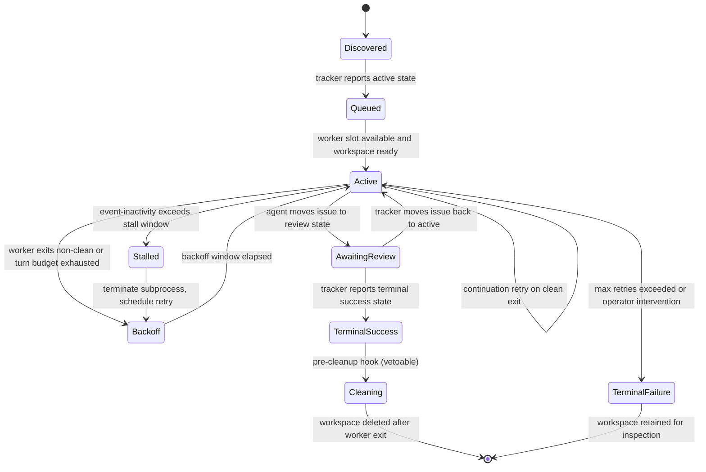
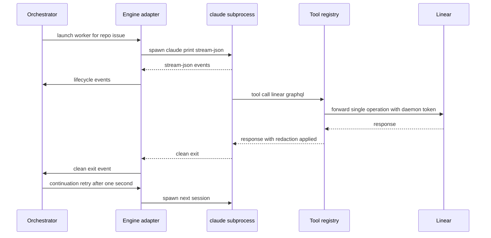

# Design Document

## Overview

**Purpose**: roki-mvp delivers the symphony-parity vertical slice of roki: a single Rust daemon that observes Linear, allocates per-issue workspaces across multiple repositories, and supervises long-lived `claude --print --output-format stream-json` subprocesses that perform implementation work. The daemon is a passive observer of Linear and an active controller of subprocess lifecycle plus workspace filesystem state — it never mutates Linear, never opens pull requests, never edits code.

**Users**: A solo developer or small team operator who runs roki locally as a long-running daemon, configures one or more Git repositories under it, and supervises Linear-driven implementation work across all of them from one process.

**Impact**: Establishes the foundational orchestrator and the four extension seams (state-machine hooks, agent tool registry, `WORKFLOW.md` schema, workspace path layout) that the four downstream specs (roki-spec-gate, roki-review-gate, roki-observability, roki-distill-postmerge) plug into. Without this MVP, none of the downstream specs has anywhere to attach.

### Goals
- A `roki` Rust 2024 binary that runs as a daemon, configurable via CLI plus a config file, with structured tracing logs.
- Multi-repo from day one: workspaces keyed by `(repo, issue)`; one daemon serves multiple repositories.
- Long-lived `claude --print --output-format stream-json` subprocess per active issue with bounded loops (max_turns, exponential backoff, continuation retry, stall detection).
- `WORKFLOW.md` (Liquid + Markdown front matter) policy loader with hot reload and schema validation.
- In-memory orchestrator state machine with stable extension points (subscription hooks, agent tool registry, `WORKFLOW.md` schema) for downstream specs.
- Restart recovery via Linear + filesystem reconciliation; no persistent database.
- Language-agnostic `SPEC.md` at the repo root describing the contract.

### Non-Goals
- Linear writes, PR creation, code edits — all delegated to the agent.
- Persistent state stores (SQLite, sled, etc.).
- kiro-spec gate enforcement, kiro-review gate enforcement, HTTP/TUI observability, post-merge distill — deferred to the four follow-up specs.
- Container or VM isolation; multi-host SSH workers; auto-merge; Windows support.

## Boundary Commitments

### This Spec Owns
- The `roki` binary entry point, CLI parsing (clap), tokio runtime, tracing pipeline.
- The in-memory orchestrator: per-`(repo, issue)` state machine, transition event bus, subscriber registry with documented vetoable transitions.
- The Linear adapter: webhook receiver, polling fallback (<= 5 min cadence per scope), tracker normalization (issue model), 429 backoff, read-only on the daemon side.
- The per-issue workspace lifecycle: sanitize identifier, create on active, delete on terminal, path-safety invariants.
- The Claude Code engine adapter: subprocess launch, stream-JSON parser, lifecycle event mapping, max_turns enforcement, stall-by-event-inactivity detection, continuation retry, exponential backoff between worker invocations.
- The `WORKFLOW.md` loader: front-matter parsing, Liquid render, JSON-Schema validation, hot reload with last-known-good fallback.
- The agent tool registry contract and the built-in `linear_graphql` proxy tool (one operation per call, daemon-owned credentials, redaction).
- The default permission strategy and sandbox knobs (`workspace-write` + reject elicitations as default; `--settings` allowlist or `--dangerously-skip-permissions` fallback).
- `SPEC.md` at the repository root, language-agnostic.

### Out of Boundary
- Any logic that performs Linear writes, PR creation, branch management, or code edits — that work belongs to the agent, full stop.
- kiro-spec gate enforcement (deferred to roki-spec-gate, plugs into the state-machine subscription hook).
- kiro-review gate enforcement (deferred to roki-review-gate, plugs into the state-machine subscription hook).
- HTTP API, ratatui TUI, structured state introspection beyond logs (deferred to roki-observability).
- Post-merge flow-document classification and distill (deferred to roki-distill-postmerge).
- Persistent storage of run history, run analytics, multi-tenant orchestration, multi-host workers, container isolation, auto-merge, Windows.

### Allowed Dependencies
- Rust 2024 + tokio for async runtime.
- clap for CLI argument parsing.
- tracing + tracing-subscriber for structured logs.
- reqwest for Linear HTTPS calls; axum for the webhook receiver only (no broader HTTP surface).
- liquid (or compatible) for `WORKFLOW.md` body templating; serde_yaml or toml for front matter; a JSON-Schema validator (jsonschema or similar) for schema enforcement.
- notify (or compatible) for filesystem hot-reload watching.
- Claude Code installed locally with kiro skills available under `~/.claude/skills/kiro-*` (operator concern, not bundled).
- The `gh` CLI is invoked only by the agent inside the workspace, not by the daemon.

### Revalidation Triggers
Changes that should force dependent specs to re-check integration:
- Any change to the orchestrator state set or to the documented vetoable-transition list.
- Any breaking change to the agent tool registry contract or to `linear_graphql` semantics.
- Any breaking change to the `WORKFLOW.md` schema (additions are additive and safe; removals or type changes are breaking).
- Any change to the workspace path layout or sanitization rules.
- Any change to the lifecycle event taxonomy emitted by the engine adapter.
- Any change to subscriber error-isolation semantics.
- Any change to the published read-side traits (`OrchestratorRead`, `TrackerRefresh`) consumed by roki-observability.
- Any change to the pre-cleanup hook contract consumed by roki-distill-postmerge.
- Any change to the `WorkerContext` field set or the prelude-forwarding mechanism for `additional_context`.

### Cross-Spec Extension Surface

roki-mvp publishes the following stable extension surface for downstream specs. Every entry on this list is a contract: breaking changes here trigger the revalidation triggers above.

- **State-machine subscription hooks** (`SubscriberHooks`) with the documented vetoable-transition list (`Queued -> Active`, `AwaitingReview -> TerminalSuccess`, `TerminalSuccess -> Cleaning`).
- **Pre-cleanup hook** (`Cleaning` interim state, see "Per-issue worker lifecycle"): downstream specs may register vetoable observers for `TerminalSuccess -> Cleaning` to perform deferred work (e.g., distill) before the workspace is removed.
- **Read-side traits**: `OrchestratorRead` (snapshot + per-issue lookup) and `TrackerRefresh` (nudge). Both are read-only / nudge-only and grant no state-mutation rights; observability and similar specs depend on these.
- **Agent tool registry** (`Registry::register`): downstream specs may register additional read-only tools without forking the core.
- **`WorkflowPolicy.extension`** (typed as `serde_json::Value`): downstream specs deserialize their own slice of the policy from a reserved sub-namespace. The MVP loader round-trips unknown keys without interpreting them. Reserved namespaces:
  - `extension.gates.spec.*` (roki-spec-gate)
  - `extension.gates.review.*` (roki-review-gate)
  - `extension.server.*` (roki-observability)
  - `extension.distill.*` (roki-distill-postmerge)
- **`WorkerContext.additional_context`** (typed as `Option<serde_json::Value>`): an additive optional field reserved for downstream gates and specs to inject prelude context into the worker session (for example, roki-review-gate's `.review-findings.json`). The engine adapter forwards this value through the workspace prelude / Claude session prompt envelope; the MVP itself does not interpret the contents. `WorkerContext` is extensible by additional optional additive fields under the same forwarding contract; removing or retyping fields is a breaking change.

## Architecture

### Architecture Pattern & Boundary Map



**Architecture Integration**:
- **Selected pattern**: Hexagonal / ports-and-adapters around an in-memory orchestrator core. Adapters (tracker, engine, workspace, workflow loader) implement narrow traits; the orchestrator depends only on those traits. Symphony-aligned: long-lived agent session, no DB, `WORKFLOW.md` as user-facing policy.
- **Domain boundaries**: CLI shell vs orchestrator core; tracker adapter vs orchestrator; engine adapter vs orchestrator; workspace manager vs orchestrator; workflow loader vs orchestrator; agent tool registry as its own seam.
- **Existing patterns preserved**: Symphony's small-daemon thesis (no DB, agent owns writes, long-lived stdio session, `WORKFLOW.md`).
- **New components rationale**: Multi-repo from day one (`(repo, issue)` keying) and explicit subscription hooks are the deliberate divergences from symphony to support the four downstream specs.
- **Steering compliance**: Rust 2024 + tokio, no SQLite, kiro skills as personal skills, macOS + Linux only.

### Technology Stack

| Layer | Choice / Version | Role in Feature | Notes |
|-------|------------------|-----------------|-------|
| CLI | clap 4.x | Argument parsing for `roki run` and subcommands | Derive macros for subcommand structure |
| Runtime | Rust 2024 + tokio 1.x | Async orchestration, subprocess supervision | Multi-threaded scheduler |
| Logging | tracing + tracing-subscriber | Structured logs with per-`(repo, issue)` context | JSON output supported via subscriber |
| HTTP client | reqwest 0.12+ | Linear GraphQL calls from `linear_graphql` proxy and tracker adapter | rustls TLS by default |
| HTTP server | axum 0.7+ | Linear webhook receiver only — no broader API surface | Bound to localhost or operator-configured interface |
| Templating | liquid | `WORKFLOW.md` body rendering | Front matter parsed separately |
| Front matter | serde_yaml or toml | YAML or TOML front matter on `WORKFLOW.md` | Single format selected at MVP — see decision below |
| Schema | jsonschema (Rust) | Validate parsed `WORKFLOW.md` policy shape | Fails closed with last-known-good fallback on hot reload |
| File watcher | notify | Hot reload of `WORKFLOW.md` | Debounced |
| GraphQL | hand-rolled or graphql_client | Linear GraphQL request envelope | Hand-rolled is acceptable to keep dependencies small |
| Config | serde + figment or hand-rolled | Layered config (file + env + flags) | Linear token loaded from env or secret file, never committed |

> Front-matter format choice: MVP picks YAML for ergonomic reasons (Liquid + YAML pairs commonly in static site tooling), but the loader trait does not leak the choice; the policy struct after parsing is format-agnostic so a future change to TOML is non-breaking for downstream specs.

## File Structure Plan

### Directory Structure

The repository is a Cargo workspace from day one. The MVP ships a single member crate, `crates/roki-daemon/`, but the workspace layout is committed up front so downstream specs (notably roki-observability) can add `crates/roki-tui/` and `crates/roki-api-types/` as pure-additive members without restructuring.

```
SPEC.md                              # Language-agnostic contract
Cargo.toml                           # [workspace] root, members = ["crates/roki-daemon"]
WORKFLOW.example.md                  # Bundled default workflow file
crates/
└── roki-daemon/                     # The MVP daemon crate (sole initial workspace member)
    ├── Cargo.toml                   # name = "roki", binary entry
    ├── src/
    │   ├── main.rs                  # Binary entry, tokio runtime bootstrap
    │   ├── cli.rs                   # clap definitions, subcommand wiring
    │   ├── config/
    │   │   ├── mod.rs               # Config struct, loader, validation
    │   │   └── repos.rs             # Multi-repo config and routing precedence
    │   ├── orchestrator/
    │   │   ├── mod.rs               # Orchestrator entry, lifecycle ownership
    │   │   ├── state.rs             # State enum, transition table, vetoable set
    │   │   ├── worker.rs            # Per-(repo, issue) worker actor
    │   │   ├── events.rs            # Transition event types, event bus
    │   │   ├── hooks.rs             # Subscription registry, error isolation, pre-cleanup hook
    │   │   ├── read.rs              # OrchestratorRead implementation (snapshot/issue)
    │   │   └── recovery.rs          # Restart reconciliation across Linear + workspace
    │   ├── tracker/
    │   │   ├── mod.rs               # Tracker trait, TrackerRefresh trait, normalized issue model
    │   │   ├── linear.rs            # Linear GraphQL client, polling, 429 backoff
    │   │   └── webhook.rs           # axum-based webhook receiver, signature verify
    │   ├── engine/
    │   │   ├── mod.rs               # Engine adapter trait
    │   │   ├── claude.rs            # Claude Code subprocess launcher and supervisor; prelude forwarding
    │   │   ├── stream.rs            # stream-json line parser, typed lifecycle events
    │   │   └── policy.rs            # max_turns, stall detection, backoff, continuation retry
    │   ├── workspace/
    │   │   ├── mod.rs               # Workspace manager, sanitization, path safety
    │   │   └── layout.rs            # Workspace root, per-(repo, issue) path derivation
    │   ├── workflow/
    │   │   ├── mod.rs               # WORKFLOW.md loader, hot reload coordinator
    │   │   ├── parse.rs             # Front matter + Liquid + Markdown parse
    │   │   └── schema.rs            # JSON-Schema for the policy shape
    │   ├── tools/
    │   │   ├── mod.rs               # Agent tool registry trait, registration API
    │   │   └── linear_graphql.rs    # Single-operation proxy tool, redaction
    │   ├── permissions.rs           # Sandbox + permission-strategy resolution
    │   ├── logging.rs               # Tracing init, redaction layer
    │   └── shutdown.rs              # Signal handling, bounded shutdown windows
    └── tests/
        ├── integration_orchestrator.rs
        ├── integration_engine_adapter.rs
        ├── integration_workflow_loader.rs
        ├── integration_workspace.rs
        ├── integration_tracker.rs
        ├── integration_tools_registry.rs
        └── integration_recovery.rs
```

> Each module owns one clear responsibility. Cross-module imports follow the dependency direction: `config` → `orchestrator/state` → `orchestrator/worker` (via traits in `tracker`, `engine`, `workspace`, `workflow`, `tools`). Adapters never import from `orchestrator/worker`; they implement traits the orchestrator consumes.
>
> Cargo workspace rationale: keeping the daemon at `crates/roki-daemon/` from day one means roki-observability can add `crates/roki-tui/` (ratatui front end) and `crates/roki-api-types/` (shared HTTP type crate) as pure-additive workspace members without moving any roki-mvp source files. The workspace `Cargo.toml` lists `members = ["crates/roki-daemon"]` initially; downstream specs append entries to that list.

### Modified Files
- (Greenfield: there are no existing source files to modify. The `.gitignore` and `CLAUDE.md` already in the repo are unaffected.)

## System Flows

### Daemon bootstrap

`runtime::run` (task 5.1) composes the architecture in a fixed order so
secrets are added to the redaction list before any structured event is
emitted, refusal modes land before any resource is held, and the HTTP
surface comes up regardless of Linear's reachability. The full sequence is
documented under `SPEC.md §9.7`; the reference implementation lives in
`crates/roki-daemon/src/runtime.rs::run_with_shutdown`. Composition order:

1. Load config (`--config <path>` overrides `./roki.toml`; CLI flags
   `--bind` / `--port` / `--dangerously-skip-permissions` override the
   file).
2. Resolve every secret (Linear token + per-repo webhook secret) and
   reinitialise the redaction-aware tracing pipeline with the secret list.
3. Install OS signal handlers wired to a shared `ShutdownSignal`.
4. Resolve the `claude` binary (config override → `$PATH` discovery → hard
   refusal).
5. Build per-repo `WorkflowLoader`s, the workspace manager, the engine
   adapter, the orchestrator (with `EnginePolicy::from_workflow(&policy)`).
6. For each repo, spawn a `LinearTracker` and mount
   `/linear/webhook/<sanitised-repo-id>` on a single `axum::Router`.
7. Bind the HTTP server at `[server].bind:[server].port`; a port conflict
   is a hard refusal.
8. Funnel polling + webhook streams through `TrackerBridge` into the
   orchestrator inbox.
9. `tokio::select!` on shutdown across orchestrator, bridge, server, and
   trackers; bound the wind-down at `SHUTDOWN_WINDOW = 30s` via
   `await_workers_with_window`.

`Orchestrator::with_engine_policy` carries one runtime engine policy per
daemon for the MVP. Per-repo policy resolution is a downstream-spec
concern — when the orchestrator splits per-repo actor pools, this resolver
expands to a per-repo map.

### Per-issue worker lifecycle



> Vetoable transitions (subscriber hooks may block): `Queued -> Active` (used by spec-gate), `AwaitingReview -> TerminalSuccess` (used by review-gate), `TerminalSuccess -> Cleaning` (used by distill-postmerge as a pre-cleanup hook). All other transitions are observable but non-vetoable.
>
> The `Cleaning` interim state exists to give downstream specs a stable place to perform deferred work that requires the workspace to still be present after success has been declared. Workspace removal is performed only on `Cleaning -> [*]`. A `Deny` vote on `TerminalSuccess -> Cleaning` blocks workspace removal and is logged; the operator-intervention path (manual cleanup) still applies.

### Worker invocation loop



## Requirements Traceability

| Requirement | Summary | Components | Interfaces | Flows |
|-------------|---------|------------|------------|-------|
| 1.1, 1.2, 1.3, 1.4, 1.5 | Daemon lifecycle and CLI | CliShell, Logging, Shutdown, Config | clap commands, signal handlers | n/a |
| 2.1, 2.2, 2.3, 2.4, 2.5 | Multi-repo configuration | Config, RepoRouter | Config schema, routing precedence | n/a |
| 3.1, 3.2, 3.3, 3.4, 3.5 | Linear tracker integration | TrackerAdapter, WebhookReceiver, NormalizedIssue | Tracker trait | Webhook + polling fallback |
| 4.1, 4.2, 4.3, 4.4, 4.5 | Workspace lifecycle | WorkspaceManager, WorkspaceLayout | Workspace trait | Per-issue worker lifecycle |
| 5.1, 5.2, 5.3, 5.4, 5.5, 5.6, 5.7 | Engine adapter | EngineAdapter, StreamJsonParser, EnginePolicy | Engine trait, lifecycle event types | Worker invocation loop |
| 6.1, 6.2, 6.3, 6.4, 6.5 | WORKFLOW.md loader | WorkflowLoader, WorkflowSchema | WorkflowPolicy struct, schema | n/a |
| 7.1, 7.2, 7.3, 7.4, 7.5 | Agent tool registry and linear_graphql proxy | ToolRegistry, LinearGraphqlTool | Tool trait, registry API | Worker invocation loop |
| 8.1, 8.2, 8.3, 8.4, 8.5 | State machine and extension points | Orchestrator, EventBus, SubscriberHooks, RecoveryReconciler | Hook subscription API, transition events | Per-issue worker lifecycle |
| 9.1, 9.2, 9.3, 9.4, 9.5 | Permissions and sandbox | Permissions, EngineAdapter | Permission strategy enum | n/a |
| 10.1, 10.2, 10.3, 10.4 | Restart recovery | RecoveryReconciler, WorkspaceManager, TrackerAdapter | Recovery scan API | Per-issue worker lifecycle |
| 11.1, 11.2, 11.3, 11.4 | Language-agnostic SPEC.md | SPEC.md (root) | Documented contracts | n/a |
| 12.1, 12.2, 12.3, 12.4 | Daemon observability | Logging, Orchestrator, EngineAdapter, TrackerAdapter, WorkspaceManager | tracing fields, redaction layer | n/a |
| 13.1 | OrchestratorRead trait published for additive consumers | Orchestrator, OrchestratorRead | `OrchestratorRead` trait | n/a |
| 13.2 | Pre-cleanup hook (`Cleaning` interim state) published for deferred-cleanup consumers | Orchestrator, SubscriberHooks | `PreCleanupHook` trait, `Cleaning` state | Per-issue worker lifecycle |
| 13.3 | TrackerRefresh nudge trait published for additive observability surfaces | TrackerAdapter | `TrackerRefresh` trait | n/a |
| 13.4 | `WorkerContext.additional_context` additive field forwarded as session prelude | EngineAdapter | `WorkerContext` schema, prelude envelope | Worker invocation loop |
| 13.5 | Reserved `WORKFLOW.md` extension namespaces published for downstream specs | WorkflowLoader, WorkflowSchema | `WorkflowPolicy.extension`, schema | n/a |

## Components and Interfaces

| Component | Domain/Layer | Intent | Req Coverage | Key Dependencies (P0/P1) | Contracts |
|-----------|--------------|--------|--------------|--------------------------|-----------|
| CliShell | CLI | Parse arguments, bootstrap config, hand control to Orchestrator | 1.1, 1.2, 1.5 | Config (P0), Orchestrator (P0) | Service |
| Config | Config | Load and validate layered configuration including multi-repo and secrets | 1.2, 2.1, 2.5, 9.5 | filesystem (P0), env (P0) | State |
| RepoRouter | Config | Resolve `(repo, issue)` routing precedence across overlapping scopes | 2.2, 2.3, 2.4 | Config (P0) | Service |
| Orchestrator | Orchestrator | Run the per-`(repo, issue)` state machine, schedule workers, isolate subscriber failures | 1.1, 1.3, 8.1, 8.2, 8.3, 8.4, 13.1, 13.2 | TrackerAdapter (P0), EngineAdapter (P0), WorkspaceManager (P0), WorkflowLoader (P0), EventBus (P0) | Service, Event, State |
| OrchestratorRead | Orchestrator | Read-only projection of orchestrator state for additive consumers | 13.1 | Orchestrator (P0) | Service |
| EventBus | Orchestrator | Publish transition events with isolation across subscribers | 8.2, 8.3, 8.4 | Orchestrator (P0) | Event |
| SubscriberHooks | Orchestrator | Register and dispatch subscribers; expose vetoable-transition contract and pre-cleanup hook | 8.3, 8.4, 13.2 | EventBus (P0) | Service |
| RecoveryReconciler | Orchestrator | Reconcile in-memory state on startup from Linear + workspace layout | 8.5, 10.1, 10.2, 10.3, 10.4 | TrackerAdapter (P0), WorkspaceManager (P0) | Service |
| TrackerAdapter | Tracker | Read-only Linear adapter with webhook + polling fallback and 429 backoff; publishes `TrackerRefresh` nudge trait | 3.1, 3.2, 3.3, 3.4, 3.5, 13.3 | reqwest (P0), axum (P0), Config (P0) | Service, Event |
| WebhookReceiver | Tracker | Validate signatures, normalize webhook payloads | 3.1, 3.4 | TrackerAdapter (P0) | API |
| WorkspaceManager | Workspace | Create, locate, and delete per-`(repo, issue)` workspaces with path safety | 4.1, 4.2, 4.3, 4.4, 4.5, 10.1, 10.2, 10.3 | filesystem (P0) | Service, State |
| EngineAdapter | Engine | Launch and supervise long-lived `claude` subprocess; map stream-json to lifecycle events | 5.1, 5.2, 5.3, 5.4, 5.5, 5.6, 5.7, 9.1, 9.2, 9.3, 9.4 | tokio process (P0), Permissions (P0), WorkflowLoader (P0), ToolRegistry (P0) | Service, Event |
| StreamJsonParser | Engine | Convert newline-delimited stream-json into typed lifecycle events | 5.2, 5.3 | EngineAdapter (P0) | Service |
| EnginePolicy | Engine | Enforce max_turns, stall detection, exponential backoff, continuation retry | 5.3, 5.4, 5.5, 5.6 | EngineAdapter (P0) | Service |
| WorkflowLoader | Workflow | Parse front matter + Liquid body, validate against schema, hot reload with last-known-good fallback | 6.1, 6.2, 6.3, 6.4, 6.5, 9.2 | notify (P0), liquid (P0), jsonschema (P0) | Service, State |
| WorkflowSchema | Workflow | The published policy schema, extensible without breaking consumers | 6.5 | WorkflowLoader (P0) | State |
| ToolRegistry | Tools | Stable agent tool registration and dispatch; redaction enforcement | 7.1, 7.4, 7.5 | EngineAdapter (P0) | Service, API |
| LinearGraphqlTool | Tools | Single-operation Linear proxy; redact credentials | 7.1, 7.2, 7.3, 7.4 | reqwest (P0), Config (P0) | API |
| Permissions | Permissions | Resolve sandbox and permission strategy from Config + WORKFLOW.md per worker | 9.1, 9.2, 9.3, 9.4, 9.5 | Config (P0), WorkflowLoader (P1) | State |
| Logging | Logging | tracing init, redaction layer, per-`(repo, issue)` context fields | 1.4, 12.1, 12.2, 12.3, 12.4 | tracing (P0) | Service |
| Shutdown | Lifecycle | Bounded shutdown on SIGINT/SIGTERM | 1.3 | tokio signal (P0) | Service |
| SpecRoot | Documentation | Language-agnostic `SPEC.md` at the repo root | 11.1, 11.2, 11.3, 11.4 | n/a | n/a |

### Orchestrator core

#### Orchestrator

| Field | Detail |
|-------|--------|
| Intent | Own the per-`(repo, issue)` state machine and the worker scheduling loop |
| Requirements | 1.1, 1.3, 8.1, 8.2, 8.3, 8.4 |

**Responsibilities & Constraints**
- Maintain one in-memory state instance per `(repo, issue)`.
- Drive transitions only from declared sources: tracker events, engine lifecycle events, recovery scan, operator shutdown.
- Publish a transition event for every transition (no silent transitions).
- Isolate subscriber failures so one failing subscriber cannot stall others.
- Never call Linear write APIs and never invoke `gh` directly; engine adapter is the only path to the agent.

**Dependencies**
- Inbound: CliShell — invokes `Orchestrator::run` (P0)
- Outbound: TrackerAdapter — subscribes to normalized issue events (P0)
- Outbound: EngineAdapter — launches and supervises workers (P0)
- Outbound: WorkspaceManager — creates and removes workspaces on transition (P0)
- Outbound: WorkflowLoader — reads policy at worker launch (P0)
- Outbound: EventBus — publishes transitions to SubscriberHooks (P0)

**Contracts**: Service [x] / API [ ] / Event [x] / Batch [ ] / State [x]

##### Service Interface (Rust trait sketch)

```rust
pub trait Orchestrator: Send + Sync {
    // Start the orchestrator. Returns when shutdown completes.
    async fn run(self, shutdown: ShutdownSignal) -> Result<(), OrchestratorError>;

    // Subscribe to transition events; returns a handle that, when dropped, unsubscribes.
    fn subscribe(&self, subscriber: Arc<dyn TransitionSubscriber>) -> SubscriptionHandle;

    // Register an async pre-cleanup observer invoked on the vetoable
    // TerminalSuccess -> Cleaning transition. The pre-cleanup hook is the
    // contracted extension point for deferred-cleanup work (e.g.,
    // roki-distill-postmerge) that must run while the workspace still exists.
    // A Deny result blocks workspace removal and is logged.
    fn register_pre_cleanup_hook(&self, hook: Arc<dyn PreCleanupHook>) -> SubscriptionHandle;
}

// Read-only projection of orchestrator state, published as a stable trait so
// roki-observability and similar additive specs can read state without any
// path to mutation.
pub trait OrchestratorRead: Send + Sync {
    // Snapshot the current per-(repo, issue) state for all tracked workers.
    fn snapshot(&self) -> SnapshotResponse;

    // Look up a single (repo, issue) projection.
    fn issue(&self, repo: &RepoId, issue: &IssueId) -> Option<IssueState>;
}

#[async_trait]
pub trait PreCleanupHook: Send + Sync {
    async fn on_pre_cleanup(&self, ctx: &PreCleanupContext) -> Result<VetoDecision, SubscriberError>;
}

pub trait TransitionSubscriber: Send + Sync {
    // Observe a transition. Errors are logged and isolated.
    async fn on_transition(&self, event: &TransitionEvent) -> Result<(), SubscriberError>;

    // Veto a transition (only meaningful for the subset declared as vetoable).
    async fn veto(&self, event: &TransitionEvent) -> Result<VetoDecision, SubscriberError>;
}

pub enum VetoDecision { Allow, Deny { reason: String } }

pub struct TransitionEvent {
    pub repo: RepoId,
    pub issue: IssueId,
    pub previous: WorkerState,
    pub next: WorkerState,
    pub trigger: TransitionTrigger,
    pub correlation_id: CorrelationId,
}

pub enum WorkerState {
    Discovered,
    Queued,
    Active,
    AwaitingReview,
    Backoff,
    Stalled,
    TerminalSuccess,
    Cleaning,          // interim state between TerminalSuccess and workspace removal; pre-cleanup hook target
    TerminalFailure,
}

pub enum TransitionTrigger {
    TrackerEvent,
    EngineEvent,
    RecoveryScan,
    OperatorShutdown,
    SubscriberVeto,
}
```

- Preconditions: `WorkflowLoader`, `TrackerAdapter`, `EngineAdapter`, and `WorkspaceManager` are constructed and injected before `run`.
- Postconditions: every transition is published exactly once; no per-issue state is written to disk.
- Invariants: state is owned by exactly one task per `(repo, issue)`; the state machine is deterministic given the input event sequence.

**Implementation Notes**
- Integration: tokio task per `(repo, issue)`; mpsc channels in, broadcast bus out.
- Validation: vetoable-transition list is hard-coded for MVP — `Queued -> Active`, `AwaitingReview -> TerminalSuccess`, and `TerminalSuccess -> Cleaning` are vetoable; all other transitions are observable but non-vetoable.
- Risks: subscriber back-pressure. Mitigation: bounded broadcast channel with drop-newest-on-full and a logged drop counter per subscriber.

#### EventBus, SubscriberHooks

Implementation note: a single tokio broadcast channel for non-vetoable transitions; an explicit await-on-each-subscriber path for vetoable transitions where a `Deny` result blocks the transition. Subscriber failure on a non-vetoable event is logged and ignored. Subscriber failure on a vetoable event is treated as `Deny` to fail closed.

#### RecoveryReconciler

Implementation note: at daemon start, list `<workspace_root>/<repo>/<sanitized-issue>/`, look up each `(repo, issue)` against Linear, and reconcile:
- workspace + active Linear → resume Active
- workspace + non-active Linear → orphaned, retain, log
- no workspace + active Linear → create workspace, enter Queued
- absent on both sides → no-op

### Tracker

#### TrackerAdapter

| Field | Detail |
|-------|--------|
| Intent | Provide a normalized stream of issue events from Linear, hot-path via webhook with polling fallback |
| Requirements | 3.1, 3.2, 3.3, 3.4, 3.5 |

**Responsibilities & Constraints**
- Webhook is the hot path; polling is the cold-path fallback at <= 5 min cadence per scope.
- 429 responses trigger exponential backoff per endpoint.
- Daemon-side adapter is read-only against Linear; writes are routed through the agent via `linear_graphql`.
- All emitted events conform to a single `NormalizedIssue` shape.

**Dependencies**
- Inbound: Orchestrator subscribes to issue events (P0)
- Outbound: Linear API via reqwest (P0)
- Outbound: axum webhook receiver (P0)

**Contracts**: Service [x] / API [x] / Event [x] / Batch [ ] / State [ ]

##### Service Interface

```rust
pub trait Tracker: Send + Sync {
    async fn run(self, sink: TrackerEventSink, shutdown: ShutdownSignal)
        -> Result<(), TrackerError>;
}

// Published nudge-only trait for external callers (e.g., roki-observability's
// POST /api/v1/refresh handler) to request an out-of-cycle poll. The trait
// exposes no read or mutation surface beyond requesting that the next poll
// be scheduled sooner; cadence caps and 429 backoff are still enforced.
pub trait TrackerRefresh: Send + Sync {
    async fn nudge(&self) -> Result<RefreshAccepted, TrackerError>;
}

pub struct RefreshAccepted {
    pub will_poll_within: Duration,
}

pub struct NormalizedIssue {
    pub repo: RepoId,             // resolved by RepoRouter
    pub issue: IssueId,           // Linear identifier
    pub title: String,
    pub description: String,
    pub state: IssueState,        // active | review | terminal | other
    pub labels: Vec<String>,
    pub team_or_scope: String,
}
```

##### API Contract (webhook)

| Method | Endpoint | Request | Response | Errors |
|--------|----------|---------|----------|--------|
| POST | `/linear/webhook` | Linear webhook payload + signature header | 204 on accepted | 401 invalid signature, 400 malformed |

**Implementation Notes**
- Integration: signature verification before any normalization; signature secret loaded from config.
- Validation: poll cadence enforced by a token bucket per scope; 429 triggers exponential backoff with logging.
- Risks: webhook duplicate delivery. Mitigation: orchestrator transitions are idempotent on `(repo, issue, target_state)`.

### Engine

#### EngineAdapter

| Field | Detail |
|-------|--------|
| Intent | Launch and supervise long-lived `claude --print --output-format stream-json` per active issue and surface lifecycle events |
| Requirements | 5.1, 5.2, 5.3, 5.4, 5.5, 5.6, 5.7, 9.1, 9.2, 9.3, 9.4 |

**Responsibilities & Constraints**
- Spawn `claude --print --output-format stream-json` with the issue workspace as cwd.
- Pass kiro-skill-discovery flags (no `--bare`) and the resolved permission/sandbox strategy.
- Apply turn budget, stall detection, continuation retry on clean exit, exponential backoff between launches.
- Stream-json parsing must isolate parse errors per line; one bad line cannot abort the worker.

**Dependencies**
- Inbound: Orchestrator schedules launches (P0)
- Outbound: tokio process for subprocess (P0)
- Outbound: Permissions (P0), WorkflowLoader (P0), ToolRegistry (P0)

**Contracts**: Service [x] / API [ ] / Event [x] / Batch [ ] / State [ ]

##### Service Interface

```rust
pub trait Engine: Send + Sync {
    async fn launch(
        &self,
        ctx: WorkerContext,
        events: WorkerEventSink,
        shutdown: ShutdownSignal,
    ) -> Result<WorkerOutcome, EngineError>;
}

pub struct WorkerContext {
    pub repo: RepoId,
    pub issue: IssueId,
    pub workspace: PathBuf,
    pub policy: WorkflowPolicy,
    pub permission: PermissionStrategy,
    pub max_turns: u32,
    pub stall_window: Duration,
    pub correlation_id: CorrelationId,
    // Additive optional field reserved for downstream gates and specs to inject
    // prelude context into the worker session. The MVP engine adapter forwards
    // this value verbatim through the workspace prelude / Claude session prompt
    // envelope; it is not interpreted by the MVP. Example consumers:
    //   - roki-review-gate injects a `.review-findings.json` summary so the
    //     agent's next session can address findings.
    // WorkerContext is extensible by additional optional additive fields under
    // the same forwarding contract; see "Cross-Spec Extension Surface".
    pub additional_context: Option<serde_json::Value>,
}

pub enum WorkerOutcome {
    CleanExit,
    NonCleanExit { code: Option<i32>, signal: Option<i32> },
    TurnBudgetExhausted,
    Stalled,
    Cancelled,
}

pub enum EngineLifecycleEvent {
    Started,
    AgentMessage,        // generic non-empty event observed
    ToolCall { name: String },
    ToolResult { name: String, ok: bool },
    Error { message: String },
    Exited(WorkerOutcome),
}
```

- Preconditions: workspace exists, `claude` binary present on `PATH`, `WorkflowPolicy` validated.
- Postconditions: a typed `EngineLifecycleEvent` stream, one terminal `Exited` event always emitted.
- Invariants: stall detection uses event-arrival inactivity, not subprocess CPU activity.

**Implementation Notes**
- Integration: `tokio::process::Command` with `kill_on_drop`; stdout reader as a line stream; stderr captured into log fields.
- Validation: max_turns enforced by the engine's continuation-prompt policy; on exhaustion, no new prompt is sent for the current invocation.
- Risks: stream-json schema drift across Claude Code versions. Mitigation: tolerant parser keyed on stable fields; unknown event types map to `AgentMessage` to keep the loop alive.
- Prelude forwarding: when `WorkerContext.additional_context` is `Some(value)`, the engine adapter forwards the value to the agent through the workspace prelude / Claude session prompt envelope (a documented JSON block prepended to the session prompt under a stable key). The MVP does not interpret the value; downstream specs own the schema of what they inject. The forwarding mechanism is additive: future fields may be added without breaking existing agents.

### Workspace

#### WorkspaceManager

| Field | Detail |
|-------|--------|
| Intent | Allocate and delete per-`(repo, issue)` workspaces with path-safety invariants |
| Requirements | 4.1, 4.2, 4.3, 4.4, 4.5, 10.1, 10.2, 10.3 |

**Responsibilities & Constraints**
- Allocate per-`(repo, issue)` git worktrees via the external `wt` CLI
  (worktrunk); resolve the source repo's local checkout via the external
  `ghq` CLI from a per-repo `owner/repo` (or `host/owner/repo`)
  identifier. See `design-worktree-workspace.md` for the locked decisions.
- Path layout: `{repo_path}/../{repo_name}.{branch_sanitized}` where
  `repo_path` is what `ghq list -p` returns and `branch` is the Linear
  issue id verbatim. Branch sanitization (`[^A-Za-z0-9_-]` → `-`) lives
  inside the `wt` adapter and is the only sanitizer applied.
- Creation is idempotent; deletion fires only on `Cleaning -> [*]` via
  `wt remove`. `TerminalFailure` retains both worktree dir and branch.
- Two distinct issue ids that sanitize to the same worktree path under
  the same repo are rejected with a typed identifier-collision error.
- The manager depends on `WtTool` and `GhqTool` traits; the production
  bootstrap injects `RealWt` / `RealGhq` (subprocess shellouts), and tests
  inject hand-rolled mocks. There is no daemon-level workspace root.
- Failures bubble as typed errors carrying the offending path or
  identifier.

**Contracts**: Service [x] / API [ ] / Event [ ] / Batch [ ] / State [x]

##### Service Interface

```rust
pub trait Workspace: Send + Sync {
    async fn ensure(&self, repo: &RepoId, issue: &IssueId) -> Result<PathBuf, WorkspaceError>;
    async fn remove(&self, repo: &RepoId, issue: &IssueId) -> Result<(), WorkspaceError>;
    async fn list_existing(&self) -> Result<Vec<(RepoId, IssueId, PathBuf)>, WorkspaceError>;
}
```

- Invariants: the resolved path is the deterministic worktree layout
  `{repo_path}/../{repo_name}.{branch_sanitized}` produced by
  `wt switch --create` against the configured repo's local checkout.
  There is no daemon-level workspace root.

### Workflow loader

#### WorkflowLoader

| Field | Detail |
|-------|--------|
| Intent | Load, validate, and hot-reload `WORKFLOW.md` per repo with last-known-good fallback |
| Requirements | 6.1, 6.2, 6.3, 6.4, 6.5, 9.2 |

**Responsibilities & Constraints**
- Parse front matter (YAML), render Liquid body, validate parsed object against `WorkflowSchema`.
- Hot reload via filesystem watcher with debounce; on validation failure, retain the previous valid policy and log.
- Schema is additive-friendly: unknown keys under designated extension namespaces (e.g., `gates.*`) are accepted to allow downstream specs.

**Contracts**: Service [x] / API [ ] / Event [ ] / Batch [ ] / State [x]

##### Service Interface

```rust
pub trait WorkflowLoader: Send + Sync {
    fn current(&self, repo: &RepoId) -> Result<WorkflowPolicy, WorkflowError>;
    async fn watch(self, shutdown: ShutdownSignal) -> Result<(), WorkflowError>;
}

pub struct WorkflowPolicy {
    pub sandbox: SandboxMode,            // workspace-write by default
    pub elicitations: ElicitationsMode,  // reject by default
    pub max_turns: u32,
    pub stall_window: Duration,
    pub backoff: BackoffPolicy,          // min 10s, max 5min
    // Concrete type: serde_json::Value (a JSON object at the policy root).
    // Equivalent to `BTreeMap<String, serde_json::Value>` semantically, but
    // typed as a JSON value so downstream specs can `serde_json::from_value`
    // their reserved sub-slice (e.g., policy.extension.get("gates").get("spec"))
    // into their own typed struct without coupling to MVP types.
    pub extension: serde_json::Value,
}
```

- Schema notes: the following sub-namespaces under `extension` are reserved for the canonical roki specs. The MVP loader does not interpret them; it round-trips them through the policy struct unchanged. Downstream specs may register additive sub-schemas under these namespaces and deserialize their slice (`policy.extension.gates.spec`, `policy.extension.gates.review`, `policy.extension.server`, `policy.extension.distill`):
  - `extension.gates.spec.*` — roki-spec-gate
  - `extension.gates.review.*` — roki-review-gate
  - `extension.server.*` — roki-observability
  - `extension.distill.*` — roki-distill-postmerge

### Tools

#### ToolRegistry and LinearGraphqlTool

| Field | Detail |
|-------|--------|
| Intent | Stable, extensible registry that exposes audited tools to the agent; bundle the `linear_graphql` proxy |
| Requirements | 7.1, 7.2, 7.3, 7.4, 7.5 |

**Responsibilities & Constraints**
- Each tool declares a stable name and JSON-Schema input/output. The registry hands a serialized tool catalog to the engine adapter at worker launch.
- `linear_graphql` proxy enforces single GraphQL operation per call; multi-operation requests return a structured error to the agent.
- Linear API token is held only in `LinearGraphqlTool`; never reflected in tool input/output/error visible to the agent. A redaction layer removes any accidental occurrence in error strings.

**Contracts**: Service [x] / API [x] / Event [ ] / Batch [ ] / State [ ]

##### Service Interface

```rust
pub trait Tool: Send + Sync {
    fn name(&self) -> &'static str;
    fn input_schema(&self) -> &'static str;   // JSON-Schema string
    fn output_schema(&self) -> &'static str;
    async fn call(&self, input: serde_json::Value) -> Result<serde_json::Value, ToolError>;
}

pub trait Registry: Send + Sync {
    fn register(&self, tool: Arc<dyn Tool>) -> Result<(), ToolError>;
    fn catalog(&self) -> Vec<ToolDescriptor>;
    async fn dispatch(&self, name: &str, input: serde_json::Value)
        -> Result<serde_json::Value, ToolError>;
}
```

##### API Contract (`linear_graphql`)

| Method | Endpoint | Request | Response | Errors |
|--------|----------|---------|----------|--------|
| Tool call | `linear_graphql` | `{ query: string, variables: object }` (single GraphQL operation) | Linear response payload | `MULTIPLE_OPERATIONS`, `LINEAR_HTTP_ERROR`, `RATE_LIMITED`, `REDACTION_FAILED` |

**Implementation Notes**
- Validation: parse the GraphQL document and reject if it contains more than one operation definition.
- Integration: requests are sent through the same reqwest client as the tracker, sharing 429 backoff state.
- Risks: schema drift on the Linear side. Mitigation: the proxy is intentionally agnostic and returns Linear's response shape unchanged.

### Permissions

#### Permissions

Implementation note: at worker launch, resolve the effective permission strategy by combining the operator's selection (`--settings` allowlist or `--dangerously-skip-permissions`) with any per-repo override declared in `WORKFLOW.md`. Always refuse to start a worker if neither strategy is present.

### Documentation

#### SpecRoot (`SPEC.md` at repo root)

Implementation note: a single `SPEC.md` at the repository root that documents, in language-agnostic prose:
- The daemon contract (lifecycle, shutdown, configuration shape).
- The `WORKFLOW.md` schema, with the reserved extension namespaces.
- The per-issue state machine, the documented vetoable transitions, the recovery rules.
- The agent tool registry contract (tool name + schema convention) and the `linear_graphql` proxy semantics.
- The workspace path layout and sanitization rules.
- The lifecycle event taxonomy emitted by the engine adapter.
The Rust implementation is one conformant implementation among possibly many.

## Data Models

### Domain Model

The MVP has no persistent domain model. The runtime in-memory model has three aggregates:
- **Worker** keyed by `(RepoId, IssueId)`, owning `WorkerState`, `correlation_id`, last-event timestamp, retry count, and current backoff window.
- **NormalizedIssue** owned by the tracker as a snapshot per webhook or poll tick; never persisted.
- **WorkflowPolicy** owned per repo by the workflow loader; replaced atomically on hot reload.

No durable storage. The only on-disk state under daemon control is the workspace tree, which is the agent's working directory, not a daemon state store.

### Data Contracts & Integration

- `linear_graphql` request/response: arbitrary GraphQL document and variables in, Linear-shape JSON out, one operation per call.
- Tool catalog: JSON array of `{ name, input_schema, output_schema }` shipped to the engine at launch.
- `WORKFLOW.md` schema: published in `SPEC.md` and enforced by `WorkflowSchema`.

## Error Handling

### Error Strategy

Each adapter defines its own typed error enum (using `thiserror`) and converts at the orchestrator boundary into a single `OrchestratorError`. Errors are surfaced as either:
- A transition into `Backoff` or `TerminalFailure` for that `(repo, issue)`.
- A daemon-wide refusal to start (config / WORKFLOW.md validation, missing permission strategy).

Subscriber errors are isolated: per-subscriber error counters in tracing, never abort the orchestrator loop.

### Error Categories and Responses

- **Configuration errors** (startup): refuse to start, exit non-zero, log offending field.
- **Linear errors** (runtime): transient (429, network) → exponential backoff with logging; persistent → leave issue queued, surface via logs.
- **Workspace errors**: fail the affected `(repo, issue)`, mark `TerminalFailure`, retain workspace for inspection if creation succeeded but a later step failed.
- **Engine errors**: classify by `WorkerOutcome`. Only `NonCleanExit` consumes the configured `max_attempts` retry budget (default `3`); on each `NonCleanExit` the worker actor drives `Active → Backoff → Active` until the budget is exhausted, at which point the actor routes `Active → TerminalFailure` and retains the workspace. `Stalled` and `TurnBudgetExhausted` are agent-authored failures that repeat under the same prompt and budget, so they route directly to `TerminalFailure` without consuming the retry budget. The workspace is retained across the entire Backoff loop (no delete/recreate between attempts); the prelude / `additional_context` is re-emitted unchanged on each launch.
- **WORKFLOW.md errors**: at startup, refuse for that repo; at hot reload, retain last-known-good and log.
- **Tool errors**: structured tool errors are returned to the agent unchanged after redaction; never elevated to daemon errors.

### Monitoring

All decisions above are logged via tracing with `(repo, issue, correlation_id)` context fields and an event-name field that downstream consumers (operator and roki-observability) can filter on.

## Testing Strategy

### Unit Tests
- Workspace identifier sanitization rejects path-traversal and absolute paths and accepts the documented character class.
- StreamJsonParser maps a representative set of stream-json line shapes to the typed lifecycle event taxonomy and skips one bad line without aborting.
- EnginePolicy enforces max_turns, stall window, exponential backoff bounds (10s..=5min), and continuation-retry-on-clean-exit semantics.
- LinearGraphqlTool rejects multi-operation GraphQL documents with `MULTIPLE_OPERATIONS` and never echoes the API token in any field of any error variant.
- WorkflowLoader returns the previous valid policy and logs a structured event when a hot-reload candidate fails schema validation.

### Integration Tests
- Orchestrator restart recovery: pre-seed two workspaces and a Linear stub state, start the daemon, assert reconciliation produces the documented per-case outcome (resume / orphan / create).
- Vetoable transition path: a stub subscriber denies `Queued -> Active` for a specific issue; assert that issue stays `Queued` and the daemon emits the expected veto log event while another issue progresses normally.
- Tracker webhook + 429 backoff: simulate signed webhook delivery alongside a 429 from a polling fallback call and assert the next polling tick respects the backoff window.
- Engine adapter end-to-end with a fake `claude` binary that emits a scripted stream-json sequence, including a stall, a clean exit, and a non-clean exit, asserting the orchestrator records the corresponding state transitions.
- Multi-repo routing: two repos with overlapping label scopes and a deterministic precedence rule; assert that each issue lands in exactly one repo's worker and that logs name the precedence decision.

### E2E Tests
- A fake Linear stub plus a fake `claude` binary drive a full happy path from `Discovered -> Queued -> Active -> AwaitingReview -> TerminalSuccess` for a single `(repo, issue)`, including workspace creation and post-terminal deletion.
- Same harness drives a failure path that exhausts the retry budget and lands in `TerminalFailure` with the workspace retained.

### Performance / Load (informational)
- Polling cadence test: assert no scope is polled more than once per five minutes under steady load.
- Subscriber back-pressure: a slow subscriber does not stall transitions for other subscribers; drop counter increments are observable in logs.

## Optional Sections

### Security Considerations

- Linear API token is loaded from environment or operator-controlled secret file, never committed, redacted from all log output by a tracing layer that scrubs known secret strings.
- Webhook receiver verifies the Linear signature before any normalization; failures return 401 with no payload echoed.
- The daemon binds the webhook receiver to localhost by default; binding to a public interface is an operator choice and is documented.
- The agent runs under `workspace-write` and rejects elicitations by default; the `--dangerously-skip-permissions` fallback is opt-in and is logged at every worker launch.
- Workspace path-safety invariants prevent agent or user input from escaping the workspace root via crafted issue identifiers.

### Performance & Scalability

- One daemon, single host, multi-repo. Target: tens of repos, low-tens of concurrently active issues per host. No database means restart cost is bounded by Linear fetch + workspace listing.
- Polling cadence cap (<= 5 min per scope) is the dominant Linear-side load.
- Subprocess concurrency is bounded by an operator-configurable max-concurrent-workers knob (defaulted to a small integer).
