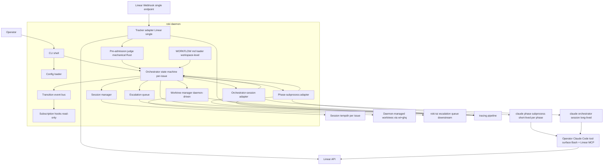

---
refs:
  id: design:roki-mvp
  kind: design
  title: "roki-mvp Design"
  spec: roki-mvp
  implements:
    - requirements:roki-mvp
  related:
    - research:roki-mvp
  modules:
    - crates/roki-daemon/
---

# Design Document

## Overview

**Purpose**: roki-mvp delivers the symphony-parity vertical slice of roki: a single Rust daemon that observes Linear, runs a mechanical pre-admission-judge in Rust against four ordered conditions (assignee match + Linear state in `admit_states` + `roki:ready` label + optional `roki:impl` to select the per-ticket `mode` flag), launches a long-lived per-ticket **orchestrator session** (`claude --input-format stream-json --output-format stream-json`), and supervises short-lived bounded **phase subprocesses** that the orchestrator nominates to perform code-changing work. The daemon owns mechanical observation only — pre-admission filtering, orchestrator and phase subprocess lifecycle (launch / stall detection / stream-json parsing / exit translation), per-issue session tempdir lifecycle, daemon-driven worktree materialization (idempotent on every non-`classify` phase nomination) and cleanup on terminal Linear state, and the three orchestrator-dead routing paths to `Inactive(reason=*)` + TUI escalation queue. The daemon never writes Linear, never opens PRs, never edits code, and never registers, proxies, or wraps any agent-side tool.

**Users**: A solo developer or small team operator who runs roki locally as a long-running daemon, configures the Linear assignee as `me` (or another resolvable Linear user), declares an allowlist of Git repositories under it, installs Claude Code locally with their own Linear MCP integration plus `wt` / `ghq` on `$PATH`, applies the fixed labels `roki:ready` (always) and `roki:impl` (when declaring an existing project-level spec is complete) to Linear tickets, and supervises their own Linear-driven implementation work across all repos from one process.

**Impact**: Establishes the daemon-side foundation and the stable extension seams (state-machine subscription hooks, `OrchestratorRead` snapshot, `TrackerRefresh` nudge, four required `WORKFLOW.md` template blocks, reserved `extension.*` namespaces, engine-adapter `additional_context` channel) that the downstream spec roki-observability plugs into. The pre-admission-judge narrows orchestrator launch to authorized tickets at zero LLM cost; the orchestrator session itself owns repo resolution against the daemon's allowlist, structural artifact validation (`review.md` after `finalize_review`; SPEC_DRIVEN target spec docs on first turn), and Linear writes via the operator's installed Linear MCP.

### Goals

- A `roki` Rust 2024 binary running as a daemon, configurable via CLI and a config file, with structured tracing logs and per-issue / per-subprocess / per-repo correlation context.
- Daemon-side mechanical pre-admission-judge: 4-condition check (assignee + Linear state + `roki:ready` + optional `roki:impl`) per [fr:04-state-machine-and-recovery](../../../docs/fr/04-state-machine-and-recovery.md). Failed ticket is silently skipped (log only, no state entry, no Linear write, no subprocess launched).
- Long-lived per-ticket orchestrator session per [fr:19-orchestrator-session](../../../docs/fr/19-orchestrator-session.md): one `claude --input-format stream-json --output-format stream-json` process, tool surface restricted to Linear MCP (write) + `Read` + `Bash` (read-only filesystem sandbox) regardless of operator overrides, strict-JSON action contract over a small enum, `mode` flag rendered into the system prompt at launch.
- Short-lived bounded phase subprocesses per [fr:18-worker-skill-workflow](../../../docs/fr/18-worker-skill-workflow.md): seven phases (`classify`, `implement`, `review`, `validate`, `open_pr`, `ci_fix`, `finalize_review`) with mode-aware catalog defaults (slash-command-driven skill or daemon-internal Liquid template) and per-phase override surface (`extension.phase.<name>.command` or `prompt_template_<phase>`, mutually exclusive).
- Single workspace-level `WORKFLOW.md` (Liquid + Markdown front matter) policy loader with hot reload, schema validation, and four required named template blocks: `prompt_template_orchestrator`, `prompt_template_implement_direct`, `prompt_template_validate_direct`, `prompt_template_open_pr`.
- In-memory orchestrator state machine with five states (`Pending`, `Active`, `Backoff`, `Inactive`, `Cleaning`) and a 12-value `Inactive.reason` discriminator including the three orchestrator-dead reasons (`orchestrator_crash`, `orchestrator_unparseable`, `orchestrator_budget_exhausted`).
- Daemon-driven worktree materialization, idempotent on every non-`classify` phase nomination (single repo per ticket, allowlist-validated by the orchestrator), and cleanup on tracker terminal state via allowlist iteration filtered by branch == issue id.
- Restart recovery via Linear + filesystem reconciliation (no persistent database). A fresh orchestrator is launched on re-admission with the `mode` recomputed from the current Linear label set.
- Daemon-only failure surfacing per [fr:14-operator-notifications](../../../docs/fr/14-operator-notifications.md): `daemon_directive` events to a live orchestrator (which writes Linear via Linear MCP); the three orchestrator-dead `Inactive.reason` values surface via structured log + TUI escalation queue only — the daemon does not write Linear directly.

### Non-Goals

- Linear writes from the daemon process; daemon-registered, daemon-proxied, or daemon-wrapped agent-side tools — every agent reach to Linear / git / `gh` / `ghq` / `wt` is through the operator's local Claude Code tool surface.
- Per-issue spec materialization inside the daemon flow. SPEC_DRIVEN reuses an operator-authored project-level spec; NEEDS_CLASSIFY hands off to the operator on Path A / C / D / E.
- Daemon-side mechanical artifact-validation gates (the prior `roki-spec-gate` / `roki-review-gate` vetoable hooks). Structural validation of the SPEC_DRIVEN target spec docs and `review.md` is owned by the orchestrator inside its own phase-planning loop.
- Persistent state stores (SQLite, sled, etc.); HTTP API and TUI surfaces (deferred to `roki-observability`); auto-merge orchestration; container or VM isolation; multi-host SSH workers; Windows support.
- Multi-repo tickets (rejected by the orchestrator with `outcome=needs_split`); operator-renamable label conventions (`roki:ready` and `roki:impl` are fixed strings); mode mutation mid-flight; orchestrator-side context compaction across long-running tickets (deferred — `max_phases` bounds session length).
- Slack and other push notification channels — daemon-only failures surface via the orchestrator → Linear MCP when the orchestrator is alive, and via TUI escalation queue + structured log only for the three orchestrator-dead failure paths and for skipped tickets.

## Boundary Commitments

### This Spec Owns

- The `roki` binary entry point, CLI parsing (clap, including `--config` / `--bind` / `--port` / `--dangerously-skip-permissions` / `--debug`), tokio runtime, tracing pipeline with redaction layer, and the bootstrap composition order in [Daemon bootstrap](#daemon-bootstrap) below.
- The Linear adapter and pre-admission-judge boundary: a single workspace-level webhook receiver, a single workspace-level polling fallback (≤ 5 min cadence), startup resolution of `[linear].assignee` (`me` → token owner), tracker normalization (`NormalizedIssue` carrying assignee user id and label set), the **four-condition pre-admission-judge in Rust** (assignee match + Linear state in `admit_states` + `roki:ready` present + optional `roki:impl` selecting `mode`), 429 backoff, read-only on the daemon side.
- The in-memory orchestrator state machine: five states (`Pending`, `Active`, `Backoff`, `Inactive`, `Cleaning`) keyed by Linear issue id alone, transition event bus with read-only subscriber registry (no vetoable transitions), the per-issue `mode` flag (`SPEC_DRIVEN` | `NEEDS_CLASSIFY`) attached on entry to `Pending` and immutable for the orchestrator-session lifetime, and the 12-value `Inactive.reason` discriminator (`awaiting_linear`, `needs_operator`, `spec_incomplete`, `needs_split`, `allowlist_rejected`, `orchestrator_crash`, `orchestrator_unparseable`, `orchestrator_budget_exhausted`, `stall`, `retry_exhausted`, `fs_poison`, `orphan`).
- The orchestrator-session adapter: launch a `claude --input-format stream-json --output-format stream-json` process per admitted ticket on entry to `Pending`, render `prompt_template_orchestrator` with the `mode` flag substituted in, pin a read-only filesystem sandbox + rejected elicitations regardless of operator overrides, write JSON events to its stdin (`phase_complete`, `phase_nonclean`, `daemon_directive`, `tracker_terminal`), parse the **last** JSON object per turn from its stdout (after any extended-thinking block), validate against the orchestrator response schema, enforce the `extension.orchestrator.max_phases` budget, detect orchestrator-stall via the `extension.orchestrator.stall_seconds` window (default `600`), route schema drift / crash / `max_phases` exhaustion to the three orchestrator-dead `Inactive.reason` values.
- The phase-subprocess adapter: spawn one bounded `claude` subprocess per `action=run_phase` directive, select catalog default per phase × mode (slash-command-driven skill via `claude -p '/<skill> <args>'` or daemon-internal Liquid template via `claude --input-format stream-json` on stdin), apply per-phase `--max-turns`, render the per-phase context envelope (including the orchestrator's `additional_context` verbatim), parse stream-json into typed lifecycle events, translate the terminal `result` event into `phase_complete` (clean exit `subtype=success`) or `phase_nonclean` (non-zero / signal / stall / `--max-turns` exhaustion / non-`success` `subtype`) events to the orchestrator's stdin.
- Per-phase override surface: `extension.phase.<name>.command` (slash-command swap, daemon launches `claude -p '<command>'`) or `prompt_template_<phase>` named template block (templated stdin, daemon launches `claude --input-format stream-json` and writes the rendered prompt). The two forms are mutually exclusive per phase; declaring both is rejected at startup or retained-as-previous at hot reload.
- Daemon-driven worktree materialization, **idempotent on every non-`classify` phase nomination**: the daemon ensures a worktree exists for the issue before spawning any phase subprocess other than `classify`. On the first such nomination the daemon performs `ghq list -p` + `wt switch-create <issue>` for the validated single allowlisted repo; on every subsequent non-`classify` nomination the daemon verifies the worktree's continued presence via `wt list` (or equivalent) without re-invoking `wt switch-create`. The `classify` phase MUST NOT receive a worktree path — it runs against ticket context and the project-level spec dir alone, before any allowlisted repo has been resolved. Cleanup on `Cleaning` (entry from tracker terminal Linear state, assignment loss, or `roki:ready` removal) iterates the `[[repos]]` allowlist + `wt list` filtered by branch == issue id and `wt remove`s every match. Branches are not deleted.
- The per-issue session lifecycle: ephemeral session tempdir under the platform-appropriate user cache root, created on entry to `Pending` (orchestrator launch CWD); removed on `Cleaning` after worktree cleanup completes; retained on every non-`awaiting_linear` `Inactive(reason=*)` until the operator manually closes the Linear ticket.
- The single workspace-level `WORKFLOW.md` loader: front-matter parsing (YAML/TOML), Liquid rendering, JSON-Schema validation, hot reload with last-known-good fallback. Required template blocks: `prompt_template_orchestrator`, `prompt_template_implement_direct`, `prompt_template_validate_direct`, `prompt_template_open_pr`. Optional template blocks: `prompt_template_<phase>` per the per-phase override surface. Reserved namespaces: `extension.orchestrator.*`, `extension.phase.<name>.*`, `extension.server.*`.
- The default phase-subprocess permission strategy (`workspace-write` sandbox + rejected elicitations as default; `--settings` allowlist or `--dangerously-skip-permissions` fallback) and the orchestrator-session permission strategy (read-only filesystem sandbox + rejected elicitations; `--settings` enforcing `extension.orchestrator.allowed_tools` regardless of operator overrides).
- Daemon-only failure surfacing: in-memory escalation queue keyed by issue id (most recent failure event per issue, consumed by `OrchestratorRead`), `daemon_directive` event delivery to a live orchestrator with directive `kind` and structured fields (no Linear template owned by the daemon), and the three-path TUI-only routing on `orchestrator_crash` / `orchestrator_unparseable` / `orchestrator_budget_exhausted`.
- Per-issue debug capture (`--debug` CLI flag / `[debug]` config block): per-issue `<dir>/<issue>.log` containing every stdout and stderr line from the orchestrator session and every phase subprocess for that issue, with RFC 3339 nanosecond timestamps and `[STDOUT|STDERR]` stream tags plus a subprocess-role tag (`orchestrator` or `phase:<phase-name>`).
- Reference docs of record (`docs/reference/cli.md`, `docs/reference/config.md`, `docs/reference/log-events.md`, `docs/reference/artifacts.md`, `docs/reference/extension-surface.md`).

### Out of Boundary

- Any logic that performs Linear writes, PR creation, branch management, or code edits — that work belongs to the orchestrator (Linear writes via the operator's installed Linear MCP) or to phase subprocesses (code edits, PR open, CI fixes via the operator's local Claude Code tool surface).
- Daemon-registered, daemon-proxied, or daemon-wrapped agent-side tools. The orchestrator's `Bash` and Linear MCP and the phase subprocesses' broader tool surface inherit the operator's Claude Code installation as-is, narrowed only by per-process `allowed_tools`. No `linear_graphql` proxy, no `roki_open_worktree` tool.
- Substantive judgment of acceptance criteria. SPEC_DRIVEN per-task review and validation is owned by `kiro-impl` / `kiro-review` / `kiro-validate-impl`; direct-mode equivalents run inside the daemon-internal templated phases. The orchestrator's role on `review.md` is structural-only (file presence, schema shape, code-reference reachability), not "does this code satisfy the criterion".
- The phase-internal loops (`kiro-impl`'s per-task review loop, `roki-ci-fix`'s per-category fix loop, `kiro-validate-impl`'s mechanical/spec staging) — those live in skill state, not in any daemon-side persistent column.
- Per-issue spec materialization (the prior `materialize_spec` phase is removed). SPEC_DRIVEN reuses the operator-authored project-level spec; NEEDS_CLASSIFY's `classify` phase decides whether the work is small enough for direct implementation (Path B) or hands off to the operator.
- Daemon-side mechanical artifact-validation gates. The prior `roki-spec-gate` / `roki-review-gate` vetoable hooks and the `Judging → Active` / `Active → Inactive` veto edges are removed.
- HTTP API, ratatui TUI, and structured state introspection beyond the published `OrchestratorRead` snapshot trait — deferred to `roki-observability`.
- Auto-merge, post-merge distill / archive sweep, persistent run history, multi-tenant orchestration, multi-host workers, container isolation, Windows support.
- Multi-repo tickets, operator-renamable label conventions, mode mutation mid-flight, orchestrator-side context compaction.
- Slack / email / other push channels for daemon-only failures.

### Allowed Dependencies

- Rust 2024 + tokio for async runtime.
- clap 4.x for CLI argument parsing.
- tracing + tracing-subscriber for structured logs with redaction.
- reqwest 0.12+ for Linear GraphQL HTTPS calls (read-only on the daemon side).
- axum 0.7+ for the single workspace-level webhook receiver only.
- liquid (or compatible) for `WORKFLOW.md` body rendering.
- serde + serde_yaml / toml for front matter; `jsonschema` (Rust) for schema validation; `serde_json` for the orchestrator's action JSON parsing and `additional_context` value forwarding.
- `notify` for `WORKFLOW.md` filesystem hot-reload watching.
- Operator-installed Claude Code with the operator's MCP servers (notably a Linear MCP integration) and kiro / roki skills under `~/.claude/skills/{kiro,roki}-*`.
- The `wt` (worktrunk) and `ghq` external CLIs on `$PATH` (operator concern; daemon refuses to start if either is absent). Both are invoked only by the daemon-internal worktree manager and recovery reconciler — never by an agent through any daemon-mediated path.
- The `gh` and `git` CLIs are invoked only by phase subprocesses through the operator's Bash tool, never by the daemon directly.

### Revalidation Triggers

- Any change to the five-state set or the 12-value `Inactive.reason` discriminator.
- Any change to the orchestrator response schema (`action`, `phase`, `additional_context`, `outcome`, `linear_writes`, `reason` fields and their enum value sets) or the daemon → orchestrator event catalog (`phase_complete`, `phase_nonclean`, `daemon_directive`, `tracker_terminal` payload shape).
- Any change to the phase catalog (the seven phase names, mode-aware default invocation per phase, per-phase `--max-turns` defaults) or the per-phase override surface (the two override forms, their mutual exclusivity rule).
- Any change to the agent tooling boundary clause — restoring a daemon-registered agent-side tool is a breaking change for downstream specs.
- Any change to the four required `WORKFLOW.md` template blocks, the optional `prompt_template_<phase>` blocks, or the reserved `extension.*` namespaces.
- Any change to the engine adapter's `additional_context` forwarding contract or the per-phase context envelope shape.
- Any change to the daemon-driven worktree discovery primitive (allowlist iteration + branch == issue id).
- Any change to assignee resolution, the four pre-admission-judge conditions, or the mode-flag selection rule.
- Any change to the published read-side traits (`OrchestratorRead`, `TrackerRefresh`) consumed by `roki-observability`.
- Any change to the three orchestrator-dead `Inactive.reason` values or the TUI-only routing rule.

### Cross-Spec Extension Surface

Stable contracts published for downstream specs. Breaking changes here trigger the revalidation triggers above.

- **State-machine subscription hooks** (`SubscriberHooks`): observers receive every transition event read-only. There are **no vetoable transitions** in roki-mvp — the prior `Queued → Judging`, `Judging → Active`, `AwaitingReview → TerminalSuccess`, and `TerminalSuccess → Cleaning` veto edges are removed alongside the gates and the `Judging` state itself. Subscriber failures are isolated and logged.
- **Read-side traits**: `OrchestratorRead` (per-issue snapshot + escalation-queue snapshot) and `TrackerRefresh` (out-of-cycle poll nudge respecting cadence cap and 429 backoff). Both are read-only / nudge-only; `roki-observability` consumes these.
- **`WorkflowPolicy.extension`** (`serde_json::Value`): downstream specs deserialize their own slice from a reserved sub-namespace. The MVP loader round-trips unknown keys without interpreting them. Reserved namespaces: `extension.orchestrator.*` (this spec), `extension.phase.<name>.*` (this spec), `extension.server.*` (`roki-observability`). The previously-reserved `extension.linear_updater.*`, `extension.gates.spec.*`, `extension.gates.review.*`, and `extension.distill.*` namespaces are removed.
- **Engine-adapter `additional_context` channel** (`Option<String>`): an additive optional field on the per-phase context that the engine adapter forwards verbatim to the phase subprocess through a stable, machine-extractable section of its prompt envelope. The orchestrator populates it directly on `action=run_phase` directives; the daemon does not interpret the contents.
- **TUI escalation queue snapshot** (consumed by `roki-observability`): the in-memory escalation queue of recent daemon-only failure events, exposed read-only via `OrchestratorRead`.

> **Removed extension seams** (from pre-Phase-18+19 design): the agent tool registry (`Registry::register`), the `prompt_template_setup` and `prompt_template_worker` named blocks, the pre-cleanup hook on `TerminalSuccess → Cleaning`, the `Skipped` terminal state, and the `Judging` state are deleted. Downstream specs must rely on the operator's Claude Code installation (Bash + the operator's installed MCP servers) for agent-side tooling and on the new `Inactive.reason` set for terminal-state classification.

## Architecture

### Architecture Pattern & Boundary Map



**Architecture Integration**:

- **Selected pattern**: Hexagonal / ports-and-adapters around an in-memory orchestrator core. The orchestrator core depends only on narrow traits (`Tracker`, `OrchestratorSession`, `PhaseSubprocess`, `Session`, `WorktreeManager`, `WorkflowPolicy`); adapters implement those traits. Symphony-aligned: long-lived per-ticket "thinking" component, short-lived per-phase code-changing components, no DB, `WORKFLOW.md` as the single workspace-level policy artifact.
- **Key shift from prior design**: the long-lived "thinking" role is moved out of the orchestrator core (which is now mechanical Rust state-machine bookkeeping) and into a child subprocess (the orchestrator session). The setup-judge subprocess shape is removed; its role is split between the Rust pre-admission-judge (label / assignee / state filter) and the orchestrator's own first-turn deliberation (target spec resolution in SPEC_DRIVEN, `classify` phase nomination in NEEDS_CLASSIFY). The single-worker per-ticket shape is replaced by one orchestrator session plus a series of phase subprocesses the orchestrator nominates.
- **Domain boundaries**: CLI shell vs orchestrator core; tracker adapter + pre-admission-judge vs orchestrator; orchestrator-session adapter vs phase-subprocess adapter (both wrap the same engine primitive but with different lifecycle and prompt shapes); session manager + worktree manager vs orchestrator; workflow loader vs orchestrator. The agent tooling boundary (Req 7) is a non-component: there is no in-daemon tool registry — every agent process inherits the operator's Claude Code tool surface unchanged.
- **Existing patterns preserved**: stream-json parsing primitive, hexagonal/ports adapter shape, single workspace-level webhook + polling fallback + 429 backoff, daemon-driven worktree lifecycle via `wt` + `ghq`, operator-side kiro/roki skills under `~/.claude/skills/`, hot-reload `WORKFLOW.md` with last-known-good fallback.
- **New components rationale**: the **orchestrator-session adapter** owns the long-lived bidirectional stream-json conversation and the strict-JSON action parsing (last JSON object per turn after the extended-thinking block, validated against the published response schema). The **phase-subprocess adapter** generalizes the prior single-worker engine wrapper into a per-phase nomination loop with mode-aware catalog defaults and per-phase override resolution. The **escalation queue** records the most recent daemon-only failure event per issue for read by `roki-observability`'s TUI; it is the only operator-facing surface for the three orchestrator-dead reasons.
- **Steering compliance**: Rust 2024 + tokio, no SQLite, kiro/roki skills as operator-side personal skills, macOS + Linux only.

### Technology Stack

| Layer | Choice / Version | Role in Feature | Notes |
|-------|------------------|-----------------|-------|
| CLI | clap 4.x | Argument parsing for `roki run` and subcommands | Derive macros for subcommand structure |
| Runtime | Rust 2024 + tokio 1.x | Async orchestration, subprocess supervision (orchestrator session + phase subprocesses) | Multi-threaded scheduler |
| Logging | tracing + tracing-subscriber | Structured logs with per-issue / subprocess-role / per-repo / correlation context, redaction layer for secrets | JSON output supported via subscriber |
| HTTP client | reqwest 0.12+ | Linear GraphQL calls (read-only — viewer lookup at startup, polling, label/assignee fetches) | rustls TLS by default |
| HTTP server | axum 0.7+ | Linear webhook receiver only (`POST /linear/webhook`); no broader API | `roki-observability` adds `/api/v1/*` separately |
| Process supervision | `tokio::process::Command` + custom stream-json line reader | Orchestrator session and phase subprocess launch, stdin write, stdout line read, signal-based termination | Shared primitive between the two adapters |
| JSON | `serde` + `serde_json` | Orchestrator action JSON parsing (last object per turn), event catalog payload shape, `additional_context` forwarding, debug log envelopes | `serde_json::Value` for round-tripping unknown extension keys |
| Templating | liquid | `WORKFLOW.md` body rendering for the four required template blocks plus optional per-phase blocks | Front matter parsed separately |
| Front matter | serde_yaml or toml | YAML or TOML front matter on `WORKFLOW.md` | YAML default at MVP |
| Schema | jsonschema (Rust) | Validate parsed `WORKFLOW.md` policy shape | Last-known-good fallback on hot reload |
| File watcher | notify | Hot reload of `WORKFLOW.md` | Debounced |
| Config | serde + figment or hand-rolled | Layered config (file + env + flags); secrets loaded from env or file references | Linear token and webhook secret never logged |

> Front-matter format choice: MVP picks YAML for ergonomic reasons; the policy struct after parsing is format-agnostic so a future change to TOML is non-breaking for downstream specs.

## File Structure Plan

### Directory Structure

The repository is a Cargo workspace from day one. The MVP ships a single member crate (`crates/roki-daemon/`); the workspace layout is committed up front so `roki-observability` can add `crates/roki-tui/` and `crates/roki-api-types/` as pure-additive members.

```
Cargo.toml                           # [workspace] root
WORKFLOW.example.md                  # Bundled default workflow with the four required template blocks
crates/
└── roki-daemon/
    ├── Cargo.toml                   # name = "roki", binary entry
    ├── src/
    │   ├── main.rs                  # Binary entry, tokio runtime bootstrap
    │   ├── cli.rs                   # clap definitions (--config / --bind / --port / --dangerously-skip-permissions / --debug)
    │   ├── runtime.rs               # Bootstrap composition (see "Daemon bootstrap" section)
    │   ├── shutdown.rs              # Signal handling, bounded shutdown windows
    │   ├── config/
    │   │   ├── mod.rs               # Config struct; [linear] / [workflow] / [server] / [debug] blocks
    │   │   └── repos.rs             # [[repos]] allowlist (ghq identifiers)
    │   ├── tracker/
    │   │   ├── mod.rs               # Tracker trait, TrackerRefresh trait, NormalizedIssue model
    │   │   ├── pre_admission.rs     # 4-condition pre-admission-judge in Rust (assignee + state + roki:ready + optional roki:impl → mode)
    │   │   ├── model.rs             # NormalizedIssue (assignee user id, label set, body, current state)
    │   │   ├── linear.rs            # Linear GraphQL client (single workspace-level), polling, 429 backoff
    │   │   └── webhook.rs           # axum webhook receiver, HMAC verify, normalize, pre-admission-judge entry
    │   ├── orchestrator/
    │   │   ├── mod.rs               # Orchestrator entry, lifecycle ownership
    │   │   ├── state.rs             # State enum (Pending/Active/Backoff/Inactive/Cleaning), Inactive.reason discriminator (12 values), mode flag
    │   │   ├── core.rs              # Per-issue actor: orchestrator-session lifecycle, phase nomination handling, retry-budget loop
    │   │   ├── events.rs            # Transition event types, event bus
    │   │   ├── hooks.rs             # Subscription registry (read-only), error isolation
    │   │   ├── read.rs              # OrchestratorRead trait implementation (snapshot + per-issue lookup + escalation queue)
    │   │   ├── escalation.rs        # In-memory escalation queue keyed by issue id; daemon-only failure entries; routing for the three orchestrator-dead reasons
    │   │   ├── tracker_bridge.rs    # NormalizedIssue → orchestrator inbox; deduplication index keyed by issue id
    │   │   └── recovery.rs          # Restart reconciliation (Linear + session tempdirs + worktrees by branch == issue id)
    │   ├── engine/
    │   │   ├── mod.rs               # Engine trait shared by both adapters; per-phase context envelope; additional_context channel
    │   │   ├── claude.rs            # `tokio::process::Command` shellout primitive (claude binary discovery, process spawn, stdin/stdout pipes)
    │   │   ├── stream.rs            # stream-json line parser; typed lifecycle events; result envelope translation
    │   │   ├── orchestrator_session/
    │   │   │   ├── mod.rs           # Long-lived session adapter: launch, mode-flag rendering, stdin event delivery, stdout turn parsing
    │   │   │   ├── action_parser.rs # Last-JSON-object-per-turn extractor; OrchestratorAction schema validation; reprompt-once on schema drift
    │   │   │   └── budget.rs        # extension.orchestrator.max_phases enforcement; orchestrator-stall detection via extension.orchestrator.stall_seconds
    │   │   ├── phase_subprocess/
    │   │   │   ├── mod.rs           # Short-lived phase adapter: launch one subprocess per run_phase nomination; phase_complete / phase_nonclean translation
    │   │   │   ├── catalog.rs       # Phase catalog: 7 phases × 2 modes default-invocation lookup; default --max-turns per phase
    │   │   │   ├── override.rs      # Per-phase override resolution: extension.phase.<name>.command vs prompt_template_<phase>; mutual-exclusivity check
    │   │   │   └── policy.rs        # Per-phase --max-turns enforcement; per-phase stall detection; ticket-level retry-budget loop on phase_nonclean
    │   ├── workflow/
    │   │   ├── mod.rs               # Single workspace-level WORKFLOW.md loader; hot reload coordinator
    │   │   ├── parse.rs             # Front matter + Liquid + Markdown parse; identifies four required template blocks plus optional prompt_template_<phase>
    │   │   ├── schema.rs            # JSON-Schema for the policy shape; reserved extension namespaces
    │   │   └── render.rs            # Render context for orchestrator (mode flag substitution) and per-phase templates (additional_context channel)
    │   ├── session/
    │   │   └── mod.rs               # SessionManager: per-issue tempdir under user cache root; orchestrator CWD
    │   ├── worktree_manager/
    │   │   ├── mod.rs               # WorktreeManager: idempotent ensure(issue, repo_id) on every non-classify phase nomination via ghq+wt; cleanup via allowlist iteration + branch == issue id
    │   │   └── allowlist.rs         # Repo allowlist resolution; out-of-allowlist → orchestrator outcome=allowlist_rejected
    │   ├── exec/
    │   │   ├── mod.rs               # Daemon-internal external CLI primitives (never reachable from inside a phase subprocess)
    │   │   ├── wt.rs                # WtTool trait + RealWt subprocess shellout
    │   │   └── ghq.rs               # GhqTool trait + RealGhq subprocess shellout
    │   ├── permissions.rs           # Sandbox + permission-strategy resolution (orchestrator pinned read-only; phase subprocesses workspace-write default)
    │   ├── logging.rs               # tracing init, redaction layer (Linear token + webhook secret), per-issue debug capture sink
    │   └── docs.rs                  # Reference doc-of-record paths surfaced in --help / startup banner
    └── tests/
        ├── unit_pre_admission.rs              # 4-condition matrix, mode selection, silent skip on failure
        ├── unit_action_parser.rs              # Last-JSON-object-per-turn extraction; schema validation; reprompt-once
        ├── unit_phase_catalog.rs              # Mode × phase default-invocation lookup; default --max-turns
        ├── unit_override_resolution.rs        # extension.phase.<name>.command vs prompt_template_<phase> mutual exclusivity
        ├── integration_orchestrator_session.rs    # Lifecycle: launch, event delivery, action parsing, max_phases enforcement, schema-drift reprompt + Inactive(orchestrator_unparseable)
        ├── integration_phase_subprocess.rs        # Lifecycle: spawn per phase nomination, phase_complete / phase_nonclean translation, ticket-level retry-budget loop
        ├── integration_tracker.rs                 # Webhook + polling + assignee filter + label filter + mode selection
        ├── integration_workflow_loader.rs         # Four required template blocks; optional per-phase blocks; reserved namespace round-trip; hot reload last-known-good
        ├── integration_worktree_lifecycle.rs      # Idempotent ensure on every non-classify nomination; cleanup via allowlist iteration + branch == issue id
        ├── integration_recovery.rs                # Linear + session tempdir + worktree reconciliation; mode recomputation on re-admission
        ├── e2e_bootstrap.rs                       # Composition order; refusals on missing wt/ghq/claude; Linear token resolution
        ├── e2e_spec_driven_happy.rs               # SPEC_DRIVEN: target spec resolution → implement → review → validate → open_pr → finalize_review → review.md validation → action=stop outcome=success
        ├── e2e_needs_classify_path_b.rs           # NEEDS_CLASSIFY Path B: classify → implement (direct mode) → review → validate → open_pr → finalize_review
        ├── e2e_needs_classify_path_a.rs           # NEEDS_CLASSIFY Path A: classify → orchestrator writes Linear comment + label → action=stop outcome=needs_operator
        ├── e2e_phase_nonclean_retry.rs            # phase_nonclean → ticket-level retry-budget loop → exhausted → daemon_directive(retry_exhausted) → orchestrator action=stop outcome=failure
        ├── e2e_orchestrator_crash.rs              # Orchestrator non-zero exit → Inactive(orchestrator_crash) → escalation queue → no Linear write
        ├── e2e_orchestrator_unparseable.rs        # Schema-drift twice → Inactive(orchestrator_unparseable)
        ├── e2e_orchestrator_budget_exhausted.rs   # max_phases hit → Inactive(orchestrator_budget_exhausted)
        ├── e2e_assignment_loss.rs                 # Mid-flight reassignment → Cleaning without retry budget consumption
        ├── e2e_review_md_validation_retry.rs      # finalize_review clean exit → review.md structural fail → orchestrator re-nominates implement with additional_context → eventual success
        └── e2e_multi_repo_rejection.rs            # Orchestrator detects out-of-allowlist or multi-repo → action=stop outcome=needs_split | allowlist_rejected with Linear comment in same turn
```

> The pre-Phase-18 `tools/` module remains removed (no daemon-registered agent-side tools). The `judge/` module from the prior design is removed (no daemon-side LLM judge subprocess). The `engine/` module is split into `orchestrator_session/` and `phase_subprocess/` to reflect the two distinct lifecycle shapes the daemon supervises per ticket. The `worktrees/` per-worker registry remains removed; `worktree_manager/` is workspace-wide and keyed by issue id alone.

> Cross-module dependency direction: `config` → `tracker/{model,pre_admission}` → `orchestrator/{state,events}` → `orchestrator/core` (which composes via traits in `tracker`, `engine/{orchestrator_session,phase_subprocess}`, `session`, `worktree_manager`, `workflow`). Adapters never import from `orchestrator/core`; they implement traits the core consumes.

### Modified Files

- (Greenfield: there are no existing source files to modify under `crates/roki-daemon/src/`.) The bundled `WORKFLOW.example.md` is updated to declare the four required template blocks instead of the prior `prompt_template_setup` / `prompt_template_worker`.

## System Flows

### Daemon bootstrap

`runtime::run` composes the architecture in a fixed order so secrets land in the redaction list before any structured event is emitted, refusal modes land before any resource is held, and the HTTP surface comes up regardless of Linear's reachability. The reference implementation lives in `crates/roki-daemon/src/runtime.rs::run_with_shutdown`. Composition order:

1. Load config (`--config <path>` overrides `./roki.toml`; CLI flags `--bind` / `--port` / `--dangerously-skip-permissions` / `--debug` override the file).
2. Resolve secrets (Linear token + the single workspace-level webhook HMAC secret) and reinitialise the redaction-aware tracing pipeline with the secret list.
3. Resolve `[linear].assignee`; the value `me` performs a Linear `viewer` lookup, and any explicit selector must resolve to exactly one Linear user id before startup continues.
4. Resolve `[linear].admit_states` (default `["Todo"]`); refuse to start if the resolved set is empty.
5. Install OS signal handlers wired to a shared `ShutdownSignal`.
6. Resolve the `claude` binary (config override → `$PATH` discovery → hard refusal). Refuse to start if `wt` or `ghq` is not on `$PATH`.
7. Load the single workspace-level `WORKFLOW.md` from `[workflow].path`; require the four named template blocks (`prompt_template_orchestrator`, `prompt_template_implement_direct`, `prompt_template_validate_direct`, `prompt_template_open_pr`); validate the `extension.orchestrator.*`, `extension.phase.<name>.*`, and `extension.server.*` reserved namespaces' typed slices; build `SessionManager`, `WorktreeManager`, `PermissionResolver`, and the `OrchestratorSessionAdapter` and `PhaseSubprocessAdapter` engine adapters. Refuse to start on `[judge].model` or `extension.linear_updater.*` keys (legacy from the removed setup-judge / linear-updater shapes) with an actionable error.
8. Run `Orchestrator::with_recovery(...)` to drive the restart-recovery scan and obtain the configured orchestrator. The orchestrator does not receive any agent tool factory — the daemon registers no agent-side tools.
9. Start one workspace-level `LinearTracker` (no per-repo fan-out — the poller queries active issues filtered by `[linear].assignee` and `admit_states`).
10. Mount the single `POST /linear/webhook` route on a single `axum::Router` with a workspace-level `WebhookState`. Bind the HTTP server at `[server].bind:[server].port`; a port conflict is a hard refusal.
11. Funnel polling + webhook streams through the Rust `PreAdmissionJudge` (4-condition check) and into the orchestrator inbox. Failed conditions are logged as `tracker.pre_admission.skipped` events with the failed condition and dropped without state entry.
12. `tokio::select!` on shutdown across orchestrator, bridge, server, and the single tracker; bound the wind-down at `SHUTDOWN_WINDOW = 30s` via `await_workers_with_window`. On shutdown, send the orchestrator a final `stop`-acknowledgement signal and close its stdin; SIGTERM in-flight phase subprocesses; await clean exit per the configured shutdown window per subprocess.

### Per-issue ticket lifecycle

```mermaid
stateDiagram-v2
    [*] --> Pending: pre-admission-judge passes (4 conditions); orchestrator session launched with mode flag
    Pending --> Active: orchestrator emits action=run_phase; phase subprocess in flight
    Active --> Pending: phase_complete or phase_nonclean delivered to orchestrator; orchestrator deliberates next directive
    Active --> Backoff: phase_nonclean and ticket-level retry budget remaining
    Backoff --> Active: backoff timer expires (10s..5min); orchestrator re-nominated phase
    Pending --> Inactive: orchestrator action=stop with outcome (success / failure / cancelled / needs_operator / spec_incomplete / needs_split / allowlist_rejected)
    Pending --> Inactive: orchestrator crash / schema drift twice / max_phases exhausted (orchestrator-dead reasons)
    Active --> Inactive: phase stall and orchestrator dead (Inactive reason=stall)
    Backoff --> Inactive: ticket-level retry budget exhausted; daemon_directive(retry_exhausted) sent if orchestrator alive; orchestrator action=stop outcome=failure
    Pending --> Cleaning: tracker terminal Linear state OR assignment loss OR roki:ready removed
    Active --> Cleaning: same triggers; orchestrator + phase terminated first
    Backoff --> Cleaning: same triggers
    Inactive --> Cleaning: tracker terminal Linear state observed for non-awaiting_linear Inactive; operator must close ticket first
    Cleaning --> [*]: allowlist iteration removes worktrees by branch == issue id; session tempdir then removed
```

> **No vetoable transitions.** Every transition is observable via `SubscriberHooks`, but no subscriber may block. The prior `Queued → Judging`, `Judging → Active`, `AwaitingReview → TerminalSuccess`, and `TerminalSuccess → Cleaning` veto edges are removed alongside the gates.

> **`Pending` is the deliberation state.** It covers (a) admission-passed orchestrator-launched, (b) idle waiting between phases while the orchestrator deliberates, and (c) the post-`Active` clean-exit return point. The orchestrator session is launched on first entry to `Pending` per [fr:19-orchestrator-session](../../../docs/fr/19-orchestrator-session.md).

> **`Active` is the phase-in-flight state.** Entering `Active` means a phase subprocess is running. Exit transitions: clean back to `Pending` (orchestrator gets `phase_complete` and deliberates), `Backoff` (`phase_nonclean` with retry remaining), `Inactive(stall)` (orchestrator dead at the moment of phase stall), `Cleaning` (tracker terminal state observed mid-phase).

> **`Inactive.reason` is the discriminator.** The 12-value set covers operator-facing pre-phase stops (`needs_operator`, `spec_incomplete`, `needs_split`, `allowlist_rejected`), success / cancellation (`awaiting_linear`, `cancelled` is folded into `awaiting_linear`), three orchestrator-dead reasons (`orchestrator_crash`, `orchestrator_unparseable`, `orchestrator_budget_exhausted`), daemon-detected failure with orchestrator dead (`stall`, `retry_exhausted`, `fs_poison`, `orphan`). Auto-cleanup eligibility: only `awaiting_linear` is auto-eligible; every other reason preserves the worktree + session tempdir until the operator closes the Linear ticket, after which `Cleaning` proceeds.

> **Mode flag is immutable for the orchestrator-session lifetime.** Relabeling the ticket while the orchestrator is running does not re-route. The next webhook re-runs the pre-admission-judge, which may re-admit the issue with the recomputed mode.

> **Assignment loss / `roki:ready` removal / Linear terminal state** are daemon-side stop conditions. The orchestrator and any in-flight phase subprocess are terminated first; `Cleaning` proceeds without consuming the ticket-level retry budget.

### Orchestrator turn loop and phase nomination

```mermaid
sequenceDiagram
    participant Trk as Tracker
    participant Adm as PreAdmission
    participant Orch as Orchestrator core
    participant OSA as OrchestratorSessionAdapter
    participant OS as claude orchestrator session
    participant PSA as PhaseSubprocessAdapter
    participant Wfm as WorktreeManager
    participant PCli as claude phase subprocess
    participant Mcp as Operator Claude Code surface
    participant Lin as Linear

    Trk->>Adm: NormalizedIssue (webhook or poll)
    Adm->>Orch: Admit { issue, mode }
    Orch->>OSA: launch(issue, mode, session_tempdir)
    OSA->>OS: claude --input-format stream-json --output-format stream-json (system prompt rendered with mode)
    OS-->>OSA: stdout: action=run_phase phase=classify | implement | ... (last JSON object per turn)
    OSA-->>Orch: OrchestratorAction
    alt phase != classify
        Orch->>Wfm: ensure(issue, repo_id) ; idempotent: ghq+wt switch-create on first call, wt list verify on subsequent calls
        Wfm-->>Orch: worktree_path
    end
    Orch->>PSA: spawn(phase, mode, additional_context, worktree_path)
    PSA->>PCli: claude -p '/<skill> <args>' --output-format stream-json --max-turns N
    PCli->>Mcp: agent uses Bash + operator's Linear MCP for code/git/gh/Linear
    Mcp-->>Lin: agent-driven Linear writes (only Linear MCP path; daemon never sees this)
    PCli-->>PSA: terminal result event (success or non-success subtype)
    PSA-->>Orch: phase_complete or phase_nonclean
    Orch->>OSA: write event JSON to orchestrator stdin
    OS-->>OSA: next action (run_phase / linear_update_done / stop)
    alt action = stop outcome = success
        OS->>Mcp: write Linear comment via Linear MCP (if applicable)
        OSA-->>Orch: action=stop
        Orch->>Orch: Pending → Inactive(awaiting_linear)
    end
    Note over Orch,Wfm: Cleaning on tracker terminal: Wfm iterates [[repos]] allowlist + wt list filtered by branch == issue id; SessionMgr removes session tempdir
```

Key decisions surfaced in the diagram:

- **Last-JSON-object extraction**: the action parser reads the orchestrator's stdout one turn at a time and extracts the **last** complete JSON object after any extended-thinking block. Earlier emissions are advisory progress and do not influence the state machine.
- **Reprompt-once on schema drift**: a parsed object that fails schema validation triggers exactly one daemon-side reprompt. A second consecutive drift routes to `Inactive(orchestrator_unparseable)`.
- **`additional_context` is verbatim**: the daemon never interprets the orchestrator's `additional_context` string. It is forwarded to the phase subprocess through a stable, machine-extractable section of the prompt envelope.
- **Worktree setup is just-in-time and idempotent**: the daemon does not materialize a worktree at `Pending`. On any phase nomination **other than `classify`**, the daemon ensures a worktree exists before spawning the phase subprocess: first call performs `ghq list -p` + `wt switch-create <issue>`; subsequent calls verify presence via `wt list` and short-circuit. This frees the orchestrator from depending on a fixed phase ordering — `open_pr` / `ci_fix` / `validate` / `review` / `finalize_review` may be nominated before `implement` (e.g., re-running CI fix after a manual operator commit) without burning retry budget on a missing worktree. `classify` is excluded because its repo identity has not yet been committed to.
- **`tracker_terminal` event preemption**: when a tracker terminal observation arrives mid-phase, the daemon SIGTERMs the in-flight phase subprocess, awaits its exit (clean or signal), **discards the resulting terminal event without translating it into `phase_complete` / `phase_nonclean`**, and delivers `tracker_terminal` solo to the orchestrator's stdin. The orchestrator's next turn returns `action=stop outcome=cancelled`. The discarded phase exit is captured in the structured log only — translating it would burn an orchestrator turn on a decision that is already overridden.

## Requirements Traceability

| Requirement | Summary | Components | Interfaces / Contracts | Flows |
|-------------|---------|------------|------------------------|-------|
| 1.1–1.7 | Daemon lifecycle, CLI (`--config` / `--bind` / `--port` / `--dangerously-skip-permissions` / `--debug`), external-CLI startup checks (wt / ghq / claude), per-issue + per-subprocess + per-repo log context, structured event catalog of record | CliShell, Runtime, Logging, Shutdown, Config | clap commands, signal handlers, `which` probes, `docs/reference/cli.md` + `docs/reference/log-events.md` | Daemon bootstrap |
| 2.1–2.15 | `[[repos]]` allowlist (ghq id), `[linear]` / `[workflow]` / `[server]` blocks, assignee filter (`me`), per-issue keying, empty-allowlist degrades, fixed labels (`roki:ready` / `roki:impl`), `admit_states` default, `extension.orchestrator.*` namespace + canonical defaults, removal of `[judge].model` / `extension.linear_updater.*`, four required template blocks | Config, PreAdmissionJudge, WorkflowLoader | Config schema, assignee resolver, label-set parser, `extension.orchestrator.{model,effort,max_phases,allowed_tools}` validator, four-block template-name validator | Daemon bootstrap, Per-issue ticket lifecycle |
| 3.1–3.14 | Linear tracker integration: webhook + assigned polling fallback (≤ 5 min) + 429 backoff, daemon-side read-only access, four-condition pre-admission-judge with mode selection, deduplication index, assignment-loss handling, re-admission on label change | TrackerAdapter, WebhookReceiver, PreAdmissionJudge, NormalizedIssue, Orchestrator | Tracker trait, `TrackerRefresh` trait, `PreAdmissionDecision` enum | Webhook + polling, Per-issue ticket lifecycle |
| 4.1–4.12 | Per-issue session, mode flag rendered into orchestrator prompt, SPEC_DRIVEN first-turn target-spec validation, NEEDS_CLASSIFY first-turn classify nomination, allowlist + multi-repo enforcement on orchestrator outcome, daemon-driven worktree setup just-in-time, mode immutability, `Inactive(reason=*)` retention rules, fs-poison routing, schema-drift reprompt-once | Orchestrator, OrchestratorSessionAdapter, PhaseSubprocessAdapter, WorktreeManager, SessionManager | `OrchestratorAction` schema, `mode` flag, allowlist validator, fs-poison `daemon_directive` payload | Orchestrator turn loop, Per-issue ticket lifecycle |
| 5.1–5.12 | Two engine shapes (orchestrator session + phase subprocess), event catalog (`phase_complete` / `phase_nonclean` / `daemon_directive` / `tracker_terminal`), last-JSON-object extraction, schema validation, orchestrator-stall window, `max_phases` enforcement, phase catalog with mode-aware defaults + override surface, per-phase `--max-turns`, per-phase stall window, structured exit translation, unknown-`subtype` forwarding, ticket-level retry-budget loop, `classify` phase tool surface | OrchestratorSessionAdapter, PhaseSubprocessAdapter, EngineCommand, StreamJsonParser, ActionParser, PhaseCatalog, OverrideResolver, RetryPolicy | `OrchestratorSession` trait, `PhaseSubprocess` trait, `OrchestratorAction` schema, `DaemonEvent` enum, `PhaseCatalogEntry`, `--max-turns` per phase, `additional_context` channel | Orchestrator turn loop |
| 6.1–6.7 | Workspace-level `WORKFLOW.md` loader: front-matter + Liquid + Markdown parse, four required template blocks + optional `prompt_template_<phase>` blocks, schema validation, hot reload with last-known-good fallback, mode-flag substitution into orchestrator prompt, deterministic fallback prompt on render failure, per-phase override surface (`extension.phase.<name>.command` vs `prompt_template_<phase>`, mutually exclusive) | WorkflowLoader, WorkflowSchema, OrchestratorSessionAdapter, PhaseSubprocessAdapter, OverrideResolver | `WorkflowPolicy` struct, schema, render context per role, override-mutual-exclusivity check | Daemon bootstrap, Orchestrator turn loop |
| 7.1–7.4 | Agent tooling boundary: daemon registers / proxies / wraps NO agent-side tool; orchestrator surface = Linear MCP write + Read + Bash (read-only sandbox); `classify` phase surface = Read + Glob + Grep; phase subprocesses inherit operator's Claude Code installation; daemon never embeds Linear token / webhook secret in any agent-reachable artifact | Runtime, OrchestratorSessionAdapter, PhaseSubprocessAdapter, Permissions, Logging | (no in-daemon tool registry); `--settings` allowlist construction; redaction layer | Orchestrator turn loop |
| 8.1–8.5 | State machine (5 states, 12 Inactive.reason values, no Judging, no Skipped), no vetoable transitions, transition events with optional repo + mode + reason fields, subscriber error isolation, restart recovery without persistent storage, mode recomputation on re-admission | Orchestrator, EventBus, SubscriberHooks, RecoveryReconciler | `WorkerState` enum, `InactiveReason` enum, `TransitionEvent` struct, hook subscription API | Per-issue ticket lifecycle |
| 9.1–9.6 | Phase subprocess sandbox (`workspace-write` + reject elicitations default, `--settings` allowlist, `--dangerously-skip-permissions` fallback), missing-strategy hard refusal, orchestrator session pinned read-only filesystem sandbox + rejected elicitations regardless of operator overrides, `extension.orchestrator.allowed_tools` enforced via `--settings` | Permissions, OrchestratorSessionAdapter, PhaseSubprocessAdapter | `PermissionStrategy` enum, sandbox profile resolver | Orchestrator turn loop |
| 10.1–10.5 | Restart recovery: walk session tempdirs + allowlist iteration of `wt list` filtered by branch == issue id, 5-cell decision matrix (resume-active / orphaned-session / orphaned-worktree / fresh-queued / no-op), pre-admission-judge during reconciliation, no per-issue runtime state on disk, fresh orchestrator on re-admission with mode recomputed | RecoveryReconciler, SessionManager, WorktreeManager, PreAdmissionJudge, TrackerAdapter | Recovery scan API | Daemon bootstrap |
| 11.1–11.8 | Daemon observability: structured events for every pre-admission-judge evaluation / orchestrator lifecycle / phase lifecycle / session-tempdir / worktree / Linear poll / webhook / backoff / stall / retry attempt / `daemon_directive` / orchestrator response / state-machine transition; per-issue / per-repo / correlation context; configurable level + destination; secret redaction; per-issue debug capture (RFC 3339 nanos timestamps + `[STDOUT|STDERR]` tags); per-issue debug file open failure logged without aborting subprocess launch; subprocess stderr surfacing tagged with role; subprocess-completion structured log event | Logging, Orchestrator, OrchestratorSessionAdapter, PhaseSubprocessAdapter, TrackerAdapter, SessionManager, WorktreeManager | tracing fields, redaction layer, debug file sink with timestamp+stream-tag format, completion log event, `docs/reference/log-events.md` | n/a |
| 12.1–12.7 | Daemon-only failure surfacing: in-memory escalation queue keyed by issue id, `daemon_directive` to live orchestrator (kinds: phase stall, retry exhaustion, fs poison, recovery orphan), three orchestrator-dead reasons routed to `Inactive(reason=*)` + TUI escalation queue without Linear write, no `daemon_directive` for operator-facing pre-phase stops, partial-write logging on `linear_update_done`, daemon never templates Linear writes itself | Orchestrator, EscalationQueue, OrchestratorSessionAdapter, OrchestratorRead, Logging | `EscalationEntry` struct, `DaemonDirective` payload schema, `OrchestratorRead` snapshot | Orchestrator turn loop, Per-issue ticket lifecycle |
| 13.1–13.5 | Cross-spec extension surface: `OrchestratorRead` (state + escalation queue, read-only), no vetoable state transitions, `TrackerRefresh` nudge trait, `additional_context` channel forwarded verbatim through engine adapter, reserved `extension.orchestrator.*` / `extension.phase.<name>.*` / `extension.server.*` namespaces with unknown-key round-trip; legacy `extension.linear_updater.*` / `extension.gates.spec.*` / `extension.gates.review.*` removed | Orchestrator, OrchestratorRead, TrackerAdapter, EngineCommand, WorkflowLoader, WorkflowSchema | `OrchestratorRead` trait, `TrackerRefresh` trait, `WorkerContext.additional_context` field, `WorkflowPolicy.extension` (`serde_json::Value`) | n/a |

## Components and Interfaces

| Component | Domain/Layer | Intent | Req Coverage | Key Dependencies (P0/P1) | Contracts |
|-----------|--------------|--------|--------------|--------------------------|-----------|
| CliShell | CLI | Parse arguments, bootstrap config, hand control to Runtime | 1.1, 1.2, 1.6, 1.7 | Config (P0), Runtime (P0) | Service |
| Runtime | CLI | Compose the daemon (signals, secrets, loaders, server) per [Daemon bootstrap](#daemon-bootstrap) | 1.1, 1.3, 1.4, 1.5 | Config (P0), Logging (P0), Orchestrator (P0), TrackerAdapter (P0), OrchestratorSessionAdapter (P0), PhaseSubprocessAdapter (P0), WorktreeManager (P0), `which` (P0) | Service |
| Config | Config | Load and validate layered configuration; refuse legacy `[judge].model` and `extension.linear_updater.*` keys with actionable error | 1.2, 2.1–2.15, 9.5 | filesystem (P0), env (P0), Linear API (`me` resolution, P0) | State |
| PreAdmissionJudge | Tracker | Mechanical 4-condition Rust filter (assignee + state + `roki:ready` + optional `roki:impl` → mode); silent skip on failure; mode selection on pass | 2.14, 3.1, 3.3, 3.7, 3.8, 3.9, 3.10, 3.14, 8.1 | Config (P0), TrackerAdapter (P0), Logging (P1) | Service, State |
| TrackerAdapter | Tracker | Read-only single workspace-level Linear adapter: webhook + assigned polling (≤ 5 min) + 429 backoff; publishes `TrackerRefresh` nudge | 3.1, 3.2, 3.3, 3.4, 3.5, 3.6, 13.3 | reqwest (P0), axum (P0), Config (P0) | Service, Event |
| WebhookReceiver | Tracker | `POST /linear/webhook`; HMAC-verify; normalize; into `PreAdmissionJudge` | 3.1, 3.2 | TrackerAdapter (P0), PreAdmissionJudge (P0) | API |
| Orchestrator | Orchestrator | Per-issue state machine (5 states, 12-value `Inactive.reason`), launches/terminates the orchestrator session, drives phase nomination via the OrchestratorSessionAdapter, owns the ticket-level retry-budget Backoff loop, handles assignment-loss / `roki:ready`-removal / tracker-terminal stops, isolates subscriber failures | 1.1, 1.4, 3.10, 4.1–4.12, 5.10, 5.11, 8.1, 8.2, 8.3, 8.4, 12.1, 12.4, 13.1, 13.2 | TrackerAdapter (P0), PreAdmissionJudge (P0), OrchestratorSessionAdapter (P0), PhaseSubprocessAdapter (P0), WorktreeManager (P0), SessionManager (P0), WorkflowLoader (P0), EventBus (P0), EscalationQueue (P0) | Service, Event, State |
| OrchestratorRead | Orchestrator | Read-only projection of orchestrator state + escalation queue snapshot for additive consumers | 13.1, 12.1 | Orchestrator (P0), EscalationQueue (P0) | Service |
| EventBus | Orchestrator | Publish transition events to read-only subscribers; isolate per-subscriber failures | 8.2, 8.3, 8.4 | Orchestrator (P0) | Event |
| SubscriberHooks | Orchestrator | Register / dispatch read-only subscribers; no vetoable transitions | 8.3, 8.4, 13.2 | EventBus (P0) | Service |
| EscalationQueue | Orchestrator | In-memory queue keyed by issue id; most-recent daemon-only failure event per issue; data source for `OrchestratorRead` | 12.1, 12.3 | Orchestrator (P0) | State |
| RecoveryReconciler | Orchestrator | Reconcile in-memory state on startup from Linear + session tempdirs + allowlist iteration of `wt list`, applying `PreAdmissionJudge` before resume | 8.5, 10.1, 10.2, 10.3, 10.4, 10.5 | PreAdmissionJudge (P0), TrackerAdapter (P0), SessionManager (P0), WorktreeManager (P0), GhqTool (P0) | Service |
| OrchestratorSessionAdapter | Engine | Launch and supervise the long-lived `claude --input-format stream-json --output-format stream-json` orchestrator session; render `prompt_template_orchestrator` with mode flag substituted in; deliver event JSON to its stdin; parse last JSON object per turn from stdout; validate against the `OrchestratorAction` schema; reprompt once on schema drift; enforce `max_phases`; detect orchestrator-stall via the `extension.orchestrator.stall_seconds` window (default `600`) | 4.1, 4.2, 4.7, 5.1, 5.2, 5.3, 5.4, 5.5, 6.6, 7.1, 9.6, 11.1, 11.5, 11.8 | tokio process (P0), Permissions (P0), WorkflowLoader (P0), ActionParser (P0) | Service, Event |
| ActionParser | Engine | Last-JSON-object-per-turn extractor (after extended-thinking blocks); JSON-Schema validation of `OrchestratorAction`; reprompt-once on drift; emit `OrchestratorAction` or `Drift` outcome | 4.7, 5.2, 5.4 | serde_json (P0), jsonschema (P0) | Service |
| PhaseSubprocessAdapter | Engine | Spawn one bounded `claude` subprocess per `action=run_phase`; resolve catalog default per phase × mode (slash-command-driven skill or daemon-internal Liquid template); apply per-phase override; render per-phase context envelope (including `additional_context` verbatim); apply per-phase `--max-turns`; parse stream-json to typed lifecycle events; translate terminal `result` to `phase_complete` (clean `subtype=success`) or `phase_nonclean` (every other terminal case, including unknown `subtype`); detect per-phase stall; drive ticket-level retry-budget loop on `phase_nonclean` | 4.4, 5.1, 5.2, 5.6, 5.7, 5.8, 5.9, 5.10, 5.12, 6.7, 7.1, 9.1, 9.2, 9.3, 9.4, 11.1, 11.5, 11.8, 13.4 | tokio process (P0), Permissions (P0), WorkflowLoader (P0), PhaseCatalog (P0), OverrideResolver (P0), StreamJsonParser (P0) | Service, Event |
| PhaseCatalog | Engine | Static lookup: phase × mode → default invocation (slash-command skill name + arg shape, OR daemon-internal template name) + default `--max-turns`. Seven phases × two modes. | 5.6, 5.12, 6.7 | (none — pure data) | State |
| OverrideResolver | Engine | Per-phase override resolution from `WORKFLOW.md`: `extension.phase.<name>.command` vs `prompt_template_<phase>`; mutual-exclusivity check (refuse-at-startup / retain-at-hot-reload) | 6.7, 13.5 | WorkflowLoader (P0) | Service |
| StreamJsonParser | Engine | Convert newline-delimited stream-json into typed lifecycle events; preserve unknown `result.subtype` raw | 5.2, 5.9 | serde_json (P0) | Service |
| RetryPolicy | Engine | Ticket-level `max_attempts` retry-budget loop on `phase_nonclean`; exponential backoff (10s..5min); orchestrator session retained across retries; `Stalled` and `TurnBudgetExhausted` bypass the budget if the orchestrator is dead at detection time | 5.7, 5.10 | Config (P0), Orchestrator (P0) | Service |
| WorkflowLoader | Workflow | Parse front matter + Liquid + Markdown body; extract four required template blocks (`prompt_template_orchestrator`, `prompt_template_implement_direct`, `prompt_template_validate_direct`, `prompt_template_open_pr`) plus optional `prompt_template_<phase>` blocks; validate against schema (incl. reserved `extension.*` namespaces); hot reload with last-known-good fallback; render contexts per role with mode-flag substitution and `additional_context` channel | 6.1, 6.2, 6.3, 6.4, 6.5, 6.6, 6.7, 13.5 | notify (P0), liquid (P0), jsonschema (P0) | Service, State |
| WorkflowSchema | Workflow | Published policy schema with reserved extension namespaces (`extension.orchestrator.*`, `extension.phase.<name>.*`, `extension.server.*`); legacy namespaces removed | 6.1, 6.5, 13.5 | WorkflowLoader (P0) | State |
| SessionManager | Session | Create / remove per-issue session tempdirs under platform user cache root; orchestrator CWD; created on entry to `Pending`; removed on `Cleaning` after worktree cleanup; retained on every non-`awaiting_linear` `Inactive(reason=*)` | 4.6, 4.8, 4.11, 10.1, 10.4 | filesystem (P0), `dirs` / XDG resolver (P0) | Service, State |
| WorktreeManager | Worktrees | Daemon-driven setup, **idempotent on every non-`classify` phase nomination** via `WorktreeManager::ensure(issue, repo_id)` — first call performs `ghq list -p` + `wt switch-create <issue>`, subsequent calls verify presence via `wt list` and short-circuit; cleanup via `[[repos]]` allowlist iteration + `wt list` filtered by branch == issue id + `wt remove`; no branch deletion; allowlist-validation on orchestrator-emitted repo identifiers | 4.5, 4.6, 4.9, 10.1, 10.2 | WtTool (P0), GhqTool (P0), Config (P0), filesystem (P0) | Service, State |
| WtTool | Exec | `wt switch --create`, `wt remove`, `wt list` shellouts; branch sanitization. Daemon-internal only — never reachable from inside any agent subprocess | 4.6 | external `wt` CLI (P0) | Service |
| GhqTool | Exec | `ghq list -p`, `ghq get` shellouts. Daemon-internal only | 4.6, 10.1 | external `ghq` CLI (P0) | Service |
| Permissions | Permissions | Resolve sandbox + permission strategy from Config + `WORKFLOW.md` per phase subprocess; pin orchestrator session to read-only filesystem sandbox + rejected elicitations regardless of operator overrides; enforce `extension.orchestrator.allowed_tools` via `--settings` | 9.1, 9.2, 9.3, 9.4, 9.5, 9.6 | Config (P0), WorkflowLoader (P1) | State |
| Logging | Logging | tracing init, redaction layer, per-issue + subprocess-role + correlation context, subprocess stderr capture (warn) tagged with role, optional per-issue debug file sink with RFC 3339 nanos timestamps and `[STDOUT|STDERR]` tags | 1.5, 11.1, 11.2, 11.3, 11.4, 11.5, 11.6, 11.7, 11.8, 12.5 | tracing (P0), filesystem (P1) | Service |
| Shutdown | Lifecycle | Bounded shutdown on SIGINT/SIGTERM; close orchestrator stdin gracefully, SIGTERM in-flight phase subprocesses | 1.4 | tokio signal (P0) | Service |

> **Removed components** (from pre-FR-18+19 design): `SetupJudge`, `judge/findings.rs`, `prompt_template_setup` / `prompt_template_worker` consumers, the per-worker `WorktreeRegistry`, the per-issue `Skipped` terminal state, the `Judging` state, the `[judge].model` config key, the `extension.linear_updater.*` namespace, the daemon-side `roki-spec-gate` / `roki-review-gate` vetoable hooks, the `TerminalSuccess` / `AwaitingReview` / `Discovered` / `Queued` states. All replaced by mechanical pre-admission-judge, orchestrator session, phase subprocess catalog, and the 5-state / 12-`Inactive.reason` model.

### Orchestrator core

#### Orchestrator

| Field | Detail |
|-------|--------|
| Intent | Own the per-issue state machine; supervise the orchestrator session and the phase subprocess nominated next; drive the ticket-level retry-budget Backoff loop; isolate subscriber failures |
| Requirements | 1.1, 1.4, 3.10, 4.1, 4.7, 4.10, 4.11, 4.12, 5.10, 5.11, 8.1, 8.2, 8.3, 8.4, 12.1, 12.4, 13.1, 13.2 |

**Responsibilities & Constraints**
- Maintain one in-memory state instance per Linear issue identifier (no `(repo, issue)` keying). Repo identity travels on per-issue snapshots and on transition-event payloads; the orchestrator session resolves it.
- Drive transitions only from declared sources: tracker events, `OrchestratorAction` outputs, phase lifecycle events, `daemon_directive` deliveries, recovery scan, operator shutdown.
- Publish a transition event for every transition (no silent transitions). Transition payloads carry `issue`, `previous`, `next`, `trigger`, `correlation_id`, optional `repo`, optional `mode` (on admission / re-admission), and optional `inactive_reason` (on `Pending → Inactive` / `Active → Inactive` / `Backoff → Inactive`).
- On entry to `Pending` from a pre-admission-judge pass or re-admission, launch the orchestrator session with the `mode` flag rendered into `prompt_template_orchestrator`. The orchestrator does not pre-materialize a worktree.
- On `OrchestratorAction { action=run_phase }`: if the nominated phase is `classify`, spawn the phase subprocess directly (no worktree). For any other phase, call `WorktreeManager::ensure(issue, repo_id)` (idempotent — creates on first call, verifies presence on subsequent calls) against the orchestrator-supplied repo id (validated against `[[repos]]`) before spawning the phase subprocess. The orchestrator does not enforce phase ordering; the daemon's `ensure` semantics let the orchestrator pick any code-touching phase first without burning retry budget on a missing worktree.
- On `phase_nonclean`, drive `Active → Backoff → Active` until the ticket-level `max_attempts` budget is exhausted. On exhaustion, deliver `daemon_directive(retry_exhausted)` to the orchestrator session if alive (it returns `action=stop outcome=failure`); if the orchestrator is dead, route to `Inactive(retry_exhausted)` directly.
- On `Stalled` and `TurnBudgetExhausted` from a phase subprocess: deliver `phase_nonclean` with the failure classification; the orchestrator may re-nominate or stop. These failure classes bypass the daemon-internal replay budget — the orchestrator gets the choice rather than the daemon making it unilaterally.
- On orchestrator-session exit without an `action=stop` (crash / SIGSEGV / non-zero) or stall (no event in N seconds, configurable), route to `Inactive(orchestrator_crash)`. On schema drift twice, route to `Inactive(orchestrator_unparseable)`. On `max_phases` exhaustion, route to `Inactive(orchestrator_budget_exhausted)`. None of the three triggers a Linear write — escalation queue + structured log only.
- Treat assignment loss / `roki:ready` removal / Linear terminal state as daemon-side stop conditions: terminate orchestrator and any in-flight phase, route to `Cleaning` without consuming retry budget.
- Isolate subscriber failures so one failing subscriber cannot stall others.
- Never call Linear write APIs and never invoke `gh` / `git` directly; the orchestrator session is the only Linear write path; phase subprocesses are the only code / PR / git path. The daemon registers no agent-side tools.

**Dependencies**
- Inbound: Runtime — invokes `Orchestrator::run` (P0)
- Inbound: PreAdmissionJudge — sends only admitted issue events plus assignment-loss / re-admission notices (P0)
- Outbound: OrchestratorSessionAdapter — launches and supervises the long-lived orchestrator session (P0)
- Outbound: PhaseSubprocessAdapter — spawns one phase subprocess per `action=run_phase` (P0)
- Outbound: WorktreeManager — invoked on every non-classify phase nomination (idempotent ensure) and on `Cleaning` (P0)
- Outbound: SessionManager — creates the per-issue session tempdir on entry to `Pending`; removes it on `Cleaning` after worktree cleanup (P0)
- Outbound: WorkflowLoader — reads policy at orchestrator launch and at every phase nomination (P0)
- Outbound: EventBus — publishes transitions to SubscriberHooks (P0)
- Outbound: EscalationQueue — records daemon-only failure entries on each `Inactive(reason=*)` and on each `daemon_directive` delivery (P0)

**Contracts**: Service [x] / API [ ] / Event [x] / Batch [ ] / State [x]

##### Service Interface (Rust trait sketch)

```rust
pub trait Orchestrator: Send + Sync {
    async fn run(self, shutdown: ShutdownSignal) -> Result<(), OrchestratorError>;

    fn subscribe(&self, subscriber: Arc<dyn TransitionSubscriber>) -> SubscriptionHandle;
}

pub trait OrchestratorRead: Send + Sync {
    fn snapshot(&self) -> SnapshotResponse;
    fn issue(&self, issue: &IssueId) -> Option<IssueState>;
    fn escalation_queue(&self) -> Vec<EscalationEntry>;
}

pub trait TransitionSubscriber: Send + Sync {
    async fn on_transition(&self, event: &TransitionEvent) -> Result<(), SubscriberError>;
}

pub enum WorkerState {
    Pending,
    Active,
    Backoff,
    Inactive(InactiveReason),
    Cleaning,
}

pub enum InactiveReason {
    AwaitingLinear,
    NeedsOperator,
    SpecIncomplete,
    NeedsSplit,
    AllowlistRejected,
    OrchestratorCrash,
    OrchestratorUnparseable,
    OrchestratorBudgetExhausted,
    Stall,
    RetryExhausted,
    FsPoison,
    Orphan,
}

pub enum Mode {
    SpecDriven,
    NeedsClassify,
}

pub struct TransitionEvent {
    pub issue: IssueId,
    pub repo: Option<RepoId>,
    pub previous: WorkerState,
    pub next: WorkerState,
    pub trigger: TransitionTrigger,
    pub mode: Option<Mode>,            // populated on admission / re-admission
    pub inactive_reason: Option<InactiveReason>,
    pub correlation_id: CorrelationId,
}

pub enum TransitionTrigger {
    TrackerEvent,
    AssignmentLost,
    RokiReadyRemoved,
    OrchestratorAction,
    PhaseEvent,
    DaemonDirective,
    OrchestratorDead,
    RecoveryScan,
    OperatorShutdown,
}
```

- Preconditions: `WorkflowLoader`, `TrackerAdapter`, `OrchestratorSessionAdapter`, `PhaseSubprocessAdapter`, `WorktreeManager`, `SessionManager`, `EscalationQueue` are constructed and injected before `run`.
- Postconditions: every transition is published exactly once; no per-issue state is written to disk except session tempdir contents and structured logs.
- Invariants: state is owned by exactly one task per Linear issue identifier; the state machine is deterministic given the input event sequence; `mode` is set on entry to `Pending` and never mutated for the orchestrator-session lifetime.

**Implementation Notes**
- Integration: tokio task per issue identifier; mpsc channels in (tracker events, action outcomes, phase events, daemon-directive feedback), broadcast bus out.
- Validation: there are no vetoable transitions in MVP. Subscriber failures on any transition are logged and ignored. The 12-value `InactiveReason` set is closed; adding a value is a breaking change.
- Risks: subscriber back-pressure (mitigation: bounded broadcast channel with drop-newest-on-full and a logged drop counter per subscriber); orchestrator-session stall on slow operator (mitigation: `extension.orchestrator.stall_seconds` operator-tunable default `600`; SIGTERM and route to `orchestrator_crash` on exceed).

#### EventBus, SubscriberHooks

A single tokio broadcast channel for transition events. There are no vetoable transitions, so no separate await-each-subscriber path is needed. Subscriber failure is logged and ignored.

#### EscalationQueue

In-memory queue keyed by `IssueId`, holding the most recent `EscalationEntry` per issue:

```rust
pub struct EscalationEntry {
    pub issue: IssueId,
    pub repo: Option<RepoId>,
    pub kind: EscalationKind,        // PhaseStall, RetryExhausted, FsPoison, Orphan, OrchestratorCrash, OrchestratorUnparseable, OrchestratorBudgetExhausted
    pub correlation_id: CorrelationId,
    pub timestamp: SystemTime,
    pub structured_fields: serde_json::Map<String, serde_json::Value>,
}
```

- Daemon-detected failures with the orchestrator alive: enqueue and forward as `daemon_directive` to the orchestrator's stdin.
- Daemon-detected failures with the orchestrator dead (the three orchestrator-dead reasons + `Stall` if orchestrator was already dead): enqueue without Linear-write attempt; structured log + TUI surface only.
- Read access via `OrchestratorRead::escalation_queue()`.

#### RecoveryReconciler

At daemon start, walk both filesystem sources and reconcile each distinct issue identifier against Linear. The discovery primitive is shared with `Cleaning`-state worktree cleanup so the daemon handles agent-created worktrees (with branch == issue id) symmetrically:

1. Walk session tempdirs under the platform user cache root (`~/Library/Caches/roki/sessions/` on macOS / `~/.cache/roki/sessions/` on Linux). Each name is an `IssueId`.
2. For each configured `[[repos]]` entry, resolve the local checkout via `ghq list -p` and run `wt list` (or `git worktree list --porcelain` as fallback) against it, filtering to branches matching the operator-configurable issue-id regex (default `^[A-Z]+-\d+$`).
3. For every distinct `IssueId` discovered, query Linear via `RecoveryLinearReader`, apply `PreAdmissionJudge` (4-condition check; mode recomputed from the current Linear label set), then apply the 5-cell decision matrix:
   - **ResumeActive** — pre-admission passes, session tempdir present, at least one worktree on disk → enter `Pending` and launch a fresh orchestrator session with the recomputed mode.
   - **OrphanedSession** — session tempdir exists but pre-admission fails or no Linear active state → `Inactive(orphan)`; retain and log; `daemon_directive(orphan)` sent to the next live orchestrator if any.
   - **OrphanedWorktree** — worktree exists but pre-admission fails or no session tempdir → `Inactive(orphan)`; retain and log.
   - **FreshQueued** — pre-admission passes, nothing on disk → enter `Pending` and launch a fresh orchestrator (the session tempdir is created on entry; the worktree is materialized on the first non-classify phase nomination via idempotent ensure, and re-verified on every subsequent non-classify nomination).
   - **NoOp** — Linear issue terminal and nothing on disk.

### Tracker

#### PreAdmissionJudge

| Field | Detail |
|-------|--------|
| Intent | Mechanical Rust pre-admission filter; gates orchestrator launch at zero LLM cost; selects the per-ticket `mode` flag |
| Requirements | 2.14, 3.1, 3.3, 3.7, 3.8, 3.9, 3.10, 3.14, 8.1 |

**Responsibilities & Constraints**
- Resolve `[linear].assignee` once at startup (`me` → Linear `viewer.id`; explicit selectors must resolve to exactly one user id; missing / empty / ambiguous values are configuration errors).
- Resolve `[linear].admit_states` once at startup (default `["Todo"]`; refuse to start if the resolved set is empty).
- Recognize the fixed Linear label names `roki:ready` and `roki:impl` (not operator-configurable). Operator-renamable label conventions are out of scope.
- Evaluate every incoming Linear webhook and every poll observation against the four ordered conditions: (a) `ticket.assignee == [linear].assignee`, (b) `ticket.linear_state ∈ [linear].admit_states`, (c) `roki:ready ∈ ticket.labels`, (d) presence of `roki:impl` selects `mode`: `SPEC_DRIVEN` if `roki:impl` is also present, `NEEDS_CLASSIFY` if only `roki:ready` is present, "not authorized" if `roki:impl` is present without `roki:ready`.
- On any failed condition: silently skip — log a `tracker.pre_admission.skipped` event with the issue id and the failed condition, no state entry, no Linear write, no orchestrator launch.
- On all conditions passing: emit `Admit { issue, mode }` to the `Orchestrator` inbox.
- Mid-flight assignment loss or `roki:ready` removal observed via webhook / poll → emit `AssignmentLost { previous_owner }` or `RokiReadyRemoved` to the `Orchestrator`. The current orchestrator session is not retroactively re-routed if `roki:impl` is added or removed mid-flight (mode mutation is out of scope per Req 4.10); the next webhook re-runs pre-admission.

**Dependencies**
- Inbound: WebhookReceiver / TrackerAdapter polling (P0)
- Outbound: Orchestrator inbox (P0)
- Outbound: Logging — admission decisions and skip reasons (P1)

**Contracts**: Service [x] / API [ ] / Event [x] / Batch [ ] / State [x]

##### Service Interface

```rust
pub struct AdmittedIssue {
    pub issue: NormalizedIssue,
    pub mode: Mode,
}

pub enum PreAdmissionDecision {
    Admit(AdmittedIssue),
    SilentSkip { reason: SkipReason },
    AssignmentLost { previous_owner: Option<LinearUserId> },
    RokiReadyRemoved,
}

pub enum SkipReason {
    AssigneeMismatch,
    StateNotAdmissible,
    RokiReadyMissing,
    RokiImplWithoutRokiReady,
}

pub trait PreAdmissionJudge: Send + Sync {
    async fn resolve(config: &LinearConfig, client: &LinearClient) -> Result<Self, PreAdmissionError> where Self: Sized;
    fn classify(&self, issue: &NormalizedIssue, prior: Option<&PriorObservation>) -> PreAdmissionDecision;
}
```

- Preconditions: Linear token resolved; redaction-aware logging initialized; `[[repos]]` allowlist loaded (consulted later by `Orchestrator::handle_orchestrator_outcome`, not by `PreAdmissionJudge`).
- Postconditions: only `Admit(_)` events enter the orchestrator's normal admission path; `AssignmentLost` / `RokiReadyRemoved` enter as stop signals.
- Invariants: `me` always refers to the Linear token owner at daemon startup; changes to the token require daemon restart to change the resolved assignee.

#### TrackerAdapter

| Field | Detail |
|-------|--------|
| Intent | Read-only single workspace-level Linear adapter: webhook + assigned polling fallback + 429 backoff; publishes `TrackerRefresh` nudge |
| Requirements | 3.1, 3.2, 3.3, 3.4, 3.5, 3.6, 13.3 |

**Responsibilities & Constraints**
- Single workspace-level webhook endpoint (`POST /linear/webhook`) and a single workspace-level poller; no per-repo scope filtering. Polling cadence ≤ 5 min. 429 → exponential backoff per endpoint.
- Daemon-side adapter is read-only against Linear. Linear writes are exclusively the orchestrator's job, performed via the operator's installed Linear MCP from inside the orchestrator session.
- `NormalizedIssue` shape carries: issue identifier, title, description / body, current Linear workflow state, label set (full set so `roki:ready` / `roki:impl` are observable), assignee user id. No repo association at the tracker boundary — repo identity is the orchestrator's responsibility.
- Publishes `TrackerRefresh` (out-of-cycle poll nudge respecting cadence cap and 429 backoff) for additive consumers.

**Contracts**: Service [x] / API [ ] / Event [x] / Batch [ ] / State [ ]

```rust
pub trait Tracker: Send + Sync {
    async fn run(self, shutdown: ShutdownSignal) -> Result<(), TrackerError>;
}

pub trait TrackerRefresh: Send + Sync {
    fn nudge(&self) -> NudgeResult;       // Accepted | Throttled | BackoffActive
}

pub struct NormalizedIssue {
    pub issue: IssueId,
    pub title: String,
    pub body: String,
    pub current_linear_state: LinearStateName,
    pub labels: BTreeSet<LinearLabel>,
    pub assignee: Option<LinearUserId>,
}
```

### Engine

#### OrchestratorSessionAdapter

| Field | Detail |
|-------|--------|
| Intent | Long-lived per-ticket `claude --input-format stream-json --output-format stream-json` adapter; renders the system prompt with mode flag substituted in; bidirectional stream-json conversation; strict JSON action contract |
| Requirements | 4.1, 4.2, 4.7, 5.1, 5.2, 5.3, 5.4, 5.5, 6.6, 7.1, 9.6, 11.1, 11.5, 11.8 |

**Responsibilities & Constraints**
- Launch one `claude` subprocess per ticket on entry to `Pending`. CWD is the per-issue session tempdir. Tool surface is enforced via `--settings` to `extension.orchestrator.allowed_tools` (default: Linear MCP write + `Read` + `Bash`); filesystem sandbox is read-only regardless of operator overrides; elicitations rejected.
- Render `prompt_template_orchestrator` against the per-ticket render context (issue id / title / body / labels / `mode` / current bucketed lifecycle state); the `mode` flag is the discriminating variable. The deterministic fallback prompt (on render failure) MUST include `mode`, issue id, title, and body so the orchestrator always receives non-empty context.
- Write JSON events to the orchestrator's stdin (`phase_complete`, `phase_nonclean`, `daemon_directive`, `tracker_terminal`); each event is one JSON object on its own line.
- Parse the orchestrator's stdout one turn at a time. Extract the **last** complete JSON object on stdout per turn (after any extended-thinking block). Earlier emissions are advisory progress and are written to the structured log at trace severity, not to the state machine.
- Validate the parsed object against the published `OrchestratorAction` schema. On schema drift: reprompt once with a daemon-side reminder of the schema; on a second consecutive drift, route to `Inactive(orchestrator_unparseable)` with the raw stdout captured in the log.
- Enforce `extension.orchestrator.max_phases` (default `15`). Each `OrchestratorAction { action=run_phase }` consumes one slot; on exhaustion, route to `Inactive(orchestrator_budget_exhausted)`.
- Detect orchestrator-stall via `extension.orchestrator.stall_seconds` (default `600`; no stdout for that many seconds). On exceed: SIGTERM the orchestrator, route to `Inactive(orchestrator_crash)`, no Linear write. Default sized for `effort=high` orchestrator turns that include extended-thinking blocks plus tool calls; operators on `effort=middle`/`low` may lower the value.
- The orchestrator session has no `--max-turns`. The thinking budget is bounded by `effort` (`low | middle | high`) inside the model and by `max_phases` outside.
- Capture stderr lines as warn-severity log events tagged `role=orchestrator`. Append stdout + stderr to the per-issue debug file when `--debug` is enabled.
- On `Cleaning` entry, send a `tracker_terminal` event then close the orchestrator's stdin and await graceful exit within the configured shutdown window. If the orchestrator does not exit cleanly, SIGTERM.

**Contracts**: Service [x] / API [ ] / Event [x] / Batch [ ] / State [ ]

```rust
pub trait OrchestratorSession: Send + Sync {
    async fn launch(&self, ctx: OrchestratorLaunchContext) -> Result<OrchestratorHandle, EngineError>;
}

pub struct OrchestratorLaunchContext {
    pub issue: IssueId,
    pub mode: Mode,
    pub session_tempdir: PathBuf,
    pub workflow_policy: Arc<WorkflowPolicy>,
    pub render_vars: OrchestratorRenderVars,
    pub allowed_tools: AllowedTools,         // Linear MCP write + Read + Bash by default
    pub max_phases: u32,                     // default 15
    pub stall_seconds: u32,                  // extension.orchestrator.stall_seconds; default 600
}

pub struct OrchestratorAction {
    pub action: ActionKind,                  // RunPhase | LinearUpdateDone | Stop
    pub phase: Option<PhaseName>,
    pub additional_context: Option<String>,
    pub outcome: Option<Outcome>,            // required on Stop
    pub linear_writes: Option<Vec<LinearWriteAck>>,
    pub reason: BoundedString200,
}

pub enum Outcome {
    Success,
    Failure,
    Cancelled,
    NeedsOperator,
    SpecIncomplete,
    NeedsSplit,
    AllowlistRejected,
}

pub enum LinearWriteAck {
    Label(String),                           // "label:<name>"
    CommentPosted(String),                   // "comment_posted:<id>"
}
```

#### PhaseSubprocessAdapter

| Field | Detail |
|-------|--------|
| Intent | Spawn one bounded `claude` subprocess per `action=run_phase`; resolve catalog default per phase × mode; apply per-phase override; translate terminal `result` to `phase_complete` / `phase_nonclean` |
| Requirements | 4.4, 5.1, 5.2, 5.6, 5.7, 5.8, 5.9, 5.10, 5.12, 6.7, 7.1, 9.1, 9.2, 9.3, 9.4, 11.1, 11.5, 11.8, 13.4 |

**Responsibilities & Constraints**
- Resolve invocation per `(phase, mode)` via `PhaseCatalog`:

| `phase` | `mode` | Default invocation | Default `--max-turns` |
|---|---|---|---|
| `classify` | `NEEDS_CLASSIFY` (first turn only) | `claude -p '/roki-classify <ticket-context>'` | 5 |
| `implement` | `SPEC_DRIVEN` | `claude -p '/kiro-impl <target>'` | 100 |
| `implement` | `NEEDS_CLASSIFY` (Path B) | `claude --input-format stream-json` + rendered `prompt_template_implement_direct` on stdin | 100 |
| `review` | both | `claude -p '/kiro-review <criteria-source>'` | 30 |
| `validate` | `SPEC_DRIVEN` | `claude -p '/kiro-validate-impl <target>'` | 30 |
| `validate` | `NEEDS_CLASSIFY` (Path B) | `claude --input-format stream-json` + rendered `prompt_template_validate_direct` on stdin | 30 |
| `open_pr` | both | `claude --input-format stream-json` + rendered `prompt_template_open_pr` on stdin | 10 |
| `ci_fix` | both | `claude -p '/roki-ci-fix <feature-or-ticket>'` | 60 |
| `finalize_review` | both | `claude -p '/roki-finalize-review <criteria-source>'` | 20 |

- Apply per-phase override via `OverrideResolver`: `extension.phase.<name>.command` swaps the slash-command (daemon launches `claude -p '<command>' --output-format stream-json --max-turns N`); `prompt_template_<phase>` swaps the daemon-internal template body (daemon launches `claude --input-format stream-json --output-format stream-json --max-turns N` and writes the rendered prompt to stdin). Mutual exclusivity is enforced.
- Render the per-phase context envelope: issue id, target spec name (when SPEC_DRIVEN), worktree path, mode, plus the orchestrator's `additional_context` verbatim through the engine adapter's stable forwarding channel ([Req 13.4]).
- Apply `--max-turns` per the catalog default unless overridden at the phase level by `extension.phase.<name>.max_turns`.
- Apply phase-subprocess permissions per `Permissions` (`workspace-write` + reject elicitations default; operator-overridable via `WORKFLOW.md`; `--settings` allowlist or `--dangerously-skip-permissions` fallback). The orchestrator's read-only sandbox does NOT apply to phase subprocesses. The `classify` phase is additionally pinned to `Read` + `Glob` + `Grep` per [fr:11-agent-tool-boundary](../../../docs/fr/11-agent-tool-boundary.md).
- Parse stream-json. On terminal `result` event with `subtype=success`: emit `phase_complete { phase, result_payload, pr_url?, review_artifact_path?, classify.path? + classify.suggested_command? + classify.suggested_label? }` to the orchestrator's stdin. On any other terminal case (non-zero exit / signal / per-phase stall / `--max-turns` exhausted / non-`success` `subtype` / **unknown `subtype`** with raw value forwarded): emit `phase_nonclean { phase, classification, raw_subtype?, additional_context }`.
- Detect per-phase stall via `extension.phase.<name>.stall_seconds` (default `120` for every phase; per-phase override allowed). On exceed: SIGTERM the phase subprocess, emit `phase_nonclean { stall }`. If the orchestrator is dead at detection time, route the issue to `Inactive(stall)` and surface via TUI escalation queue only.
- Drive the ticket-level `max_attempts` retry-budget loop on `phase_nonclean` as **daemon-internal replay** (default 3, range 1..10). The daemon does NOT re-deliver `phase_nonclean` to the orchestrator and does NOT request a fresh `run_phase` nomination during replay; intermediate retries silently re-spawn the same phase with the original `PhaseLaunchContext` (same `phase`, `mode`, `additional_context`, `worktree_path`, `max_turns`). Each replay therefore consumes ZERO `extension.orchestrator.max_phases` slots. While remaining attempts exist, transition `Active → Backoff`, apply exponential backoff bounded between 10s and 5min, retain the session tempdir and worktree, and on timer expiry transition back to `Active` and re-spawn directly. On exhaustion only: deliver `daemon_directive(retry_exhausted)` to the orchestrator session if alive; the orchestrator emits `action=stop outcome=failure`. The orchestrator's next nomination after a `phase_complete` is independent of this loop and consumes one slot as usual.
- Capture stderr as warn-severity log events tagged `role=phase:<phase-name>`. Append stdout + stderr to the per-issue debug file when `--debug` is enabled.

```rust
pub trait PhaseSubprocess: Send + Sync {
    async fn spawn(&self, ctx: PhaseLaunchContext) -> Result<PhaseHandle, EngineError>;
}

pub struct PhaseLaunchContext {
    pub issue: IssueId,
    pub phase: PhaseName,
    pub mode: Mode,
    pub additional_context: Option<String>,
    pub worktree_path: Option<PathBuf>,        // None for classify (no worktree yet)
    pub session_tempdir: PathBuf,
    pub max_turns: u32,
    pub workflow_policy: Arc<WorkflowPolicy>,
    pub permission_strategy: PermissionStrategy,
    pub allowed_tools: AllowedTools,
}

pub enum PhaseName {
    Classify, Implement, Review, Validate, OpenPr, CiFix, FinalizeReview,
}

pub enum DaemonEvent {
    PhaseComplete(PhaseCompletePayload),
    PhaseNonclean(PhaseNoncleanPayload),
    DaemonDirective(DaemonDirectivePayload),
    TrackerTerminal(TrackerTerminalPayload),
}
```

### Workflow loader

#### WorkflowLoader

| Field | Detail |
|-------|--------|
| Intent | Single workspace-level `WORKFLOW.md` loader with hot reload, schema validation, and rendering for the orchestrator and per-phase subprocesses |
| Requirements | 6.1, 6.2, 6.3, 6.4, 6.5, 6.6, 6.7, 13.5 |

**Responsibilities & Constraints**
- Parse front matter (YAML default; TOML acceptable) and Liquid + Markdown body. Identify the four required template blocks (`prompt_template_orchestrator`, `prompt_template_implement_direct`, `prompt_template_validate_direct`, `prompt_template_open_pr`) plus zero or more optional `prompt_template_<phase>` named template blocks (per-phase override surface).
- Validate against the published JSON-Schema. Reserved namespaces under `extension.*`: `extension.orchestrator.*` (typed slice with `model`, `effort`, `max_phases`, `allowed_tools`), `extension.phase.<name>.*` (typed slice with `command` xor `max_turns`), `extension.server.*` (round-tripped opaquely for `roki-observability`). Unknown keys under reserved namespaces are round-tripped without interpretation. Legacy namespaces (`extension.linear_updater.*`, `extension.gates.spec.*`, `extension.gates.review.*`, `extension.distill.*`) are explicitly rejected at startup with an actionable error.
- Refuse to start if a required template block is missing. Refuse to start if a per-phase override declares both `extension.phase.<name>.command` and `prompt_template_<name>`. Refuse to start if `[judge].model` or any legacy namespace key is observed in `WORKFLOW.md` or `roki.toml`.
- Hot reload: watch the file via `notify`; on change, re-validate; on validation failure, retain the previously valid policy and log the validation error. Hot reload of `extension.orchestrator.*` and per-phase template blocks applies from the next ticket admission; an in-flight orchestrator keeps its rendered prompt and an in-flight phase keeps its rendered prompt.
- Render `prompt_template_orchestrator` with `mode` flag substituted plus issue / title / body / labels / bucketed lifecycle. Render per-phase templates with phase-specific variables plus `additional_context` verbatim. On render failure, log with the offending block name and use the deterministic fallback prompt (issue id + title + body + mode for orchestrator; issue id + title + phase name + `additional_context` for phase subprocesses).

```rust
pub struct WorkflowPolicy {
    pub orchestrator: OrchestratorConfig,                       // model, effort, max_phases, allowed_tools
    pub phase: BTreeMap<PhaseName, PhaseConfig>,                // optional per-phase overrides
    pub templates: WorkflowTemplates,                           // four required + optional per-phase
    pub extension: serde_json::Map<String, serde_json::Value>,  // round-tripped under reserved namespaces
}
```

### Permissions

#### Permissions

- Phase subprocess default: `workspace-write` sandbox + rejected elicitations. Operator may override sandbox + elicitation policy via `WORKFLOW.md`. Permission strategy: `--settings` allowlist (default) or `--dangerously-skip-permissions` (CLI fallback). Missing strategy is a hard refusal.
- Orchestrator session: pinned read-only filesystem sandbox + rejected elicitations regardless of operator overrides. `--settings` enforces `extension.orchestrator.allowed_tools` (default: Linear MCP write + `Read` + `Bash`). Bash invocations execute inside the read-only sandbox. The `--dangerously-skip-permissions` fallback does NOT apply to the orchestrator.
- The `classify` phase additionally pins its tool surface to `Read` + `Glob` + `Grep` per [fr:11-agent-tool-boundary](../../../docs/fr/11-agent-tool-boundary.md), regardless of operator's broader phase-subprocess sandbox.

### Documentation

#### SpecRoot (reference docs)

The canonical reference docs of record are under `docs/reference/`:

- `cli.md` — CLI surface (Req 1.6, 1.7).
- `config.md` — config-key reference (Req 2.13).
- `log-events.md` — structured event catalog (Req 1.5, 11.1).
- `artifacts.md` — `review.md` schema and canonical path (Req 4.4, FR 18).
- `extension-surface.md` — published extension contracts (Req 13).
- `frontmatter.md` — graph-doc front matter schema (cross-cutting; consumed by `roki-doctools`).

These are normative. The `requirements.md` and this design.md reference them; the prior in-design `SPEC.md` enumeration is replaced.

## Data Models

### State and mode

```rust
pub enum WorkerState { Pending, Active, Backoff, Inactive(InactiveReason), Cleaning }

pub enum InactiveReason {
    AwaitingLinear, NeedsOperator, SpecIncomplete, NeedsSplit, AllowlistRejected,
    OrchestratorCrash, OrchestratorUnparseable, OrchestratorBudgetExhausted,
    Stall, RetryExhausted, FsPoison, Orphan,
}

pub enum Mode { SpecDriven, NeedsClassify }
```

`Mode` is set on entry to `Pending` and immutable for the orchestrator-session lifetime. Re-admission recomputes `Mode` from the current Linear label set.

### Orchestrator response schema

```json
{
  "action": "run_phase" | "linear_update_done" | "stop",
  "phase": "classify" | "implement" | "review" | "validate" | "open_pr" | "ci_fix" | "finalize_review" | null,
  "additional_context": "<bounded string>" | null,
  "outcome": "success" | "failure" | "cancelled" | "needs_operator" | "spec_incomplete" | "needs_split" | "allowlist_rejected" | null,
  "linear_writes": ["label:<name>" | "comment_posted:<id>", ...] | null,
  "reason": "<= 200 chars"
}
```

Field rules:

- `action` is always required. Other fields are populated only when meaningful.
- `phase` is required when `action=run_phase`; mode-dependent legality (`classify` only legal in `NEEDS_CLASSIFY` and only on the first turn).
- `additional_context` is forwarded verbatim to the next phase subprocess. SPEC_DRIVEN `implement`: target spec name + project-level spec dir path. NEEDS_CLASSIFY `implement`: ticket body's numbered `## Acceptance Criteria` (verbatim) + prior reviewer findings on retry. `review.md` validation retry: failing per-criterion entries (criterion id, fail reason, diagnostic text).
- `outcome` is required when `action=stop`. Pre-phase stops (`spec_incomplete` / `needs_operator` / `needs_split` / `allowlist_rejected`) require `linear_writes` populated by the orchestrator in the same turn.
- `linear_writes` array element grammar: `label:<name>` for label additions, `comment_posted:<id>` for comments. Other prefixes are reserved (additive; daemon round-trips opaquely).
- `reason` is bounded (≤ 200 chars) and not a state-machine input.

### Daemon → orchestrator event catalog

Each event is one JSON object on its own line. The daemon writes events to the orchestrator's stdin only when the orchestrator is between phases (no phase subprocess in flight) — exception: `tracker_terminal` preempts and is delivered immediately after the daemon SIGTERMs the in-flight phase.

| Event | Trigger | Payload |
|---|---|---|
| `phase_complete` | Phase subprocess clean exit with `result.subtype=success` | `phase`, `result`, optional `pr_url` (`open_pr`), optional `review_artifact_path` (`finalize_review`), optional `classify.path` / `classify.suggested_command` / `classify.suggested_label` (`classify`) |
| `phase_nonclean` | Non-zero exit / signal termination / stall / `--max-turns` exhausted / non-`success` `subtype` (incl. unknown raw `subtype` forwarded) | `phase`, `classification` (one of `non_zero` / `signal` / `stall` / `max_turns_exhausted` / `non_success_subtype` / `unknown_subtype`), `raw_subtype?`, `additional_context` (verbatim what the orchestrator passed in) |
| `daemon_directive` | Phase stall (Req 12.2a) / retry exhaustion (Req 12.2b) / fs poison (Req 12.2c) / recovery orphan (Req 12.2d) — orchestrator alive | `kind`, structured fields (`correlation_id`, `repos[]`, `worktree_path`, `last_subtype`, `attempts`, `window_ms`, `errno`, etc.), `timestamp` |
| `tracker_terminal` | Linear state moved to `done` / `canceled` or assignment lost mid-flight | `terminal_state` (one of `done` / `canceled` / `assignment_lost` / `roki_ready_removed`), `correlation_id`, `timestamp` |

### Phase exit translation

The phase subprocess's terminal stream-json `result` event is the daemon's input for translation:

- `result.subtype = success` → `phase_complete` (with phase-specific payload extraction).
- `result.subtype` ∈ {`error_max_turns`, `error_during_execution`, …} → `phase_nonclean(non_success_subtype, raw_subtype=...)`.
- Unknown `result.subtype` (any value the daemon's compiled mapping does not recognize) → `phase_nonclean(unknown_subtype, raw_subtype=<verbatim>)`. The orchestrator decides; the daemon does not unilaterally route to `Inactive`.
- Non-zero exit / signal / stall-detected SIGTERM / `--max-turns` exhausted → `phase_nonclean(<classification>)`.

## Error Handling

### Error Strategy

Every error path is observable via structured logs (`docs/reference/log-events.md`) and routed to one of three terminal handling shapes:

1. **Skipped at admission** — pre-admission-judge fails any of the four conditions. Log only, no state entry, no Linear write. Operator's view: `tracker.pre_admission.skipped` event in the structured log.
2. **Surfaced by the orchestrator session** — every operator-facing failure that the orchestrator can write to Linear via the operator's installed Linear MCP. Includes pre-phase stops (`spec_incomplete`, `needs_operator`, `needs_split`, `allowlist_rejected`) emitted by the orchestrator itself, post-phase failures the orchestrator decides to stop on (`failure` after retry exhausted), and `daemon_directive`-triggered Linear writes (phase stall, retry exhaustion, fs poison, orphan).
3. **TUI-only via the escalation queue** — every daemon-only failure where the orchestrator is dead. Three orchestrator-dead reasons (`orchestrator_crash`, `orchestrator_unparseable`, `orchestrator_budget_exhausted`) plus the `Stall` and `Orphan` cases when no orchestrator exists at detection time. Structured log + `roki-observability` TUI escalation queue. The daemon does NOT write Linear in these cases.

### Error Categories and Responses

| Category | Examples | Response |
|---|---|---|
| Configuration error | Missing config file, malformed schema, missing `wt`/`ghq`/`claude` binary, missing `[linear].assignee`, empty `[linear].admit_states`, missing required `WORKFLOW.md` template block, legacy `[judge].model` or `extension.linear_updater.*` key, both override forms declared for the same phase | Hard refusal at startup; structured log naming the offending field; non-zero exit. At hot reload, retain previous policy and log. |
| Linear API error | 429, 5xx, network failure | Exponential backoff with documented window; structured log; resume on success. Webhook HMAC failure → reject with documented unauthorized status without normalizing payload. |
| Pre-admission skip | Any of the four conditions failing | Silent skip (log only, no state entry). |
| Orchestrator-action drift | Schema validation fails on parsed JSON | Reprompt once with daemon-side schema reminder; on a second consecutive drift route to `Inactive(orchestrator_unparseable)` and capture raw stdout in the log. |
| Orchestrator stall | No stdout for the configured inactivity window | SIGTERM the orchestrator; route to `Inactive(orchestrator_crash)`; no Linear write. |
| Orchestrator crash | SIGSEGV / non-zero exit without `action=stop` | Route to `Inactive(orchestrator_crash)`; no Linear write. |
| `max_phases` exhaustion | The orchestrator would nominate another phase but the budget is gone | Route to `Inactive(orchestrator_budget_exhausted)`; no Linear write. |
| Phase stall | Phase subprocess emits no events for the configured per-phase window | SIGTERM the phase; emit `phase_nonclean(stall)` to the orchestrator (if alive) for routing; if orchestrator is dead, route to `Inactive(stall)` and TUI-only. |
| Phase non-clean | Non-zero exit / signal / non-`success` `subtype` / `--max-turns` exhausted / unknown `subtype` | Emit `phase_nonclean` to the orchestrator with the classification (or raw `subtype` for unknown). The orchestrator decides retry / fall-through to `ci_fix` / stop. Ticket-level retry budget bounds. |
| Filesystem poison | Session tempdir / worktree creation / removal / sanitization failure | Mark `Inactive(fs_poison)`; deliver `daemon_directive(fs_poison)` to live orchestrator (it writes Linear via Linear MCP); if dead, escalation queue + structured log only. |
| Tracker terminal | Linear state → `done` / `canceled`, assignment loss, `roki:ready` removal | Terminate orchestrator + in-flight phase; `Cleaning`; allowlist iteration cleanup; no retry budget consumed. |
| Recovery orphan | Session tempdir / worktree without matching pre-admission-passing Linear issue | `Inactive(orphan)`; retain on disk; deliver `daemon_directive(orphan)` to next live orchestrator if any. |
| Subscriber error | Subscriber on `EventBus` raises an unhandled error | Log with subscriber identifier; isolate; continue dispatching to remaining subscribers. |

### Monitoring

Structured log events per `docs/reference/log-events.md` cover: pre-admission evaluations (incl. silent skips), orchestrator lifecycle (launch / drift / crash / stall / budget-exhausted / clean exit), phase lifecycle (launch / start / per-event / stall / non-clean / clean), session-tempdir + worktree side effects, Linear poll / webhook, backoff / stall timers, retry attempts with attempt counter, `daemon_directive` deliveries, orchestrator-action receipts (action + phase + outcome, redacted of long `reason`), state-machine transitions (incl. `mode` and `inactive_reason`). Per-issue debug capture appends every stdout / stderr line from every subprocess for the issue when `--debug` is enabled.

The daemon never logs the Linear API token, the webhook HMAC secret, or any other operator-declared secret; the redaction layer is initialized before any structured event is emitted ([Daemon bootstrap](#daemon-bootstrap) step 2).

## Testing Strategy

### Unit Tests

- `unit_pre_admission`: 4-condition matrix covering 16 truth-table combinations; mode selection (`SPEC_DRIVEN` vs `NEEDS_CLASSIFY` vs not-authorized); `me` resolution success / ambiguity / failure; assignment-loss / `roki:ready`-removal mid-flight signals.
- `unit_action_parser`: last-JSON-object-per-turn extraction across multi-emission turns (advisory progress + final action); schema validation of `OrchestratorAction` (action / phase / outcome enum coverage; bounded `reason` length); reprompt-once on first drift; second drift → `Drift` outcome; ignored extended-thinking blocks.
- `unit_phase_catalog`: every `(phase, mode)` pair returns the documented default invocation and `--max-turns`; mode-illegal pairs (`classify` outside NEEDS_CLASSIFY first turn) are rejected.
- `unit_override_resolution`: `extension.phase.<name>.command` only → command override applied; `prompt_template_<phase>` only → template override applied; both declared → startup refusal / hot-reload retain-previous; neither → catalog default.

### Integration Tests

- `integration_orchestrator_session`: full lifecycle of the long-lived session — launch with `mode=SPEC_DRIVEN` rendered into the prompt, deliver `phase_complete(classify)` event (NEEDS_CLASSIFY case in the sibling test), receive `action=run_phase phase=implement`, validate `additional_context` propagation, enforce `max_phases` budget, simulate schema drift twice → `Inactive(orchestrator_unparseable)`, simulate stall → `Inactive(orchestrator_crash)`.
- `integration_phase_subprocess`: spawn per `action=run_phase`, translate clean exit / non-`success` / unknown `subtype` / stall / `--max-turns` exhausted into the four `phase_nonclean` classifications + `phase_complete`; ticket-level `max_attempts` retry-budget loop including exponential backoff bounds (10s..5min).
- `integration_tracker`: webhook HMAC verify; polling cadence cap; 429 backoff; `[linear].assignee` filter; label-set normalization; deduplication index correctness across concurrent webhook + poll observations of the same issue.
- `integration_workflow_loader`: four required template blocks; optional `prompt_template_<phase>` blocks; reserved-namespace round-trip for `extension.server.*` opaque keys; legacy-key refusal (`[judge].model`, `extension.linear_updater.*`); hot-reload last-known-good fallback on validation failure; mode-flag substitution into `prompt_template_orchestrator`.
- `integration_worktree_lifecycle`: idempotent ensure on every non-classify phase nomination — first call resolves `ghq list -p` + `wt switch-create <issue>`, subsequent calls verify presence with `wt list` (no `wt switch-create` re-invocation); classify phase nomination MUST NOT trigger ensure; cleanup via `[[repos]]` allowlist iteration + `wt list` filtered by branch == issue id + `wt remove`; no branch deletion; tolerate worktrees the agent created via Bash with the same convention.
- `integration_recovery`: 5-cell decision matrix (resume-active / orphaned-session / orphaned-worktree / fresh-queued / no-op); pre-admission re-application during reconciliation; mode recomputation on re-admission.

### E2E Tests

- `e2e_bootstrap`: composition order; refusals on missing `wt` / `ghq` / `claude`; Linear token resolution; legacy-namespace-in-config refusal; `--debug` activates per-issue debug sink.
- `e2e_spec_driven_happy`: SPEC_DRIVEN — orchestrator first turn validates target spec docs, nominates `implement` (`/kiro-impl <target>`) → `review` → `validate` → `open_pr` → `finalize_review` → `review.md` validation passes → `action=stop outcome=success`; final `Inactive.reason=awaiting_linear`.
- `e2e_needs_classify_path_b`: NEEDS_CLASSIFY Path B — `classify` returns Path B → `implement` (direct mode, daemon-internal `prompt_template_implement_direct` rendered with ticket body's numbered acceptance criteria as `additional_context`) → same downstream chain → `outcome=success`.
- `e2e_needs_classify_path_a`: NEEDS_CLASSIFY Path A — `classify` returns Path A → orchestrator writes Linear comment + label via Linear MCP in the same turn → `action=stop outcome=needs_operator` → `Inactive(needs_operator)`.
- `e2e_phase_nonclean_retry`: phase non-clean on `implement` → `Active → Backoff → Active`; second non-clean → exhausted → `daemon_directive(retry_exhausted)` → orchestrator emits `action=stop outcome=failure` → `Inactive(retry_exhausted)`.
- `e2e_orchestrator_crash`: orchestrator non-zero exit without `action=stop` → `Inactive(orchestrator_crash)`; no Linear write; escalation-queue entry present; worktree + session preserved.
- `e2e_orchestrator_unparseable`: schema-drift twice → `Inactive(orchestrator_unparseable)`; raw stdout captured.
- `e2e_orchestrator_budget_exhausted`: `max_phases=2` for the test → orchestrator nominates third phase → `Inactive(orchestrator_budget_exhausted)`; phase not spawned.
- `e2e_assignment_loss`: webhook reports assignment moved away mid-`implement` → orchestrator + phase terminated → `Cleaning` without retry-budget consumption; allowlist-iteration cleanup removes worktree.
- `e2e_review_md_validation_retry`: `finalize_review` clean exit but `review.md` overall `status=fail` → orchestrator re-nominates `implement` with `additional_context` populated from failing per-criterion entries → eventually passes → `outcome=success`.
- `e2e_multi_repo_rejection`: orchestrator detects classify Path B context naming two repos OR an out-of-allowlist repo → emits `outcome=needs_split` or `outcome=allowlist_rejected` with Linear comment in the same turn → matching `Inactive.reason`.
- `e2e_recovery`: kill the daemon mid-phase (orchestrator + phase both alive); restart; recovery scan reconciles sessions + worktrees + Linear; resume-active issue gets a fresh orchestrator with mode recomputed; orphan paths surface via escalation queue.

## Optional Sections

### Security Considerations

- **Secret handling**: Linear API token and the workspace-level webhook HMAC secret are loaded from env or file references at bootstrap step 2 and registered with the redaction layer before any structured event emits. They never appear in `prompt_template_*` rendering, in `additional_context`, in stream-json envelopes, or in debug-log files.
- **Webhook authenticity**: every webhook payload's HMAC is verified against the workspace-level secret before normalization. Failed verification rejects with the documented unauthorized status code without normalizing the payload (Req 3.2).
- **Filesystem sandbox**: the orchestrator session is pinned read-only filesystem regardless of operator overrides; its `Bash` runs inside that sandbox so accidental mutation attempts cannot succeed. Phase subprocesses honor the operator's `WORKFLOW.md` sandbox (default `workspace-write`); the operator's `--dangerously-skip-permissions` fallback applies only to phase subprocesses, never to the orchestrator.
- **Path traversal**: session tempdir + worktree paths are sanitized; any path that escapes the expected root, contains traversal segments, or collides with another active issue's session is rejected (Req 4.8).

### Performance & Scalability

- The MVP targets a single operator running ~1–10 simultaneous tickets. The dominant cost per ticket is the orchestrator session's thinking budget (`effort` + `max_phases`) plus per-phase thinking budgets (`--max-turns`). All time budgets are configurable per `WORKFLOW.md`.
- The daemon itself is bookkeeping: an in-memory state machine, a single workspace-level Linear poller (cadence ≤ 5 min) + webhook receiver, and `tokio::process::Command` shellouts. Operator-facing latency from Linear → orchestrator launch is bounded by webhook delivery + 4-condition pre-admission + subprocess spawn (sub-second on typical hardware).
- `max_phases=15` is sized for the SPEC_DRIVEN happy path (5 nominations) plus headroom for `review` REJECTED retries, `review.md` validation retries, and `ci_fix` cycles. Operators tune per ticket via `extension.orchestrator.max_phases`.

### Migration Strategy

The pre-FR-18+19 architecture (setup-judge subprocess + single-worker per ticket + `Judging` / `Skipped` states + `prompt_template_setup` / `prompt_template_worker`) is fully replaced. There is no backward-compatibility shim. Operators upgrading must:

1. Update `WORKFLOW.md` to declare the four required template blocks (`prompt_template_orchestrator`, `prompt_template_implement_direct`, `prompt_template_validate_direct`, `prompt_template_open_pr`) and remove `prompt_template_setup` / `prompt_template_worker`.
2. Remove `[judge].model` from `roki.toml` and `extension.linear_updater.*` / `extension.gates.*` from `WORKFLOW.md` (refused at startup if present).
3. Apply the fixed labels `roki:ready` (always) and `roki:impl` (when declaring an existing project-level spec is complete) to Linear tickets that should be admitted.
4. Operator-side: install the new runtime skills (`roki-classify`, `kiro-review`, `kiro-validate-impl`, `roki-ci-fix`, `roki-finalize-review`) under `~/.claude/skills/<skill>/SKILL.md`.

The daemon refuses to start if any legacy key is detected and logs an actionable migration message naming the offending key. There is no rollback to the prior architecture without reverting the binary.
