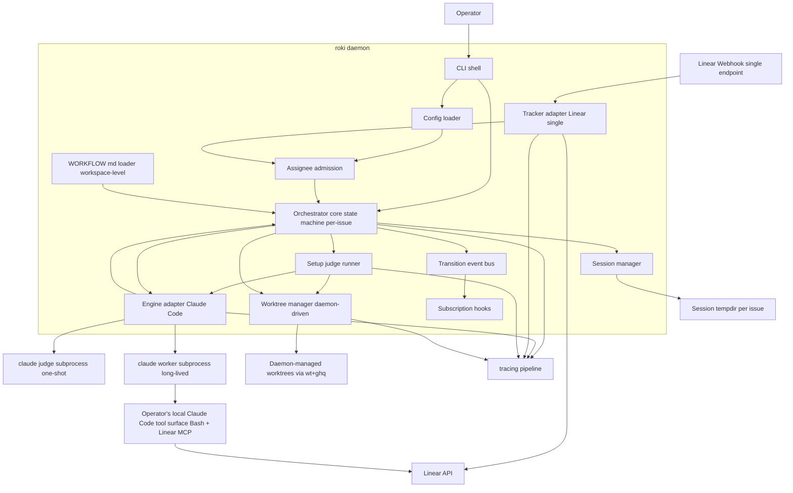

---
refs:
  id: design:roki-mvp
  kind: design
  title: "roki-mvp Design"
  spec: roki-mvp
  implements:
    - requirements:roki-mvp
  depends_on:
    - design:roki-mvp:bootstrap
    - design:roki-mvp:worktree-workspace
    - design:roki-mvp:retry-policy
  related:
    - design:roki-mvp:agent-driven-repo-selection
    - research:roki-mvp
  modules:
    - crates/roki-daemon/
---

# Design Document

> **Sidecar designs**: detailed locked decisions for major scope shifts live alongside this file:
> - [`design-bootstrap.md`](design-bootstrap.md) — startup composition, signal handling, secrets pipeline (task 5.1).
> - [`design-worktree-workspace.md`](design-worktree-workspace.md) — `wt` + `ghq` external CLI dependencies, branch sanitization, worktree path layout (task 6.1).
> - [`design-agent-driven-repo-selection.md`](design-agent-driven-repo-selection.md) — historical: agent-driven `roki_open_worktree` repo selection. Superseded post-Phase-18 by daemon-driven setup-judge selection (see "Setup judge and daemon-driven worktree lifecycle" below); kept only for the assignee-admission, single-tracker, single-`WORKFLOW.md`, per-issue-keying, and session/registry-decomposition decisions that survived the rewrite.
> - [`design-retry-policy.md`](design-retry-policy.md) — `max_attempts` retry budget on non-clean exits; stalls and turn-budget exhaustion bypass the retry loop (task 3.7).
>
> When the sidecars conflict with this document, this document wins for everything in the post-Phase-18 setup-judge / agent-tooling-boundary scope (Requirements 4, 6, 7, 8.1–8.2, 9.6, 11.1, 12.5, 12.8). For earlier scope (bootstrap composition, retry policy, branch sanitization, assignee admission), the sidecars remain authoritative.

## Overview

**Purpose**: roki-mvp delivers the symphony-parity vertical slice of roki: a single Rust daemon that observes Linear, admits only active issues assigned to the configured Linear user, runs a short pre-flight setup judge (one-shot `claude` invocation) to classify which configured repos each admitted issue requires, materializes the resulting git worktrees itself via `wt` + `ghq`, allocates per-issue sessions, and supervises long-lived `claude --print --output-format stream-json` subprocesses that perform implementation work. The daemon owns the assignment filter, the setup-judge invocation, the per-issue session tempdir, the daemon-driven worktree lifecycle (setup AND cleanup), the subprocess lifecycle, and the cleanup pass — but it never mutates Linear, never opens pull requests, never edits code, and never registers, proxies, or wraps any agent-side tool.

**Users**: A solo developer or small team operator who runs roki locally as a long-running daemon, configures the Linear assignee as `me` (or another resolvable Linear user), configures an allowlist of Git repositories under it, installs Claude Code locally with their own Linear MCP integration plus `wt`/`ghq` on `$PATH`, and supervises their own Linear-driven implementation work across all repos from one process.

**Impact**: Establishes the foundational orchestrator and the three extension seams (state-machine hooks, single workspace-level `WORKFLOW.md` schema with two named template blocks, workspace path layout) that the four downstream specs (roki-spec-gate, roki-review-gate, roki-observability, roki-distill-postmerge) plug into. The assignee filter narrows worker admission before judge launch so roki cannot consume work assigned to another Linear user; the setup judge then narrows worktree provisioning to the configured allowlist and routes `noop` outcomes to the `Skipped` terminal end without ever launching the main worker.

### Goals
- A `roki` Rust 2024 binary that runs as a daemon, configurable via CLI plus a config file, with structured tracing logs.
- Daemon-side Linear assignee admission: `[linear].assignee = "me"` resolves to the Linear token owner at startup, and only issues assigned to that user may enter the orchestrator worker lifecycle.
- Multi-repo through a daemon-driven setup judge: the daemon publishes an allowlist of repos identified by `ghq` identifiers; on first admission for an issue, the daemon runs the workspace-level `prompt_template_setup` block as a one-shot `claude` call, parses the structured findings (`act` with repo identifiers, or `noop`), validates each returned identifier against the allowlist, and itself materializes the corresponding worktrees via `ghq list -p` + `wt switch-create`. Cross-repo tickets fall out for free as multiple validated identifiers; per-issue state is keyed by Linear issue id alone.
- Long-lived `claude --print --output-format stream-json` subprocess per active issue with bounded loops (`max_turns`, configurable retry budget on non-clean exit, exponential backoff between launches, continuation retry on clean exit, stall detection). The worker subprocess inherits the operator's local Claude Code tool surface (Bash plus the operator's installed MCP servers, including the operator-configured Linear MCP); the daemon never registers, proxies, or wraps an agent-side tool.
- Single workspace-level `WORKFLOW.md` (Liquid + Markdown front matter) policy loader with hot reload and schema validation, exposing two named template blocks (`prompt_template_setup` for the judge, `prompt_template_worker` for the worker).
- In-memory orchestrator state machine with stable extension points (subscription hooks, `WORKFLOW.md` schema, `OrchestratorRead`, `TrackerRefresh`, pre-cleanup hook, `WorkerContext.additional_context`) for downstream specs. The state set covers `Judging` (judge in flight) and `Skipped` (terminal end reached only from `Judging` on `noop`) in addition to the conventional active/review/terminal arcs.
- Restart recovery via Linear + filesystem reconciliation across both per-issue session tempdirs and per-repo worktrees discovered by allowlist iteration (the same primitive used at cleanup); no persistent database.
- Language-agnostic `SPEC.md` at the repo root describing the contract, including the setup-judge findings schema, the agent-tooling-boundary clause, the two named `WORKFLOW.md` template blocks, and the `Judging`/`Skipped` states.

### Non-Goals
- Linear writes, PR creation, code edits — all delegated to the agent through the operator's local Claude Code tool surface.
- Daemon-registered, daemon-proxied, or daemon-wrapped agent-side tools — the worker subprocess inherits the operator's Claude Code installation as-is (Bash + the operator's installed MCP servers, including their Linear MCP).
- Persistent state stores (SQLite, sled, etc.).
- kiro-spec gate enforcement, kiro-review gate enforcement, HTTP/TUI observability, post-merge distill — deferred to the four follow-up specs.
- Container or VM isolation; multi-host SSH workers; auto-merge; Windows support.
- Generic Linear admission rules beyond the configured assignee filter, including label, team, project, or custom workflow-state filters.

## Boundary Commitments

### This Spec Owns
- The `roki` binary entry point, CLI parsing (clap, including `--config` / `--bind` / `--port` / `--dangerously-skip-permissions` / `--debug`), tokio runtime, tracing pipeline, the bootstrap composition order documented in `design-bootstrap.md`.
- The in-memory orchestrator: per-issue state machine keyed by Linear issue id alone (states include `Judging` and `Skipped` in addition to the conventional active/review/terminal arcs), transition event bus, subscriber registry with documented vetoable transitions, retry-budget loop driving `Active → Backoff → Active` for non-clean exits.
- The Linear adapter and admission boundary: a single workspace-level webhook receiver, a single workspace-level polling fallback (≤ 5 min cadence), startup resolution of the configured Linear assignee (`me` → token owner), tracker normalization (issue model — no repo association at the tracker boundary, assignee user id included), assignment filtering before orchestrator admission, 429 backoff, read-only on the daemon side.
- The pre-flight setup judge: a one-shot `claude` invocation that renders the `prompt_template_setup` block of the workspace `WORKFLOW.md` against the admitted issue, parses stdout as a structured findings document (`{ action: "act"|"noop", repos?: string[] }`), validates each returned repo identifier against the configured `[[repos]]` allowlist, retries once on parse failure, routes `noop` directly to `Skipped`, routes any unknown identifier to `TerminalFailure`, and always launches the judge subprocess with a read-only sandbox + rejected elicitations regardless of operator overrides. The operator-configurable judge model identifier (default: a small fast Claude model from the same family as the worker) is owned here.
- Daemon-driven worktree lifecycle: on validated `act` findings, the daemon resolves each repository via `ghq list -p` and creates a worktree via `wt switch-create` whose branch name equals the Linear issue identifier verbatim; on `Cleaning`, the daemon iterates every entry in the configured `[[repos]]` allowlist, lists existing worktrees in each repo's local checkout, and removes every worktree whose branch name equals the Linear issue identifier verbatim (the same discovery primitive Requirement 10 uses for restart recovery). The daemon owns setup AND cleanup; neither path passes through agent tool calls.
- The per-issue session lifecycle: ephemeral session tempdir under the platform-appropriate user cache root as the worker's CWD, created only when the setup judge returns `act`; cleanup on `Cleaning` removes the session tempdir AFTER allowlist-iteration worktree cleanup completes; `TerminalFailure` retains all worktrees, branches, and the session tempdir.
- The Claude Code engine adapter: subprocess launch (judge AND worker), stream-JSON parser, lifecycle event mapping, `max_turns` enforcement, stall-by-event-inactivity detection (routes to `TerminalFailure`), turn-budget exhaustion (routes to `TerminalFailure`), one-second continuation retry on clean exit, configurable `max_attempts` retry budget on non-clean exit (default 3, range 1–10) with exponential backoff between launches bounded between 10 s and 5 min, prelude-forwarding for `WorkerContext.additional_context`.
- The single workspace-level `WORKFLOW.md` loader: front-matter parsing, Liquid render, JSON-Schema validation, hot reload with last-known-good fallback. The schema requires two named template blocks: `prompt_template_setup` (consumed by the judge) and `prompt_template_worker` (consumed by the main worker, with the validated worktree paths exposed as a named template variable). Startup validation failure is a hard refusal — there is no per-repo override to fall through to.
- The default permission strategy and sandbox knobs (`workspace-write` + reject elicitations as default for the worker; `--settings` allowlist or `--dangerously-skip-permissions` fallback, with the workspace-level `WORKFLOW.md` allowed to override sandbox/elicitation policy for the worker only). The judge subprocess is always sandboxed read-only with elicitations rejected regardless of operator overrides.
- Per-issue debug capture (`--debug` CLI flag / `[debug]` config block): per-issue `<dir>/<team>/<issue>.log` containing every stdout and stderr line from each worker subprocess with RFC 3339 nanos timestamps and `[STDOUT|STDERR]` stream tags.
- `SPEC.md` at the repository root, language-agnostic.

### Out of Boundary
- Any logic that performs Linear writes, PR creation, branch management, or code edits — that work belongs to the agent, executed through the operator's local Claude Code tool surface.
- Daemon-registered, daemon-proxied, or daemon-wrapped agent-side tools. The worker subprocess inherits the operator's local Claude Code installation as-is, so the agent reaches Linear via the operator's installed Linear MCP and reaches `git` / `gh` / `ghq` / `wt` via Bash. The previously-bundled `linear_graphql` proxy and `roki_open_worktree` tool are explicitly out of scope.
- Persistent agent-tool registry as an extension seam. Downstream specs may not assume the daemon registers any agent-side tool on their behalf.
- kiro-spec gate enforcement (deferred to roki-spec-gate, plugs into the state-machine subscription hook).
- kiro-review gate enforcement (deferred to roki-review-gate, plugs into the state-machine subscription hook).
- HTTP API, ratatui TUI, structured state introspection beyond logs (deferred to roki-observability).
- Post-merge flow-document classification and distill (deferred to roki-distill-postmerge).
- Persistent storage of run history, run analytics, multi-tenant orchestration, multi-host workers, container isolation, auto-merge, Windows.
- Agent-side ownership filtering as the primary guard. The agent may still choose not to work after reading a ticket, but the daemon must already have rejected issues assigned to other users before judge launch.
- Per-repo `WORKFLOW.md` overrides; additional admission filters beyond assignee (team, label, project, priority, custom state) unless a later spec extends the admission component.

### Allowed Dependencies
- Rust 2024 + tokio for async runtime.
- clap for CLI argument parsing.
- tracing + tracing-subscriber for structured logs.
- reqwest for Linear HTTPS calls (read-only on the daemon side); axum for the single workspace-level webhook receiver only (no broader HTTP surface).
- liquid (or compatible) for `WORKFLOW.md` body templating; serde_yaml or toml for front matter; a JSON-Schema validator (jsonschema or similar) for schema enforcement.
- notify (or compatible) for filesystem hot-reload watching.
- Claude Code installed locally with the operator's own MCP servers (notably a Linear MCP integration) and kiro skills available under `~/.claude/skills/kiro-*` (operator concern, not bundled).
- The `wt` (worktrunk) and `ghq` external CLIs installed on `$PATH` (operator concern; daemon hard-refuses to start if either is absent). Both are invoked exclusively by the daemon — never by the agent through any daemon-mediated path.
- The `gh` and `git` CLIs are invoked only by the agent through the operator's Bash tool inside the worker session, not by the daemon.

### Revalidation Triggers
Changes that should force dependent specs to re-check integration:
- Any change to the orchestrator state set (including the addition or removal of `Judging`/`Skipped`, the retry-loop intermediate states, or the documented vetoable-transition list).
- Any change to the setup judge findings schema, the allowlist-validation contract, the retry-once policy, or the `noop`-routes-to-`Skipped` semantics.
- Any change to the agent tooling boundary clause (the daemon is forbidden from registering, proxying, or wrapping agent-side tools — restoring such a path is a breaking change for downstream specs that already assume the operator's Claude Code installation is the only agent tool surface).
- Any breaking change to the workspace-level `WORKFLOW.md` schema, including the contract for the two named template blocks `prompt_template_setup` and `prompt_template_worker` and the named template variables exposed to each (additions are additive and safe; removals or type changes are breaking).
- Any change to the session-tempdir layout, the worktree path layout, the branch sanitization rule, or the daemon-driven cleanup discovery primitive (allowlist iteration + branch-equals-issue-id filter).
- Any change to the lifecycle event taxonomy emitted by the engine adapter (judge OR worker).
- Any change to subscriber error-isolation semantics.
- Any change to assignee resolution or assignment-loss behavior, including the `me` token-owner resolution contract or whether reassignment away triggers cleanup.
- Any change to the published read-side traits (`OrchestratorRead`, `TrackerRefresh`) consumed by roki-observability.
- Any change to the pre-cleanup hook contract consumed by roki-distill-postmerge.
- Any change to the `WorkerContext` field set or the prelude-forwarding mechanism for `additional_context`.

### Cross-Spec Extension Surface

roki-mvp publishes the following stable extension surface for downstream specs. Every entry on this list is a contract: breaking changes here trigger the revalidation triggers above.

- **State-machine subscription hooks** (`SubscriberHooks`) with the documented vetoable-transition list (`Queued -> Judging`, `Judging -> Active`, `AwaitingReview -> TerminalSuccess`, `TerminalSuccess -> Cleaning`).
- **Pre-cleanup hook** (`Cleaning` interim state, see "Per-issue worker lifecycle"): downstream specs may register vetoable observers for `TerminalSuccess -> Cleaning` to perform deferred work (e.g., distill) before the worktrees and session tempdir are removed.
- **Read-side traits**: `OrchestratorRead` (snapshot + per-issue lookup) and `TrackerRefresh` (nudge). Both are read-only / nudge-only and grant no state-mutation rights; observability and similar specs depend on these.
- **`WorkflowPolicy.extension`** (typed as `serde_json::Value`): downstream specs deserialize their own slice of the policy from a reserved sub-namespace. The MVP loader round-trips unknown keys without interpreting them. Reserved namespaces:
  - `extension.gates.spec.*` (roki-spec-gate)
  - `extension.gates.review.*` (roki-review-gate)
  - `extension.server.*` (roki-observability)
  - `extension.distill.*` (roki-distill-postmerge)
- **`WorkerContext.additional_context`** (typed as `Option<serde_json::Value>`): an additive optional field reserved for downstream gates and specs to inject prelude context into the worker session (for example, roki-review-gate's `.review-findings.json`). The engine adapter forwards this value through the workspace prelude / Claude session prompt envelope; the MVP itself does not interpret the contents. `WorkerContext` is extensible by additional optional additive fields under the same forwarding contract; removing or retyping fields is a breaking change.

> **Removed extension seam** (from pre-Phase-18 design): the agent tool registry (`Registry::register`) is no longer published as an extension surface. Downstream specs that need agent-side tooling must rely on the operator's Claude Code installation (Bash + the operator's installed MCP servers) rather than asking the daemon to register a tool on the worker's behalf.

## Architecture

### Architecture Pattern & Boundary Map



**Architecture Integration**:
- **Selected pattern**: Hexagonal / ports-and-adapters around an in-memory orchestrator core. Adapters (tracker, engine, session manager, worktree manager, workflow loader, setup judge) implement narrow traits; the orchestrator depends only on those traits. Symphony-aligned: long-lived agent session, no DB, `WORKFLOW.md` as user-facing policy.
- **Domain boundaries**: CLI shell vs orchestrator core; tracker adapter + assignee admission vs orchestrator; setup judge vs orchestrator; engine adapter vs orchestrator (engine is shared between judge and worker invocations); session manager + worktree manager vs orchestrator; workflow loader vs orchestrator. The agent tooling boundary (Req 7) is a non-component: there is no in-daemon tool registry — the worker subprocess inherits the operator's Claude Code tool surface unchanged.
- **Existing patterns preserved**: Symphony's small-daemon thesis (no DB, agent owns writes, long-lived stdio session for the worker, `WORKFLOW.md` as policy artifact).
- **New components rationale**: Assignee admission narrows worker admission to the configured Linear user before judge launch. The setup judge replaces the pre-Phase-18 agent-driven `roki_open_worktree` tool with a daemon-driven, symmetric setup arc — a one-shot `claude` call classifies the admitted ticket into `act` (with one or more allowlisted repos) or `noop` (no worker required); the daemon then materializes the worktrees itself, reclaims them on cleanup via the same allowlist-iteration primitive used at restart recovery, and never holds an agent-facing git or Linear write path. Per-issue keying replaces `(repo, issue)` keying. Explicit subscription hooks remain the deliberate divergence from symphony to support the four downstream specs.
- **Steering compliance**: Rust 2024 + tokio, no SQLite, kiro skills as personal skills, macOS + Linux only.

### Technology Stack

| Layer | Choice / Version | Role in Feature | Notes |
|-------|------------------|-----------------|-------|
| CLI | clap 4.x | Argument parsing for `roki run` and subcommands | Derive macros for subcommand structure |
| Runtime | Rust 2024 + tokio 1.x | Async orchestration, subprocess supervision | Multi-threaded scheduler |
| Logging | tracing + tracing-subscriber | Structured logs with per-issue context (and per-repo where applicable, e.g., setup-judge worktree creation outcomes and `Cleaning` worktree removal) | JSON output supported via subscriber |
| HTTP client | reqwest 0.12+ | Linear GraphQL calls from the daemon-side tracker adapter (read-only — polling + viewer lookup at startup) | rustls TLS by default |
| HTTP server | axum 0.7+ | Linear webhook receiver only — no broader API surface | Bound to localhost or operator-configured interface |
| Templating | liquid | `WORKFLOW.md` body rendering | Front matter parsed separately |
| Front matter | serde_yaml or toml | YAML or TOML front matter on `WORKFLOW.md` | Single format selected at MVP — see decision below |
| Schema | jsonschema (Rust) | Validate parsed `WORKFLOW.md` policy shape | Fails closed with last-known-good fallback on hot reload |
| File watcher | notify | Hot reload of `WORKFLOW.md` | Debounced |
| GraphQL | hand-rolled or graphql_client | Linear GraphQL request envelope | Hand-rolled is acceptable to keep dependencies small |
| Config | serde + figment or hand-rolled | Layered config (file + env + flags) | Linear token loaded from env or secret file, never committed |

> Front-matter format choice: MVP picks YAML for ergonomic reasons (Liquid + YAML pairs commonly in static site tooling), but the loader trait does not leak the choice; the policy struct after parsing is format-agnostic so a future change to TOML is non-breaking for downstream specs.

## File Structure Plan

### Directory Structure

The repository is a Cargo workspace from day one. The MVP ships a single member crate, `crates/roki-daemon/`, but the workspace layout is committed up front so downstream specs (notably roki-observability) can add `crates/roki-tui/` and `crates/roki-api-types/` as pure-additive members without restructuring.

```
SPEC.md                              # Language-agnostic contract
Cargo.toml                           # [workspace] root, members = ["crates/roki-daemon"]
WORKFLOW.example.md                  # Bundled default workflow file
crates/
└── roki-daemon/                     # The MVP daemon crate (sole initial workspace member)
    ├── Cargo.toml                   # name = "roki", binary entry
    ├── src/
    │   ├── main.rs                  # Binary entry, tokio runtime bootstrap
    │   ├── cli.rs                   # clap definitions; --config/--bind/--port/--dangerously-skip-permissions
    │   ├── runtime.rs               # Bootstrap composition (see design-bootstrap.md)
    │   ├── config/
    │   │   ├── mod.rs               # Config struct (with [linear].assignee, [workflow], [server] blocks)
    │   │   └── repos.rs             # Allowlist of `RepoConfig { repo: String }` ghq identifiers
    │   ├── orchestrator/
    │   │   ├── mod.rs               # Orchestrator entry, lifecycle ownership
    │   │   ├── state.rs             # State enum + retry-loop intermediates, transition table, vetoable set
    │   │   ├── core.rs              # Per-issue worker actor, retry-budget loop
    │   │   ├── events.rs            # Transition event types, event bus
    │   │   ├── hooks.rs             # Subscription registry, error isolation, pre-cleanup hook
    │   │   ├── read.rs              # OrchestratorRead implementation (snapshot/issue)
    │   │   ├── tracker_bridge.rs    # NormalizedIssue → orchestrator inbox; dedup keyed (issue, target_state)
    │   │   └── recovery.rs          # Restart reconciliation across Linear + sessions + worktrees
    │   ├── tracker/
    │   │   ├── mod.rs               # Tracker trait, TrackerRefresh trait, normalized issue model
    │   │   ├── admission.rs         # Resolve/match configured Linear assignee; filter before orchestrator admission
    │   │   ├── model.rs             # NormalizedIssue including assignee user id
    │   │   ├── linear.rs            # Linear GraphQL client (single workspace-level), assigned polling, 429 backoff
    │   │   └── webhook.rs           # axum-based single-endpoint webhook receiver, HMAC verify, assignee filter
    │   ├── engine/
    │   │   ├── mod.rs               # Engine adapter trait
    │   │   ├── claude.rs            # Claude Code subprocess launcher and supervisor (judge + worker); prelude forwarding
    │   │   ├── stream.rs            # stream-json line parser, typed lifecycle events
    │   │   └── policy.rs            # max_turns, stall detection, max_attempts retry budget, backoff, continuation retry
    │   ├── judge/                   # (post-Phase-18) Pre-flight setup judge subsystem
    │   │   ├── mod.rs               # SetupJudge: render prompt_template_setup, invoke claude one-shot, parse findings, retry once
    │   │   └── findings.rs          # JudgeFindings { action: Act | Noop, repos: Vec<String> } + parser/validator
    │   ├── session/
    │   │   └── mod.rs               # SessionManager: per-IssueId tempdir under user cache root
    │   ├── worktree_manager/        # (post-Phase-18) Daemon-driven worktree lifecycle
    │   │   └── mod.rs               # WorktreeManager: setup via ghq+wt on Act findings; cleanup via allowlist iteration + branch == issue id
    │   ├── workflow/
    │   │   ├── mod.rs               # Single workspace-level WORKFLOW.md loader, hot reload coordinator
    │   │   ├── parse.rs             # Front matter + Liquid + Markdown parse; extracts named template blocks (prompt_template_setup, prompt_template_worker)
    │   │   └── schema.rs            # JSON-Schema for the policy shape (incl. max_attempts and the two named template blocks)
    │   ├── exec/
    │   │   ├── mod.rs               # External CLI shellout primitives used by the daemon (judge subprocess, worktree manager)
    │   │   ├── wt.rs                # WtTool trait + RealWt subprocess shellout (worktrunk) — daemon-internal only
    │   │   └── ghq.rs               # GhqTool trait + RealGhq subprocess shellout — daemon-internal only
    │   ├── permissions.rs           # Sandbox + permission-strategy resolution (judge always read-only)
    │   ├── logging.rs               # Tracing init, redaction layer, per-issue debug capture sink
    │   └── shutdown.rs              # Signal handling, bounded shutdown windows
    └── tests/
        ├── integration_orchestrator.rs
        ├── integration_engine_adapter.rs
        ├── integration_workflow_loader.rs
        ├── integration_session_and_worktree_manager.rs
        ├── integration_tracker.rs
        ├── integration_setup_judge.rs           # Judge invocation, findings parse, retry-once, allowlist validation, noop → Skipped
        ├── integration_worktree_cleanup.rs      # Allowlist iteration + branch-equals-issue-id discovery
        ├── e2e_bootstrap.rs
        ├── e2e_happy_path.rs
        ├── e2e_failure_retry.rs
        ├── e2e_vetoable_transition.rs
        ├── e2e_skipped_arc.rs                   # Judge returns noop → no session, no worker, lands in Skipped
        └── e2e_recovery.rs
```

> The `tools/` module from pre-Phase-18 layouts is removed entirely; the daemon no longer registers, proxies, or wraps any agent-side tool (Req 7). The `wt`/`ghq` shellout adapters remain (now under `exec/`) but are daemon-internal — they are invoked exclusively by the worktree manager and (for `ghq`) restart-recovery; they are never reachable from inside a worker subprocess. The pre-Phase-18 `worktrees/` module (per-worker `WorktreeRegistry` tracking agent-opened worktrees) is replaced by `worktree_manager/` (daemon-driven setup keyed off setup-judge findings, cleanup keyed off allowlist iteration + branch == issue id). The `routing.rs` module that existed in pre-7.1 layouts remains removed.

> Each module owns one clear responsibility. Cross-module imports follow the dependency direction: `config` → `tracker/model` + `tracker/admission` → `orchestrator/state` → `orchestrator/worker` (via traits in `tracker`, `engine`, `session`, `worktrees`, `workflow`, `tools`). Adapters never import from `orchestrator/worker`; they implement traits the orchestrator consumes.
>
> Cargo workspace rationale: keeping the daemon at `crates/roki-daemon/` from day one means roki-observability can add `crates/roki-tui/` (ratatui front end) and `crates/roki-api-types/` (shared HTTP type crate) as pure-additive workspace members without moving any roki-mvp source files. The workspace `Cargo.toml` lists `members = ["crates/roki-daemon"]` initially; downstream specs append entries to that list.

### Modified Files
- (Greenfield: there are no existing source files to modify. The `.gitignore` and `CLAUDE.md` already in the repo are unaffected.)

## System Flows

### Daemon bootstrap

`runtime::run` (task 5.1, finalised in 7.1f) composes the architecture
in a fixed order so secrets are added to the redaction list before any
structured event is emitted, refusal modes land before any resource is
held, and the HTTP surface comes up regardless of Linear's reachability.
The full sequence is documented under `SPEC.md §9.7`; the reference
implementation lives in
`crates/roki-daemon/src/runtime.rs::run_with_shutdown`. Composition order:

1. Load config (`--config <path>` overrides `./roki.toml`; CLI flags
   `--bind` / `--port` / `--dangerously-skip-permissions` override the
   file).
2. Resolve secrets (Linear token + the single workspace-level webhook
   HMAC secret from `[linear].webhook_secret_env`; an optional
   `[linear].webhook_secret_file` test seam takes precedence) and
   reinitialise the redaction-aware tracing pipeline with the secret list.
3. Resolve `[linear].assignee`; the value `me` performs a Linear `viewer`
   lookup using the configured token, and any explicit user selector must
   resolve to exactly one Linear user id before startup continues.
4. Install OS signal handlers wired to a shared `ShutdownSignal`.
5. Resolve the `claude` binary (config override → `$PATH` discovery →
   hard refusal). Refuse to start if `wt` or `ghq` is not on `$PATH`.
6. Load the single workspace-level `WORKFLOW.md` from `[workflow].path`
   and confirm both named template blocks (`prompt_template_setup`,
   `prompt_template_worker`) are present and pass schema validation;
   build `SessionManager`, `WorktreeManager`, `PermissionResolver`, the
   `ClaudeEngineAdapter`, the `RealWt` / `RealGhq` daemon-internal
   shellout adapters, and the `SetupJudge` runner (configured with the
   operator-declared judge model identifier from `[judge].model` or its
   documented default).
7. Run `Orchestrator::with_recovery(...)` to drive the restart-recovery
   scan (§Recovery) and obtain the configured orchestrator. Attach the
   `SetupJudge` and `WorktreeManager` so every admitted issue first
   passes through judge invocation before the orchestrator schedules a
   worker. The orchestrator does NOT receive any agent tool factory —
   the daemon registers no agent-side tools (Req 7).
8. Start one workspace-level `LinearTracker` (no per-repo fan-out — the
   poller queries active issues assigned to the resolved Linear assignee).
9. Mount the single `POST /linear/webhook` route on a single
   `axum::Router` with a workspace-level `WebhookState`. Bind the HTTP
   server at `[server].bind:[server].port`; a port conflict is a hard
   refusal.
10. Funnel polling + webhook streams through `AssigneeAdmission` and then
    `TrackerBridge` into the orchestrator inbox. Mismatched or unassigned
    issues are logged and dropped before judge admission.
11. `tokio::select!` on shutdown across orchestrator, bridge, server,
    and the single tracker; bound the wind-down at
    `SHUTDOWN_WINDOW = 30s` via `await_workers_with_window`.

`Orchestrator::with_engine_policy`, `with_setup_judge`, and
`with_worktree_manager` carry the runtime engine policy, the
pre-flight setup-judge runner, and the daemon-driven worktree-manager
respectively. There is no `with_tool_factory` builder — the daemon
publishes no agent-side tool surface (see "Agent tooling boundary" in
the components section).

### Per-issue worker lifecycle

```mermaid
stateDiagram-v2
    [*] --> Discovered
    Discovered --> Queued: tracker reports active state
    Queued --> Judging: worker slot available; daemon launches setup judge
    Judging --> Judging: judge parse failure; retry once with same input
    Judging --> Skipped: judge returns action=noop
    Judging --> TerminalFailure: judge findings include identifier outside [[repos]] allowlist
    Judging --> TerminalFailure: judge fails parseable findings on second attempt
    Judging --> Active: judge returns action=act with validated repos; daemon creates session tempdir + worktrees
    Active --> Active: continuation retry on clean exit (1 s wait)
    Active --> AwaitingReview: agent moves issue to review state
    Active --> Backoff: worker exits non-clean and attempts remain
    Backoff --> Active: backoff window elapsed (10 s..5 min)
    Active --> TerminalFailure: stall detected
    Active --> TerminalFailure: turn budget exhausted
    Active --> TerminalFailure: max_attempts exhausted on non-clean exit
    Judging --> Cleaning: assignment lost
    Active --> Cleaning: assignment lost
    Backoff --> Cleaning: assignment lost
    AwaitingReview --> Cleaning: assignment lost
    AwaitingReview --> TerminalSuccess: tracker reports terminal success state
    AwaitingReview --> Active: tracker moves issue back to active
    TerminalSuccess --> Cleaning: pre-cleanup hook (vetoable)
    Cleaning --> [*]: allowlist iteration removes every worktree whose branch == issue id; session tempdir then removed
    Skipped --> [*]: terminal end; no session tempdir, no worktree, no worker subprocess ever existed
    TerminalFailure --> [*]: every worktree, every branch, and the session tempdir retained
```



> Vetoable transitions (subscriber hooks may block): `Queued -> Judging` (used by spec-gate to block judge launch for unstarted-spec issues), `Judging -> Active` (used by spec-gate post-judge if the worker stage itself needs gating), `AwaitingReview -> TerminalSuccess` (used by review-gate), `TerminalSuccess -> Cleaning` (used by distill-postmerge as a pre-cleanup hook). The judge-internal retry arc (`Judging → Judging`), the judge-failure arcs (`Judging → TerminalFailure`, `Judging → Skipped`), and the retry-arc transitions (`Active → Backoff`, `Backoff → Active`, retry-exhausted `Active → TerminalFailure`) are observable but non-vetoable. All other transitions are observable but non-vetoable.
>
> **Setup judge** (Req 4): on `Queued → Judging`, the orchestrator invokes `SetupJudge::evaluate(issue)`. The judge runs `claude` once with the rendered `prompt_template_setup` block and a read-only sandbox + rejected elicitations regardless of operator overrides (Req 9.6). The judge returns `{ action: "act", repos: [..] }` or `{ action: "noop" }`. Validation: every repo identifier in `repos` must be in `[[repos]]`; an unknown identifier routes to `TerminalFailure` with the offending identifier and the configured allowlist contents in the structured log. A parse failure (malformed JSON, missing `action`, etc.) triggers exactly one retry with the same input; a second parse failure routes to `TerminalFailure` with the raw judge stdout captured. On `noop`, the orchestrator routes to the `Skipped` terminal end without creating a session tempdir, without creating any worktree, and without launching the main worker subprocess. On validated `act`, the daemon's `WorktreeManager` resolves each repo via `ghq list -p` and creates a worktree via `wt switch-create` whose branch == issue id, the orchestrator creates the session tempdir, and the worker is launched with the validated worktree paths exposed as a named template variable to `prompt_template_worker`.
>
> **Skipped** is a terminal end reachable only from `Judging` on `noop`. It is observable (a transition event is published with the `noop` reason in the structured log) but no resources have been allocated and there is nothing to clean up. The arc bypasses both the worker subprocess and the `Cleaning` state.
>
> **Retry budget** (see `design-retry-policy.md`): only `NonCleanExit` outcomes from the main worker consume the configurable `max_attempts` budget (default 3, range 1–10) and traverse the `Active → Backoff → Active` loop. `Stalled` and `TurnBudgetExhausted` are agent-authored failures that repeat under the same prompt and budget, so they route directly to `TerminalFailure` without consuming an attempt. The judge has its own retry-once policy on parse failure and does not consume the worker retry budget. The session tempdir and every daemon-created worktree are retained across the entire worker retry loop (no delete/recreate); the prelude / `additional_context` is re-emitted unchanged on each launch.
>
> **Cleaning** is the interim state where downstream specs perform deferred work (e.g., distill) that requires the agent's worktrees to still be present after success has been declared. The daemon iterates every entry in the configured `[[repos]]` allowlist, lists existing worktrees in each repo's local checkout, and calls `wt remove` for every branch name equal to the Linear issue identifier verbatim (this discovery primitive is shared with restart recovery and handles both daemon-created worktrees AND any worktree the agent may have created via Bash with the same branch convention). Branches are NOT deleted — `wt remove` does not delete branches. The session tempdir is removed AFTER worktree cleanup succeeds. A `Deny` vote on `TerminalSuccess → Cleaning` blocks cleanup and is logged; the operator-intervention path (manual cleanup) still applies.
>
> **Assignment loss** is a daemon-side stop condition, not an agent failure. If a tracker observation shows a previously admitted issue is now unassigned or assigned to another Linear user, the orchestrator stops future launches, terminates any active judge or worker subprocess, emits an assignment-loss transition reason, and routes to `Cleaning` without consuming the retry budget. If no session exists yet (issue was still in `Queued` or `Judging`), the admission layer drops the issue without creating one and the cleanup arc resolves into a no-op.

### Worker invocation loop

```mermaid
sequenceDiagram
    participant Orch as Orchestrator
    participant Judge as SetupJudge
    participant Wfm as WorktreeManager
    participant Eng as Engine adapter
    participant JCli as claude judge subprocess
    participant WCli as claude worker subprocess
    participant Mcp as Operator Claude Code surface (Bash + MCP)
    participant Linear

    Orch->>Judge: evaluate(issue)
    Judge->>Eng: launch one-shot (read-only sandbox, prompt_template_setup)
    Eng->>JCli: spawn claude print stream-json (--max-turns 1)
    JCli-->>Eng: stdout (structured findings)
    Eng-->>Judge: parsed findings or parse error
    alt parse error (first attempt)
        Judge->>Eng: relaunch one-shot once
        Eng-->>Judge: parsed findings or parse error
    end
    alt action = noop
        Judge-->>Orch: Skipped
    else action = act with allowlist-validated repos
        Judge-->>Orch: Act { repos }
        Orch->>Wfm: setup(issue, repos)
        Wfm->>Wfm: ghq list -p + wt switch --create <issue> per repo
        Wfm-->>Orch: { worktree paths }
        Orch->>Eng: launch worker (cwd = session tempdir, worktree_paths in prelude)
        Eng->>WCli: spawn claude print stream-json (long-lived)
        WCli-->>Eng: stream-json events
        Eng->>Orch: lifecycle events
        WCli->>Mcp: agent uses Bash for git/gh/ghq/wt and Linear MCP for Linear writes
        Mcp->>Linear: agent-driven Linear writes (daemon does not see this path)
        WCli-->>Eng: clean exit
        Eng->>Orch: clean exit event
        Orch->>Eng: continuation retry after one second
        Eng->>WCli: spawn next session (same session tempdir, same worktrees)
    end
    Note over Orch,Wfm: Cleaning: Wfm iterates [[repos]] allowlist, removes every worktree whose branch == issue.id; SessionMgr removes session tempdir
```

## Requirements Traceability

| Requirement | Summary | Components | Interfaces | Flows |
|-------------|---------|------------|------------|-------|
| 1.1–1.7 | Daemon lifecycle, CLI (`--config`/`--bind`/`--port`/`--dangerously-skip-permissions`/`--debug`), external-CLI startup checks (wt/ghq/claude), per-issue + per-worker + per-repo log context | CliShell, Runtime, Logging, Shutdown, Config | clap commands, signal handlers, `which` probes | Daemon bootstrap |
| 2.1–2.10 | `[[repos]]` allowlist (ghq id), `[linear]`/`[workflow]`/`[server]` blocks, assignee filter (`me`), per-issue keying, empty-allowlist degrades to `Skipped`, operator-configurable judge model | Config, AssigneeAdmission, SetupJudge | Config schema, assignee resolver, judge model resolver | Daemon bootstrap |
| 3.1–3.10 | Linear tracker integration: single workspace-level webhook + assigned polling fallback (≤5 min) + 429 backoff + assignment-loss handling. Daemon never issues Linear writes; agent writes Linear via the operator's installed Linear MCP | TrackerAdapter, WebhookReceiver, AssigneeAdmission, NormalizedIssue, Orchestrator | Tracker trait, assignee matcher | Webhook + polling fallback, Per-issue worker lifecycle |
| 4.1–4.9 | Per-issue session, setup-judge invocation, judge-findings parse + retry-once + allowlist validation, daemon-driven worktree setup via ghq+wt, `noop`→`Skipped`, allowlist-iteration cleanup keyed by branch == issue id, terminal-failure retention, path-traversal/sanitization rejection | SetupJudge, WorktreeManager, SessionManager, Orchestrator | `SetupJudge` trait, `WorktreeManager` trait, `Session` trait | Worker invocation loop, Per-issue worker lifecycle |
| 5.1–5.7 | Engine adapter (judge + worker): stream parsing, stall, turn budget, retry budget, kiro-skill discovery, retain session+worktrees across retry | EngineAdapter, StreamJsonParser, EnginePolicy | Engine trait, lifecycle event types | Worker invocation loop, Per-issue worker lifecycle |
| 6.1–6.7 | Workspace-level WORKFLOW.md loader with two named template blocks (`prompt_template_setup`, `prompt_template_worker`), schema validation, hot reload with last-known-good fallback, prompt rendering with named variables (issue + worktree paths for worker), deterministic fallback prompt on render failure | WorkflowLoader, WorkflowSchema, EngineAdapter, SetupJudge | WorkflowPolicy struct, schema, prompt render contract | Daemon bootstrap, Worker invocation loop |
| 7.1–7.4 | Agent tooling boundary: daemon registers/proxies/wraps NO agent-side tool; worker inherits operator's Claude Code tool surface (Bash + operator's installed MCP servers); Linear writes flow only through operator-configured Linear MCP; daemon never embeds API token or webhook secret in any agent-reachable artifact | Runtime, EngineAdapter, Logging | (no in-daemon tool registry) | Worker invocation loop |
| 8.1–8.5 | State machine (per-issue + Judging + Skipped + retry intermediates), transition events with optional repo id, vetoable transitions, subscriber error isolation, restart recovery without persistent storage | Orchestrator, EventBus, SubscriberHooks, RecoveryReconciler | Hook subscription API, transition events | Per-issue worker lifecycle |
| 9.1–9.6 | Permissions and sandbox: workspace-write + reject elicitations as default for worker; settings/dangerously-skip permission strategies for worker; missing-strategy hard refusal; judge subprocess always read-only + rejected elicitations regardless of operator overrides | Permissions, EngineAdapter, SetupJudge | Permission strategy enum | Worker invocation loop |
| 10.1–10.5 | Restart recovery: walk session tempdirs + allowlist iteration of `wt list` filtered by branch == issue id; 5-cell decision matrix (`ResumeActive`/`OrphanedSession`/`OrphanedWorktree`/`FreshQueued`/`NoOp`); no per-issue runtime state on disk | RecoveryReconciler, SessionManager, WorktreeManager, TrackerAdapter | Recovery scan API | Per-issue worker lifecycle |
| 11.1–11.4 | Language-agnostic SPEC.md: daemon contract, setup-judge contract + findings schema, agent-tooling-boundary clause, two named WORKFLOW.md template blocks, per-issue state machine including `Judging`/`Skipped`, session tempdir layout, worktree-discovery cleanup semantics, extension points | SpecRoot | Documented contracts | n/a |
| 12.1–12.8 | Daemon observability: per-issue + per-repo (where applicable) + correlation context, retry attempts, judge + worker stderr surfacing tagged with `role`, secret redaction, optional per-issue debug capture (`--debug`) with RFC 3339 nanos timestamps + STDOUT/STDERR tags, judge-completion structured log | Logging, Orchestrator, EngineAdapter, SetupJudge, TrackerAdapter, SessionManager, WorktreeManager | tracing fields, redaction layer, debug file sink | n/a |
| 13.1 | OrchestratorRead trait published for additive consumers | Orchestrator, OrchestratorRead | `OrchestratorRead` trait | n/a |
| 13.2 | Pre-cleanup hook (`Cleaning` interim state) published for deferred-cleanup consumers | Orchestrator, SubscriberHooks | `PreCleanupHook` trait, `Cleaning` state | Per-issue worker lifecycle |
| 13.3 | TrackerRefresh nudge trait published for additive observability surfaces | TrackerAdapter | `TrackerRefresh` trait | n/a |
| 13.4 | `WorkerContext.additional_context` additive field forwarded as session prelude | EngineAdapter | `WorkerContext` schema, prelude envelope | Worker invocation loop |
| 13.5 | Reserved `WORKFLOW.md` extension namespaces published for downstream specs; loader round-trips unknown keys | WorkflowLoader, WorkflowSchema | `WorkflowPolicy.extension`, schema | n/a |

## Components and Interfaces

| Component | Domain/Layer | Intent | Req Coverage | Key Dependencies (P0/P1) | Contracts |
|-----------|--------------|--------|--------------|--------------------------|-----------|
| CliShell | CLI | Parse arguments, bootstrap config, hand control to Runtime | 1.1, 1.2, 1.6, 1.7 | Config (P0), Runtime (P0) | Service |
| Runtime | CLI | Compose the daemon (signals, secrets, loaders, server) per `design-bootstrap.md` | 1.1, 1.3, 1.4, 1.5 | Config (P0), Logging (P0), Orchestrator (P0), TrackerAdapter (P0), SetupJudge (P0), WorktreeManager (P0), `which` (P0) | Service |
| Config | Config | Load and validate layered configuration: `[[repos]]` allowlist (`{ repo }` only), `[linear]` including `assignee`, `[workflow]`, `[server]`, `[judge].model`, `[debug]`, secrets | 1.2, 2.1, 2.2, 2.3, 2.4, 2.5, 2.8, 2.9, 2.10, 9.5 | filesystem (P0), env (P0), Linear API for `me` resolution (P0) | State |
| AssigneeAdmission | Tracker | Resolve `[linear].assignee`, match normalized issue assignees, drop mismatches, and emit assignment-loss signals | 2.8, 2.9, 3.1, 3.3, 3.5, 3.7, 3.8, 3.9, 3.10, 10.2, 10.3, 10.4 | Config (P0), TrackerAdapter (P0), Linear API (P0), Logging (P1) | Service, State |
| Orchestrator | Orchestrator | Run the per-issue state machine (incl. Judging and Skipped), schedule judge then worker, handle assignment-loss cleanup, drive the retry-budget loop, isolate subscriber failures | 1.1, 1.4, 3.7, 3.10, 8.1, 8.2, 8.3, 8.4, 13.1, 13.2 | AssigneeAdmission (P0), TrackerAdapter (P0), SetupJudge (P0), WorktreeManager (P0), EngineAdapter (P0), SessionManager (P0), WorkflowLoader (P0), EventBus (P0) | Service, Event, State |
| OrchestratorRead | Orchestrator | Read-only projection of orchestrator state for additive consumers | 13.1 | Orchestrator (P0) | Service |
| EventBus | Orchestrator | Publish transition events with isolation across subscribers; transition payloads carry optional `repo` for repo-scoped arcs | 8.2, 8.3, 8.4 | Orchestrator (P0) | Event |
| SubscriberHooks | Orchestrator | Register and dispatch subscribers; expose vetoable-transition contract and pre-cleanup hook | 8.3, 8.4, 13.2 | EventBus (P0) | Service |
| RecoveryReconciler | Orchestrator | Reconcile in-memory state on startup from Linear + session tempdirs + allowlist iteration of `wt list` filtered by branch == issue id, applying assignee admission before resume | 8.5, 10.1, 10.2, 10.3, 10.4, 10.5 | AssigneeAdmission (P0), TrackerAdapter (P0), SessionManager (P0), WorktreeManager (P0), GhqTool (P0) | Service |
| TrackerAdapter | Tracker | Read-only single workspace-level Linear adapter with single endpoint webhook + assigned polling fallback and 429 backoff; publishes `TrackerRefresh` nudge trait. Daemon never issues Linear writes — agent uses operator's installed Linear MCP | 3.1, 3.2, 3.3, 3.4, 3.5, 3.6, 3.7, 3.8, 3.9, 3.10, 13.3 | AssigneeAdmission (P0), reqwest (P0), axum (P0), Config (P0) | Service, Event |
| WebhookReceiver | Tracker | Single endpoint `POST /linear/webhook`; HMAC-verify against the workspace-level secret; normalize payload and pass through assignee admission | 3.1, 3.2, 3.5, 3.7, 3.8, 3.9, 3.10 | AssigneeAdmission (P0), TrackerAdapter (P0) | API |
| SetupJudge | Judge | Render `prompt_template_setup`, invoke `claude` one-shot under read-only sandbox + rejected elicitations regardless of operator overrides, parse structured findings, retry once on parse failure, validate every returned repo identifier against `[[repos]]`, emit a structured completion log | 2.10, 4.1, 4.2, 4.5, 6.1, 6.6, 6.7, 9.6, 12.5, 12.8 | EngineAdapter (P0), Config (P0), WorkflowLoader (P0), Permissions (P0) | Service, Event |
| WorktreeManager | Worktrees | Daemon-driven setup AND cleanup: on validated `act` findings, resolve each repo via `ghq list -p` and create a worktree via `wt switch-create` with branch == issue id; on `Cleaning`, iterate `[[repos]]` allowlist + `wt list` filtered by branch == issue id and `wt remove` each match (no branch deletion); retain everything on `TerminalFailure` | 4.3, 4.4, 4.6, 4.7, 4.8, 4.9, 10.1, 10.2, 10.3, 10.4 | WtTool (P0), GhqTool (P0), Config (P0), filesystem (P0) | Service, State |
| SessionManager | Session | Create and remove per-issue session tempdirs under the platform-appropriate user cache root; the worker's CWD. Created only on `Judging → Active` (i.e., when the judge returns `act`) | 4.3, 4.6, 4.7, 4.9, 10.1, 10.4 | filesystem (P0), `dirs` or XDG resolver (P0) | Service, State |
| EngineAdapter | Engine | Launch and supervise long-lived `claude` subprocess (worker) AND short-lived one-shot subprocess (judge); map stream-json to lifecycle events; carry the retry-budget Backoff loop. Does NOT register agent-side tools | 5.1, 5.2, 5.3, 5.4, 5.5, 5.6, 5.7, 9.1, 9.2, 9.3, 9.4 | tokio process (P0), Permissions (P0), WorkflowLoader (P0) | Service, Event |
| StreamJsonParser | Engine | Convert newline-delimited stream-json into typed lifecycle events | 5.2 | EngineAdapter (P0) | Service |
| EnginePolicy | Engine | Enforce `max_turns`, stall detection, `max_attempts` retry budget, exponential backoff, continuation retry | 5.3, 5.4, 5.5, 5.6 | EngineAdapter (P0), WorkflowLoader (P1) | Service |
| WorkflowLoader | Workflow | Parse front matter + Liquid body, identify two named template blocks (`prompt_template_setup`, `prompt_template_worker`), validate against schema, render judge AND worker prompts with deterministic fallback, hot reload with last-known-good fallback | 6.1, 6.2, 6.3, 6.4, 6.5, 6.6, 6.7, 9.2 | notify (P0), liquid (P0), jsonschema (P0) | Service, State |
| WorkflowSchema | Workflow | The published policy schema (incl. `max_attempts`, the two named template blocks), extensible under reserved `extension.*` namespaces | 6.1, 6.5, 13.5 | WorkflowLoader (P0) | State |
| WtTool | Exec | `wt switch --create`, `wt remove`, and `wt list` shellouts; branch sanitization. Daemon-internal only — never reachable from inside a worker subprocess | 4.3, 4.6 | external `wt` CLI (P0) | Service |
| GhqTool | Exec | `ghq list -p` and `ghq get` shellouts. Daemon-internal only | 4.3, 10.1 | external `ghq` CLI (P0) | Service |
| Permissions | Permissions | Resolve sandbox and permission strategy from Config + workspace-level `WORKFLOW.md` per worker; pin judge subprocess to read-only + rejected elicitations regardless of operator overrides | 9.1, 9.2, 9.3, 9.4, 9.5, 9.6 | Config (P0), WorkflowLoader (P1) | State |
| Logging | Logging | tracing init, redaction layer, per-issue + per-worker context (and per-repo where applicable), judge + worker stderr capture tagged with `role`, optional per-issue debug file sink | 1.5, 3.8, 3.10, 12.1, 12.2, 12.3, 12.4, 12.5, 12.6, 12.7, 12.8 | tracing (P0), filesystem for debug sink (P1) | Service |
| Shutdown | Lifecycle | Bounded shutdown on SIGINT/SIGTERM | 1.4 | tokio signal (P0) | Service |
| SpecRoot | Documentation | Language-agnostic `SPEC.md` at the repo root | 11.1, 11.2, 11.3, 11.4 | n/a | n/a |

> **Removed components** (from pre-Phase-18 design): `ToolRegistry`, `LinearGraphqlTool`, `RokiOpenWorktreeTool`, and the per-worker `WorktreeRegistry` are deleted. The agent tooling boundary (Req 7) explicitly forbids the daemon from registering, proxying, or wrapping any agent-side tool, so there is no in-daemon tool registry component. The previously per-worker `WorktreeRegistry` is replaced by the workspace-wide `WorktreeManager`, whose cleanup discovery primitive (allowlist iteration + branch == issue id) is symmetric with restart recovery and tolerates worktrees the agent might have created via Bash with the same convention.

### Orchestrator core

#### Orchestrator

| Field | Detail |
|-------|--------|
| Intent | Own the per-issue state machine, schedule workers, and drive the retry-budget Backoff loop |
| Requirements | 1.1, 1.4, 3.7, 3.10, 8.1, 8.2, 8.3, 8.4 |

**Responsibilities & Constraints**
- Maintain one in-memory state instance per Linear issue identifier (no `(repo, issue)` keying). `RepoId` survives only on transition-event payloads scoped to a specific repo (e.g., setup-judge worktree creation outcomes, worktree cleanup arcs) and on the per-issue snapshot of validated worktree paths the daemon created.
- Drive transitions only from declared sources: tracker events, judge events, engine lifecycle events, recovery scan, operator shutdown.
- Publish a transition event for every transition (no silent transitions). Transition payloads carry the issue identifier always and the originating repository identifier as `Option<RepoId>` for arcs scoped to a specific repo (e.g., worktree creation, worktree cleanup).
- On `Queued → Judging`, invoke `SetupJudge::evaluate(issue)`. On the resulting `Findings::Noop`, route to `Skipped`. On `Findings::Act { repos }` (already allowlist-validated by the judge), drive `WorktreeManager::setup` then `SessionManager::create` then `Active`.
- Drive `Active → Backoff → Active` for `NonCleanExit` outcomes until `max_attempts` is exhausted; route `Stalled` and `TurnBudgetExhausted` directly to `TerminalFailure` (see `design-retry-policy.md`).
- Treat assignment loss as a non-failure stop: terminate any active judge or worker subprocess for the issue, block future launches, and route to `Cleaning` without consuming retry attempts.
- Isolate subscriber failures so one failing subscriber cannot stall others.
- Never call Linear write APIs and never invoke `gh` directly; engine adapter is the only path to the agent and the daemon registers no agent-side tools.

**Dependencies**
- Inbound: Runtime — invokes `Orchestrator::run` (P0)
- Inbound: AssigneeAdmission — sends only admitted issue events plus assignment-loss notices (P0)
- Outbound: SetupJudge — invoked on `Queued → Judging` to classify the issue (P0)
- Outbound: WorktreeManager — invoked on `Judging → Active` to materialize worktrees and on `Cleaning → [*]` to discover-and-remove worktrees by allowlist iteration (P0)
- Outbound: EngineAdapter — launches and supervises both judge and worker subprocesses (P0)
- Outbound: SessionManager — creates the per-issue session tempdir on `Judging → Active` (only when the judge returned `act`), removes it on `Cleaning → [*]` (P0)
- Outbound: WorkflowLoader — reads policy at judge AND worker launch (P0)
- Outbound: EventBus — publishes transitions to SubscriberHooks (P0)

**Contracts**: Service [x] / API [ ] / Event [x] / Batch [ ] / State [x]

##### Service Interface (Rust trait sketch)

```rust
pub trait Orchestrator: Send + Sync {
    // Start the orchestrator. Returns when shutdown completes.
    async fn run(self, shutdown: ShutdownSignal) -> Result<(), OrchestratorError>;

    // Subscribe to transition events; returns a handle that, when dropped, unsubscribes.
    fn subscribe(&self, subscriber: Arc<dyn TransitionSubscriber>) -> SubscriptionHandle;

    // Register an async pre-cleanup observer invoked on the vetoable
    // TerminalSuccess -> Cleaning transition. The pre-cleanup hook is the
    // contracted extension point for deferred-cleanup work (e.g.,
    // roki-distill-postmerge) that must run while the workspace still exists.
    // A Deny result blocks workspace removal and is logged.
    fn register_pre_cleanup_hook(&self, hook: Arc<dyn PreCleanupHook>) -> SubscriptionHandle;
}

// Read-only projection of orchestrator state, published as a stable trait so
// roki-observability and similar additive specs can read state without any
// path to mutation.
pub trait OrchestratorRead: Send + Sync {
    // Snapshot the current per-issue state for all tracked workers.
    fn snapshot(&self) -> SnapshotResponse;

    // Look up a single per-issue projection.
    fn issue(&self, issue: &IssueId) -> Option<IssueState>;
}

#[async_trait]
pub trait PreCleanupHook: Send + Sync {
    async fn on_pre_cleanup(&self, ctx: &PreCleanupContext) -> Result<VetoDecision, SubscriberError>;
}

pub trait TransitionSubscriber: Send + Sync {
    // Observe a transition. Errors are logged and isolated.
    async fn on_transition(&self, event: &TransitionEvent) -> Result<(), SubscriberError>;

    // Veto a transition (only meaningful for the subset declared as vetoable).
    async fn veto(&self, event: &TransitionEvent) -> Result<VetoDecision, SubscriberError>;
}

pub enum VetoDecision { Allow, Deny { reason: String } }

pub struct TransitionEvent {
    pub issue: IssueId,
    // Repository identifier for arcs scoped to a specific repo (for example
    // setup-judge worktree creation outcomes and `Cleaning` worktree removal).
    // `None` for issue-scoped arcs that don't pin a repo (Discovered → Queued,
    // Queued → Judging, Judging → Skipped, etc.).
    pub repo: Option<RepoId>,
    pub previous: WorkerState,
    pub next: WorkerState,
    pub trigger: TransitionTrigger,
    pub correlation_id: CorrelationId,
}

pub enum WorkerState {
    Discovered,
    Queued,
    Judging,           // setup judge in flight (one-shot claude); Skipped or Active on completion
    Active,
    AwaitingReview,
    Backoff,           // intermediate of the retry-budget loop on NonCleanExit; non-vetoable
    TerminalSuccess,
    Cleaning,          // interim state between TerminalSuccess and worktree+session removal; pre-cleanup hook target
    Skipped,           // terminal end; only reachable from Judging on action=noop
    TerminalFailure,
}

pub enum TransitionTrigger {
    TrackerEvent,
    AssignmentLost,
    JudgeEvent,        // judge findings (act/noop), parse failure, allowlist rejection
    EngineEvent,
    RecoveryScan,
    OperatorShutdown,
    SubscriberVeto,
}
```

- Preconditions: `WorkflowLoader`, `TrackerAdapter`, `SetupJudge`, `WorktreeManager`, `EngineAdapter`, and `SessionManager` are constructed and injected before `run`.
- Postconditions: every transition is published exactly once; no per-issue state is written to disk.
- Invariants: state is owned by exactly one task per Linear issue identifier; the state machine is deterministic given the input event sequence; `Skipped` is only reachable from `Judging` on `action=noop`.

**Implementation Notes**
- Integration: tokio task per issue identifier; mpsc channels in, broadcast bus out.
- Validation: vetoable-transition list is hard-coded for MVP — `Queued -> Judging`, `Judging -> Active`, `AwaitingReview -> TerminalSuccess`, and `TerminalSuccess -> Cleaning` are vetoable; the judge retry/failure arcs (`Judging → Judging`, `Judging → Skipped`, `Judging → TerminalFailure`) and the worker retry-arc transitions (`Active → Backoff`, `Backoff → Active`, retry-exhausted `Active → TerminalFailure`) are observable but non-vetoable; all other transitions are observable but non-vetoable.
- Risks: subscriber back-pressure. Mitigation: bounded broadcast channel with drop-newest-on-full and a logged drop counter per subscriber.

#### EventBus, SubscriberHooks

Implementation note: a single tokio broadcast channel for non-vetoable transitions; an explicit await-on-each-subscriber path for vetoable transitions where a `Deny` result blocks the transition. Subscriber failure on a non-vetoable event is logged and ignored. Subscriber failure on a vetoable event is treated as `Deny` to fail closed.

#### RecoveryReconciler

Implementation note: at daemon start, walk both filesystem sources and reconcile each distinct issue identifier against Linear. The discovery primitive is shared with `Cleaning`-state worktree cleanup so the daemon handles agent-created worktrees (with branch == issue id) symmetrically:

1. Walk session tempdirs under the platform-appropriate user cache root (`~/Library/Caches/roki/sessions/` on macOS / `~/.cache/roki/sessions/` on Linux). Each name is an `IssueId`.
2. For each configured `[[repos]]` entry, resolve the local checkout via `ghq list -p` and run `wt list` (or `git worktree list --porcelain` as fallback) against it, filtering to branches matching the operator-configurable issue-id regex (default `^[A-Z]+-\d+$`).
3. For every distinct `IssueId` discovered (from either source), query Linear via `RecoveryLinearReader`, apply `AssigneeAdmission`, and then apply the 5-cell decision matrix:
   - **ResumeActive** — issue active in Linear, assigned to the configured assignee, session tempdir present, and at least one worktree on disk. Resume into `Active` directly (skip `Judging`); the previously-validated repo set is implied by the discovered worktrees.
   - **OrphanedSession** — session tempdir exists but there is no Linear active state assigned to the configured assignee and no worktrees; retain and log.
   - **OrphanedWorktree** — worktree exists but there is no Linear active state assigned to the configured assignee or no session tempdir; retain and log.
   - **FreshQueued** — Linear issue is active, assigned to the configured assignee, and nothing is on disk; enter `Queued` and let the normal `Queued → Judging → Active` arc run.
   - **NoOp** — Linear issue terminal and nothing on disk.

### Tracker

#### AssigneeAdmission

| Field | Detail |
|-------|--------|
| Intent | Resolve the configured Linear assignee and enforce assignment before any issue can reach the orchestrator worker lifecycle |
| Requirements | 2.8, 2.9, 3.1, 3.3, 3.5, 3.7, 3.8, 3.9, 3.10, 10.2, 10.3, 10.4 |

**Responsibilities & Constraints**
- Config source: `[linear].assignee` in the daemon configuration file (`./roki.toml` by default). The literal value `me` resolves to the Linear `viewer.id` for the configured API token at startup.
- Any non-`me` value must resolve to exactly one Linear user id before startup continues. Missing, empty, or ambiguous values are configuration errors.
- Polling uses the resolved user id in the Linear issue filter when possible, so the cold path does not pull unrelated active issues.
- Webhook delivery cannot rely on server-side filtering, so every valid Issue webhook is normalized and then matched locally against the resolved user id before it reaches `TrackerBridge`.
- Mismatched or unassigned issues are logged with the issue id and mismatch reason, then dropped without session creation or worker launch.
- A previously ignored issue assigned to the configured user is admitted on the next matching webhook or poll observation.
- A previously admitted issue reassigned away from the configured user emits an assignment-loss notice to the orchestrator; this is a cleanup stop, not `TerminalFailure`.

**Dependencies**
- Inbound: Runtime — resolves the assignee before tracker startup (P0)
- Inbound: TrackerAdapter / WebhookReceiver — submit normalized issues for matching (P0)
- Outbound: Linear API — `viewer` or user lookup during startup (P0)
- Outbound: Logging — admission drops and assignment-loss decisions (P1)

**Contracts**: Service [x] / API [ ] / Event [x] / Batch [ ] / State [x]

##### Service Interface

```rust
pub struct ResolvedAssignee {
    pub selector: String,          // e.g. "me" or an explicit Linear user selector
    pub user_id: LinearUserId,
}

pub trait AssigneeAdmission: Send + Sync {
    async fn resolve(config: &LinearConfig, client: &LinearClient)
        -> Result<ResolvedAssignee, AssigneeResolutionError>;

    fn classify(&self, issue: &NormalizedIssue) -> AdmissionDecision;
}

pub enum AdmissionDecision {
    Admit,
    Ignore { reason: AssignmentMismatch },
    AssignmentLost { previous_owner: Option<LinearUserId> },
}
```

- Preconditions: Linear token is resolved and redaction-aware logging is initialized before `resolve` may call Linear.
- Postconditions: only `Admit` events enter the normal tracker bridge; `AssignmentLost` events enter the orchestrator as stop signals.
- Invariants: `me` always refers to the Linear token owner at daemon startup; changes to the token require daemon restart to change the resolved assignee.

#### TrackerAdapter

| Field | Detail |
|-------|--------|
| Intent | Provide a normalized stream of assigned issue events from Linear, hot-path via a single workspace-level webhook with a single workspace-level polling fallback |
| Requirements | 3.1, 3.2, 3.3, 3.4, 3.5, 3.6, 3.7, 3.8, 3.9, 3.10 |

**Responsibilities & Constraints**
- Single workspace-level webhook endpoint and a single workspace-level poller; no per-repo scope filtering. Only issues assigned to the resolved assignee may enter the orchestrator worker lifecycle.
- Webhook is the hot path; polling is the cold-path fallback at ≤ 5 min cadence (workspace-wide).
- 429 responses trigger exponential backoff per endpoint.
- Daemon-side adapter is read-only against Linear; writes are performed by the agent through the operator-configured Linear MCP integration (the daemon does not register, proxy, or wrap any Linear write path).
- All emitted events conform to a single `NormalizedIssue` shape with no repo association at the tracker boundary and with the Linear assignee user id included; repo classification is performed by the daemon's setup judge against the configured `[[repos]]` allowlist before the worker is launched.

**Dependencies**
- Inbound: AssigneeAdmission filters issue events before orchestrator admission (P0)
- Outbound: Linear API via reqwest (P0)
- Outbound: axum webhook receiver (P0)

**Contracts**: Service [x] / API [x] / Event [x] / Batch [ ] / State [ ]

##### Service Interface

```rust
pub trait Tracker: Send + Sync {
    async fn run(self, sink: TrackerEventSink, shutdown: ShutdownSignal)
        -> Result<(), TrackerError>;
}

// Published nudge-only trait for external callers (e.g., roki-observability's
// POST /api/v1/refresh handler) to request an out-of-cycle poll. The trait
// exposes no read or mutation surface beyond requesting that the next poll
// be scheduled sooner; cadence caps and 429 backoff are still enforced.
pub trait TrackerRefresh: Send + Sync {
    async fn nudge(&self) -> Result<RefreshAccepted, TrackerError>;
}

pub struct RefreshAccepted {
    pub will_poll_within: Duration,
}

pub struct NormalizedIssue {
    pub issue: IssueId,           // Linear identifier (the only key)
    pub title: String,
    pub description: String,
    pub state: IssueState,        // active | review | terminal | other
    pub labels: Vec<String>,
    pub assignee: Option<LinearUserId>,
}
```

##### API Contract (webhook)

| Method | Endpoint | Request | Response | Errors |
|--------|----------|---------|----------|--------|
| POST | `/linear/webhook` | Linear webhook payload + `Linear-Signature` HMAC header | 204 on accepted, 204 on non-Issue payloads (acknowledged but ignored) | 401 missing/invalid signature, 400 malformed |

**Implementation Notes**
- Integration: HMAC verification against `[linear].webhook_secret_env` (single workspace-level secret) before any normalization; failures return 401 with no payload echoed.
- Validation: poll cadence enforced by a single workspace-level token bucket; 429 triggers exponential backoff with logging. Poll variables include the resolved assignee id where Linear supports server-side issue filtering; webhook events are filtered locally after signature verification.
- Risks: webhook duplicate delivery. Mitigation: orchestrator transitions are idempotent keyed on `(issue, target_state)`.

### Engine

#### EngineAdapter

| Field | Detail |
|-------|--------|
| Intent | Launch and supervise long-lived `claude --print --output-format stream-json` per active issue and surface lifecycle events |
| Requirements | 5.1, 5.2, 5.3, 5.4, 5.5, 5.6, 5.7, 9.1, 9.2, 9.3, 9.4 |

**Responsibilities & Constraints**
- Spawn `claude --print --output-format stream-json --verbose` with the issue session tempdir as cwd for the worker. The judge launches the same binary with `--max-turns 1` (and the judge model identifier) one-shot.
- Pass kiro-skill-discovery flags (no `--bare`) and the resolved permission/sandbox strategy. The judge always runs with a read-only sandbox + rejected elicitations regardless of operator overrides.
- Do NOT pass any tool catalog, MCP-server-list override, or settings file that would register a daemon-side agent tool — the worker's tool surface is exactly what the operator's local Claude Code installation provides (Req 7.1).
- Apply turn budget, stall detection, continuation retry on clean exit, exponential backoff between launches.
- Drain stderr line-by-line and surface every non-empty line as a structured warn-level log event tagged with `issue`, `role` (`judge` or `worker`), and `correlation_id` (Req 12.5).
- Stream-json parsing must isolate parse errors per line; one bad line cannot abort the worker.

**Dependencies**
- Inbound: Orchestrator schedules launches (worker) and SetupJudge schedules launches (judge) (P0)
- Outbound: tokio process for subprocess (P0)
- Outbound: Permissions (P0), WorkflowLoader (P0)

**Contracts**: Service [x] / API [ ] / Event [x] / Batch [ ] / State [ ]

##### Service Interface

```rust
pub trait Engine: Send + Sync {
    // Long-lived worker subprocess.
    async fn launch_worker(
        &self,
        ctx: WorkerContext,
        events: WorkerEventSink,
        shutdown: ShutdownSignal,
    ) -> Result<WorkerOutcome, EngineError>;

    // One-shot judge subprocess; sandbox is forced read-only + rejected
    // elicitations regardless of operator overrides.
    async fn launch_judge_oneshot(
        &self,
        ctx: JudgeContext,
        cancel: CancellationToken,
    ) -> Result<JudgeOutput, EngineError>;
}

pub struct WorkerContext {
    pub issue: IssueId,
    // The worker's CWD: the per-issue session tempdir under the user cache
    // root, NOT a repo worktree. Worktrees are daemon-created (by
    // `WorktreeManager`) on `Judging → Active` keyed off setup-judge findings;
    // their paths are exposed to `prompt_template_worker` as a named template
    // variable so the agent can `cd` into the appropriate worktree via Bash.
    pub session_dir: PathBuf,
    // Validated worktree paths the daemon materialized for this issue, in the
    // order produced by `WorktreeManager::setup`. Forwarded to
    // `prompt_template_worker` as a named template variable.
    pub worktree_paths: Vec<WorktreeEntry>,
    pub permission: ResolvedPermission,
    pub policy: EnginePolicy,
    pub correlation_id: CorrelationId,
    // Additive optional field reserved for downstream gates and specs to inject
    // prelude context into the worker session. The MVP engine adapter forwards
    // this value verbatim through the session prelude / Claude session prompt
    // envelope; it is not interpreted by the MVP. Re-emitted unchanged on each
    // launch in the retry-budget Backoff loop. Example consumers:
    //   - roki-review-gate injects a `.review-findings.json` summary so the
    //     agent's next session can address findings.
    // WorkerContext is extensible by additional optional additive fields under
    // the same forwarding contract; see "Cross-Spec Extension Surface".
    pub additional_context: Option<serde_json::Value>,
}

pub struct JudgeContext {
    pub issue: IssueId,
    pub rendered_prompt: String,    // prompt_template_setup applied to the issue
    pub model: ClaudeModelId,       // [judge].model or its documented default
    pub correlation_id: CorrelationId,
    // Always pinned to read-only sandbox + rejected elicitations; no operator
    // override path. Encoded as a typed value so the engine adapter cannot
    // accidentally widen the judge's permissions.
    pub sandbox: JudgeSandbox::ReadOnlyRejectElicitations,
}

pub struct JudgeOutput {
    pub stdout: String,
    pub stderr_lines: Vec<String>,  // already surfaced as warn logs
    pub exit_status: ExitStatus,
    pub duration: Duration,
}

pub enum WorkerOutcome {
    CleanExit,
    NonCleanExit { code: Option<i32>, signal: Option<i32> },
    TurnBudgetExhausted,
    Stalled,
    Cancelled,
}

pub enum EngineLifecycleEvent {
    Started,
    AgentMessage,        // generic non-empty event observed
    ToolCall { name: String },
    ToolResult { name: String, ok: bool },
    Error { message: String },
    Exited(WorkerOutcome),
}
```

- Preconditions: workspace exists, `claude` binary present on `PATH`, `WorkflowPolicy` validated.
- Postconditions: a typed `EngineLifecycleEvent` stream, one terminal `Exited` event always emitted.
- Invariants: stall detection uses event-arrival inactivity, not subprocess CPU activity.

**Implementation Notes**
- Integration: `tokio::process::Command` with `kill_on_drop`; stdout reader as a line stream; stderr captured into log fields.
- Validation: max_turns enforced by the engine's continuation-prompt policy; on exhaustion, no new prompt is sent for the current invocation.
- Risks: stream-json schema drift across Claude Code versions. Mitigation: tolerant parser keyed on stable fields; unknown event types map to `AgentMessage` to keep the loop alive.
- Prelude forwarding: when `WorkerContext.additional_context` is `Some(value)`, the engine adapter forwards the value to the agent through the workspace prelude / Claude session prompt envelope (a documented JSON block prepended to the session prompt under a stable key). The MVP does not interpret the value; downstream specs own the schema of what they inject. The forwarding mechanism is additive: future fields may be added without breaking existing agents.

### Setup Judge, Session, and Worktrees

The post-Phase-18 design splits the per-issue lifecycle into three concrete daemon-side components: `SetupJudge` (one-shot pre-flight Claude invocation that classifies which configured repos a ticket needs), `SessionManager` (worker CWD lifecycle), and `WorktreeManager` (daemon-driven worktree setup AND cleanup). The pre-Phase-18 per-worker `WorktreeRegistry` is removed; the cleanup-discovery primitive (allowlist iteration + `wt list` filtered by branch == issue id) replaces the registry-of-truth pattern and keeps cleanup symmetric with restart recovery.

#### SetupJudge

| Field | Detail |
|-------|--------|
| Intent | Pre-flight one-shot `claude` invocation that classifies an admitted issue into `act` (with one or more allowlisted repos) or `noop` |
| Requirements | 2.10, 4.1, 4.2, 4.5, 6.1, 6.6, 6.7, 9.6, 12.5, 12.8 |

**Responsibilities & Constraints**
- Render the workspace `WORKFLOW.md`'s `prompt_template_setup` block against the active Linear issue (issue id, title, description, labels, bucketed lifecycle state).
- Invoke `claude` once via the engine adapter under a forced read-only sandbox + rejected elicitations regardless of operator overrides (Req 9.6). `--max-turns` is set to a small bound (default 1) so the judge cannot loop.
- Resolve the judge model identifier from `[judge].model` (default: a documented small fast Claude model from the same family as the worker model).
- Parse the judge's stdout as a structured findings document with at minimum `{ "action": "act" | "noop" }` and, when `action=act`, a `repos: string[]` field of `ghq` repository identifiers.
- Validate every returned repo identifier against the configured `[[repos]]` allowlist. An unknown identifier returns a typed `AllowlistRejection` error (the orchestrator routes the issue to `TerminalFailure` with the offending identifier and the configured allowlist contents in the structured log).
- On parse failure, retry exactly once with the same input. Persistent parse failure returns `JudgeError::Unparseable { raw_stdout }` (orchestrator routes to `TerminalFailure` with the captured output).
- Emit a structured completion log on every judge run (success, retry, final failure) recording duration, parsed `action` (when parseable), validated repos or rejection reason, and the issue identifier (Req 12.8).
- Honor assignment-loss notices: if the orchestrator cancels the issue mid-judge, terminate the judge subprocess promptly.

##### Service Interface

```rust
pub trait SetupJudge: Send + Sync {
    async fn evaluate(
        &self,
        issue: &NormalizedIssue,
        correlation_id: CorrelationId,
        cancel: CancellationToken,
    ) -> Result<JudgeFindings, JudgeError>;
}

pub enum JudgeFindings {
    Act { repos: Vec<RepoId> },   // every entry already validated against [[repos]]
    Noop,
}

pub enum JudgeError {
    Unparseable { raw_stdout: String, attempts: u8 },
    AllowlistRejection { offending: String, allowlist: Vec<RepoId> },
    Cancelled,
    SubprocessFailure { source: EngineError },
}
```

- Preconditions: workflow loader has produced a validated policy with both named template blocks; engine adapter is ready; judge model identifier is resolved.
- Postconditions: exactly one `JudgeFindings` or `JudgeError` per call; structured completion log is emitted regardless.
- Invariants: judge sandbox is always read-only with elicitations rejected; parse retry is exactly once; allowlist rejection never falls through to `Act`.

#### SessionManager

| Field | Detail |
|-------|--------|
| Intent | Create the per-issue session tempdir on `Judging → Active` (i.e., when the judge returns `act`) and remove it on `Cleaning → [*]` |
| Requirements | 4.3, 4.6, 4.7, 4.9, 10.1, 10.4 |

**Responsibilities & Constraints**
- Session tempdir path: `~/Library/Caches/roki/sessions/<issue>` on macOS / `~/.cache/roki/sessions/<issue>` on Linux (resolved via `dirs` or an XDG resolver).
- Created only on `Judging → Active`. `Judging → Skipped` and `Judging → TerminalFailure` arcs do NOT create a session tempdir (Req 4.4).
- The session tempdir is the worker's CWD; it contains no git checkout. The validated worktree paths are exposed to `prompt_template_worker` as a named template variable so the agent can `cd` into the appropriate worktree via Bash.
- Creation is idempotent; the same session tempdir is re-used across the retry-budget Backoff loop without delete/recreate.
- Removal fires only on `Cleaning → [*]` AFTER `WorktreeManager::cleanup` has completed.
- `TerminalFailure` retains the session tempdir for inspection. Path-traversal sanitization rejects any computed path that escapes the session root (Req 4.6).
- Failures bubble as typed errors carrying the offending path.

##### Service Interface

```rust
pub trait Session: Send + Sync {
    async fn create_session(&self, issue: &IssueId) -> Result<PathBuf, SessionError>;
    async fn remove_session(&self, issue: &IssueId) -> Result<(), SessionError>;
    async fn list_existing(&self) -> Result<Vec<(IssueId, PathBuf)>, SessionError>;
}
```

#### WorktreeManager

| Field | Detail |
|-------|--------|
| Intent | Daemon-driven worktree setup AND cleanup. Setup keyed off validated setup-judge findings; cleanup keyed off allowlist iteration + branch == issue id |
| Requirements | 4.3, 4.4, 4.6, 4.7, 4.8, 4.9, 10.1, 10.2, 10.3, 10.4 |

**Responsibilities & Constraints**
- **Setup** (`Judging → Active` on validated `act`): for each repo identifier in the judge's findings, resolve the local checkout via `GhqTool::list_paths` (or `ghq get` if missing), then call `WtTool::switch_create(repo_path, issue.as_str())` to create a worktree whose branch equals the Linear issue identifier verbatim. Return the materialized worktree paths to the orchestrator for forwarding to `prompt_template_worker`.
- **Cleanup discovery** (`Cleaning → [*]`): iterate every entry in the configured `[[repos]]` allowlist; for each, resolve the local checkout via `ghq list -p` and run `wt list`; collect every worktree whose branch name equals the Linear issue identifier verbatim; call `WtTool::remove` on each. This primitive is symmetric with restart recovery (§RecoveryReconciler) and tolerates worktrees the agent might have created via Bash with the same convention. Branches are NOT deleted — `wt remove` does not delete branches.
- Worktree path layout: `{repo_path}/../{repo_name}.{branch_sanitized}` where `repo_path` is what `ghq list -p` returns. Branch sanitization (`[^A-Za-z0-9_-]` → `-`) is applied inside the `wt` adapter as the only sanitizer; path-traversal rejection refuses any computed path that escapes the repo's worktree neighborhood (Req 4.6).
- `TerminalFailure` retains every worktree directory and every branch (Req 4.8).
- Setup and cleanup failures bubble as typed errors carrying the offending repo identifier and path; the orchestrator marks the issue as failed and refuses to start additional work for it until operator intervention (Req 4.9).
- Two distinct issue ids that sanitize to the same branch (and thus collide on path) are rejected at setup time with a typed identifier-collision error.

##### Service Interface

```rust
pub trait WorktreeManager: Send + Sync {
    // Materialize one worktree per validated repo identifier; return the
    // resolved paths in deterministic order matching the input.
    async fn setup(
        &self,
        issue: &IssueId,
        repos: &[RepoId],
    ) -> Result<Vec<WorktreeEntry>, WorktreeError>;

    // Discover-and-remove every worktree across the configured allowlist whose
    // branch name equals the issue identifier verbatim. Discovery walks the
    // operator-configured `[[repos]]` list — not a daemon-internal registry.
    async fn cleanup(&self, issue: &IssueId) -> Result<CleanupReport, WorktreeError>;
}

pub struct WorktreeEntry {
    pub repo: RepoId,
    pub branch: BranchName,   // == IssueId.as_str()
    pub path: PathBuf,
}

pub struct CleanupReport {
    pub removed: Vec<WorktreeEntry>,
    pub skipped: Vec<(RepoId, SkipReason)>, // e.g. repo not on disk, no matching branch
}
```

- Invariants: setup never materializes a worktree for a repo outside `[[repos]]` (the judge has already enforced this, but the manager defends in depth). Cleanup discovery never assumes a daemon-internal registry — the operator-configured allowlist plus the live `wt list` output is the only source of truth.

### Workflow loader

#### WorkflowLoader

| Field | Detail |
|-------|--------|
| Intent | Load, validate, and hot-reload the single workspace-level `WORKFLOW.md` with last-known-good fallback |
| Requirements | 6.1, 6.2, 6.3, 6.4, 6.5, 9.2 |

**Responsibilities & Constraints**
- One `WORKFLOW.md` per workspace, configured at `[workflow].path`. Per-repo overrides were removed in 7.1 and remain out of scope.
- Parse front matter (YAML), render Liquid body, validate parsed object against `WorkflowSchema`. Identify two named template blocks within the body: `prompt_template_setup` (consumed by `SetupJudge`) and `prompt_template_worker` (consumed by the main worker). Both blocks are required; their absence is a startup hard refusal.
- Render `prompt_template_setup` with named variables `{ issue: { id, title, description, labels, state } }` available; render `prompt_template_worker` with the same variables PLUS `{ worktree_paths: [{ repo, branch, path }, ...] }` populated from `WorktreeManager::setup` (Req 6.6).
- Startup validation failure is a hard refusal (no per-repo override to fall through to).
- Hot reload via filesystem watcher with debounce; on validation failure during hot reload, retain the previous valid policy and log.
- Schema is additive-friendly: unknown keys under designated extension namespaces (e.g., `extension.gates.*`) are accepted and round-tripped to allow downstream specs.
- On render failure for either block, emit a structured log naming the offending block name and provide a deterministic fallback prompt that includes the issue id, title, and description so the subprocess always receives non-empty issue context (Req 6.7).

**Contracts**: Service [x] / API [ ] / Event [ ] / Batch [ ] / State [x]

##### Service Interface

```rust
pub trait WorkflowLoader: Send + Sync {
    fn current(&self) -> Result<WorkflowPolicy, WorkflowError>;
    async fn watch(self, shutdown: ShutdownSignal) -> Result<(), WorkflowError>;
}

pub struct WorkflowPolicy {
    pub sandbox: SandboxMode,            // workspace-write by default
    pub elicitations: ElicitationsMode,  // reject by default
    pub max_turns: u32,
    pub stall_window: Duration,
    pub backoff: BackoffPolicy,          // min 10s, max 5min
    pub max_attempts: u32,               // retry budget on NonCleanExit; default 3, range 1..=10
    // Concrete type: serde_json::Value (a JSON object at the policy root).
    // Equivalent to `BTreeMap<String, serde_json::Value>` semantically, but
    // typed as a JSON value so downstream specs can `serde_json::from_value`
    // their reserved sub-slice (e.g., policy.extension.get("gates").get("spec"))
    // into their own typed struct without coupling to MVP types.
    pub extension: serde_json::Value,
}
```

- Schema notes: the following sub-namespaces under `extension` are reserved for the canonical roki specs. The MVP loader does not interpret them; it round-trips them through the policy struct unchanged. Downstream specs may register additive sub-schemas under these namespaces and deserialize their slice (`policy.extension.gates.spec`, `policy.extension.gates.review`, `policy.extension.server`, `policy.extension.distill`):
  - `extension.gates.spec.*` — roki-spec-gate
  - `extension.gates.review.*` — roki-review-gate
  - `extension.server.*` — roki-observability
  - `extension.distill.*` — roki-distill-postmerge

### Agent tooling boundary

| Field | Detail |
|-------|--------|
| Intent | Document the explicit non-component: the daemon registers, proxies, and wraps NO agent-side tool. The worker subprocess inherits exactly the tool surface the operator's local Claude Code installation exposes |
| Requirements | 7.1, 7.2, 7.3, 7.4 |

**Responsibilities & Constraints**
- The daemon does NOT register any agent-side tool inside the worker subprocess. The worker's tool surface is exactly what the operator's local Claude Code installation exposes — typically `Bash`, `Edit`, `Read`, plus the operator's installed MCP servers (notably the operator-configured Linear MCP).
- The daemon does NOT issue Linear writes from within its own process. All Linear writes originate from the agent through the operator-configured Linear MCP integration; the daemon holds no agent-facing Linear write path. The Linear API token loaded by the daemon is used exclusively for read-only tracker access (polling, viewer lookup at startup).
- Where `prompt_template_worker` instructs the agent to operate `git`, `gh`, `ghq`, `wt`, or Linear tooling from inside the worker session, the operator's local Claude Code installation is the source of those affordances — Bash for shell tools, the operator's installed MCP servers for Linear. The daemon does not substitute, intercept, or augment those tool invocations.
- The `wt` and `ghq` external CLIs are invoked exclusively by the daemon (by `WorktreeManager` and `RecoveryReconciler`) — never by the agent through any daemon-mediated path. The agent may also invoke them directly through Bash inside the worker session, but the daemon does not own that path.
- The Linear API token and the Linear webhook secret are never embedded in any prompt input, log line, or other artifact reachable from inside the worker subprocess (Req 7.4). Redaction is enforced by the tracing pipeline.

**Implementation Notes**
- This subsection is intentionally a non-component: there is no `ToolRegistry`, no `Tool` trait, no `linear_graphql` proxy, and no `roki_open_worktree` tool in the post-Phase-18 codebase. The previous extension seam (`Registry::register`) is removed from the published extension surface.
- The engine adapter launches the worker subprocess with whatever Claude Code defaults the operator's installation provides; it does not pass an MCP server list, a tool catalog, or any settings that would inject a daemon-side tool. The operator manages MCP installation (Linear MCP, etc.) outside the daemon's purview.
- Risks: an operator who omits Linear MCP from their Claude Code installation will run workers that cannot move Linear state. Mitigation: SPEC.md, README, and the bundled `WORKFLOW.example.md` document Linear MCP as an operator prerequisite (Req §"Adjacent expectations"); the daemon does not detect or enforce this at startup because doing so would require introspecting the agent's tool surface, which is precisely the boundary this requirement establishes.

### Permissions

#### Permissions

Implementation note: there are two distinct resolution paths, one for the worker and one for the judge.

**Worker subprocess** (Req 9.1–9.5): at each worker launch, resolve the effective permission strategy by combining the operator's selection (`--settings` allowlist or `--dangerously-skip-permissions`, with the `--dangerously-skip-permissions` CLI flag overriding the configuration value) with any sandbox/elicitation overrides declared in the single workspace-level `WORKFLOW.md`. Per-repo overrides are not supported. Always refuse to start a worker if neither strategy is present. The default is `workspace-write` + reject elicitations.

**Judge subprocess** (Req 9.6): the judge always runs with a read-only sandbox + rejected elicitations regardless of any operator override. The `WORKFLOW.md` sandbox/elicitation knobs are NOT consulted for the judge; the operator-configured `--settings` allowlist and `--dangerously-skip-permissions` flag are NOT applied to the judge. This invariant is enforced by typing — `JudgeContext.sandbox` is a unit-variant enum (`ReadOnlyRejectElicitations`) so the engine adapter cannot accidentally widen the judge's permissions even if a future code change drops the explicit sandbox argument.

### Documentation

#### SpecRoot (`SPEC.md` at repo root)

Implementation note: a single `SPEC.md` at the repository root that documents, in language-agnostic prose (Req 11.1):
- The daemon contract (lifecycle, shutdown, configuration shape with `[[repos]]` allowlist + `[linear]` including `assignee` + `[workflow]` + `[server]` + `[judge]` + `[debug]` blocks, external CLI dependencies on `wt`/`ghq`/`claude`).
- The setup-judge contract: prompt rendering of `prompt_template_setup`, judge model resolution, the structured findings schema (`{ action: "act" | "noop", repos?: [string] }`), allowlist validation, retry-once policy on parse failure, the `noop`-routes-to-`Skipped` semantics, the always-read-only sandbox invariant.
- The agent tooling boundary clause: the daemon registers no agent-side tool; the worker subprocess inherits the operator's local Claude Code installation (Bash + the operator's installed MCP servers, including Linear MCP); Linear writes flow only through the operator-configured Linear MCP.
- The single workspace-level `WORKFLOW.md` schema with the two named template blocks `prompt_template_setup` and `prompt_template_worker` (including the named variables exposed to each), the reserved extension namespaces, and the `max_attempts` retry-budget knob.
- The per-issue state machine (keyed by Linear issue id) including `Judging` and `Skipped`, the documented vetoable transitions, the assignee-admission and assignment-loss rules, the retry-budget Backoff arcs, the allowlist-iteration cleanup discovery primitive, and the recovery rules across session tempdirs and the same allowlist-iteration discovery.
- The session tempdir layout, the worktree path layout, the branch sanitization rule, and the branch-equals-issue-id invariant.
- The lifecycle event taxonomy emitted by the engine adapter for both judge and worker subprocesses.
- The extension points: `OrchestratorRead`, the pre-cleanup hook (`Cleaning` interim state), `TrackerRefresh` nudge, `WorkerContext.additional_context` prelude forwarding, and the reserved `WorkflowPolicy.extension.*` sub-namespaces (Req 11.4).

The Rust implementation is one conformant implementation among possibly many. Changes to any contract documented here must land in the same change set as the corresponding implementation change (Req 11.3).

## Data Models

### Domain Model

The MVP has no persistent domain model. The runtime in-memory model has these aggregates:
- **Worker** keyed by `IssueId` (the only state-machine key), owning `WorkerState`, `correlation_id`, last-event timestamp, `consecutive_failures` counter for the retry-budget loop, and current backoff window.
- **ResolvedAssignee** owned by the tracker admission layer, containing the configured selector (`me` or explicit selector) and the resolved Linear user id used for polling filters, webhook matching, recovery reconciliation, and assignment-loss detection.
- **JudgeFindings** owned per-issue while the issue is in `Judging`; on `Judging → Active` the validated `repos: Vec<RepoId>` is folded into the per-issue snapshot so the orchestrator can hand them to `WorktreeManager::setup` and to `prompt_template_worker`'s `worktree_paths` variable. On `Judging → Skipped` or `Judging → TerminalFailure`, the findings are dropped after the structured completion log is emitted.
- **WorktreeEntry** materialized per-`(IssueId, RepoId)` by `WorktreeManager::setup`. The materialized entries live on the per-issue worker snapshot during `Active`/`AwaitingReview` and are reconstructed at cleanup time from the operator-configured `[[repos]]` allowlist plus `wt list` (the daemon does not maintain a registry-of-truth; the operator's allowlist plus the live filesystem is the source of truth).
- **NormalizedIssue** owned by the tracker as a snapshot per webhook or poll tick; never persisted; carries no repo association at the tracker boundary and includes `assignee: Option<LinearUserId>` so unassigned and mismatched issues can be rejected before judge admission.
- **WorkflowPolicy** owned by the single workspace-level workflow loader; replaced atomically on hot reload. Carries the two named template blocks `prompt_template_setup` and `prompt_template_worker` plus the additive `extension` sub-tree.

No durable storage. The only on-disk state under daemon control is the per-issue session tempdir (the worker's CWD) and the daemon-created git worktrees — both of which are the agent's working space, not a daemon state store. The daemon does not persist a worktree registry; cleanup discovery iterates the operator-configured allowlist at runtime.

### Data Contracts & Integration

- `[linear].assignee`: daemon configuration string; `me` resolves through Linear `viewer`, while explicit selectors must resolve to exactly one Linear user id before startup completes.
- Setup-judge findings (the daemon-internal contract between the judge subprocess and `SetupJudge::evaluate`): JSON document on the judge's stdout matching `{ "action": "act" | "noop", "repos"?: [string] }`. Every entry in `repos` must match a `ghq` identifier in `[[repos]]`. The schema is published in `SPEC.md` so future implementations can author the same `prompt_template_setup` block and produce conformant findings.
- `WorkerContext.worktree_paths`: ordered list of `{ repo, branch, path }` produced by `WorktreeManager::setup`, exposed to `prompt_template_worker` as the `worktree_paths` named variable.
- Single workspace-level `WORKFLOW.md` schema: published in `SPEC.md` and enforced by `WorkflowSchema`. Includes the two named template blocks plus the reserved `extension.*` sub-namespaces.

## Error Handling

### Error Strategy

Each adapter defines its own typed error enum (using `thiserror`) and converts at the orchestrator boundary into a single `OrchestratorError`. Errors are surfaced as either:
- A transition into `Backoff`, `Skipped`, or `TerminalFailure` for that issue.
- A daemon-wide refusal to start (missing `wt`/`ghq`/`claude`, missing config / `[linear]` / `[workflow]` blocks, missing or unresolvable `[linear].assignee`, `WORKFLOW.md` validation failure at startup including missing named template blocks, missing permission strategy).

Subscriber errors are isolated: per-subscriber error counters in tracing, never abort the orchestrator loop.

### Error Categories and Responses

- **Configuration errors** (startup): refuse to start, exit non-zero, log offending field. `[linear].assignee` is required; `me` must resolve to the token owner, and explicit selectors must resolve to exactly one Linear user. `[judge].model` must be either set or omitted (defaulted); a value that does not resolve to a known Claude model identifier is a hard refusal at startup.
- **External CLI absence** (startup): refuse to start, exit non-zero, log the missing executable (`wt`, `ghq`, or `claude`).
- **Linear errors** (startup/runtime): assignee resolution failure at startup is a hard refusal; transient poll errors (429, network) → exponential backoff with logging; persistent runtime errors → leave issue queued, surface via logs. The daemon never issues Linear writes; agent-side Linear write failures (through the operator's Linear MCP) are not visible to the daemon.
- **Assignment mismatch / loss**: unassigned or other-assigned issues are ignored before judge launch and logged with an assignment-mismatch reason. If an admitted issue is later reassigned away, the orchestrator terminates any active judge or worker, suppresses future launches for that issue, routes to `Cleaning`, and does not consume retry budget.
- **Setup-judge errors** (Req 4.2, 4.5): `JudgeError::Unparseable` triggers exactly one retry with the same input; persistent unparseability routes the issue to `TerminalFailure` with the raw stdout captured. `JudgeError::AllowlistRejection { offending, allowlist }` routes the issue directly to `TerminalFailure` (no retry) with both the offending identifier and the configured allowlist contents in the structured log. `JudgeError::Cancelled` (assignment loss or operator shutdown) emits a structured log and the orchestrator follows the cancellation path. `Action::Noop` is not an error — it routes to `Skipped`.
- **Session/Worktree errors**: fail the affected issue, mark `TerminalFailure`, retain the session tempdir and every materialized worktree for inspection if creation succeeded but a later step failed. `WorktreeManager` errors (`GhqResolutionFailed`, `WorktreeCreationFailed`, `IdentifierCollision`, `CleanupDiscoveryFailed`) are typed and surfaced through structured logs.
- **Engine errors**: classify by `WorkerOutcome`. Only `NonCleanExit` consumes the configured `max_attempts` retry budget (default `3`); on each `NonCleanExit` the worker actor drives `Active → Backoff → Active` until the budget is exhausted, at which point the actor routes `Active → TerminalFailure` and retains the session tempdir + every materialized worktree. `Stalled` and `TurnBudgetExhausted` are agent-authored failures that repeat under the same prompt and budget, so they route directly to `TerminalFailure` without consuming the retry budget. The session tempdir and every materialized worktree are retained across the entire Backoff loop (no delete/recreate between attempts); the prelude / `additional_context` is re-emitted unchanged on each launch.
- **WORKFLOW.md errors**: at startup, refuse to start (no per-repo override to fall through to). The two named template blocks `prompt_template_setup` and `prompt_template_worker` are both required at startup; either missing is a hard refusal. At hot reload, retain last-known-good and log. Per-launch render failures (Req 6.7) emit a structured log naming the offending block and substitute the deterministic fallback prompt.
- **Agent tool errors**: not applicable — the daemon registers no agent-side tools, so no daemon-mediated tool error surfaces in the worker. Bash command failures and operator-installed MCP server errors surface to the agent through the operator's Claude Code installation; the daemon does not see or interpret them.

### Monitoring

All decisions above are logged via tracing with the `issue` context field always, the `repo` context field where applicable (e.g., worktree-scoped events including setup-judge worktree creation outcomes and `Cleaning` worktree removal), `correlation_id`, the subprocess `role` (`judge` or `worker`) on stderr surfacing, and (where applicable) `attempt` / `outcome_reason` for retry-arc transitions. The setup judge emits a dedicated structured completion log on every run (success, retry, or final failure) recording duration, parsed `action`, validated repos or rejection reason, and the issue identifier (Req 12.8). An event-name field downstream consumers (operator and roki-observability) can filter on.

## Testing Strategy

### Unit Tests
- AssigneeAdmission resolves `me` to the Linear token owner's user id, rejects missing/empty/ambiguous selectors, admits matching assigned issues, ignores unassigned or mismatched issues, and emits `AssignmentLost` for a previously admitted issue reassigned away.
- Branch sanitization (in `WtTool`) rejects path-traversal and absolute paths and accepts the documented character class (`[A-Za-z0-9_-]` with everything else replaced by `-`).
- StreamJsonParser maps a representative set of stream-json line shapes to the typed lifecycle event taxonomy and skips one bad line without aborting.
- EnginePolicy enforces `max_turns`, stall window, the `max_attempts` retry budget (1–10, rejects 0), exponential backoff bounds (10s..=5min), and continuation-retry-on-clean-exit semantics.
- SetupJudge findings parser: accepts `{ "action": "noop" }`; accepts `{ "action": "act", "repos": ["org/r1"] }`; rejects missing `action`; rejects `{ "action": "act" }` without `repos`; rejects unknown enum value with `Unparseable`.
- SetupJudge allowlist validator: every `repos` entry must appear in `[[repos]]`; an unknown identifier returns `AllowlistRejection { offending, allowlist }` without falling through to `Act`.
- SetupJudge retry-once policy: a stub engine adapter returns malformed JSON on the first call and well-formed `Noop` on the second; assert the judge returns `Noop` and emits one structured completion log naming the retry. A stub that returns malformed JSON on both calls returns `Unparseable { attempts: 2 }` and routes the issue to `TerminalFailure`.
- SetupJudge sandbox invariant: the `JudgeContext` exposes `sandbox: JudgeSandbox::ReadOnlyRejectElicitations` (unit variant), so any code path that constructs a judge context cannot widen permissions even with `--dangerously-skip-permissions` set on the daemon (Req 9.6).
- WorktreeManager cleanup discovery: stub `[[repos]]` allowlist + stub `wt list` output containing branches matching and not matching the issue id; assert only matching branches are passed to `wt remove` and non-matching branches are left alone.
- WorktreeManager identifier-collision: two distinct issue ids that sanitize to the same branch return `IdentifierCollision` at setup time.
- WorkflowLoader returns the previous valid policy and logs a structured event when a hot-reload candidate fails schema validation; rejects at startup any `WORKFLOW.md` missing either `prompt_template_setup` or `prompt_template_worker`.
- WorkflowLoader render: `prompt_template_setup` renders with `{ issue: { id, title, description, labels, state } }`; `prompt_template_worker` renders with the same plus `{ worktree_paths: [{ repo, branch, path }] }`. Render failure on either block returns the deterministic fallback prompt and emits a structured log naming the offending block.

### Integration Tests
- Assignee admission: signed webhook for an active issue assigned to the configured user reaches the orchestrator; signed webhook for an unassigned or other-assigned active issue is logged and does not create a session tempdir or judge launch.
- Assigned polling: the Linear poller includes the resolved assignee id in the active-issue filter and emits only matching active issues to the tracker bridge.
- Assignment loss: an admitted issue with an active worker is later observed as assigned to another user; assert the worker is terminated, retry budget is unchanged, `Cleaning` runs (allowlist iteration discovers and removes the worktrees), and the assignment-loss log event names the issue.
- Orchestrator restart recovery: pre-seed both session tempdirs AND worktree branches matching the issue-id pattern across multiple `[[repos]]` entries against a Linear stub, start the daemon, assert reconciliation produces the documented 5-cell outcome (`ResumeActive` / `OrphanedSession` / `OrphanedWorktree` / `FreshQueued` / `NoOp`) using the same allowlist-iteration discovery primitive used by `WorktreeManager::cleanup`.
- Vetoable transition path: a stub subscriber denies `Queued -> Judging` for a specific issue; assert that issue stays `Queued` and the daemon emits the expected veto log event while another issue progresses normally. Repeat with a `Judging -> Active` veto.
- Tracker webhook + 429 backoff: simulate signed webhook delivery alongside a 429 from a polling fallback call and assert the next polling tick respects the backoff window.
- Engine adapter end-to-end with a fake `claude` binary that emits a scripted stream-json sequence, including a stall, a clean exit, and a non-clean exit, asserting the orchestrator records the corresponding state transitions and the retry-budget loop converges.
- Setup judge end-to-end: fake `claude` returns `{ "action": "act", "repos": ["org/r1", "org/r2"] }`; assert `WorktreeManager::setup` materializes both worktrees, `prompt_template_worker` receives both paths in `worktree_paths`, and `Cleaning` removes both via allowlist iteration.
- Cross-repo issue: judge returns three repos; assert all three worktrees are created with branch == issue id, and `Cleaning` removes all three (and no others) via allowlist iteration.
- Setup judge `noop` arc: fake `claude` returns `{ "action": "noop" }`; assert no session tempdir is created, no worktree is materialized, the worker subprocess is never launched, and the issue lands in `Skipped` with one transition event.
- Setup judge allowlist rejection: judge returns a repo not in `[[repos]]`; assert the issue routes directly to `TerminalFailure` with the offending identifier and the configured allowlist contents in the log; no worktree is materialized.
- Empty allowlist (Req 2.7): start the daemon with `[[repos]]` empty; admit an issue and stub the judge to return `act` with any identifier; assert the validation step rejects the finding and the issue lands in `Skipped` (or `TerminalFailure` per the allowlist-validation contract).
- Agent-tooling-boundary integration: launch a worker against a fake `claude` binary that asserts no daemon-side MCP catalog or tool list was passed; the binary's argv contains no daemon-injected tool registration flags.

### E2E Tests
- A fake Linear stub plus a fake `claude` binary drive a full happy path from `Discovered -> Queued -> Judging -> Active -> AwaitingReview -> TerminalSuccess -> Cleaning` for a single issue assigned to `me`, including assignee resolution, judge invocation returning `act`, daemon-driven worktree creation via `WorktreeManager::setup`, session tempdir creation, worker invocation with `worktree_paths` populated in the prelude, and post-terminal cleanup via allowlist iteration removing every matching worktree plus the session tempdir.
- Same harness drives a `Skipped` arc: judge returns `noop`; assert `Discovered -> Queued -> Judging -> Skipped` with no session tempdir, no worktree, and no worker subprocess launched.
- Same harness posts an active issue assigned to another Linear user and asserts no judge launch, no session tempdir, no worker launch, and an assignment-mismatch log event.
- Same harness drives a failure path that exhausts the retry budget and lands in `TerminalFailure` with the session tempdir, every materialized worktree, and every branch retained.
- Same harness drives a judge parse-failure-then-success arc: first judge call emits malformed JSON, second emits `act`; assert the issue eventually reaches `Active` and one structured retry log was emitted.

### Performance / Load (informational)
- Polling cadence test: assert the workspace-level poller does not exceed once-per-five-minutes cadence under steady load.
- Subscriber back-pressure: a slow subscriber does not stall transitions for other subscribers; drop counter increments are observable in logs.

## Optional Sections

### Security Considerations

- Linear API token and Linear webhook secret are loaded from environment or operator-controlled secret files, never committed, redacted from all log output by a tracing layer that scrubs known secret strings. Neither secret is ever embedded in any prompt input, log line, or other artifact reachable from inside the worker subprocess (Req 7.4).
- Assignee resolution uses the daemon-owned Linear API token only during startup (and explicit user lookup if configured); the resolved user id is not secret and may appear in structured diagnostics, but the token is never exposed to the agent. The agent reaches Linear exclusively through the operator's installed Linear MCP, which manages its own credentials outside the daemon's purview.
- Webhook receiver HMAC-verifies the `Linear-Signature` header against the workspace-level secret before any normalization; failures return 401 with no payload echoed.
- The daemon binds the webhook receiver to `127.0.0.1:7878` by default (`[server].bind` / `[server].port`); binding to a public interface is an operator choice and is documented.
- The configured `[[repos]]` allowlist is the trust boundary for daemon-driven worktree provisioning. `WorktreeManager::setup` materializes worktrees only for identifiers the setup judge returned AND that appear in `[[repos]]`; this prevents a compromised judge prompt or a maliciously rendered template from causing the daemon to clone arbitrary repositories onto disk. The judge runs under a forced read-only sandbox + rejected elicitations (Req 9.6) so it cannot itself perform any filesystem or network side effect during classification.
- The worker subprocess runs under `workspace-write` and rejects elicitations by default; the `--dangerously-skip-permissions` fallback (opt-in via config or the `--dangerously-skip-permissions` CLI flag) is logged at every worker launch and applies ONLY to the worker — the judge is always read-only regardless of operator override.
- Worktree branch sanitization in `WtTool` and the deterministic worktree path layout (`{repo_path}/../{repo_name}.{branch_sanitized}`) prevent agent or user input from escaping a configured repo's worktree neighborhood via crafted issue identifiers. The branch == issue id invariant means cleanup discovery (allowlist iteration + branch-equals-issue-id filter) cannot accidentally remove unrelated worktrees.
- The agent tooling boundary (Req 7) means the daemon never holds an agent-facing Linear write path or git write path. A compromise of the worker subprocess would only reach what the operator's local Claude Code installation already exposes — the daemon adds no privilege.

### Performance & Scalability

- One daemon, single host, multi-repo via allowlist. Target: tens of repos, low-tens of concurrently active issues per host. No database means restart cost is bounded by Linear fetch + session-tempdir listing + per-repo `wt list`.
- Setup-judge cost: one extra `claude` invocation per admitted issue. Mitigated by selecting a small fast Claude model from the same family as the worker (configurable via `[judge].model`) and by capping the judge to `--max-turns 1`. Judge duration is logged on completion (Req 12.8) so operators can observe and tune.
- Polling cadence cap (≤ 5 min, single workspace-level cadence) is the dominant Linear-side load. Assignee filtering keeps the result set bounded to the configured user's active issues.
- Subprocess concurrency is bounded by an operator-configurable max-concurrent-workers knob (defaulted to a small integer). Judge subprocesses are short-lived (one-shot) and do not count against the worker concurrency cap.
