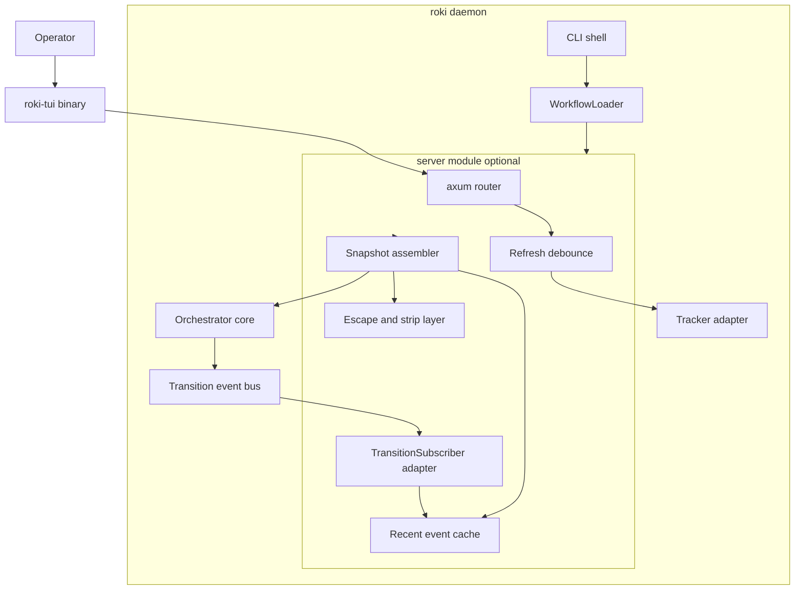
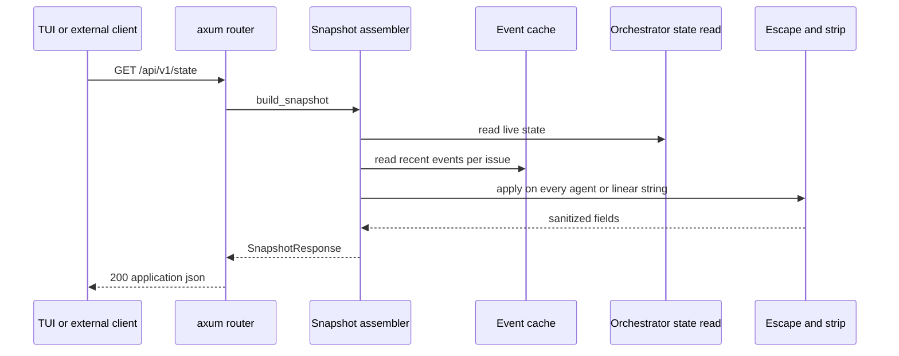
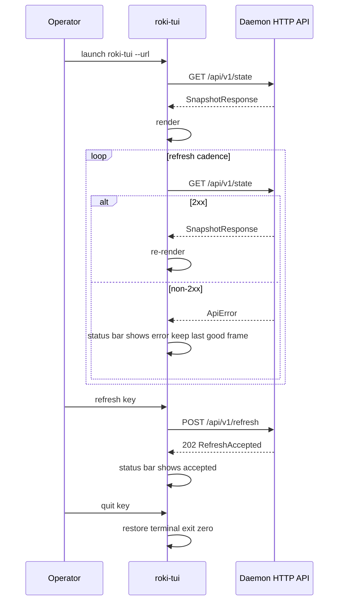

# Design Document

## Overview

**Purpose**: roki-observability adds an operator-facing observability surface to roki without changing roki-mvp's orchestrator. Two artifacts ship: (1) an optional axum HTTP server module compiled into the existing `roki` daemon binary, gated by `WORKFLOW.md` `server.port` and bound to loopback by default; (2) a separate `roki-tui` ratatui binary in the same Cargo workspace that consumes the HTTP API on a refresh loop. The API is a read-only projection of the orchestrator's in-memory state plus a single mutating endpoint (`POST /api/v1/refresh`) that nudges the tracker poller — no cancel, retry, or reschedule. The JSON schema mirrors symphony's so that future web UIs and external dashboards can interop without per-tool variants.

**Users**: A solo developer or small team operator who already runs roki as a long-running daemon and wants a TUI ("what is roki currently doing?") in seconds rather than tailing tracing logs and grepping. Future web-UI authors and external dashboard scripts are downstream consumers of the same JSON schema.

**Impact**: Adds two seams without disturbing roki-mvp: a `TransitionSubscriber` registered against the orchestrator's existing event bus and an on-demand projection that reads the orchestrator's live state. The orchestrator core does not depend on the API in either direction. The daemon continues to function with the API disabled, which is the default state.

### Goals
- Optional axum HTTP server module gated by `WORKFLOW.md` `server.port` (off by default), loopback-only by default.
- Three endpoints: `GET /api/v1/state`, `GET /api/v1/<issue>`, `POST /api/v1/refresh` — symphony-compatible JSON shape.
- Day-one HTML escaping plus ANSI stripping of every agent-derived and Linear-derived string field, on both API and TUI sides (defense in depth).
- A `roki-tui` ratatui binary that renders active workers, per-issue state, last lifecycle event, escalation queue, token usage, rate-limit snapshots; supports local escalation acknowledgement and a manual refresh action.
- Single shared `roki-api-types` crate so server and TUI cannot drift on schema.
- Reuse of roki-mvp's in-memory state model — no duplicated state structs.

### Non-Goals
- Authentication, authorization, TLS, or multi-user access. Loopback-only assumption.
- Web UI implementation. The JSON API enables it; nothing here builds it.
- Mutating control plane beyond `/refresh`. No cancel, retry, reschedule, pause, resume, or workspace operations.
- Persistent metrics, time-series storage, or historical event archives. Every snapshot is read live from in-memory state.
- Windows TUI support. macOS plus Linux only in v1.
- Persisted TUI session state across restarts beyond what is typed in the current session.

## Boundary Commitments

### This Spec Owns
- The `roki_api_types` shared crate: every `serde` type that crosses the HTTP boundary in either direction (snapshots, per-issue details, refresh acknowledgements, error envelopes), plus the projection contract from roki-mvp's in-memory state into those types.
- The `server/` module inside the daemon: axum router setup, axum `Server` binding, HTML-escape and ANSI-strip layer for every outbound string field, request-scoped tracing layer, in-memory request counter, refresh-debounce coordinator, projection assembler.
- The `roki-tui` binary: ratatui app loop, terminal setup and teardown, refresh loop against the API, key-binding map, local-only escalation acknowledgement state, terminal-capability detection and graceful degradation, status-bar error reporting.
- The `server.*` extension block in the `WorkflowPolicy` schema (under the existing `extension.*` reserved namespace).
- Documentation updates to `SPEC.md` and `WORKFLOW.example.md` covering the API surface, the `server.*` config block, and the loopback-bind security note.

### Out of Boundary
- Any change to roki-mvp's orchestrator state machine, the `WorkerState` enum, the `TransitionEvent` shape, the `WorkflowLoader` schema beyond adding a reserved extension key, or the per-issue worker lifecycle. The HTTP server module reads through stable interfaces and never writes back into orchestrator state.
- Any mutating Linear, GitHub, or filesystem effect. `POST /api/v1/refresh` calls a tracker-side nudge API that already lives in roki-mvp; this spec does not invent new tracker behavior.
- Authentication, authorization, audit logging beyond standard request logging, persistent storage of any kind, web UI, or mutating control plane endpoints.
- Any agent-side tool registration. The HTTP API is operator-facing; the agent does not see it.

### Allowed Dependencies
- roki-mvp's published interfaces: the `Orchestrator::subscribe` API for transition events; an in-memory state read API (added if not already present in roki-mvp; see Revalidation Triggers); the tracker adapter's existing refresh-nudge API (or a thin wrapper added in roki-mvp if not already present).
- axum 0.7+ and tower for HTTP routing and middleware. axum is already a roki-mvp dependency for the Linear webhook receiver, which keeps the dependency footprint flat.
- ratatui plus crossterm for the TUI; reqwest for the TUI's HTTP client (already in the workspace for Linear); serde and serde_json for shared types.
- A minimal HTML-escape crate (e.g. `html-escape`) and an ANSI-stripping crate (e.g. `strip-ansi-escapes`) consumed in the server module and the TUI for defense in depth.

### Revalidation Triggers
- Any change to roki-mvp's `WorkerState`, `TransitionEvent`, or `NormalizedIssue` shape — the projection in `roki_api_types` must be updated and the symphony-compatibility note in SPEC.md re-checked.
- Any change to the `Orchestrator::subscribe` contract or to the orchestrator's in-memory state read interface — the `server` module's projection assembler must be re-verified.
- Any change to roki-mvp's tracker refresh-nudge interface — the `POST /api/v1/refresh` handler must be re-checked.
- Any new agent-derived or Linear-derived string field added to roki-mvp's state — the API serialization must apply the escape/strip layer to it on day one.
- Adding a new mutating endpoint or changing the loopback-only default — both require revisiting the security note in `SPEC.md` and `WORKFLOW.example.md` plus an explicit acceptance criterion in this spec.
- Adding authn/authz in a future spec — the symphony-compatibility note must be updated and the loopback-only default re-evaluated.

## Architecture

### Architecture Pattern & Boundary Map



**Architecture Integration**:
- **Selected pattern**: Read-only projection plus thin mutating-nudge. The HTTP server lives in its own module; it depends on roki-mvp's orchestrator and tracker interfaces but the orchestrator does not depend on the server. The TUI is a separate process talking only over the JSON API.
- **Domain boundaries**: `roki_api_types` (shared `serde` schema) vs `server/` (HTTP module inside the daemon) vs `roki-tui` (separate binary). The orchestrator and tracker live in roki-mvp; the server module imports them through their published trait interfaces.
- **Existing patterns preserved**: axum is already in the daemon for the Linear webhook receiver; tracing is already the structured-logging pipeline; `WorkflowLoader` already publishes the `extension.*` reserved namespace for downstream specs.
- **New components rationale**: A small `TransitionSubscriber` cache exists to keep the most recent N lifecycle events per issue without re-walking the orchestrator on every request; this trades a bounded ring buffer per active issue for snapshot-time work.
- **Steering compliance**: Rust 2024, tokio runtime, no SQLite or persistent store, macOS plus Linux only, kiro skills unaffected.

### Technology Stack

| Layer | Choice / Version | Role in Feature | Notes |
|-------|------------------|-----------------|-------|
| HTTP server | axum 0.7+, tower 0.5+ | Router, middleware, request lifecycle | Already a daemon dependency |
| HTTP client (TUI) | reqwest 0.12+ | TUI fetches `/api/v1/state` and posts `/refresh` | Reuses workspace dependency; rustls TLS unused for loopback but kept for non-loopback opt-in |
| TUI framework | ratatui 0.26+, crossterm 0.27+ | Terminal rendering, key handling, terminal mode | Selected for active maintenance and macOS plus Linux focus |
| Shared types | serde 1.x, serde_json 1.x | `roki-api-types` crate | No additional dependencies needed |
| Escape / strip | html-escape 0.2+, strip-ansi-escapes 0.2+ | HTML-escape and ANSI-strip layer | Applied in server projection and again in TUI render |
| Logging | tracing, tracing-subscriber | Server request logs and TUI startup logs | Reuses existing pipeline; TUI logs to stderr only |
| CLI | clap 4.x | TUI binary CLI | Workspace dependency; daemon CLI is unchanged here |

> The server module reuses axum from roki-mvp's webhook receiver to keep the dependency footprint flat. The TUI binary deliberately uses crossterm rather than termion for macOS plus Linux uniformity.

## File Structure Plan

### Directory Structure

```
SPEC.md                                  # Updated with /api/v1/* contract and server.* config block
WORKFLOW.example.md                      # Updated with example server.* block and exposure note
Cargo.toml                               # Workspace; gains roki-api-types and roki-tui members
crates/
├── roki-api-types/
│   ├── Cargo.toml
│   └── src/
│       ├── lib.rs                       # Re-exports, version constant, top-level error envelope
│       ├── snapshot.rs                  # SnapshotResponse, ServerBlock, RepoSummary, AggregateUsage
│       ├── issue.rs                     # IssueDetailResponse, RecentEventEntry, ProjectionState
│       ├── refresh.rs                   # RefreshRequest, RefreshAccepted
│       └── error.rs                     # ApiError envelope plus ApiErrorCode
└── roki-tui/
    ├── Cargo.toml
    └── src/
        ├── main.rs                      # Binary entry, clap, runtime bootstrap
        ├── app.rs                       # AppState, refresh loop, event loop coordinator
        ├── api_client.rs                # Thin reqwest wrapper for the three endpoints
        ├── render.rs                    # Layout: header, worker table, escalation panel, status bar
        ├── input.rs                     # Key handling, debounce, escalation acknowledgement
        ├── terminal_caps.rs             # Terminal-capability detection and palette fallback
        └── sanitize.rs                  # ANSI-strip and control-character filter (defense in depth)
src/                                     # Existing daemon crate (roki-mvp owned)
├── server/                              # NEW module added by this spec
│   ├── mod.rs                           # ServerModule entrypoint, optional spawn, axum::Server bind
│   ├── router.rs                        # Route table for /api/v1/state, /api/v1/<issue>, /api/v1/refresh
│   ├── projection.rs                    # Project orchestrator state into roki_api_types shapes
│   ├── escape.rs                        # HTML-escape plus ANSI-strip helper, used by projection
│   ├── event_cache.rs                   # Per-issue ring buffer of recent lifecycle events; subscriber writes here
│   ├── refresh.rs                       # Refresh debounce coordinator, calls tracker nudge
│   ├── logging.rs                       # tracing layer for HTTP requests with redaction reuse
│   └── config.rs                        # Parse server.* block from WorkflowPolicy.extension
```

### Modified Files
- `Cargo.toml` (workspace root) — promote the daemon crate to a workspace and add `crates/roki-api-types` and `crates/roki-tui` as workspace members; the daemon crate gains a path dependency on `roki-api-types`.
- `src/main.rs` — at startup, after `WorkflowLoader` reports a valid policy, conditionally spawn `server::ServerModule::run` when `policy.server.port` is set.
- `src/orchestrator/hooks.rs` — no change to the trait; the server module registers an `Arc<dyn TransitionSubscriber>` like any other subscriber.
- `src/workflow/schema.rs` — register the `server.*` keys under the existing `extension.*` reserved namespace as additive optional fields.
- `SPEC.md` — add a section documenting the `/api/v1/*` contract, the `server.*` config block, the loopback-only default, and the symphony-compatibility note.
- `WORKFLOW.example.md` — add a commented-out example `server.*` block with the exposure warning.

> Each file owns one clear responsibility. The split between `projection.rs` (snapshot assembly logic) and `escape.rs` (string-sanitization helpers) keeps the escape/strip pass reusable from the per-issue endpoint without duplicating the logic.

## System Flows

### Daemon-side request handling (state and per-issue)



> The snapshot assembler reads the orchestrator state and the per-issue event cache under one logical read; readers see a single coherent moment. The cache is not the source of truth; it is a bounded ring fed by the transition subscriber so the snapshot does not have to walk full history each request.

### Refresh-nudge handling

```mermaid
sequenceDiagram
    participant Client as TUI or external client
    participant Router as axum router
    participant Debounce as Refresh debounce
    participant Tracker as Tracker adapter

    Client->>Router: POST /api/v1/refresh
    Router->>Debounce: request
    alt within minimum interval
        Debounce-->>Router: coalesced; reuse pending nudge
        Router-->>Client: 202 RefreshAccepted coalesced true
    else allowed now
        Debounce->>Tracker: nudge
        Tracker-->>Debounce: scheduled at next tick
        Debounce-->>Router: accepted; earliest fire time
        Router-->>Client: 202 RefreshAccepted coalesced false
    else tracker in 429 backoff
        Debounce->>Tracker: nudge
        Tracker-->>Debounce: deferred until backoff window elapses
        Debounce-->>Router: accepted; earliest fire time
        Router-->>Client: 202 RefreshAccepted coalesced false earliest_fire_at set
    end
```

### TUI refresh loop



## Requirements Traceability

| Requirement | Summary | Components | Interfaces | Flows |
|-------------|---------|------------|------------|-------|
| 1.1, 1.2, 1.3, 1.4, 1.5, 1.6 | Optional gated server, loopback default, hot-reload note | ServerModule, ServerConfig, WorkflowSchemaExt | `server.*` policy parse, axum bind | n/a |
| 2.1, 2.2, 2.3, 2.4, 2.5, 2.6 | `GET /api/v1/state` snapshot | Router, Projection, EventCache, EscapeStrip | `SnapshotResponse` | State request flow |
| 3.1, 3.2, 3.3, 3.4, 3.5, 3.6 | `GET /api/v1/<issue>` per-issue detail | Router, Projection, EventCache, EscapeStrip | `IssueDetailResponse` | State request flow (per-issue variant) |
| 4.1, 4.2, 4.3, 4.4, 4.5 | `POST /api/v1/refresh` | Router, RefreshDebounce, Tracker (read of refresh nudge) | `RefreshAccepted` | Refresh-nudge flow |
| 5.1, 5.2, 5.3, 5.4, 5.5 | Symphony-compatible schema | roki_api_types crate | Field-name and shape constraints | n/a |
| 6.1, 6.2, 6.3, 6.4, 6.5 | Escape and strip on every agent or Linear string | EscapeStrip (server side), TUI sanitize (defense in depth) | escape and strip helpers | State request flow |
| 7.1, 7.2, 7.3, 7.4 | Loopback default and exposure documentation | ServerConfig, ServerModule, SPEC.md, WORKFLOW.example.md | bind-host validation | n/a |
| 8.1, 8.2, 8.3, 8.4, 8.5, 8.6 | `roki-tui` binary basic UX | TuiApp, ApiClient, Render, Input | clap CLI, refresh loop | TUI refresh loop |
| 9.1, 9.2, 9.3, 9.4 | TUI escalation acknowledgement | TuiApp, Render, Input | Local AckState | TUI refresh loop |
| 10.1, 10.2, 10.3, 10.4 | TUI refresh action | TuiApp, ApiClient, Input | `POST /api/v1/refresh` | TUI refresh loop |
| 11.1, 11.2, 11.3, 11.4, 11.5 | Terminal compatibility and graceful degradation | TerminalCaps, Render | crossterm capability probing | n/a |
| 12.1, 12.2, 12.3, 12.4, 12.5 | Shared API types crate | roki_api_types crate | Type definitions | n/a |
| 13.1, 13.2, 13.3, 13.4, 13.5 | Read-only projection, no duplicated state | ServerModule, Projection, Subscriber | TransitionSubscriber registration | State request flow |
| 14.1, 14.2, 14.3, 14.4, 14.5 | Server and TUI logging | Logging layer (server side), TUI startup log | tracing fields, request counter | State request flow |
| 15.1, 15.2, 15.3, 15.4, 15.5 | `server.*` configuration in `WORKFLOW.md` | ServerConfig, WorkflowSchemaExt | `WorkflowPolicy.extension.server` | n/a |

## Components and Interfaces

| Component | Domain/Layer | Intent | Req Coverage | Key Dependencies (P0/P1) | Contracts |
|-----------|--------------|--------|--------------|--------------------------|-----------|
| ApiTypes (`roki_api_types`) | Shared types | One source of truth for every JSON request/response shape | 5.1, 5.2, 5.3, 5.4, 5.5, 12.1, 12.2, 12.3, 12.4, 12.5 | serde (P0) | State |
| ServerModule | Server/lifecycle | Optional axum server; bind, spawn, register subscriber, hold shared state | 1.1, 1.2, 1.3, 1.4, 1.5, 1.6, 7.1, 7.2, 13.1, 13.5 | WorkflowLoader (P0), Orchestrator (P0), Tracker (P0), tokio (P0), axum (P0) | Service |
| ServerConfig | Server/config | Parse `server.*` from `WorkflowPolicy.extension`, validate, normalize | 1.1, 1.4, 1.5, 7.1, 7.2, 15.1, 15.2, 15.3, 15.4, 15.5 | WorkflowLoader (P0) | State |
| Router | Server/HTTP | axum router; routes for state, per-issue, refresh; default headers | 2.1, 2.5, 3.1, 3.5, 4.1 | axum (P0), Projection (P0), RefreshCoordinator (P0) | API |
| Projection | Server/projection | Map orchestrator state and event cache into `roki_api_types` shapes | 2.1, 2.2, 2.3, 2.6, 3.1, 3.3, 3.4, 5.1, 5.2, 5.4, 13.2, 13.3, 13.4 | Orchestrator (P0), EventCache (P0), EscapeStrip (P0) | Service, State |
| EscapeStrip | Server/projection | HTML-escape plus ANSI-strip every agent-derived and Linear-derived string field | 2.4, 3.4, 6.1, 6.2, 6.3, 6.5 | html-escape (P0), strip-ansi-escapes (P0) | Service |
| EventCache | Server/projection | Bounded per-issue ring buffer fed by TransitionSubscriber for recent-event log | 2.2, 3.1, 3.6, 13.1 | Orchestrator EventBus (P0) | State |
| TransitionSubscriberAdapter | Server/projection | Implements `TransitionSubscriber`; writes events to EventCache; never vetoes | 13.1, 13.2, 13.5 | Orchestrator (P0), EventCache (P0) | Event |
| RefreshCoordinator | Server/refresh | Debounce refresh requests, coalesce within minimum interval, call tracker nudge | 4.1, 4.2, 4.3, 4.4, 4.5 | Tracker (P0) | Service |
| HttpLogging | Server/logging | tracing layer that emits per-request structured events with redaction reuse and increments per-endpoint counter | 14.1, 14.2, 14.3, 14.5 | tracing (P0) | Service |
| TuiApp | TUI | App loop, state holder, refresh-loop coordinator, key router | 8.2, 8.3, 8.4, 8.5, 9.1, 9.3, 10.1, 10.2 | ApiClient (P0), Render (P0), Input (P0), tokio (P0) | Service, State |
| TuiApiClient | TUI | reqwest wrapper for `GET /api/v1/state`, `GET /api/v1/<issue>`, `POST /api/v1/refresh` | 8.2, 8.3, 8.6, 10.1, 10.3 | reqwest (P0), ApiTypes (P0) | API |
| TuiRender | TUI | Layout, color palette resolution, status bar, glyph table | 8.4, 9.2, 11.1, 11.2, 11.4 | ratatui (P0), TerminalCaps (P0) | Service |
| TuiInput | TUI | Key handling, refresh debounce, ack/quit/refresh keys | 8.5, 9.1, 10.1, 10.4 | crossterm (P0) | Service |
| TerminalCaps | TUI | Detect 24-bit RGB support, fall back palette, emit one-time notice | 11.1, 11.2, 11.3, 11.4, 11.5 | crossterm (P0) | State |
| TuiSanitize | TUI | ANSI-strip plus control-char filter for every string used in render | 6.4 | strip-ansi-escapes (P0) | Service |
| WorkflowSchemaExt | Workflow integration | Register `server.*` keys as additive under `extension.*` | 1.6, 15.1, 15.2, 15.3, 15.4 | WorkflowLoader / Schema (P0) | State |
| SpecRootUpdate | Documentation | Update `SPEC.md` and `WORKFLOW.example.md` with API contract, config block, exposure note, symphony-compat note | 5.4, 7.3, 15.5 | n/a | n/a |

### Shared API types

#### ApiTypes (`roki_api_types`)

| Field | Detail |
|-------|--------|
| Intent | Single source of truth for every JSON shape that crosses the HTTP boundary |
| Requirements | 5.1, 5.2, 5.3, 5.4, 5.5, 12.1, 12.2, 12.3, 12.4, 12.5 |

**Responsibilities & Constraints**
- All structs derive `Serialize` and `Deserialize`; field names selected to match symphony's documented `/api/v1/state` and per-issue contract.
- Where roki-specific fields are required (multi-repo `(repo, issue)` keying), they live under names that do not collide with symphony's fields.
- The crate must not depend on roki-mvp internals; the projection direction is daemon-internal-state -> ApiTypes, not the reverse.
- API version constant `API_VERSION: &str = "v1"` exposed at the crate root for the daemon and TUI to assert.

**Contracts**: Service [ ] / API [ ] / Event [ ] / Batch [ ] / State [x]

##### State / Type Sketch

```rust
#[derive(Serialize, Deserialize, Clone, Debug)]
pub struct SnapshotResponse {
    pub api_version: String,                 // "v1"
    pub daemon: DaemonInfo,
    pub server: ServerBlock,
    pub repos: Vec<RepoSummary>,
    pub workers: Vec<WorkerSummary>,
    pub escalations: Vec<EscalationEntry>,
    pub aggregate_usage: AggregateUsage,
    pub aggregate_rate_limit: AggregateRateLimit,
    pub snapshot_at: chrono::DateTime<chrono::Utc>,
}

#[derive(Serialize, Deserialize, Clone, Debug)]
pub struct WorkerSummary {
    pub repo: String,
    pub issue: String,
    pub state: String,                       // ProjectionState string; documented fallback for unknown
    pub last_event: Option<RecentEventSummary>,
    pub last_event_at: Option<chrono::DateTime<chrono::Utc>>,
    pub correlation_id: Option<String>,
}

#[derive(Serialize, Deserialize, Clone, Debug)]
pub struct IssueDetailResponse {
    pub api_version: String,
    pub repo: String,
    pub issue: String,
    pub state: String,
    pub recent_events: Vec<RecentEventEntry>,
    pub last_error: Option<String>,
    pub permission_strategy: String,
    pub workspace_path: String,
    pub truncated: bool,
}

#[derive(Serialize, Deserialize, Clone, Debug)]
pub struct RefreshAccepted {
    pub api_version: String,
    pub coalesced: bool,
    pub earliest_fire_at: Option<chrono::DateTime<chrono::Utc>>,
}

#[derive(Serialize, Deserialize, Clone, Debug)]
pub struct ApiError {
    pub api_version: String,
    pub code: String,                        // e.g. "NOT_FOUND", "AMBIGUOUS_REPO", "UNHEALTHY"
    pub message: String,
    pub details: Option<serde_json::Value>,
}
```

- Preconditions: every string field is already escaped and stripped before serialization; the projection in the daemon is responsible for ensuring this.
- Postconditions: schema field names are stable across patch versions; additions are additive only.
- Invariants: `api_version` is always set to `"v1"`.

### Server module

#### ServerModule

| Field | Detail |
|-------|--------|
| Intent | Optional axum HTTP server: read `server.*` config, bind socket, register transition subscriber, drive shutdown |
| Requirements | 1.1, 1.2, 1.3, 1.4, 1.5, 1.6, 7.1, 7.2, 13.1, 13.5 |

**Responsibilities & Constraints**
- Read `WorkflowPolicy.extension.server` (parsed by `ServerConfig`); if `port` is unset, do nothing and log info-level "API disabled".
- Register a `TransitionSubscriberAdapter` with the orchestrator before binding the socket; if subscription fails, log error and continue without the API.
- Bind axum on `(bind_host, port)`; on bind failure, log error with port and underlying error and do not retry in v1.
- Hold an `Arc<AppState>` containing references to the orchestrator state-read interface, the event cache, the refresh coordinator, and a per-endpoint request counter.
- On shutdown signal, drain in-flight requests within the bounded shutdown window and stop the listener cleanly.

**Dependencies**
- Inbound: daemon main task — calls `ServerModule::run` after `WorkflowLoader` reports a valid policy (P0).
- Outbound: WorkflowLoader — reads `policy.extension.server` (P0).
- Outbound: Orchestrator — registers subscriber and reads live state (P0).
- Outbound: Tracker adapter — calls refresh-nudge from the refresh coordinator (P0).

**Contracts**: Service [x] / API [ ] / Event [ ] / Batch [ ] / State [ ]

##### Service Interface (Rust trait sketch)

```rust
pub struct ServerModule {
    config: ServerConfig,
    orchestrator: Arc<dyn OrchestratorRead>,
    tracker: Arc<dyn TrackerRefresh>,
    event_cache: Arc<EventCache>,
}

impl ServerModule {
    pub async fn run(self, shutdown: ShutdownSignal) -> Result<(), ServerError>;
}

pub trait OrchestratorRead: Send + Sync {
    fn snapshot(&self) -> OrchestratorSnapshot;
    fn issue(&self, repo: &str, issue: &str) -> Option<IssueRead>;
    fn subscribe(&self, sub: Arc<dyn TransitionSubscriber>) -> SubscriptionHandle;
}

pub trait TrackerRefresh: Send + Sync {
    fn nudge(&self) -> NudgeOutcome;        // synchronous, non-blocking; reports earliest fire time
}
```

- Preconditions: `WorkflowLoader` has produced a valid policy; orchestrator and tracker handles are constructed.
- Postconditions: when `port` is set, an axum task is running and serving the documented endpoints; when `port` is unset, no socket is bound.
- Invariants: the server module never writes to orchestrator state; `POST /api/v1/refresh` flows through `TrackerRefresh::nudge` only.

**Implementation Notes**
- Integration: `tokio::spawn` an axum task; bind via `axum::serve(TcpListener::bind(...))`; pass shutdown via `with_graceful_shutdown`.
- Validation: bind-host classification (loopback vs not) is in `ServerConfig`; the warn-level log on non-loopback bind fires from `ServerModule::run` before serving begins.
- Risks: orchestrator read API drift. Mitigation: `OrchestratorRead` is a thin trait the orchestrator implements; downstream changes require updating one trait method, not the projection.

#### ServerConfig

| Field | Detail |
|-------|--------|
| Intent | Parse and validate the `server.*` block from `WorkflowPolicy.extension` |
| Requirements | 1.1, 1.4, 1.5, 7.1, 7.2, 15.1, 15.2, 15.3, 15.4, 15.5 |

**Responsibilities & Constraints**
- Accept absence of the entire `server` block as the explicit "API disabled" state.
- Validate `port` (1..=65535), `bind` (parse as `IpAddr`; default to `127.0.0.1`), `min_refresh_interval_seconds` (>= 1, with documented default), `max_event_log_per_issue` (>= 1, with documented default).
- Classify `bind` as loopback (`127.0.0.0/8`, `::1/128`) versus non-loopback so the warn-level log can fire correctly.
- Surface validation errors as a typed enum that names the offending key.

**Contracts**: Service [ ] / API [ ] / Event [ ] / Batch [ ] / State [x]

```rust
#[derive(Clone, Debug)]
pub struct ServerConfig {
    pub port: u16,
    pub bind: IpAddr,                        // default 127.0.0.1
    pub min_refresh_interval: Duration,      // default 5 seconds
    pub max_event_log_per_issue: usize,      // default 50
}

#[derive(Debug, thiserror::Error)]
pub enum ServerConfigError {
    #[error("server.port out of range: {0}")]
    InvalidPort(i64),
    #[error("server.bind is not a valid IP address: {0}")]
    InvalidBind(String),
    #[error("server.{key} must be at least 1 (got {value})")]
    OutOfRange { key: &'static str, value: i64 },
}
```

#### Projection

| Field | Detail |
|-------|--------|
| Intent | Build `SnapshotResponse` and `IssueDetailResponse` from the live orchestrator state and the event cache, applying escape/strip per field |
| Requirements | 2.1, 2.2, 2.3, 2.6, 3.1, 3.3, 3.4, 5.1, 5.2, 5.4, 13.2, 13.3, 13.4 |

**Responsibilities & Constraints**
- Read the orchestrator state under one logical read (whatever lock or snapshot the orchestrator exposes via `OrchestratorRead::snapshot`) and read the per-issue event cache once per issue in the same pass.
- Map roki-mvp's `WorkerState` to the documented `ProjectionState` strings (`"discovered"`, `"queued"`, `"active"`, `"awaiting_review"`, `"backoff"`, `"stalled"`, `"terminal_success"`, `"terminal_failure"`); any unknown variant maps to `"unknown"` with the original variant name preserved in `details`.
- Apply `EscapeStrip::apply` to every string field carrying agent-derived or Linear-derived content (issue title, description, last-event message, last-error string, label values, tool-result preview).
- For per-issue detail with multi-repo ambiguity, return `ApiError { code: "AMBIGUOUS_REPO", ... }` with a 400 status when no `repo` query parameter is supplied and more than one repo matches.
- Return `ApiError { code: "UNHEALTHY", ... }` with a 503 status if `OrchestratorRead::snapshot` reports the orchestrator is partially initialized.

**Contracts**: Service [x] / API [ ] / Event [ ] / Batch [ ] / State [x]

#### EscapeStrip

| Field | Detail |
|-------|--------|
| Intent | One reusable helper that HTML-escapes and ANSI-strips a string |
| Requirements | 2.4, 3.4, 6.1, 6.2, 6.3, 6.5 |

**Responsibilities & Constraints**
- `EscapeStrip::apply(input: &str) -> String`: strip ANSI escape sequences first, then HTML-escape the result; on invalid UTF-8 or unrecoverable input, return a fixed sanitized placeholder marker (`"[redacted-invalid]"`) and emit a structured tracing event with the source field name.
- Used by `Projection` for every agent-derived or Linear-derived string field.

#### EventCache and TransitionSubscriberAdapter

| Field | Detail |
|-------|--------|
| Intent | Per-issue bounded ring of recent lifecycle events fed by the orchestrator's transition subscriber so snapshots avoid walking history |
| Requirements | 2.2, 3.1, 3.6, 13.1 |

**Responsibilities & Constraints**
- One ring buffer per active `(repo, issue)` keyed by orchestrator key; capacity from `ServerConfig::max_event_log_per_issue`.
- `TransitionSubscriberAdapter` registers via `OrchestratorRead::subscribe` and writes one entry per `TransitionEvent`. Errors inside the subscriber are logged and isolated; never veto.
- On worker terminal state, the cache entry is dropped after one snapshot grace window so a final read still surfaces the terminal event.

**Contracts**: Service [ ] / API [ ] / Event [x] / Batch [ ] / State [x]

#### RefreshCoordinator

| Field | Detail |
|-------|--------|
| Intent | Debounce `POST /api/v1/refresh` calls and translate them into tracker nudges |
| Requirements | 4.1, 4.2, 4.3, 4.4, 4.5 |

**Responsibilities & Constraints**
- Maintain a "next allowed nudge time" timestamp; a request inside the window returns `coalesced: true` reusing any pending nudge.
- A request outside the window invokes `TrackerRefresh::nudge` and returns `coalesced: false` plus the tracker-reported earliest fire time.
- All requests log at info level with the client address (already provided by axum's `ConnectInfo`) and the coalescing decision.

**Contracts**: Service [x] / API [ ] / Event [ ] / Batch [ ] / State [x]

#### Router and HTTP API contract

| Method | Endpoint | Request | Response | Errors |
|--------|----------|---------|----------|--------|
| GET | `/api/v1/state` | none | 200 `SnapshotResponse` (`Content-Type: application/json; charset=utf-8`, `Cache-Control: no-store`) | 503 `ApiError { code: "UNHEALTHY" }` |
| GET | `/api/v1/<issue>` | optional `repo` query parameter | 200 `IssueDetailResponse` | 400 `ApiError { code: "AMBIGUOUS_REPO" }`, 404 `ApiError { code: "NOT_FOUND" }`, 503 `ApiError { code: "UNHEALTHY" }` |
| POST | `/api/v1/refresh` | empty body or future `RefreshRequest` (reserved) | 202 `RefreshAccepted` | 503 `ApiError { code: "UNHEALTHY" }` |

> Headers `Content-Type: application/json; charset=utf-8` and `Cache-Control: no-store` are always set on JSON responses. Bodies are not logged in v1.

### TUI binary

#### TuiApp

| Field | Detail |
|-------|--------|
| Intent | The `roki-tui` app loop: drive refresh ticks, route key events, hold local UI state |
| Requirements | 8.2, 8.3, 8.4, 8.5, 9.1, 9.3, 10.1, 10.2 |

**Responsibilities & Constraints**
- On startup, parse CLI args (`--url`, `--refresh-interval-ms`), enter raw mode, hide the cursor, run the event loop until quit.
- Maintain `AppState`: latest `SnapshotResponse`, last error string, set of acknowledged escalation IDs (cleared when an escalation disappears from the snapshot), refresh-in-flight flag, last refresh timestamp.
- Concurrently run a refresh task that calls `TuiApiClient::state` at the configured cadence and a key-event task that drains crossterm events; merge into `AppState` via channels.
- On quit, restore the terminal mode, show the cursor, exit zero.

**Contracts**: Service [x] / API [ ] / Event [ ] / Batch [ ] / State [x]

#### TuiApiClient

| Method | Endpoint | Notes |
|--------|----------|-------|
| `state()` | `GET /api/v1/state` | Deserializes into `SnapshotResponse`; on non-2xx returns `ApiError`. |
| `issue(repo, issue)` | `GET /api/v1/<issue>?repo=<repo>` | Reserved for v1.1 detail view; not required for the primary refresh loop. |
| `refresh()` | `POST /api/v1/refresh` | Returns `RefreshAccepted`; surfaces tracker-reported earliest fire time in the status bar. |

#### TuiRender

| Field | Detail |
|-------|--------|
| Intent | Lay out the terminal frame: header, worker table, escalation panel, status bar |
| Requirements | 8.4, 9.2, 11.1, 11.2, 11.4 |

**Responsibilities & Constraints**
- Use a fixed three-region layout: header (`daemon`, uptime, `aggregate_usage`, `aggregate_rate_limit`), main split (active workers table on the left, escalations on the right), status bar (last error, refresh state, terminal-capability notice).
- Distinguish acknowledged from unacknowledged escalations by both color and a non-color glyph (e.g. `*` for unacknowledged, `.` for acknowledged) so that Terminal.app users without RGB color still see the difference.
- Render only printable ASCII or commonly supported Unicode glyphs (no Sixel, no Kitty graphics protocol).

#### TerminalCaps

| Field | Detail |
|-------|--------|
| Intent | Detect 24-bit RGB support and pick a palette |
| Requirements | 11.1, 11.2, 11.3, 11.4, 11.5 |

**Responsibilities & Constraints**
- Probe `COLORTERM` (`truecolor`/`24bit`), `TERM_PROGRAM`, and crossterm's terminal capability hints at startup.
- Emit one informational status-bar notice on startup if RGB is unavailable; do not repeat it on subsequent ticks.
- On Windows, exit non-zero with a not-supported message.

#### TuiSanitize

Implementation note: the TUI re-strips ANSI escapes and filters control characters from every string it receives before rendering. The server already does this, but the TUI defends in depth so a future API change does not silently regress the trust boundary.

### Workflow integration

#### WorkflowSchemaExt

Implementation note: under roki-mvp's `WorkflowSchema`, register an additive sub-schema at `extension.server` containing `port`, `bind`, `min_refresh_interval_seconds`, `max_event_log_per_issue`. Unknown sibling keys remain accepted (additive-friendly). `ServerConfig::from_policy(policy: &WorkflowPolicy) -> Result<Option<ServerConfig>, ServerConfigError>` parses this block and returns `Ok(None)` when absent.

### Documentation

#### SpecRootUpdate

Implementation note: extend `SPEC.md` with three sections — the `/api/v1/*` JSON contract (field names, status codes, error envelope), the `server.*` configuration block, and a security note that loopback is the default and any non-loopback bind is unauthenticated and thus the operator's risk. `WORKFLOW.example.md` gains a commented-out example block:

```yaml
# server:
#   port: 7842
#   bind: "127.0.0.1"        # change at your own risk; no authn in v1
#   min_refresh_interval_seconds: 5
#   max_event_log_per_issue: 50
```

## Data Models

### Domain Model

The HTTP module has no persistent domain model. The runtime in-memory model adds two aggregates:

- **EventCacheRing**: per-`(repo, issue)` bounded ring of `RecentEventEntry` values produced by the transition subscriber. Capacity is `ServerConfig.max_event_log_per_issue`. Dropped on terminal-state grace expiry.
- **RefreshDebounceState**: `next_allowed_at: Option<Instant>` plus a pending-nudge handle.

No on-disk state is added by this spec.

### Data Contracts & Integration

- HTTP boundary: every type in the `roki_api_types` crate. Requests have no bodies in v1 (refresh body is reserved for future use). Responses are JSON, UTF-8, no streaming.
- Event subscription: `TransitionSubscriber::on_transition` is the only producer of `EventCacheRing` writes; failure is isolated and logged.

## Error Handling

### Error Strategy

- The HTTP module surfaces every error to the caller as an `ApiError` envelope with a stable `code` string. Internal errors (panics, projection failures) are caught at the axum middleware and mapped to `code: "INTERNAL"` with a 500 status; the underlying error is logged through tracing with redaction.
- `TuiApp` never exits on a transient API error; instead the status bar shows the error and the refresh loop continues.
- Server startup errors (bind failure, config validation failure) do not crash the daemon; the orchestrator continues without the API and the operator sees a structured error event.

### Error Categories and Responses

- **Configuration errors** (`server.*` invalid): server does not start; daemon continues; structured error log identifies the offending key.
- **Bind errors** (port in use, permission denied): server does not start; daemon continues; structured error log identifies the port and underlying OS error.
- **Projection errors** (orchestrator unhealthy): 503 `UNHEALTHY` to caller; logged.
- **Routing errors** (not found, ambiguous repo): 404 / 400 with the documented `code`; not logged at error level.
- **Refresh errors** (tracker permanently unable): still 202 with `earliest_fire_at` set to `None` and `coalesced: false`; the tracker is responsible for recovering on its own backoff schedule.
- **TUI client errors** (non-2xx, network): status bar message; refresh loop continues.

### Monitoring

Every API request emits a structured tracing event with method, path, status, duration, client address, correlation id; bodies are never logged. A per-endpoint request counter is exposed under `SnapshotResponse.server` so the operator can confirm the API is being used.

## Testing Strategy

### Unit Tests
- `EscapeStrip::apply` strips `\x1b[31mhi\x1b[0m` to `hi`, HTML-escapes `<script>alert(1)</script>` to `&lt;script&gt;alert(1)&lt;/script&gt;`, and replaces invalid UTF-8 input with the documented `[redacted-invalid]` placeholder.
- `ServerConfig::from_policy` returns `Ok(None)` when the `server` block is absent, returns `Err(InvalidPort)` on `port: 0`, returns `Err(InvalidBind)` on a malformed IP, and accepts a valid block.
- `RefreshCoordinator` coalesces a burst of three calls within the configured minimum interval into one nudge and reports `coalesced: true` for the second and third.
- `TerminalCaps::detect` selects the truecolor palette when `COLORTERM=truecolor`, falls back to 256-color when unset, and reports the one-time notice.
- `Projection::build_snapshot` maps a stub orchestrator state plus stub event cache into a `SnapshotResponse` whose every agent-derived string field has been escaped and stripped (verified by injecting `\x1b[31m<b>` test fixtures).

### Integration Tests
- End-to-end `GET /api/v1/state` against an axum test server backed by stub `OrchestratorRead` and stub `EventCache`: assert 200, `Content-Type: application/json; charset=utf-8`, `Cache-Control: no-store`, schema field set matches symphony reference fixtures.
- End-to-end `GET /api/v1/<issue>?repo=<repo>` for an existing issue returns 200 with the expected detail; for a missing issue returns 404 `NOT_FOUND`; for an ambiguous issue without `repo` returns 400 `AMBIGUOUS_REPO`.
- End-to-end `POST /api/v1/refresh` calls a fake `TrackerRefresh` whose first call succeeds and second call (within the minimum interval) is coalesced; the response bodies match.
- WORKFLOW.md hot-reload integration: changing `server.port` while the daemon runs does not change the listening port at runtime; a structured log event records the deferred-until-restart decision.
- TransitionSubscriberAdapter integration: a stub orchestrator emits ten transitions for an issue with a cache cap of five; the resulting `IssueDetailResponse.recent_events` length is five and `truncated` is true.
- Loopback-default bind integration: with no `bind` configured, the server binds 127.0.0.1; a request from 127.0.0.1 succeeds and a startup log event names the bind address.
- Non-loopback bind integration: with `bind: 0.0.0.0` configured in a test fixture, a warn-level log event fires once at startup and serving proceeds.

### E2E Tests
- TUI happy path: launch `roki-tui --url http://127.0.0.1:<port>` against the daemon's test fixture, observe the initial frame contains the active worker list and the escalation panel, press the refresh key and observe the status bar transition.
- TUI degraded-terminal path: run on a terminal probe that reports no truecolor; observe the one-time fallback notice in the status bar and a 256-color rendering.
- TUI quit path: press the documented quit key; observe terminal mode restored and exit code zero.

### Performance / Load (informational)
- `GET /api/v1/state` under a stub orchestrator with one hundred active issues completes within the documented snapshot drift bound on a developer-class machine.
- `POST /api/v1/refresh` debounce holds under a 100-rps burst from a stub client for one minute without leaking pending nudge handles.

## Optional Sections

### Security Considerations

- **No authn in v1**: the API has no authentication or authorization. Loopback-only is the contract. Binding to a non-loopback interface is opt-in and produces a warn-level startup log.
- **Untrusted strings**: every agent-derived and Linear-derived string is HTML-escaped and ANSI-stripped on the server side and again ANSI-stripped on the TUI side. Defense in depth on day one because symphony hardened this in PRs #22 and #23.
- **No body logging**: the HTTP layer logs metadata only (method, path, status, duration, client address). Agent-derived strings never enter the log path through the API.
- **Secret redaction**: the existing tracing redaction layer continues to apply to API logs.
- **No SSRF risk on the daemon side**: the API is read-only plus a single tracker-nudge call; the daemon never fetches arbitrary URLs on behalf of clients.

### Performance & Scalability

- Snapshot work is O(active_workers) in the projection plus O(max_event_log_per_issue) per active worker. With the documented defaults (low-tens of issues, 50 events per issue), each snapshot fits in well under a millisecond's worth of allocator and serialization work on a developer-class machine.
- The TUI refresh cadence default is 1000 ms; operators can override via CLI.
- The HTTP module shares the daemon's tokio runtime; no separate thread pool.
