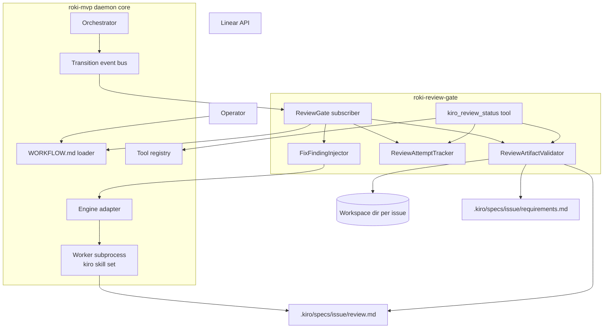
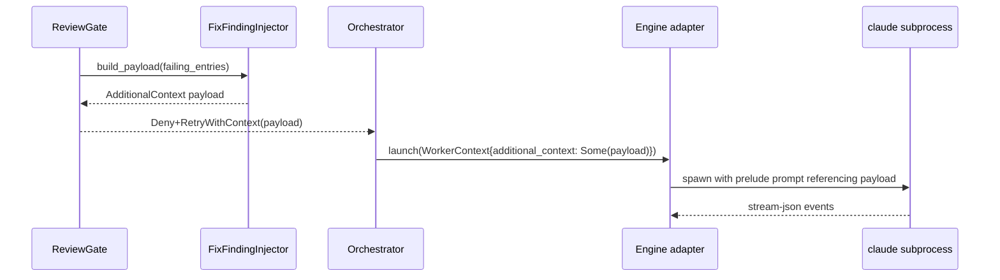

---
refs:
  id: design:roki-review-gate
  kind: design
  title: "roki-review-gate Design"
  spec: roki-review-gate
  implements:
    - requirements:roki-review-gate
---

# Design Document

## Overview

**Purpose**: roki-review-gate adds a daemon-enforced pre-PR review checkpoint to roki by registering a `TransitionSubscriber` against roki-mvp's vetoable `Active -> Inactive` transition (the worker's clean-exit transition). It refuses the transition until a structurally valid review artifact (`review.md`) exists at a stable per-issue path, and on failure routes the issue back to `Active` with findings injected as `additional_context`, bounded by `extension.gates.review.max_attempts`. The artifact is produced **inside the worker session** by the kiro skill set; the daemon does not launch a separate review turn.

**Users**: A roki operator who has roki-mvp running, configures the review gate per repo in `WORKFLOW.md`, and depends on the daemon to enforce that no Linear ticket reaches a PR-ready state on the agent's self-assessment alone.

**Impact**: Closes the symphony-vs-roki gap on review enforcement: symphony relies on prompt convention; roki turns this into a daemon-enforced contract, while keeping "single bounded `claude` invocation per ticket" intact (no daemon-launched review subprocess).

### Goals
- Register a daemon-side `TransitionSubscriber` that vetoes `Active -> Inactive` until `review.md` validates structurally.
- Validate the artifact deterministically: presence, schema, per-criterion pass/fail, and reachable code references on pass entries — no LLM judgment, no heuristics.
- Compose the kiro skill set's verdicts inside the worker session into the `review.md` artifact before clean exit (no separate daemon-launched review turn).
- Re-launch the worker on failure with structured findings injected as `additional_context`, up to `max_attempts`, respecting the worker's `max_turns` budget.
- Publish a `kiro_review_status` read-only tool through roki-mvp's `Registry` so the worker can self-check on the next attempt.
- Land new `WORKFLOW.md` keys under the reserved `extension.gates.review.*` namespace without breaking the published schema.

### Non-Goals
- LLM or heuristic judgment of whether code actually satisfies a criterion (lives in the kiro skill set running inside the worker session).
- Auto-merge, auto-PR-open, Linear writes, branch management, `gh` invocation — the agent owns those, full stop.
- Spec materialization (owned by roki-spec-gate) or implementation phase mechanics (owned by roki-mvp).
- Persistent storage of review history or run analytics.
- Authoring kiro skill prompt content.
- A daemon-launched `claude` review subprocess of any kind.

## Boundary Commitments

### This Spec Owns
- A `ReviewGate` component that implements roki-mvp's `TransitionSubscriber` trait, scoped to the vetoable `Active -> Inactive` transition.
- The `review.md` schema (frontmatter shape + per-criterion entry shape) and its location: `<workspace_root>/<repo>/<issue>/.kiro/specs/<issue>/review.md`.
- A `ReviewArtifactValidator` that performs presence, schema, per-criterion status, and code-reference reachability checks and produces a typed `ValidationOutcome`.
- A `ReviewAttemptTracker` that holds in-memory per-issue attempt counters and reset semantics, with no persistence.
- A `FixFindingInjector` that converts the previous attempt's failing per-criterion entries into a structured `additional_context` payload for the next worker invocation, routed through roki-mvp's documented engine adapter channel.
- The `kiro_review_status` read-only `Tool` registered through roki-mvp's `Registry`.
- The `extension.gates.review.{required_status, max_attempts}` keys consumed from the `WorkflowPolicy` exposed by roki-mvp's `WorkflowLoader` (the keys live in the reserved namespace already round-tripped by roki-mvp; this spec does not change the `WorkflowSchema` itself).
- The Review Gate section of `docs/reference/artifacts.md` documenting the `review.md` path, schema, decision codes, and the `additional_context` envelope.

### Out of Boundary
- Changes to roki-mvp's state machine, vetoable-transition list, `TransitionSubscriber` trait, `Registry`/`Tool` traits, or `WorkflowSchema` infrastructure — this spec consumes those interfaces unchanged.
- Kiro skill prompts, content, or judgment heuristics.
- Any logic that decides whether code actually satisfies a criterion.
- Linear writes, PR creation, branch management, `gh` CLI invocation.
- Spec materialization (`requirements.md` is produced by roki-spec-gate; this spec only reads it).
- Auto-merge, multi-host orchestration, persistent state.
- Any daemon-launched `claude` subprocess for review.
- Per-attempt time bounds: time-boundedness is roki-mvp's `max_turns` and stall detection on the same worker subprocess that produces `review.md`.

### Allowed Dependencies
- Rust 2024 + tokio (consumed via roki-mvp's runtime, not new).
- roki-mvp's `Orchestrator::subscribe`, `TransitionSubscriber` (with `veto`), `TransitionEvent`, `WorkerState`.
- roki-mvp's `Registry::register`, `Tool` trait.
- roki-mvp's `WorkflowLoader::current` and the `extension` scope on `WorkflowPolicy`.
- roki-mvp's engine adapter `additional_context` channel on `WorkerContext` for fix-finding payload delivery.
- serde + serde_yaml for parsing `review.md` frontmatter.
- A hand-rolled scanner for cross-checking referenced code paths inside the workspace (path reachability only; no semantic parsing).
- tracing for structured log events with `(issue, attempt, correlation_id)` context.
- thiserror for typed adapter errors.

### Revalidation Triggers
Changes that should force dependent docs / consumers to re-check integration:
- Any change to the `review.md` path or to the structural schema (status field, per-criterion entry shape, code-reference shape).
- Any change to the gate decision-code taxonomy (`pass`, `fail-missing`, `fail-schema`, `fail-evidence`, `fail-missing-spec`).
- Any change to the `extension.gates.review.*` key set or default values.
- Any change to the `additional_context` injection contract that roki-mvp's engine adapter exposes.
- Any change to the escalation route (`Inactive(reason=review_gate_exhausted)` + linear-updater dispatch) on attempt exhaustion.

### Cross-Spec Contract Note (Engine Adapter `additional_context` Channel)

This spec depends on roki-mvp's engine adapter `additional_context` channel on `WorkerContext` (the same channel documented in `docs/reference/extension-surface.md`). When the gate returns `Deny+RetryWithContext(payload)`, roki-mvp re-launches the worker with `payload` forwarded into the `additional_context` field; the worker prompt's machine-extractable section receives it verbatim, separate from the rendered `prompt_template_worker` body. The exact serialization (JSON line in stream-json prelude vs. workspace-side scratch file) is implementation-internal to roki-mvp's engine adapter; this spec consumes whichever stable seam roki-mvp provides.

## Architecture

### Architecture Pattern & Boundary Map



**Architecture Integration**:
- **Selected pattern**: Subscriber-of-orchestrator with a small set of focused collaborators. The gate is a single `TransitionSubscriber` that delegates to a validator, an attempt tracker, an injector, and a read-only status tool. No new bus, no new state machine, **no daemon-launched review subprocess**.
- **Domain boundaries**: Gate (decision) vs Validator (structural check) vs Attempt Tracker (in-memory counter) vs Injector (additional-context payload) vs Status Tool (read-only projection).
- **Existing patterns preserved**: roki-mvp's hexagonal core, vetoable-transition contract, `Tool`/`Registry`, `extension.gates.*` reserved namespace, no DB, agent owns writes, single bounded `claude` invocation per ticket.
- **New components rationale**: each collaborator has exactly one responsibility; combining them would either pull LLM judgment into the daemon (forbidden) or couple the gate to engine-adapter internals (forbidden).
- **Steering compliance**: Rust 2024 + tokio, no SQLite, kiro skills as personal skills, macOS + Linux, agent owns Linear/PR writes, daemon never launches a side `claude`.

### Technology Stack

| Layer | Choice / Version | Role in Feature | Notes |
|-------|------------------|-----------------|-------|
| Runtime | Rust 2024 + tokio 1.x (inherited from roki-mvp) | Async subscriber dispatch | No new runtime dependency |
| Subscription | roki-mvp `TransitionSubscriber` | Single subscriber registered against the vetoable `Active -> Inactive` transition | Hard fail closed on subscriber error per roki-mvp |
| Front matter | serde + serde_yaml | Parse `review.md` frontmatter | Loose Markdown body permitted; only frontmatter is schema-validated |
| Markdown body scan | hand-rolled string scanner | Extract code-reference path tokens from per-criterion sections when not in frontmatter | Reachability check only; no semantic parsing |
| Validation | thiserror typed errors | Typed `ValidationOutcome` with one variant per decision code | One canonical decision-code enum |
| Logging | tracing (inherited) | Per-decision structured events with `(issue, attempt, correlation_id)` | Same context fields roki-mvp already standardizes |
| Configuration | roki-mvp `WorkflowPolicy::extension` | Read `extension.gates.review.{required_status, max_attempts}` | Loader is unchanged; namespace was reserved by roki-mvp |
| Engine integration | roki-mvp engine adapter `additional_context` channel on `WorkerContext` | Inject fix-finding payload on re-launch | Consumes the channel; does not extend it |

## File Structure Plan

### Directory Structure

```
src/
├── gates/
│   └── review/
│       ├── mod.rs                  # ReviewGate subscriber, registration entry point
│       ├── artifact.rs             # ReviewArtifact type, frontmatter parser, body code-ref scanner
│       ├── schema.rs               # Per-criterion entry shape, status enum, decision-code enum
│       ├── validator.rs            # ReviewArtifactValidator: presence, schema, code-ref reachability
│       ├── attempts.rs             # ReviewAttemptTracker: in-memory counters, reset semantics
│       ├── inject.rs               # FixFindingInjector: build the additional-context payload
│       ├── status_tool.rs          # kiro_review_status Tool implementation
│       └── config.rs               # Read extension.gates.review.* from WorkflowPolicy
tests/
├── integration_review_gate.rs      # End-to-end gate veto + fix-finding loop with stub engine
└── integration_review_status_tool.rs
```

### Modified Files
- `src/orchestrator/mod.rs` (or wherever roki-mvp constructs subscribers) — register `ReviewGate` at daemon start.
- `src/tools/mod.rs` — register `kiro_review_status` through `Registry`.
- `docs/reference/artifacts.md` — add the Review Gate section: `review.md` path, schema, decision-code taxonomy, `extension.gates.review.*` keys, `additional_context` envelope.

> Each new file owns one responsibility. The integration into roki-mvp is intentionally narrow and additive: one new subscriber registration, one new tool registration, no engine-adapter extension (the `additional_context` channel is consumed as already exposed by roki-mvp).

## System Flows

### Gate decision lifecycle on `Active -> Inactive`

```mermaid
sequenceDiagram
    participant Orch as Orchestrator
    participant Gate as ReviewGate
    participant Val as Validator
    participant Track as AttemptTracker
    participant Inj as Injector

    Orch->>Gate: veto(Active -> Inactive)
    Gate->>Val: validate(issue)
    alt artifact present and passes
        Val-->>Gate: ValidationOutcome::Pass
        Gate-->>Orch: VetoDecision::Allow
    else missing spec (requirements.md absent)
        Val-->>Gate: FailMissingSpec
        Gate-->>Orch: VetoDecision::Deny (skip retry; route to Inactive(reason=review_gate_exhausted))
    else artifact missing or fails
        Val-->>Gate: ValidationOutcome::Fail{code, reasons}
        Gate->>Track: read attempt
        alt attempt < max_attempts
            Gate->>Inj: build additional_context from reasons
            Inj-->>Gate: AdditionalContext payload
            Gate->>Track: increment attempt
            Gate-->>Orch: VetoDecision::Deny+RetryWithContext(payload)
        else attempt >= max_attempts
            Gate->>Track: mark exhausted
            Gate-->>Orch: VetoDecision::Deny (route to Inactive(reason=review_gate_exhausted))
        end
    end
```

> The gate uses `VetoDecision::Allow` / `VetoDecision::Deny+RetryWithContext(payload)` / `VetoDecision::Deny` per roki-mvp's documented decision shape. The orchestrator owns committing the actual transition; on `Deny+RetryWithContext`, roki-mvp re-launches the worker subprocess with `payload` forwarded into `additional_context`.

### Fix-finding injection into the next worker invocation



## Requirements Traceability

| Requirement | Summary | Components | Interfaces | Flows |
|-------------|---------|------------|------------|-------|
| 1.1, 1.2, 1.3, 1.4, 1.5, 1.6 | State-machine hook + Allow/Deny+RetryWithContext/Deny + fail-closed | ReviewGate | `TransitionSubscriber::veto` | Gate decision lifecycle |
| 2.1, 2.2, 2.3, 2.4, 2.5 | Artifact path + schema + traceability to requirements.md + reference doc publication | ReviewArtifact, ReviewSchema | Frontmatter shape, per-criterion entry shape | n/a |
| 3.1, 3.2, 3.3, 3.4, 3.5 | Structural validation only, no LLM/heuristic judgment | ReviewArtifactValidator | `validate(issue) -> ValidationOutcome` | Gate decision lifecycle |
| 4.1, 4.2, 4.3, 4.4, 4.5 | No daemon-launched review turn; worker session produces `review.md`; daemon ↔ skill coupling limited to artifact contract | ReviewGate (negative responsibility) | n/a | n/a |
| 5.1, 5.2, 5.3, 5.4, 5.5 | Fix-finding loop, additional-context injection, max_turns respect, escalation on exhaustion, counter reset | ReviewAttemptTracker, FixFindingInjector | `WorkerContext.additional_context` channel | Fix-finding injection |
| 6.1, 6.2, 6.3, 6.4, 6.5 | `extension.gates.review.*` config consumption + hot reload semantics + no own time bound | ReviewGateConfig | `WorkflowLoader::current` | n/a |
| 7.1, 7.2, 7.3, 7.4, 7.5 | `kiro_review_status` read-only tool with redaction | KiroReviewStatusTool | `Tool` + `Registry::register` | n/a |
| 8.1, 8.2, 8.3, 8.4, 8.5 | Escalation event, missing-spec handling, stable artifact path, audit logs, no Slack | ReviewGate, FixFindingInjector | Decision-code enum + escalation transition request | Gate decision lifecycle |

## Components and Interfaces

| Component | Domain/Layer | Intent | Req Coverage | Key Dependencies (P0/P1) | Contracts |
|-----------|--------------|--------|--------------|--------------------------|-----------|
| ReviewGate | Gate orchestration | Single `TransitionSubscriber` against the vetoable `Active -> Inactive` transition; coordinates collaborators and returns `VetoDecision` | 1.1, 1.2, 1.3, 1.4, 1.5, 1.6, 4.1, 4.5, 5.1, 5.4, 8.1, 8.5 | Orchestrator (P0), Validator (P0), Tracker (P0), Injector (P0), Config (P0) | Service, Event |
| ReviewArtifact | Artifact model | In-memory representation of `review.md` (overall status + per-criterion entries with code references) | 2.2, 2.3, 2.4 | serde_yaml (P0) | State |
| ReviewSchema | Artifact schema | Static shape for the frontmatter and per-criterion entries; defines the decision-code enum | 2.2, 2.3, 2.4, 2.5 | n/a | State |
| ReviewArtifactValidator | Validation | Presence, schema, per-criterion status, code-reference reachability; never invokes LLMs or substring-matches code content | 2.1, 2.2, 2.3, 2.4, 3.1, 3.2, 3.3, 3.4, 3.5, 8.2 | Workspace filesystem (P0), spec criteria from `.kiro/specs/<issue>/requirements.md` (P0) | Service |
| ReviewAttemptTracker | Counters | In-memory per-issue attempt counter with reset semantics on fresh `Active` entries from a non-veto path | 5.1, 5.4, 5.5 | n/a | State |
| FixFindingInjector | Re-launch feedback | Build the structured `additional_context` payload from failing per-criterion entries | 5.2, 5.3 | Engine adapter `additional_context` channel (P0) | Service |
| KiroReviewStatusTool | Read-only tool | Project the gate's last decision and counters to the agent through roki-mvp's `Registry` | 7.1, 7.2, 7.3, 7.4, 7.5 | Registry (P0), Tracker (P0), Validator (P1) | API |
| ReviewGateConfig | Configuration | Read `extension.gates.review.*` from `WorkflowPolicy`; surface defaults and hot-reload-aware accessors | 6.1, 6.2, 6.3, 6.4, 6.5 | WorkflowLoader (P0) | State |
| ArtifactsRefExtension | Documentation | Add the Review Gate section to `docs/reference/artifacts.md` (artifact path, schema, decision codes, config keys) | 2.5, 8.4 | n/a | n/a |

### Gate orchestration

#### ReviewGate

| Field | Detail |
|-------|--------|
| Intent | Single `TransitionSubscriber` that decides Allow / Deny+RetryWithContext / Deny on `Active -> Inactive` |
| Requirements | 1.1, 1.2, 1.3, 1.4, 1.5, 1.6, 4.1, 4.5, 5.1, 5.4, 8.1, 8.5 |

**Responsibilities & Constraints**
- Subscribe to roki-mvp's `Orchestrator::subscribe`; declare itself for the vetoable `Active -> Inactive` transition only.
- On every `veto(event)`, invoke the validator first; if Pass, return `Allow`. Otherwise consult the attempt tracker and decide whether to return `Deny+RetryWithContext(payload)` (retry remaining) or `Deny` (exhausted or fail-missing-spec).
- Never invoke any LLM API; never run shell commands; never write Linear or invoke `gh`; never launch a `claude` subprocess.
- Fail closed: any unhandled error during evaluation translates to plain `Deny` and is logged with the gate's identifier.
- Validate in a single pass per attempt; do not re-validate within the same attempt.
- Log a single structured decision event per `veto` invocation with `(issue, attempt, decision_code, correlation_id)`.

**Dependencies**
- Inbound: roki-mvp `Orchestrator` invokes `veto(event)` and `on_transition(event)` (P0).
- Outbound: ReviewArtifactValidator (P0), ReviewAttemptTracker (P0), FixFindingInjector (P0), ReviewGateConfig (P0).

**Contracts**: Service [x] / API [ ] / Event [x] / Batch [ ] / State [ ]

##### Service Interface

```rust
pub struct ReviewGate {
    validator: Arc<dyn ReviewArtifactValidator>,
    attempts: Arc<dyn ReviewAttemptTracker>,
    injector: Arc<dyn FixFindingInjector>,
    config: Arc<ReviewGateConfig>,
    workflow: Arc<dyn WorkflowLoader>, // from roki-mvp
}

#[async_trait]
impl TransitionSubscriber for ReviewGate {
    async fn on_transition(&self, event: &TransitionEvent) -> Result<(), SubscriberError> {
        // Reset attempt counter on a fresh Active entry from a non-veto path
        // (operator-driven retry, re-admission per roki-mvp Req 3.14).
        if event.next == WorkerState::Active
            && !matches!(event.trigger, TransitionTrigger::SubscriberVeto)
        {
            self.attempts.reset(&event.issue).await;
        }
        Ok(())
    }

    async fn veto(&self, event: &TransitionEvent) -> Result<VetoDecision, SubscriberError> {
        // Only acts on the documented vetoable transition.
        if !(event.previous == WorkerState::Active
            && event.next == WorkerState::Inactive)
        {
            return Ok(VetoDecision::Allow);
        }
        let policy = self.workflow.current().map_err(SubscriberError::from)?;
        let cfg = self.config.read(&policy);
        match self.evaluate(&event.issue, &cfg).await {
            Ok(GateOutcome::Pass) => Ok(VetoDecision::Allow),
            Ok(GateOutcome::Retry { payload }) => Ok(VetoDecision::DenyRetryWithContext { payload }),
            Ok(GateOutcome::Exhausted { reason }) => Ok(VetoDecision::Deny { reason }),
            Err(e) => {
                tracing::error!(issue = %event.issue, error = %e, "review-gate evaluation failed; failing closed");
                Ok(VetoDecision::Deny { reason: format!("review-gate error: {e}") })
            }
        }
    }
}

pub enum GateOutcome {
    Pass,
    Retry { payload: AdditionalContext },
    Exhausted { reason: String },
}

pub enum DecisionCode {
    Pass,
    FailMissing,
    FailSchema { offending_path: String },
    FailEvidence { criterion_id: String, missing_path: String },
    FailMissingSpec,
    FailExhausted { last_reason: String, attempts: u32 },
}
```

- Preconditions: `Validator`, `Tracker`, `Injector`, `Config`, and `WorkflowLoader` are constructed and injected before registration.
- Postconditions: every `veto` returns a `VetoDecision`; every decision is logged; no external state is mutated except attempt counters.
- Invariants: no LLM call, no `gh`, no Linear write, no `claude` subprocess launch; plain `Deny` is the default on any internal error.

**Implementation Notes**
- Integration: register exactly one instance per daemon; rely on roki-mvp's per-subscriber error isolation.
- Validation: declared scope is exactly the vetoable transition; non-vetoable observations short-circuit to `Allow`.
- Risks: subscriber back-pressure if validation IO is slow on a large workspace. Mitigation: validator hot path is one filesystem read of `review.md` plus a small set of `Path::canonicalize` calls — well below the orchestrator's per-subscriber budget.

### Validation

#### ReviewArtifactValidator

| Field | Detail |
|-------|--------|
| Intent | Structurally validate the review artifact and check code-reference reachability — no LLM, no heuristics |
| Requirements | 2.1, 2.2, 2.3, 2.4, 3.1, 3.2, 3.3, 3.4, 3.5, 8.2 |

**Responsibilities & Constraints**
- Locate `review.md` at `<workspace_root>/<repo>/<issue>/.kiro/specs/<issue>/review.md`.
- Parse the frontmatter as YAML; reject any document that does not parse against `ReviewSchema`.
- Cross-reference per-criterion entries against the numeric requirement IDs found in `<workspace_root>/<repo>/<issue>/.kiro/specs/<issue>/requirements.md`. If `requirements.md` is missing, return `FailMissingSpec`.
- For every per-criterion entry whose status is `pass`, ensure each declared code reference resolves to an existing path inside the workspace root (canonicalize and assert descendant of workspace root).
- Never read code content for semantic comparison; reachability check is the entire substantive check.

**Dependencies**
- Inbound: ReviewGate (P0).
- Outbound: filesystem (P0), serde_yaml (P0).

**Contracts**: Service [x] / API [ ] / Event [ ] / Batch [ ] / State [ ]

##### Service Interface

```rust
#[async_trait]
pub trait ReviewArtifactValidator: Send + Sync {
    async fn validate(&self, issue: &IssueId) -> Result<ValidationOutcome, ValidatorError>;
}

pub enum ValidationOutcome {
    Pass,
    FailMissing,
    FailMissingSpec,
    FailSchema { offending_path: String },
    FailEvidence { entries: Vec<EvidenceFailure> },
}

pub struct EvidenceFailure {
    pub criterion_id: String,
    pub missing_path: String,
}

pub struct ReviewArtifact {
    pub overall_status: ArtifactStatus,
    pub per_criterion: Vec<CriterionEntry>,
}

pub enum ArtifactStatus { Pass, Fail }

pub struct CriterionEntry {
    pub criterion_id: String,           // numeric requirement ID, e.g. "1.2"
    pub status: ArtifactStatus,
    pub code_refs: Vec<CodeRef>,
    pub note: Option<String>,
}

pub struct CodeRef {
    pub path: PathBuf,                  // relative to workspace root
    pub lines: Option<(u32, u32)>,
}
```

- Preconditions: workspace root and `issue` are valid; canonicalization rules of roki-mvp's `WorkspaceManager` apply.
- Postconditions: returns exactly one `ValidationOutcome`; never panics on malformed YAML; never opens code files for content reads.
- Invariants: every `Pass` outcome implies the artifact parses, the requirement-ID set covers every numeric ID present in `requirements.md`, every `pass` entry has at least one reachable in-workspace code reference, and the overall status equals the configured `required_status`.

**Implementation Notes**
- Integration: the validator reads `requirements.md` only for the numeric ID set; it does not interpret EARS prose.
- Validation: the canonicalize-and-assert-descendant check uses roki-mvp's documented workspace path-safety invariant — reject any reference that escapes the workspace root.
- Risks: agents may produce code references with platform-specific separators. Mitigation: normalize to forward slashes before canonicalization; reject absolute paths outright.

### Counters

#### ReviewAttemptTracker

| Field | Detail |
|-------|--------|
| Intent | In-memory per-issue attempt counters with reset semantics |
| Requirements | 5.1, 5.4, 5.5 |

**Responsibilities & Constraints**
- Hold a `HashMap<IssueId, AttemptState>` behind a `tokio::sync::Mutex`.
- `increment` on a recorded fail; `read` on every gate evaluation; `reset` on a fresh `Active` entry from a non-veto path.
- Never persist; the tracker is recreated on daemon restart, which is acceptable because Linear state and `review.md` presence carry the meaningful state.

**Contracts**: Service [x] / API [ ] / Event [ ] / Batch [ ] / State [x]

##### Service Interface

```rust
pub struct AttemptState {
    pub attempts: u32,
    pub last_decision: Option<DecisionCode>,
    pub last_failure_reason: Option<String>,
}

#[async_trait]
pub trait ReviewAttemptTracker: Send + Sync {
    async fn read(&self, issue: &IssueId) -> AttemptState;
    async fn increment(&self, issue: &IssueId, decision: DecisionCode, reason: Option<String>);
    async fn reset(&self, issue: &IssueId);
}
```

### Injection

#### FixFindingInjector

| Field | Detail |
|-------|--------|
| Intent | Build a structured `additional_context` payload from the previous attempt's failing per-criterion entries |
| Requirements | 5.2, 5.3 |

**Responsibilities & Constraints**
- Map each failing per-criterion entry into a stable `FixFindingFinding` shape (criterion id, fail reason, optional diagnostic excerpt, optional referenced paths).
- Emit a single `AdditionalContext` payload that roki-mvp's engine adapter forwards verbatim into the next worker invocation's machine-extractable section.
- Cap payload size to a small fixed byte budget; if the failing entries exceed the cap, truncate per-entry diagnostic text first and log a structured truncation event.
- Apply roki-mvp's tracing redaction layer to every text field before assembling the payload.

**Contracts**: Service [x] / API [ ] / Event [ ] / Batch [ ] / State [ ]

##### Service Interface

```rust
pub struct FixFindingFinding {
    pub criterion_id: String,
    pub reason: String,                      // fail-schema | fail-evidence | fail-missing-spec
    pub diagnostic_excerpt: Option<String>,
    pub referenced_paths: Vec<PathBuf>,
}

pub struct AdditionalContext {
    pub kind: &'static str,                  // "review-fix-finding"
    pub findings: Vec<FixFindingFinding>,
}

pub trait FixFindingInjector: Send + Sync {
    fn build(&self, validation: &ValidationOutcome) -> AdditionalContext;
}
```

### Status tool

#### KiroReviewStatusTool

| Field | Detail |
|-------|--------|
| Intent | Read-only `Tool` that projects the gate's most recent decision and counters to the agent |
| Requirements | 7.1, 7.2, 7.3, 7.4, 7.5 |

**Responsibilities & Constraints**
- Register through roki-mvp's `Registry::register` at daemon start.
- On call, read the attempt tracker plus (optionally) re-run the validator without launching anything; return a JSON envelope with `artifact_present`, `last_decision`, `attempts`, `max_attempts`, `last_failure_reason`.
- Apply the same redaction layer roki-mvp's tool registry uses; never echo secrets.

**Contracts**: Service [ ] / API [x] / Event [ ] / Batch [ ] / State [ ]

##### API Contract (`kiro_review_status`)

| Method | Endpoint | Request | Response | Errors |
|--------|----------|---------|----------|--------|
| Tool call | `kiro_review_status` | `{ issue: string }` | `{ artifact_present: bool, last_decision: string, attempts: number, max_attempts: number, last_failure_reason: string \| null }` | `INVALID_INPUT`, `NOT_TRACKED` |

### Configuration

#### ReviewGateConfig

| Field | Detail |
|-------|--------|
| Intent | Read `extension.gates.review.*` from `WorkflowPolicy` and surface defaults |
| Requirements | 6.1, 6.2, 6.3, 6.4, 6.5 |

**Responsibilities & Constraints**
- Defaults: `required_status = "pass"`, `max_attempts = 3`.
- Read on every gate evaluation so hot reload is honored on the next attempt; do not retroactively reset attempt counters that are already in flight.
- Surface a typed `ReviewGateSettings { required_status, max_attempts }` value.
- Do not introduce a per-attempt `timeout_ms` key — time-boundedness is enforced by roki-mvp's per-worker `max_turns` and stall detection on the same worker subprocess that produces `review.md` (Req 6.5).

```rust
pub struct ReviewGateSettings {
    pub required_status: ArtifactStatus,
    pub max_attempts: u32,
}
```

### Documentation

#### ArtifactsRefExtension

Implementation note: extend `docs/reference/artifacts.md` with a Review Gate section that documents the `review.md` path and schema (overall status, per-criterion entry shape, code-reference shape), the decision-code taxonomy, and the `extension.gates.review.*` keys with defaults. The Rust implementation is a conformant implementation among possibly many.

## Data Models

### Domain Model

The review gate has no persistent domain model. Runtime in-memory aggregates:
- **AttemptState** keyed by `IssueId` with `attempts`, `last_decision`, `last_failure_reason` — owned by `ReviewAttemptTracker`, recreated on daemon restart.
- **ReviewArtifact** transient, parsed per `validate` call from disk and discarded.

### Data Contracts & Integration

- `review.md` frontmatter (YAML) — published in `docs/reference/artifacts.md`:

```yaml
---
status: pass | fail
spec: <issue>                     # the issue identifier this artifact reviews
generated_at: <ISO 8601>
criteria:
  - id: "1.1"                     # numeric requirement ID from .kiro/specs/<issue>/requirements.md
    status: pass | fail
    code_refs:                    # required when status == pass; at least one entry
      - path: "src/foo/bar.rs"    # relative to workspace root
        lines: "42-67"            # optional
    note: "..."                    # optional
  - id: "1.2"
    status: fail
    note: "criterion not met because..."
---
# Body (free-form Markdown; daemon parses front matter only)
```

- `kiro_review_status` request: `{ issue }`. Response: `{ artifact_present, last_decision, attempts, max_attempts, last_failure_reason | null }`.
- `AdditionalContext` envelope (engine-adapter input on re-launch): `{ kind: "review-fix-finding", findings: [...] }`.
- `WORKFLOW.md` extension keys (under `extension.gates.review.*`): `required_status: string`, `max_attempts: integer`.

## Error Handling

### Error Strategy

The review gate uses one canonical `DecisionCode` enum surfaced in logs and the status tool. Adapter errors (filesystem, serde) convert into the appropriate decision code rather than bubbling up to the orchestrator. Internal panics are caught and translated to plain `Deny` with a `review-gate error` reason — fail closed.

### Error Categories and Responses

- **Configuration errors** (missing or invalid `extension.gates.review` namespace): plain `Deny` with reason "config missing"; logged with the offending key path. Operator must fix `WORKFLOW.md`.
- **Filesystem errors** during validation (workspace not readable, canonicalization failure): `FailEvidence` for that entry; if global, treat as `FailMissing`. Always log the offending path.
- **Schema errors** in `review.md`: `FailSchema` with the offending key path. Logged.
- **Spec missing** (`requirements.md` not present): `FailMissingSpec`; return plain `Deny` (skip the retry loop) so the issue routes to escalation immediately. Avoids burning attempts when the upstream gate has not produced a spec.
- **Tool registry errors** during `kiro_review_status` registration: refuse to start the daemon (consistent with roki-mvp's startup error policy).

### Monitoring

Every gate decision logs through tracing with fields: `issue`, `attempt`, `max_attempts`, `decision_code`, `correlation_id`, and `last_failure_reason` for failure cases. The escalation event uses a distinct `event = "review_gate.escalation"` field for downstream filtering.

## Testing Strategy

### Unit Tests
- `ReviewArtifactValidator` returns `FailMissing` when `review.md` is absent and `FailMissingSpec` when `requirements.md` is absent.
- `ReviewArtifactValidator` returns `FailSchema` with the offending key path for malformed frontmatter and missing per-criterion entries.
- `ReviewArtifactValidator` returns `FailEvidence` when a `pass` entry references a path that does not exist, escapes the workspace root, or is absolute.
- `ReviewArtifactValidator` returns `Pass` only when the overall status equals the configured `required_status`, every numeric requirement ID from `requirements.md` has a per-criterion entry, and every `pass` entry has at least one reachable in-workspace code reference.
- `FixFindingInjector` produces an `AdditionalContext` whose `findings` cover every failing entry, truncates per-entry diagnostic text when over budget, and never includes secrets.
- `ReviewAttemptTracker` increments only on recorded fails, resets on a fresh `Active` entry from a non-veto trigger, and reads concurrently without races (use `tokio::test` with a few hundred concurrent operations).
- `KiroReviewStatusTool` returns the same decision code that the gate last logged for the same `issue` and applies the redaction layer to every field.

### Integration Tests
- Full gate lifecycle with a stub worker: starts in `Active`, on clean exit no `review.md` is present, validator returns `FailMissing`, gate returns `Deny+RetryWithContext(payload)`, orchestrator re-launches with `additional_context`, the next stub worker writes a passing `review.md`, gate re-validates on next clean-exit veto and returns `Allow`. Assert the audit log records two decision events.
- Fix-finding loop with stub worker: validator returns `FailEvidence` twice, then `Pass`. Assert the `AdditionalContext` payload reaches the engine adapter on each re-launch, the attempt counter increments to 2, and the final decision is `Allow`.
- Exhaustion path: validator never passes; assert the gate returns plain `Deny` after `max_attempts`, the orchestrator routes to `Inactive(reason=review_gate_exhausted)` + linear-updater dispatch, an escalation event is emitted with the attempt count and last reason.
- Missing-spec path: `requirements.md` is absent; assert the gate returns plain `Deny` (skipping the retry loop) and the issue routes to escalation immediately.
- Hot reload: change `extension.gates.review.max_attempts` between attempts; assert the new value applies to subsequent attempts but does not retroactively reset the in-flight counter.
- `kiro_review_status` reflects the most recent gate decision after each attempt and matches the gate's own decision log.

### E2E Tests
- Full daemon harness with fake Linear, fake `claude`, and roki-mvp's other adapters: drive `Pending -> Judging -> Active -> Inactive (review fail) -> Active (re-launch with additional_context) -> Inactive (review pass)` and assert the resulting transition log plus the on-disk presence of `review.md` with status `pass`.
- Same harness but the fake `claude` cannot satisfy the criteria and the gate exhausts attempts; assert `Inactive(reason=review_gate_exhausted)` + linear-updater dispatch and the workspace is retained for inspection.

### Performance / Load (informational)
- Validator latency budget: under 50 ms per call on a small workspace; verified with a single integration benchmark feeding a 50-entry `review.md`.

## Optional Sections

### Security Considerations

- The status tool inherits the redaction layer from roki-mvp's tool registry; failure-reason text passes through redaction before being returned.
- Code-reference reachability uses canonicalize-and-descendant-of-workspace-root checks (the same invariant roki-mvp's `WorkspaceManager` enforces) so a crafted `review.md` cannot point outside the workspace.
- The fix-finding payload never includes secrets; the injector explicitly redacts the same secret strings the daemon-wide tracing layer redacts.
- The gate never invokes the network and never launches a `claude` subprocess; the only outbound effect is signaling roki-mvp's orchestrator with a `VetoDecision`.

### Performance & Scalability

- The gate's hot path is a single filesystem read of `review.md` plus a small set of `Path::canonicalize` calls. Negligible compared to a Claude Code subprocess turn.
- The attempt tracker is bounded by the number of active issues (low-tens per host per roki-mvp's stated target). Memory footprint is trivial.
- Hot-reload semantics are intentionally non-disruptive: in-flight attempts complete under their original settings; new attempts pick up the new settings.
