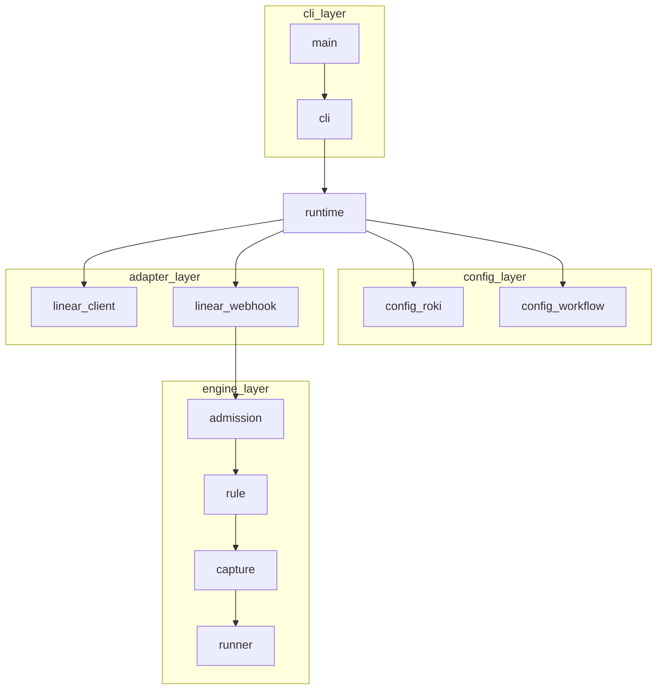
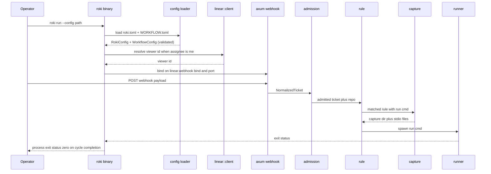

---
refs:
  id: design:roki-skeleton
  kind: design
  title: "roki-skeleton Design"
  spec: roki-skeleton
  implements:
    - req:roki-skeleton#1
    - req:roki-skeleton#2
    - req:roki-skeleton#3
    - req:roki-skeleton#4
    - req:roki-skeleton#5
    - req:roki-skeleton#6
    - req:roki-skeleton#7
    - req:roki-skeleton#8
    - req:roki-skeleton#9
  depends_on:
    - req:roki-skeleton
    - ref:cli
    - ref:config
  related:
    - research:roki-skeleton
    - fr:01-engine-model
    - fr:02-configuration
    - fr:03-linear-admission
    - fr:04-phase-execution
    - fr:12-daemon-lifecycle
  modules:
    - crates/roki-daemon/
    - crates/roki-daemon/tests/e2e/skeleton_smoke.rs
---

# Design Document

## Overview

`roki-skeleton` materializes the empty post-pivot daemon tree as a single Rust binary crate that boots, accepts one Linear webhook, runs the canonical-but-minimal admission-then-rule pipeline, executes one inline `run.cmd` subprocess, captures its stdio, and exits. It is the smallest backbone every later wave plugs into and is pinned by `tests/e2e/skeleton_smoke.rs`.

**Purpose**: Stand up the walking-skeleton daemon and its end-to-end smoke test so later specs (engine, runtime, linear adapter, config breadth, observability, CLI, HTTP, TUI) have a fixed integration target.

**Users**: roki maintainers (smoke gate), and every downstream spec author who must keep the smoke green while extending the skeleton.

**Impact**: Re-introduces the `crates/roki-daemon` workspace member (currently stale in `Cargo.toml`), publishes the canonical `roki run` CLI surface, and establishes the module seams (`config`, `linear`, `admission`, `rule`, `runner`, `capture`, `runtime`) that later waves widen rather than rewrite.

### Goals

- One binary, one cycle, end-to-end: `roki run --config <path>` → webhook → admission → first-match rule → `run.cmd` → captured stdio → clean exit.
- Module boundaries that match the FR module paths (`fr:02`, `fr:12`) so later specs widen each module instead of restructuring the tree.
- A pinned `tests/e2e/skeleton_smoke.rs` integration test that drives the binary end-to-end from a stubbed Linear surface.

### Non-Goals

- Anything in `requirements.md` Boundary Context > Out of scope: HMAC verification, full `when.*` vocabulary, `[[cleanup]]` / `[[on_failure]]` evaluation, iteration loop, session-shape phases, `pre` / `post` phases, `path` / `prompt` phase forms, Liquid rendering, worktree creation, canonical capture-file layout, diff cache, polling fallback, refresh nudge, 429 backoff, hot reload, observability HTTP API (`[api]`), tracing pipeline, ring buffer, TUI, and any CLI subcommand other than `roki run`.
- Any structured-event catalog beyond what is needed for a startup error and a parse error. The skeleton emits errors via `tracing::error!` at the default subscriber; the canonical event names land with `roki-obs-event-catalog`.

## Boundary Commitments

### This Spec Owns

- The single `roki` binary and the `roki run --config <path>` CLI surface (Req 1.1–1.3).
- The minimal `roki.toml` loader covering only `[linear]`, `[linear.webhook]`, `[default.ai.command]`, `[engine]`, `[paths]`, `[log]` (Req 2.1, 2.4).
- The minimal `WORKFLOW.toml` loader covering only `[admission]`, the first `[[admission.repos]]` entry, and `[[rule]]` (Req 2.2, 2.5).
- Schema validation that rejects any `[[rule]]` `when.*` other than `when.status` / `when.labels.has_all` and any phase block other than `run.cmd` (Req 5.3, 6.2).
- HTTP webhook listener on `[linear.webhook].bind` / `.port` and the JSON body parser that produces the internal `NormalizedTicket` (Req 3.1, 3.2, 3.4).
- The `me` resolver that issues one Linear `viewer { id }` GraphQL request after config load (Req 4.2).
- The global `tracing-subscriber` installation point in `main` (default fmt formatter, stdout, `INFO` max level) so every requirement-mandated log surfaces from the very first instruction (Req 1.2, 2.3, 3.4, 4.4, 5.4, 7.3).
- The single-shot in-memory ticket model scoped to one cycle.
- The admission filter (assignee + first `[[admission.repos]]` only, no `when.*` evaluation) (Req 4.1, 4.3, 4.4).
- The first-match rule evaluator restricted to `when.status` equality + `when.labels.has_all` set containment (Req 5.1, 5.2).
- The single command-form phase runner (`run.cmd` subprocess, no Liquid rendering, no `pre` / `post`) (Req 6.1, 6.3, 6.4, 6.5).
- The per-cycle capture directory under `[paths].session_root` and the stdout/stderr file sinks (Req 7.1–7.3).
- The single-cycle terminate-on-first-cycle exit semantics (Req 8.1–8.4).
- `crates/roki-daemon/tests/e2e/skeleton_smoke.rs` as the acceptance gate every later wave must keep green (Req 9.1–9.3).
- The reintroduced `crates/roki-daemon` workspace member that satisfies `fr:02` / `fr:12` `modules:` paths.

### Out of Boundary

- Everything listed in `requirements.md` Boundary Context > Out of scope.
- Per-iter capture-file layout (`<session_root>/<ticket-id>/cycle-<uuid>/iter-<n>/{phase}.{stdout,stderr}` per [`fr:04`](../../docs/fr/04-phase-execution.md)) — owned by `roki-runtime-capture-layout`.
- Working-directory resolution by worktree / ghq base ([`fr:04 §Working directory`](../../docs/fr/04-phase-execution.md)) — skeleton inherits the daemon process cwd; canonical rule lands with `roki-runtime-worktree-lazy`.
- `wt` / `ghq` PATH check ([`fr:12 §Missing dependency CLI`](../../docs/fr/12-daemon-lifecycle.md)) — skeleton skips the check (no worktree / ghq usage).
- Webhook receiver authentication. Skeleton accepts every well-formed POST. HMAC enforcement lands with `roki-linear-signature-verify`.
- Structured event catalog and tracing destination (`[log].destination` / `[log].file_path`). Skeleton uses `tracing` with the default `tracing-subscriber` to stdout for error visibility only; the canonical pipeline lands with `roki-obs-tracing-pipeline`.

### Allowed Dependencies

- Workspace lints: `unsafe_code = forbid`, clippy `all = warn` (`Cargo.toml`).
- The reintroduced `crates/roki-daemon` member.
- New external crates: `tokio`, `axum`, `clap`, `serde`, `toml`, `reqwest` (rustls + JSON features), `uuid`, `tracing`, `tracing-subscriber`, `anyhow`, `thiserror`, `async-trait` (only if needed). Versions pinned by `cargo add` at task time; minor-version updates are not part of this spec.
- Canonical references: `ref:cli`, `ref:config`, `fr:01..05`, `fr:12`. Behavior the skeleton defers must remain consistent with these documents (no contradictions, only narrowings).

### Revalidation Triggers

- Any change to the `roki run --config` CLI shape, the six `roki.toml` sections, or the three `WORKFLOW.toml` sections this spec reads.
- Any change to the `NormalizedTicket` field set the admission and rule modules consume.
- Any change to the per-cycle capture directory contract or to the skeleton's process exit contract.
- Adding any structured event before `roki-obs-event-catalog` lands.
- Any change to the workspace member layout for `crates/roki-daemon`.
- Any change to the smoke-test wire shape (binary subprocess + loopback HTTP POST). In-process drive of the engine is forbidden by Req 9.3.

## Architecture

### Existing Architecture Analysis

- The workspace declares `crates/roki-daemon` and `crates/roki-doctools` but only `roki-doctools` exists; the missing daemon crate makes `cargo metadata` fail. `fr:02` and `fr:12` already declare module paths inside `crates/roki-daemon/...`, producing four pre-existing dangling-module entries surfaced by `roki-doctools validate`. This spec reintroduces the crate so those module references resolve.
- Workspace lints (`unsafe_code = forbid`, clippy `all = warn`) are inherited automatically. Edition 2024, MSRV 1.85.
- `roki-doctools` is unrelated to the daemon runtime and shares no code; the skeleton has no daemon code to extend.

### Architecture Pattern & Boundary Map

Pattern: linear pipeline inside one async runtime. The cycle is single-shot, so a thin sequential orchestrator (`runtime::run`) replaces actors / event buses that later waves can introduce when concurrency surfaces.



**Architecture Integration**:

- Selected pattern: thin pipeline orchestrator. Justification: Req 8 mandates single-cycle exit, so concurrency complexity has no concrete pull. Later waves (engine iteration loop, queue preemption) introduce the actor / scheduler surface when they need it.
- Domain boundaries: `cli` parses argv only; `config` owns file-shape validation; `linear` owns Linear-side I/O (HTTP listener + GraphQL client + payload normalization); `admission` / `rule` are pure functions over `NormalizedTicket` + loaded `WorkflowConfig`; `runner` + `capture` own subprocess and filesystem; `runtime` wires them in order.
- Existing patterns preserved: workspace lint inheritance; `clap` + `serde` style already in `roki-doctools`.
- New components rationale: each module corresponds to a requirement cluster. No module exists "just in case"; later waves will widen modules in place.
- Steering compliance: `grounded-design.md` Principle 1 (canonical CLI / config keys), Principle 4 (minimal state — single-shot pipeline, no actors).

### Dependency Direction

Modules import only from modules to their left:

`error → config::{roki, workflow} → linear::ticket → linear::{client, webhook} → admission → rule → capture → runner → runtime → cli → main`

Violations (e.g. `runner` importing from `cli`) are rejected at review.

### Technology Stack

| Layer | Choice / Version | Role in Feature | Notes |
|-------|------------------|-----------------|-------|
| CLI | `clap` 4 (derive) | `roki run --config <path>` | Same crate already used by `roki-doctools`. |
| Async runtime | `tokio` (full features) | Webhook listener + subprocess wait + GraphQL request | First tokio surface in the workspace. |
| HTTP server | `axum` | Webhook receiver bound to `[linear.webhook].bind/port` | Roadmap calls out axum for the future `/api/v1/`; skeleton aligns ahead of `roki-http-server`. |
| HTTP client | `reqwest` (rustls-tls, json) | One-shot Linear `viewer { id }` GraphQL POST | Pure JSON body; no SDK needed. |
| Config parsing | `serde` + `toml` | `roki.toml` + `WORKFLOW.toml` deserialization | Hand-rolled validators sit on top. |
| Subprocess | `tokio::process::Command` | Spawn `run.cmd` and pipe stdio to capture files | Built-in. |
| Filesystem | `std::fs` + `tokio::fs` (only where async-needed) | Per-cycle capture directory | Sync `std::fs::create_dir_all` is acceptable at startup paths. |
| Logging | `tracing` + `tracing-subscriber` (default fmt to stdout) | Startup errors, parse errors | Canonical pipeline deferred to `roki-obs-tracing-pipeline`; skeleton uses defaults. |
| Identifiers | `uuid` v4 | Per-cycle directory naming | Random UUID is sufficient for the smoke. |
| Errors | `thiserror` (typed) + `anyhow` (top-level) | Typed module errors, `main` returns `anyhow::Result` | Typed errors cross module boundaries; `anyhow` only at the binary edge. |

Rationale beyond the table — alternative crate choices and why they were not selected — stays in `research.md`.

## File Structure Plan

### Directory Structure

```
crates/roki-daemon/
  Cargo.toml                # new crate manifest; declares optional `test-support` feature
  src/
    main.rs                 # binary entry; installs tracing subscriber; calls cli::run
    cli.rs                  # clap parser; dispatches `run` subcommand
    error.rs                # SkeletonError + module error types
    runtime.rs              # pipeline orchestrator (load -> bind -> await one webhook -> admit -> match -> run -> exit)
    config/
      mod.rs                # re-exports
      roki.rs               # RokiConfig + roki.toml loader + validator
      workflow.rs           # WorkflowConfig + WORKFLOW.toml loader + when.* and run.* validator
    linear/
      mod.rs                # re-exports
      ticket.rs             # NormalizedTicket value object
      client.rs             # reqwest GraphQL client; resolves viewer { id }
      webhook.rs            # axum router; parses payload; emits NormalizedTicket via channel
    admission.rs            # assignee + first-repo filter (pure)
    rule.rs                 # first-match status + has_all (pure)
    capture.rs              # per-cycle dir creation + stdio file handles
    runner.rs               # tokio::process::Command spawn + wait + exit-status forwarding
  tests/
    e2e/
      skeleton_smoke.rs     # binary-as-subprocess + loopback POST + stdout/stderr capture assertions
```

Module pattern: each `*.rs` file has one clear responsibility from the dependency-direction list above. The `config/` and `linear/` directories group two cohesive files each because they share a domain (config files; Linear adapter); the rest are flat.

### Modified Files

- `Cargo.toml` (workspace root): no member-list change is needed — `crates/roki-daemon` is already declared. The crate manifest at `crates/roki-daemon/Cargo.toml` is created fresh by this spec.

> The File Structure Plan reflects the boundary above: every owned capability has exactly one file, every Out-of-Boundary item has no file. The pattern drives the `_Boundary:_` annotations in `tasks.md`.

## System Flows

### End-to-end skeleton flow



Notes after the diagram:

- The arrow from `Hook` to `Adm` carries the `NormalizedTicket`; admission rejects (info log) when the assignee gate or the first-repo presence check fails (Req 4.5). The webhook channel re-arms; the listener stays open for the next POST (Req 8.2).
- A non-matching `[[rule]]` first-match (Req 5.4) emits an info no-match outcome via `tracing`; the channel re-arms and the listener stays open.
- The runtime stops accepting further webhooks the moment the first admitted-and-matched ticket starts a cycle (Req 8.4); the cell is set to `None` permanently and subsequent POSTs reply 503.

## Requirements Traceability

| Requirement | Summary | Components | Interfaces | Flows |
|-------------|---------|------------|------------|-------|
| 1.1 | `roki run --config <path>` starts the daemon | `cli`, `runtime` | `Cli::run` | end-to-end |
| 1.2 | Missing or unreadable `--config` path → non-zero exit + error log | `cli`, `config::roki` | `RokiConfig::load` | startup |
| 1.3 | `--help` surfaces `--config` flag | `cli` | clap-derived help | startup |
| 2.1 | Read six canonical `roki.toml` sections | `config::roki` | `RokiConfig` | startup |
| 2.2 | Resolve `[paths].workflow` and load `WORKFLOW.toml` minimally | `config::roki`, `config::workflow` | `WorkflowConfig::load` | startup |
| 2.3 | Required-field / type validation → non-zero exit + offending field | `config::roki`, `config::workflow` | `ConfigError` variants | startup |
| 2.4 | Accept (without applying) `[default.ai.session]`, `[linear.webhook].secret`, and any non-listed key | `config::roki` | `RokiConfig` permissive struct | startup |
| 2.5 | Accept (without evaluating) `[[cleanup]]`, `[[on_failure]]`, per-repo `[[admission.repos]] workflow` overrides | `config::workflow` | `WorkflowConfig` permissive struct | startup |
| 3.1 | Bind axum on `[linear.webhook].bind` / `.port` | `linear::webhook`, `runtime` | `axum::Router` | startup |
| 3.2 | Parse JSON body → `NormalizedTicket` → forward to admission | `linear::webhook`, `linear::ticket`, `admission` | `NormalizedTicket` | end-to-end |
| 3.3 | No HMAC verification | `linear::webhook` | (absence of) | end-to-end |
| 3.4 | Bad payload → 4xx + parse error log | `linear::webhook` | error response | end-to-end |
| 4.1 | Assignee gate against `[admission].assignee` | `admission` | `Admission::accept` | end-to-end |
| 4.2 | `me` resolves via Linear `viewer { id }` | `linear::client`, `runtime` | `LinearClient::resolve_viewer` | startup |
| 4.3 | First `[[admission.repos]]` entry, no `when.*` | `admission`, `config::workflow` | `WorkflowConfig::first_repo` | end-to-end |
| 4.4 | No `[[admission.repos]]` → reject + admission error log | `admission`, `config::workflow` | `AdmissionError::NoRepos` | end-to-end |
| 4.5 | Reject → no cycle | `runtime`, `admission` | pipeline short-circuit | end-to-end |
| 5.1 | First-match `when.status` equality + `when.labels.has_all` containment | `rule` | `Rule::first_match` | end-to-end |
| 5.2 | `when.status` equality, `when.labels.has_all` set containment | `rule`, `config::workflow` | `WhenClause` typed enum | end-to-end |
| 5.3 | Any other `when.*` key → validation error at load | `config::workflow` | `WorkflowError::UnsupportedWhen` | startup |
| 5.4 | No match → no cycle + no-match outcome log | `rule`, `runtime` | pipeline short-circuit | end-to-end |
| 5.5 | Skip `[[cleanup]]` and `[[on_failure]]` evaluation | `rule` | scope-only | end-to-end |
| 6.1 | Spawn matched `run.cmd` as one-shot subprocess | `runner` | `Runner::spawn` | end-to-end |
| 6.2 | `run.path` / `run.prompt` / missing `run` → validation error | `config::workflow` | `WorkflowError::UnsupportedRunForm` | startup |
| 6.3 | Skip `pre` / `post` | `runner` | scope-only | end-to-end |
| 6.4 | No Liquid rendering of `run.cmd` | `runner` | scope-only | end-to-end |
| 6.5 | Record exit status | `runner`, `runtime` | `RunOutcome` | end-to-end |
| 7.1 | Per-cycle capture dir under `[paths].session_root` | `capture` | `CaptureLayout::create` | end-to-end |
| 7.2 | Write stdout / stderr to capture files while running | `capture`, `runner` | `tokio::process::Command::stdout/stderr` piped to `File` | end-to-end |
| 7.3 | Capture-dir / file errors → cycle fails + capture error log | `capture` | `CaptureError` | end-to-end |
| 8.1 | Subprocess exit → finalize files + terminate | `runtime`, `capture` | drop / flush | end-to-end |
| 8.2 | Cycle ok → exit zero regardless of subprocess code | `runtime` | `ExitCode::SUCCESS` | end-to-end |
| 8.3 | Internal daemon error → non-zero exit | `runtime`, `cli` | `anyhow::Result` propagation | end-to-end |
| 8.4 | Reject further webhooks after first cycle exit | `linear::webhook`, `runtime` | shutdown signal | end-to-end |
| 9.1 | Smoke test exists | `tests/e2e/skeleton_smoke.rs` | binary-subprocess harness | smoke |
| 9.2 | Smoke passes against skeleton | `tests/e2e/skeleton_smoke.rs` | `cargo test` | smoke |
| 9.3 | Smoke continues to pass under later specs | (carrier — every spec) | regression contract | smoke |

## Components and Interfaces

| Component | Domain/Layer | Intent | Req Coverage | Key Dependencies (P0/P1) | Contracts |
|-----------|--------------|--------|--------------|--------------------------|-----------|
| `cli` | CLI | Parse argv; dispatch `run` | 1.1, 1.2, 1.3 | `clap` (P0) | Service |
| `config::roki` | Config | Load and validate `roki.toml` | 2.1, 2.3, 2.4 | `serde` + `toml` (P0) | Service, State |
| `config::workflow` | Config | Load and validate `WORKFLOW.toml`; reject unsupported `when.*` and `run.*` | 2.2, 2.3, 2.5, 5.3, 6.2 | `serde` + `toml` (P0) | Service, State |
| `linear::ticket` | Adapter types | `NormalizedTicket` value object | 3.2, 4.1, 5.1 | (none) | State |
| `linear::client` | Adapter | Resolve `viewer { id }` | 4.2 | `reqwest` (P0), Linear API (P0) | API |
| `linear::webhook` | Adapter | Bind axum, parse one JSON body, forward; reject after first cycle | 3.1, 3.2, 3.3, 3.4, 8.4 | `axum` (P0), `tokio` (P0) | API, Event |
| `admission` | Engine | Assignee + first-repo gate | 4.1, 4.3, 4.4, 4.5 | `config::workflow`, `linear::ticket` (P0) | Service |
| `rule` | Engine | First-match `when.status` + `when.labels.has_all` | 5.1, 5.2, 5.4, 5.5 | `config::workflow`, `linear::ticket` (P0) | Service |
| `capture` | Engine | Per-cycle dir + stdio sinks | 7.1, 7.2, 7.3 | `std::fs`, `uuid` (P0) | State |
| `runner` | Engine | Spawn subprocess; await exit | 6.1, 6.3, 6.4, 6.5 | `tokio::process` (P0) | Service |
| `runtime` | Orchestrator | Wire components in order; own shutdown | 1.1, 3.1, 8.1, 8.2, 8.3, 8.4 | every other module (P0) | Service |
| `error` | Cross-cutting | Typed error variants + display | 1.2, 2.3, 3.4, 4.4, 5.3, 6.2, 7.3, 8.3 | `thiserror` (P0) | (none) |

Detailed blocks below cover only modules that introduce new boundaries (external surface, filesystem, subprocess, HTTP).

### CLI

#### `cli`

| Field | Detail |
|-------|--------|
| Intent | Parse `roki run --config <path>` and surface `--help`. |
| Requirements | 1.1, 1.2, 1.3 |

**Responsibilities & Constraints**

- Top-level `roki` command with one subcommand (`run`) and one flag (`--config <path>`).
- Returns a typed `CliCommand` enum to `main`, never directly invokes runtime; `runtime::run` is the only entry point that touches IO beyond argv.
- `--help` output names `--config` together with the canonical config file it identifies (`roki.toml`).

**Dependencies**

- Inbound: `main` (P0)
- Outbound: `runtime::run` (P0)
- External: `clap` 4 (P0)

**Contracts**: Service [x]

##### Service Interface

```rust
pub async fn run() -> anyhow::Result<std::process::ExitCode>;
```

- Preconditions: process argv parseable; called from `#[tokio::main]` in `main.rs`.
- Postconditions: returns `ExitCode::SUCCESS` only when the runtime terminates without an internal daemon error (Req 8.2 / 8.3).
- Invariants: the binary never long-runs after a successful cycle (Req 8.1).

### Config

#### `config::roki`

| Field | Detail |
|-------|--------|
| Intent | Deserialize and validate the six canonical `roki.toml` sections the skeleton needs. |
| Requirements | 2.1, 2.3, 2.4 |

**Responsibilities & Constraints**

- Reads `[linear]`, `[linear.webhook]`, `[default.ai.command]`, `[engine]`, `[paths]`, `[log]` per [`ref:config`](../../docs/reference/config.md).
- Required-field set the skeleton **enforces**: `[linear].token`, `[linear.webhook].bind`, `[linear.webhook].port`, `[default.ai.command].cli`, `[paths].workflow`, `[paths].session_root`. (`[linear.webhook].secret`, `[default.ai.session].cli` are accepted-without-applying per Req 2.4.)
- Type validation matches the canonical schema (string / int / bind addr / port / path).
- Unknown keys (within the read sections or outside them) are tolerated to honor Req 2.4.

**Dependencies**

- Inbound: `runtime` (P0)
- Outbound: filesystem (P0), `serde` + `toml` (P0)
- External: none.

**Contracts**: Service [x] State [x]

##### Service Interface

```rust
pub struct RokiConfig {
    pub linear: LinearSection,
    pub linear_webhook: LinearWebhookSection,
    pub default_ai_command: DefaultAiCommandSection,
    pub engine: EngineSection,
    pub paths: PathsSection,
    pub log: LogSection,
}

impl RokiConfig {
    pub fn load(path: &std::path::Path) -> Result<Self, RokiConfigError>;
}
```

- Preconditions: `path` is the value of `--config`; existence and readability are enforced by `load`.
- Postconditions: returned `RokiConfig` carries every required field; un-applied fields like `secret` are stored verbatim but not surfaced beyond this module.
- Invariants: deserialization failure carries the offending key path string for the structured error log (Req 2.3).

#### `config::workflow`

| Field | Detail |
|-------|--------|
| Intent | Deserialize and validate the minimal `WORKFLOW.toml` slice; reject unsupported `when.*` and `run.*`. |
| Requirements | 2.2, 2.3, 2.5, 5.3, 6.2 |

**Responsibilities & Constraints**

- Reads `[admission]` (assignee), the **first** `[[admission.repos]]` entry (`ghq` only — `when.*` and `workflow` are ignored) when present, and the `[[rule]]` array. An empty or missing `[[admission.repos]]` array does **not** fail loading; `WorkflowConfig::repo` becomes `None` and the per-ticket `AdmissionError::NoRepos` surfaces at admission time per Req 4.4.
- Each `[[rule]]` entry: `when.status` (required string), `when.labels.has_all` (required `Vec<String>`, may be empty), `run.cmd` (required string). Any other `when.*` (`when.assignee`, `when.repo`, `when.labels.has_any`, regex / starts_with / contains / not / in, etc.) → `WorkflowError::UnsupportedWhen` at load.
- Rejects `run.path`, `run.prompt`, or a missing `run` (Req 6.2). Rejects `pre.*` and `post.*` blocks present on a `[[rule]]` entry (skeleton owns only `run`).
- Accepts presence of `[[cleanup]]`, `[[on_failure]]`, and per-repo `[[admission.repos]] workflow` overrides without evaluating them (Req 2.5). The validator stores opaque values for these.

**Dependencies**

- Inbound: `runtime`, `admission`, `rule` (P0)
- Outbound: filesystem (P0), `serde` + `toml` (P0)

**Contracts**: Service [x] State [x]

##### Service Interface

```rust
pub struct WorkflowConfig {
    pub admission: AdmissionSection,        // { assignee: String }
    pub repo: Option<AdmissionRepo>,        // first [[admission.repos]] only; None when the array is empty/missing (admission emits NoRepos per Req 4.4); { ghq: String }
    pub rules: Vec<Rule>,                   // typed; only when.status + when.labels.has_all + run.cmd
}

pub struct Rule {
    pub when_status: String,
    pub when_labels_has_all: Vec<String>,
    pub run_cmd: String,
}

impl WorkflowConfig {
    pub fn load(path: &std::path::Path) -> Result<Self, WorkflowError>;
}
```

- Preconditions: `path` resolved from `RokiConfig::paths::workflow`.
- Postconditions: `repo` is `Some(first_entry)` when `[[admission.repos]]` is non-empty, else `None` (admission surfaces `NoRepos` per Req 4.4); `rules` order matches file order (first-match contract).
- Invariants: any unsupported `when.*` or `run.*` form fails the load with a key-path-bearing error before the binary binds the listener.

### Linear adapter

#### `linear::ticket`

| Field | Detail |
|-------|--------|
| Intent | Internal value object handed to admission and rule evaluation. |
| Requirements | 3.2, 4.1, 5.1 |

**Responsibilities & Constraints**

- The minimum field set every other module needs: `id: String`, `assignee_id: Option<String>`, `status: String`, `labels: Vec<String>`. Title / body / repo are not consulted by the skeleton (no admission.repos `when.*`, no rule.title regex).
- Constructed only by `linear::webhook::normalize`; consumed by `admission` and `rule`.

**Contracts**: State [x]

#### `linear::client`

| Field | Detail |
|-------|--------|
| Intent | Resolve `[admission].assignee = "me"` to a Linear user id by issuing one GraphQL request. |
| Requirements | 4.2 |

**Responsibilities & Constraints**

- Issues `POST https://api.linear.app/graphql` with body `{"query":"query { viewer { id } }"}`, header `Authorization: <[linear].token>` (Linear accepts the personal API token verbatim, no `Bearer` prefix). The token is applied verbatim per the value loaded from `roki.toml`.
- One-shot at startup; the resolved id is held in `runtime` for the cycle. No retry, no backoff (deferred to Wave 3).
- Failure (non-200, malformed body, missing `viewer.id`) → `LinearClientError::ViewerResolveFailed` → daemon refuses startup.
- **Endpoint override (test-only seam)**: the GraphQL URL constant is overridable via the env var `ROKI_LINEAR_GRAPHQL_URL` exclusively for the smoke harness. The override is **gated behind `#[cfg(any(test, feature = "test-support"))]`** on `linear::client::resolve_viewer`; the release binary (built without `--features test-support`) never reads the env var and always POSTs to the hardcoded `https://api.linear.app/graphql`. The seam is **not** part of the canonical `roki.toml` schema (no `ref:config` entry). The smoke harness lives at `crates/roki-daemon/tests/e2e/skeleton_smoke.rs` (crate-internal integration test) so `env!("CARGO_BIN_EXE_roki")` resolves and `cargo test -p roki-daemon --features test-support` activates the override on the binary build. The `test-support` feature is declared in `crates/roki-daemon/Cargo.toml` `[features]` and gates only the env-var read inside `linear::client`. A CLI-flag alternative (`--linear-graphql-url`) was rejected because it surfaces in `ps` and `--help`, contradicting Req 1.3's canonical-flag enumeration.

**Dependencies**

- External: Linear GraphQL API (P0), `reqwest` (P0).

**Contracts**: API [x]

##### API Contract

| Method | Endpoint | Request | Response | Errors |
|--------|----------|---------|----------|--------|
| POST | `https://api.linear.app/graphql` | `{ "query": "{ viewer { id } }" }` + `Authorization` header | `{ "data": { "viewer": { "id": "<uuid>" } } }` | non-200, malformed, missing field |

#### `linear::webhook`

| Field | Detail |
|-------|--------|
| Intent | Bind axum on `[linear.webhook].bind/port`, accept one POST, normalize, forward. |
| Requirements | 3.1, 3.2, 3.3, 3.4, 8.4 |

**Responsibilities & Constraints**

- Single route `POST /` (path agnostic — Linear is configured by the operator's webhook URL; the skeleton accepts any path).
- Body parse extracts `id`, `assignee.id`, `state.name`, `labels.nodes[].name` from the Linear webhook envelope. Missing fields → 400 + parse error log.
- Handler holds `Arc<tokio::sync::mpsc::Sender<NormalizedTicket>>` (channel capacity 1) and `Arc<AtomicBool> cycle_started` (init `false`), both shared with `runtime`. Per accepted POST: parse body → load `cycle_started` (`Acquire`); if `true` → 503; else `sender.try_send(ticket)` → `Ok(())` = 202, `TrySendError::Full(_)` = 503 (transient pre-cycle backpressure; runtime is mid-iteration), `TrySendError::Closed(_)` = 503 (runtime dropped the receiver after terminal cycle).
- `runtime` owns the matching `Receiver` and the write side of `cycle_started`. Per iteration: `receiver.recv().await` → admission → on reject (Req 4.5) info log + `continue` (channel buffer drains naturally; no swap needed); → rule first-match → on no-match (Req 5.4) info log + `continue`; on match: `cycle_started.store(true, Release)` → drop receiver → break into cycle.
- `cycle_started` is set to `true` exactly once in process lifetime: when a cycle starts (Req 8.4) or when an internal cycle error occurs (Req 8.3). Both cases are terminal; the listener stays bound only long enough for `axum::serve` graceful shutdown to drain the in-flight handler.
- The mpsc + atomic pair carries the entire cross-task state — no shared mutex, no swap, no placeholder window. The handler's `Acquire` load happens-before the runtime's `Release` store of `true`, so once the runtime publishes the terminal flag, every subsequent handler observes it (or sees `Closed` if the receiver was already dropped). Pre-cycle handlers that race a runtime-mid-iteration window get `TrySendError::Full` → 503; this is acceptable because Req 8.4 only forbids post-cycle acceptance, and the smoke harness sends one POST so the window is unobservable in the acceptance gate.
- No HMAC verification (Req 3.3) even when `[linear.webhook].secret` is configured.

**Dependencies**

- External: `axum` (P0), `tokio` (P0).

**Contracts**: API [x] Event [x]

##### API Contract

| Method | Endpoint | Request | Response | Errors |
|--------|----------|---------|----------|--------|
| POST | `/*` | Linear webhook JSON | 202 (accepted) / 400 (parse) / 503 (post-cycle) | 400, 503 |

##### Event Contract

- Published events: one `NormalizedTicket` per accepted webhook, sent via `tokio::sync::mpsc::Sender<NormalizedTicket>` (channel capacity 1) paired with `Arc<AtomicBool> cycle_started`. Handler reads the flag (`Acquire`) before `try_send`; replies 503 when the flag is `true` or when `try_send` returns `Full` / `Closed`.
- Subscribed events: none.
- Ordering / delivery guarantees: exactly one cycle per process. Pre-cycle webhooks may be rejected by admission (Req 4.5) or rule no-match (Req 5.4); the channel buffer drains on `recv` so the next POST has capacity. `cycle_started` is set to `true` (`Release`) exactly once — when a cycle starts (Req 8.4) or an internal cycle error occurs (Req 8.3) — and the runtime drops the receiver immediately after; every subsequent POST observes the atomic as `true` (or sees the channel as `Closed`) and gets 503. There is no swap or placeholder state, so no race window exists between handler and runtime.

**Implementation Notes**

- Integration: the listener task is spawned by `runtime::run` after configuration is loaded and the `me` id is resolved.
- Validation: only well-formed JSON with the fields the skeleton needs is admitted. The 400 response carries an `error_id` log key; the body is `{"error":"invalid_payload"}`.
- Risks: a malformed but voluminous payload could fill the request body buffer; axum's default 2 MiB limit is sufficient for Linear webhook payloads. Skeleton does not raise the cap.

### Engine

#### `admission`, `rule`, `capture`, `runner`

These four modules are pure or near-pure functions; full block detail beyond the summary table is deferred to the per-task specs in `tasks.md`. Key contracts:

- `Admission::accept(&NormalizedTicket, &WorkflowConfig, &MeId) -> Result<AdmittedTicket, AdmissionError>` — pure.
- `Rule::first_match(&AdmittedTicket, &[Rule]) -> Option<&Rule>` — pure.
- `Capture::create(session_root: &Path, ticket_id: &str) -> Result<CaptureLayout, CaptureError>` — sync filesystem.
- `Runner::spawn(cmd: &str, layout: &CaptureLayout) -> Result<RunOutcome, RunnerError>` — async; `tokio::process::Command::new("sh").arg("-c").arg(cmd)` + `Stdio::from(File)` redirect.

Skeleton intentionally uses `sh -c` for command-form subprocess invocation: `run.cmd` is a complete cli string by canonical contract ([`ref:config` `cmd = "<inline string>"`](../../docs/reference/config.md)). Liquid rendering is forbidden by Req 6.4, so the daemon does not split the command line itself. This matches the canonical "operator-authored full cli line" intent ([`fr:04 §Subprocess shapes`](../../docs/fr/04-phase-execution.md)).

### Runtime

#### `runtime`

| Field | Detail |
|-------|--------|
| Intent | Wire the modules above in order; own the shutdown signal that prevents a second cycle. |
| Requirements | 1.1, 3.1, 4.5, 5.4, 8.1, 8.2, 8.3, 8.4 |

**Responsibilities & Constraints**

- Pipeline: parse cli → load `RokiConfig` → load `WorkflowConfig` → resolve `me` if needed → create `mpsc::channel::<NormalizedTicket>(1)` + `Arc<AtomicBool>` `cycle_started` (init `false`) → bind webhook listener (handler holds `Sender` clone + atomic clone) → loop { `receiver.recv().await` → run admission → if reject: info log + `continue` (channel buffer drains naturally); → run rule first-match → if no-match: info log + `continue`; on match: `cycle_started.store(true, Release)` → drop receiver → create capture layout → spawn `run.cmd` → await exit → flush capture files → break } → graceful axum shutdown → return `ExitCode::SUCCESS`.
- A failure at any **cycle-bound** pipeline step (capture, runner) short-circuits to `Err(SkeletonError)`; `cli::run` returns `ExitCode::FAILURE` (Req 8.3). Admission rejection and rule no-match are not failures — they re-arm and continue.
- Startup-bound failures (`RokiConfig`, `WorkflowConfig`, `me` resolve, bind) abort before the listener accepts traffic, returning `ExitCode::FAILURE`.
- The runtime owns the tokio runtime via `#[tokio::main]` in `main.rs` (single multi-thread runtime; the listener and the runner share it).

**Contracts**: Service [x] State [x]

##### State Management

- Single in-memory state: `Option<MeId>` plus `tokio::sync::mpsc::Sender<NormalizedTicket>` shared with the handler (runtime owns the matching `Receiver`) plus `Arc<AtomicBool> cycle_started` shared with the handler (runtime owns the write side). Channel capacity 1. Runtime sets `cycle_started = true` (`Release`) exactly once when a cycle starts (Req 8.4) or an internal cycle error occurs (Req 8.3) and drops the receiver immediately after. The atomic carries the terminal-state signal; the channel `recv` carries pre-cycle backpressure naturally.
- Persistence: none. Single-cycle exit is the persistence model (Req 8.1, 8.4).
- Concurrency: the listener task runs concurrently with the runtime loop. Each iteration `recv`s one ticket, processes it, and either continues (admission reject / no-match — channel buffer drains, next POST has capacity) or stores the atomic, drops the receiver, and breaks into the cycle. No mutex, no swap, no placeholder window. A pre-cycle POST that races a runtime-mid-iteration window observes `TrySendError::Full` → 503; this is acceptable because Req 8.4 only forbids post-cycle acceptance. After cycle exit, runtime sends the graceful-shutdown signal and joins the listener task.

**Implementation Notes**

- Integration: `main.rs` is the only file with `#[tokio::main]`; every other module exposes plain functions. The very first action inside `main` (before clap parses argv) is `tracing_subscriber::fmt().with_max_level(tracing::Level::INFO).try_init()`, so all subsequent error / warn / info events from clap, config load, bind, admission, rule, capture, and runner reach stdout. The canonical structured pipeline lands with `roki-obs-tracing-pipeline` and will replace this default subscriber.
- Validation: pipeline order matches the requirement-traceability table; deviations require updating both the table and the runtime body.
- Risks: shutdown ordering — axum graceful shutdown must wait for the in-flight POST handler to return before the binary exits, so the 4xx / 5xx response actually reaches the smoke harness. Implementation uses `axum::serve(...).with_graceful_shutdown(...)` with a `notify_one` sent after capture flush.

## Data Models

### Domain Model

The skeleton has only one transactional unit — a single cycle for a single ticket. Aggregates:

- `NormalizedTicket` (immutable, constructed from one webhook payload): `id`, `assignee_id`, `status`, `labels`.
- `AdmittedTicket` (`= NormalizedTicket + AdmissionRepoGhq`): the result of admission acceptance.
- `RunOutcome` (`= ExitStatus + CaptureDirPath`): the result of the run subprocess.

Invariants:

- `AdmittedTicket` exists only after `admission::accept` succeeds; `Rule::first_match` consumes it.
- `RunOutcome::exit_status` may be any value (Req 8.2 — daemon exits zero regardless).
- The `me` id is resolved at most once per process.

### Logical Data Model

Skeleton does not own a data store. Capture files are filesystem state owned by the operator, written once per cycle:

```
<session_root>/
  cycle-<uuid>/
    stdout
    stderr
```

Path layout is intentionally simpler than the canonical `<session_root>/<ticket-id>/cycle-<uuid>/iter-<n>/{phase}.{stdout,stderr}` layout that lands with `roki-runtime-capture-layout`. Out of Boundary callout above documents the deferral.

### Data Contracts & Integration

- API request payload (Linear viewer): documented in `linear::client` block.
- API request payload (Linear webhook): the skeleton extracts only the four fields named in `linear::ticket`. The full Linear webhook envelope shape is a moving target documented at `https://developers.linear.app/docs/graphql/webhooks`; the skeleton does not lock the envelope shape in its types — `serde_json::Value` is parsed and the four fields are read by path.
- No Liquid template variables are exposed to `run.cmd` (Req 6.4).

## Error Handling

### Error Strategy

- One typed enum per module (`thiserror`); one top-level `SkeletonError` aggregates them; `cli::run` returns `anyhow::Result<ExitCode>` and writes the error to `tracing::error!` with the offending key path / file / endpoint.
- Fail-fast at startup; any error before the listener is bound aborts before opening the port.
- After the listener is bound, errors fall into three classes:
  - **Pre-admit / parse errors** → HTTP 4xx + `tracing::warn!`; the listener stays open until an admitted webhook arrives or the operator SIGINTs.
  - **No-cycle outcomes** (admission rejection per Req 4.5, rule no-match per Req 5.4) → `tracing::info!` outcome event; the webhook channel re-arms and the listener stays open for the next POST. No process exit (Req 8.2 reads "no cycle ⇒ trivially completed without internal daemon error").
  - **Cycle errors** (capture, runner) → `tracing::error!` + non-zero exit (Req 7.3, 8.3).

### Error Categories and Responses

| Category | Surface | Behavior |
|----------|---------|----------|
| Bad CLI args | `cli` | clap-driven non-zero exit + usage to stderr |
| Missing / unreadable config | `config::roki` | non-zero exit + offending path |
| Schema validation (`roki.toml` or `WORKFLOW.toml`) | `config::*` | non-zero exit + offending key path |
| Unsupported `when.*` / `run.*` | `config::workflow` | non-zero exit + offending key path |
| Bind failure | `linear::webhook` | non-zero exit + bind addr |
| `viewer { id }` resolve failure | `linear::client` | non-zero exit + endpoint |
| Bad webhook payload | `linear::webhook` | HTTP 400 + warn log; listener stays open |
| Admission rejection | `admission` | info log; no exit; webhook channel re-arms (Req 4.5, 8.2) |
| Rule no-match | `rule` | info log; no exit; webhook channel re-arms (Req 5.4, 8.2) |
| Capture filesystem error | `capture` | error log + non-zero exit |
| Subprocess spawn / wait error | `runner` | error log + non-zero exit |

### Monitoring

- `tracing` with the default `tracing-subscriber` formatter to stdout, installed once at the top of `main` via `tracing_subscriber::fmt().with_max_level(tracing::Level::INFO).try_init()` (see `runtime` Implementation Notes). No custom event names. The full structured event catalog and destination logic are owned by `roki-obs-tracing-pipeline` / `roki-obs-event-catalog`.

## Testing Strategy

### Unit Tests

- `config::roki::load`: rejects missing `[linear].token` with key-path-bearing error; accepts unknown / `secret` keys silently (Req 2.3, 2.4).
- `config::workflow::load`: rejects `when.assignee = ...`, `run.path = ...`, missing `run`; accepts the canonical happy-path TOML (Req 5.3, 6.2).
- `admission::accept`: assignee mismatch → `Reject`; `me` resolved id matches → `Accept`; missing `[[admission.repos]]` → `NoRepos` (Req 4.1, 4.2, 4.4).
- `rule::first_match`: status equality + `has_all` containment hit → returns rule; status mismatch → `None`; `has_all` not contained → `None` (Req 5.1, 5.2, 5.4).
- `linear::webhook::normalize`: well-formed Linear envelope → `NormalizedTicket`; missing `state.name` → `ParseError` (Req 3.2, 3.4).

### Integration Tests

- `linear::client` against a `wiremock` mock returning `{"data":{"viewer":{"id":"u1"}}}`: success path; non-200; missing `viewer` (Req 4.2).
- `linear::webhook` axum router with `tower::ServiceExt::oneshot`: 400 on bad body; 202 on good body when the channel has capacity and `cycle_started == false`; 503 when `cycle_started == true` (Req 8.4) and 503 when the receiver is dropped (`TrySendError::Closed`); concurrent good-body POSTs against the same channel — one 202, the other 503 via `TrySendError::Full` (Event Contract concurrency clause).
- `runner::spawn` against `sh -c "echo hi; echo err >&2; exit 7"` with a temp `CaptureLayout`: stdout and stderr files contain the expected bytes; `RunOutcome::exit_status` is 7 (Req 6.5, 7.2).

### E2E / smoke

- `crates/roki-daemon/tests/e2e/skeleton_smoke.rs` (Req 9.1, 9.2, 9.3): crate-internal integration test that drives the binary end-to-end. Lives under the daemon crate's `tests/` so `env!("CARGO_BIN_EXE_roki")` is defined and `cargo test -p roki-daemon --features test-support` activates the `linear::client` env-var override.
  - Setup: a `tempfile::TempDir` workspace with a generated `roki.toml`. The harness picks a free port at test setup time via `std::net::TcpListener::bind("127.0.0.1:0").local_addr().port()`, then writes the resolved port into the generated `roki.toml`. The `WORKFLOW.toml` declares `[admission].assignee = "u1"`, one `[[admission.repos]]`, and one `[[rule]]` whose `run.cmd` is `sh -c 'printf out; printf err 1>&2; exit 0'` (no cwd dependency, satisfies the deferral noted in Out of Boundary).
  - A `wiremock` server stubs the Linear `viewer { id }` endpoint with `u1`; the harness sets `ROKI_LINEAR_GRAPHQL_URL` to the wiremock base URL before spawning the binary (test-only seam declared in `linear::client`).
  - The harness `Command::new(env!("CARGO_BIN_EXE_roki")).args(["run", "--config", path])` spawns the binary, then `reqwest::Client::post(format!("http://127.0.0.1:{port}/"))` posts a Linear-shaped JSON body.
  - Assertions: process exit code is zero (Req 8.2); the per-cycle `stdout` capture file contains `out`; the `stderr` file contains `err` (Req 7.2); the binary refuses a second POST (503) before exit (Req 8.4).

The smoke harness must use binary-as-subprocess + loopback HTTP POST per `requirements.md` Boundary Context > Adjacent expectations (later specs may not regress the wire path).

### Performance / Load

Out of scope. The skeleton runs one cycle on one webhook; performance targets land with later specs that introduce concurrency.

## Security Considerations

- `[linear].token` is held in process memory only; redaction at log emission lands with `roki-obs-redaction`. The skeleton does not log the token; `RokiConfig`'s `Debug` impl is hand-rolled to mask the token field. The Linear GraphQL endpoint URL is hardcoded to `https://api.linear.app/graphql` in release builds; the `ROKI_LINEAR_GRAPHQL_URL` env-var seam used by the smoke harness is compiled out unless the `test-support` feature is enabled, eliminating any token-exfiltration path through environment override in a production binary.
- HMAC verification is **deliberately absent** (Req 3.3). The webhook listener trusts every well-formed POST. This is acceptable because the skeleton is run only against the smoke harness or in an operator-controlled test environment; the canonical hot path requires `roki-linear-signature-verify`.
- The skeleton does not parse or rewrite `run.cmd`; the operator's authored cli line runs verbatim in a `sh -c` subprocess. Permission posture is whatever the operator's shell environment provides ([`fr:04 §Tool boundary`](../../docs/fr/04-phase-execution.md)).
