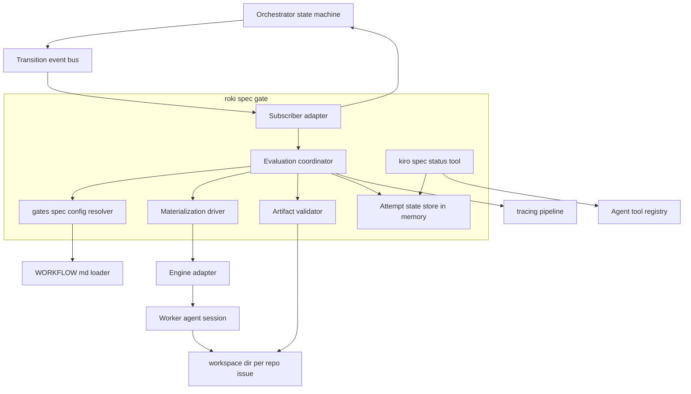
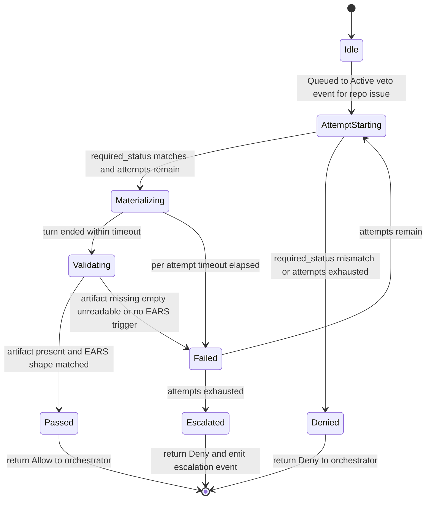
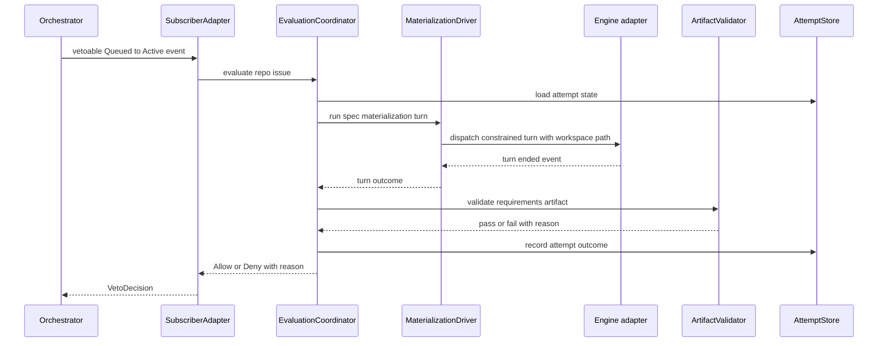

---
refs:
  id: design:roki-spec-gate
  kind: design
  title: "roki-spec-gate Design"
  spec: roki-spec-gate
  implements:
    - requirements:roki-spec-gate
---

# Design Document

## Overview

**Purpose**: roki-spec-gate is a daemon-enforced pre-implementation gate that plugs into roki-mvp's published state-machine subscription hook for the vetoable `Queued -> Active` transition. Before a `(repo, issue)` worker enters `Active`, the gate orchestrates a constrained spec-materialization agent turn whose only purpose is to produce `.kiro/specs/<issue>/requirements.md` by merging the Linear ticket body with the project's existing EARS docs under `.kiro/specs/`. The gate then validates the produced artifact mechanically — file presence plus EARS-shape regex — and maps the outcome to `Allow` or `Deny` on the vetoable transition. Validation is daemon-side and LLM-free; authoring is always agent-side. The gate is time-bounded per attempt and capped in attempt count, so it never blocks the orchestrator indefinitely.

**Users**: A solo developer or small team operator running roki against one or more Git repositories, who wants Linear-driven implementation runs to be preceded by an explicit, auditable spec phase without authoring those specs by hand for every ticket.

**Impact**: Adds one new orchestrator subscriber, one new agent tool registered through roki-mvp's `Registry`, and three reserved `WORKFLOW.md` keys under `extension.gates.spec.*`. It does not modify the orchestrator state set, the documented vetoable-transition list, the `Tool` or `Registry` trait shape, or the workspace path layout.

### Goals
- Subscribe to roki-mvp's vetoable `Queued -> Active` transition and produce a deterministic `Allow`/`Deny` decision per `(repo, issue)`.
- Drive a constrained spec-materialization turn that relies on the kiro-discovery skill auto-invocation to merge ticket EARS with project EARS docs and to write `.kiro/specs/<issue>/requirements.md`.
- Validate the produced artifact only via file presence, non-empty content, encoding sanity, and presence of EARS trigger keywords.
- Enforce per-attempt timeout and maximum attempt count from `extension.gates.spec.*` keys; emit a structured escalation event on attempt-cap exhaustion.
- Register a read-only `kiro_spec_status` tool through roki-mvp's `Registry` so subsequent agent turns can self-check the gate's view of the artifact.
- Apply hot-reloaded `WORKFLOW.md` values for any subsequent evaluation without restart.

### Non-Goals
- Changing the orchestrator state set, the documented vetoable-transition list, or the transition event payload (owned by roki-mvp).
- Modifying the `Tool` or `Registry` trait shapes (this spec only registers a new tool).
- Extending the `WORKFLOW.md` schema beyond consuming the reserved `extension.gates.spec.*` namespace already published by roki-mvp.
- Performing deep semantic validation of EARS bullets (presence + structure regex is enough).
- Project-wide spec synchronization across multiple specs (deferred to a future `roki-spec-sync`).
- Review-gate logic (deferred to roki-review-gate) and post-merge distill (deferred to roki-distill-postmerge).
- Persistent storage of gate attempts beyond in-memory state and structured logs.

## Boundary Commitments

### This Spec Owns
- The `SpecGate` subscriber that registers against roki-mvp's vetoable `Queued -> Active` transition hook and returns `VetoDecision::Allow` or `VetoDecision::Deny { reason }`.
- The spec-materialization-turn invocation contract: how the gate signals to the agent session that a constrained spec-materialization turn must run, how it scopes the turn to producing `.kiro/specs/<issue>/requirements.md`, and how it interprets turn completion.
- The mechanical validator that decides pass or fail purely from file presence, non-empty content, encoding sanity, and EARS-trigger regex.
- The per-attempt timeout enforcement and the per-`(repo, issue)` attempt-cap enforcement, including the upper bound on total time the gate may hold a transition.
- The structured gate-decision and escalation events emitted through roki-mvp's tracing pipeline.
- The `kiro_spec_status` tool: its name, input schema, output schema, read-only semantics, and registration through roki-mvp's `Registry`.
- The default values applied to `extension.gates.spec.required_status`, `extension.gates.spec.timeout_ms`, and `extension.gates.spec.max_attempts` when absent from a repository's `WORKFLOW.md`.

### Out of Boundary
- Any modification to roki-mvp's orchestrator state set, vetoable-transition list, transition event payload, or recovery rules.
- Any modification to the `Tool` or `Registry` trait shapes; the spec only registers a new tool through them.
- Any new `WORKFLOW.md` schema keys outside `extension.gates.spec.*`.
- Linear writes, PR creation, branch management, and code edits — those remain the agent's responsibility through roki-mvp's existing tools.
- Deep semantic correctness of acceptance criteria; only EARS-shape regex is in scope.
- Project-wide spec sync across multiple specs (deferred).
- Review-gate logic; post-merge distill logic.
- Persistent state stores; container or VM isolation; multi-host SSH workers; Windows.

### Allowed Dependencies
- roki-mvp orchestrator subscription hook with `TransitionSubscriber::veto` semantics on the `Queued -> Active` transition.
- roki-mvp engine adapter and worker session as the channel through which the spec-materialization turn is dispatched.
- roki-mvp `Registry` for registering the `kiro_spec_status` tool and consuming the existing `Tool` trait.
- roki-mvp `WorkflowLoader` for the `extension.gates.spec.*` reserved namespace, including hot-reload behavior.
- roki-mvp `Logging` pipeline (tracing + redaction) for all log emissions; no separate destination.
- The kiro-discovery skill auto-invocation inside the materialization turn — relied on as a personal skill at `~/.claude/skills/kiro-discovery/`, not vendored.
- Standard Rust crates already permitted by roki-mvp: tokio, tracing, serde, serde_json, regex, thiserror.

### Revalidation Triggers
- Any change to roki-mvp's vetoable-transition list, transition event payload, or `TransitionSubscriber`/`VetoDecision` shape.
- Any change to roki-mvp's `Tool` or `Registry` trait shape.
- Any change to roki-mvp's `WORKFLOW.md` schema for the `extension.gates.*` reserved namespaces, including the loader's preservation rules.
- Any change to the workspace path layout `<workspace_root>/<repo>/<issue>/`.
- Any change to roki-mvp's lifecycle event taxonomy that the engine adapter emits during the materialization turn.
- Any change to the personal-skill discovery contract that breaks kiro-discovery auto-invocation.

## Architecture

### Architecture Pattern & Boundary Map



**Architecture Integration**:
- **Selected pattern**: Subscriber-driven gate, hexagonal style. The gate is one new adapter subscribing to roki-mvp's existing transition event bus and one new tool registered through roki-mvp's existing `Registry`. The gate depends only on traits roki-mvp publishes; roki-mvp does not import anything from this spec.
- **Domain boundaries**: SubscriberAdapter handles the orchestrator handshake; EvaluationCoordinator owns per-attempt state and timing; MaterializationDriver dispatches the constrained agent turn; ArtifactValidator owns the mechanical regex check; AttemptStore is the only stateful component; SpecStatusTool is read-only on AttemptStore.
- **Existing patterns preserved**: roki-mvp's small-daemon thesis (no DB, agent owns writes, in-memory state, `WORKFLOW.md`-driven policy), roki-mvp's `(repo, issue)` keying, roki-mvp's tracing-and-redaction pipeline.
- **New components rationale**: SubscriberAdapter and EvaluationCoordinator are the gate's reason to exist; AttemptStore is needed because the gate must enforce attempt caps across veto retries while staying restart-tolerant; SpecStatusTool exists so the agent can self-check without parsing logs.
- **Steering compliance**: Rust 2024 + tokio, no SQLite, kiro skills as personal skills.

### Technology Stack

| Layer | Choice / Version | Role in Feature | Notes |
|-------|------------------|-----------------|-------|
| Backend / Services | Rust 2024 + tokio 1.x | Async subscriber, per-attempt timer, materialization driver | Reuses roki-mvp's runtime; no new runtime |
| Data / Storage | In-memory only | AttemptStore keyed by `(RepoId, IssueId)` | No database; reconstructable on restart |
| Messaging / Events | tokio mpsc + broadcast (already in roki-mvp) | Receives transition events; emits structured logs | Uses roki-mvp's existing event bus |
| Templating | regex 1.x | EARS-trigger regex on `requirements.md` | Compiled once, reused per validation |
| Logging | tracing + tracing-subscriber (already in roki-mvp) | Gate decision and escalation events | Reuses roki-mvp's pipeline and redaction layer |
| Schema | serde_json 1.x | `kiro_spec_status` input/output JSON-Schema | JSON-Schema strings declared as static `&'static str` |

> No new runtime, no new transport, no new persistence. Every dependency this spec touches already ships in roki-mvp.

## File Structure Plan

### Directory Structure

```
src/
└── gates/
    └── spec/
        ├── mod.rs                       # Public entry: SpecGate::install(...)
        ├── subscriber.rs                # SubscriberAdapter: TransitionSubscriber impl, veto handshake
        ├── evaluation.rs                # EvaluationCoordinator: per-(repo, issue) attempt loop
        ├── materialization.rs           # MaterializationDriver: constrained turn invocation contract
        ├── validator.rs                 # ArtifactValidator: file presence + EARS regex
        ├── attempts.rs                  # AttemptStore: in-memory per-(repo, issue) state
        ├── config.rs                    # ConfigResolver: extension.gates.spec.* read + defaults
        ├── tool.rs                      # SpecStatusTool: kiro_spec_status read-only tool
        └── events.rs                    # Structured event names and helpers for tracing
tests/
├── integration_spec_gate.rs             # End-to-end gate flow against fake orchestrator + agent
├── integration_spec_gate_tool.rs        # kiro_spec_status read-only behavior
└── integration_spec_gate_config.rs      # Config defaults, hot-reload pickup, misconfiguration
```

> All new files live under `src/gates/spec/` so the gate is self-contained and so future sibling gates (review gate) can mirror the pattern under `src/gates/review/`. Each file owns one responsibility; no file imports from `src/orchestrator/worker.rs` or any other roki-mvp internal — only from published traits.

### Modified Files
- `src/main.rs` (or `src/orchestrator/mod.rs`, whichever roki-mvp uses for boot wiring) — add a single call site that constructs `SpecGate` and installs it against the orchestrator subscription registry and the agent tool registry. The change is additive and gated behind the same boot path roki-mvp already uses for its built-in subscribers.
- `SPEC.md` — add a short subsection under the existing extension-points discussion describing the spec gate's reserved `extension.gates.spec.*` keys, the `kiro_spec_status` tool name and read-only contract, and the documented total time bound.

> No other roki-mvp files are modified; the spec gate is purely additive against published extension points.

## System Flows

### Per-attempt evaluation lifecycle



> All transitions in this gate are internal to the spec-gate module. The only outward decision is `Allow` or `Deny` on the orchestrator's vetoable `Queued -> Active`. `Failed -> AttemptStarting` only fires when the orchestrator republishes the transition event for the same `(repo, issue)` after an outer backoff; the gate does not loop autonomously on its own attempts.

### Vetoable transition handshake



## Requirements Traceability

| Requirement | Summary | Components | Interfaces | Flows |
|-------------|---------|------------|------------|-------|
| 1.1, 1.2, 1.3, 1.4, 1.5 | Subscription against `Queued -> Active` vetoable transition | SubscriberAdapter | `TransitionSubscriber`, `VetoDecision` | Vetoable transition handshake |
| 2.1, 2.2, 2.3, 2.4, 2.5 | Spec-materialization turn invocation | MaterializationDriver, EvaluationCoordinator | Constrained turn invocation contract | Vetoable transition handshake |
| 3.1, 3.2, 3.3, 3.4, 3.5 | Daemon-side EARS-shape validation | ArtifactValidator | Validator API, regex set | Per-attempt evaluation lifecycle |
| 4.1, 4.2, 4.3, 4.4, 4.5, 4.6 | Time bounding and retry policy | EvaluationCoordinator, AttemptStore, ConfigResolver | Timeout, attempt cap, escalation event | Per-attempt evaluation lifecycle |
| 5.1, 5.2, 5.3, 5.4, 5.5 | Pass/fail mapping to `VetoDecision` | SubscriberAdapter, EvaluationCoordinator | `VetoDecision::Allow`/`Deny` | Vetoable transition handshake |
| 6.1, 6.2, 6.3, 6.4, 6.5 | `kiro_spec_status` read-only tool | SpecStatusTool, AttemptStore | `Tool` trait, JSON-Schema strings | n/a |
| 7.1, 7.2, 7.3, 7.4, 7.5 | `WORKFLOW.md` configuration surface | ConfigResolver | `extension.gates.spec.*` keys | n/a |
| 8.1, 8.2, 8.3, 8.4, 8.5 | Concurrency, idempotency, multi-repo independence | EvaluationCoordinator, AttemptStore | Per-`(repo, issue)` keying, idempotent dedup | Per-attempt evaluation lifecycle |
| 9.1, 9.2, 9.3, 9.4, 9.5 | Observability and escalation | events.rs, all components | tracing pipeline (roki-mvp) | n/a |

## Components and Interfaces

| Component | Domain/Layer | Intent | Req Coverage | Key Dependencies (P0/P1) | Contracts |
|-----------|--------------|--------|--------------|--------------------------|-----------|
| SpecGate | Gate root | Compose subgates, install subscriber and tool, expose entry point | 1.1, 6.1 | roki-mvp Orchestrator subscribe (P0), roki-mvp Registry (P0) | Service |
| SubscriberAdapter | Gate / Orchestrator handshake | Implement `TransitionSubscriber`; route `Queued -> Active` veto calls into the coordinator | 1.1, 1.2, 1.3, 1.4, 1.5, 5.1, 5.2, 5.3, 5.5 | EvaluationCoordinator (P0), roki-mvp `TransitionSubscriber` (P0) | Service, Event |
| EvaluationCoordinator | Gate / Core | Drive per-`(repo, issue)` evaluation: load attempt state, run materialization, validate, record outcome | 2.1, 2.4, 4.1, 4.2, 4.3, 4.4, 4.5, 4.6, 5.1, 5.2, 5.3, 5.4, 5.5, 8.1, 8.2, 8.3 | MaterializationDriver (P0), ArtifactValidator (P0), AttemptStore (P0), ConfigResolver (P0), Logging (P0) | Service, State |
| MaterializationDriver | Gate / Engine integration | Dispatch a constrained spec-materialization turn against the agent session and report turn outcome | 2.1, 2.2, 2.3, 2.4, 2.5, 4.1, 4.4 | roki-mvp EngineAdapter (P0), WorkflowPolicy (P0) | Service |
| ArtifactValidator | Gate / Validation | Validate `.kiro/specs/<issue>/requirements.md` by file presence, non-empty, encoding sanity, EARS-trigger regex | 3.1, 3.2, 3.3, 3.4, 3.5 | filesystem (P0), regex (P0) | Service |
| AttemptStore | Gate / State | Track per-`(repo, issue)` attempt index, in-flight flag, last outcome, last reason | 4.3, 4.5, 8.1, 8.2, 8.3, 8.4, 8.5, 6.2, 6.3 | None (P0) | State |
| ConfigResolver | Gate / Configuration | Read `extension.gates.spec.*` keys from roki-mvp's `WorkflowPolicy` and apply documented defaults | 7.1, 7.2, 7.3, 7.4, 7.5 | roki-mvp WorkflowLoader (P0) | Service, State |
| SpecStatusTool | Gate / Agent tool | Implement roki-mvp's `Tool` trait for `kiro_spec_status`; return read-only view of AttemptStore for a `(repo, issue)` | 6.1, 6.2, 6.3, 6.4, 6.5 | AttemptStore (P0), roki-mvp `Tool`/`Registry` (P0) | Service, API |
| events.rs | Gate / Observability | Structured event names and helpers; redaction-safe field set | 9.1, 9.2, 9.3, 9.4, 9.5 | roki-mvp Logging (P0) | Event |

> Dependency direction: `SpecGate` → `SubscriberAdapter` + `SpecStatusTool` → `EvaluationCoordinator` → `{MaterializationDriver, ArtifactValidator, AttemptStore, ConfigResolver}` → roki-mvp published traits + std/tokio. No upward imports.

### Gate root

#### SpecGate

| Field | Detail |
|-------|--------|
| Intent | Compose the gate, install its subscriber on the orchestrator, and register the `kiro_spec_status` tool |
| Requirements | 1.1, 6.1 |

**Responsibilities & Constraints**
- Construct `EvaluationCoordinator`, `AttemptStore`, `ConfigResolver`, `MaterializationDriver`, `ArtifactValidator`, `SubscriberAdapter`, and `SpecStatusTool`.
- Call the orchestrator's subscription API to attach `SubscriberAdapter`.
- Call the registry's `register` method to attach `SpecStatusTool`.
- Hold a `SubscriptionHandle` for clean shutdown.

**Dependencies**
- Inbound: roki-mvp boot wiring (P0)
- Outbound: roki-mvp `Orchestrator::subscribe` (P0)
- Outbound: roki-mvp `Registry::register` (P0)

**Contracts**: Service [x] / API [ ] / Event [ ] / Batch [ ] / State [ ]

##### Service Interface (Rust trait sketch)

```rust
pub struct SpecGate { /* opaque */ }

impl SpecGate {
    pub fn install(
        orchestrator: &dyn roki_mvp::Orchestrator,
        registry: &dyn roki_mvp::Registry,
        engine: Arc<dyn roki_mvp::Engine>,
        workflow: Arc<dyn roki_mvp::WorkflowLoader>,
    ) -> Result<SpecGateHandle, SpecGateInstallError>;
}

pub struct SpecGateHandle {
    _subscription: roki_mvp::SubscriptionHandle,
}
```

**Implementation Notes**
- Integration: a single `install` call site in roki-mvp's boot wiring; the gate fails closed at boot if either the subscription or the tool registration fails, with a structured error pointing at the failed step.

### SubscriberAdapter

| Field | Detail |
|-------|--------|
| Intent | Implement `TransitionSubscriber`; map vetoable `Queued -> Active` calls into the gate; ignore other transitions |
| Requirements | 1.1, 1.2, 1.3, 1.4, 1.5, 5.1, 5.2, 5.3, 5.5 |

**Responsibilities & Constraints**
- Implement `on_transition` as a no-op (event observation only is uninteresting for this gate; the work is on `veto`).
- Implement `veto` only for `Queued -> Active`; for any other transition, return `VetoDecision::Allow` immediately so the gate is inert outside its declared seam.
- Convert internal evaluator outcomes into `VetoDecision`: pass → `Allow`; fail-with-attempts-remaining → `Deny { reason }`; cap exhausted → `Deny { reason }` plus escalation event.
- Catch and log unexpected internal errors as `Deny { reason: "spec_gate_internal_error" }` (fail closed).

**Dependencies**
- Inbound: roki-mvp orchestrator subscription dispatch (P0)
- Outbound: EvaluationCoordinator (P0)

**Contracts**: Service [x] / API [ ] / Event [x] / Batch [ ] / State [ ]

##### Service Interface

```rust
#[async_trait]
impl roki_mvp::TransitionSubscriber for SubscriberAdapter {
    async fn on_transition(&self, _event: &TransitionEvent) -> Result<(), SubscriberError> {
        Ok(())
    }

    async fn veto(&self, event: &TransitionEvent) -> Result<VetoDecision, SubscriberError> {
        if !is_queued_to_active(event) {
            return Ok(VetoDecision::Allow);
        }
        match self.coordinator.evaluate(event.repo.clone(), event.issue.clone(), event.correlation_id).await {
            Ok(GateOutcome::Pass) => Ok(VetoDecision::Allow),
            Ok(GateOutcome::Deny { reason, escalate }) => {
                if escalate {
                    self.events.emit_escalation(event, &reason);
                }
                Ok(VetoDecision::Deny { reason })
            }
            Err(internal) => {
                self.events.emit_internal_error(event, &internal);
                Ok(VetoDecision::Deny { reason: "spec_gate_internal_error".into() })
            }
        }
    }
}
```

- Preconditions: `is_queued_to_active` matches the orchestrator's documented `previous = Queued`, `next = Active` shape.
- Postconditions: a `VetoDecision` is always returned; subscriber errors never propagate as `Err`.
- Invariants: only `Queued -> Active` triggers the coordinator; all other transitions are short-circuited to `Allow`.

### EvaluationCoordinator

| Field | Detail |
|-------|--------|
| Intent | Run one evaluation per `(repo, issue)`: gate-status check, attempt budget check, materialization, validation, outcome recording |
| Requirements | 2.1, 2.4, 4.1, 4.2, 4.3, 4.4, 4.5, 4.6, 5.1, 5.2, 5.3, 5.4, 5.5, 8.1, 8.2, 8.3 |

**Responsibilities & Constraints**
- Acquire a per-`(repo, issue)` lock so concurrent vetoable events for the same `(repo, issue)` cannot run twice (Requirement 1.3).
- Read `extension.gates.spec.required_status` and short-circuit to `Allow` if the orchestrator-supplied trigger context indicates the issue is not in `required_status` (Requirement 7.3). Operationally, the gate uses `correlation_id`-bound metadata included in the transition event payload published by roki-mvp; if that metadata is absent, the gate evaluates conservatively on every `Queued -> Active`.
- Read `extension.gates.spec.timeout_ms` and `extension.gates.spec.max_attempts`; if either resolves non-positive, return `Deny { reason: "spec_gate_misconfigured" }` and log (Requirement 7.5).
- Increment the per-`(repo, issue)` attempt counter only when an attempt actually starts; do not increment for duplicate transition events that map to the same in-flight attempt (Requirement 8.2).
- Wrap the materialization-and-validation step in `tokio::time::timeout(timeout_ms, ...)` so the per-attempt time bound is hard (Requirement 4.1, 4.2, 4.4).
- On `Pass` → `GateOutcome::Pass`. On `Fail` with attempts remaining → `GateOutcome::Deny { reason, escalate: false }`. On attempts-cap exhaustion → `GateOutcome::Deny { reason, escalate: true }`.
- Publish per-step structured events (start, materialization-start/end, validation outcome, decision, escalation) through `events.rs` (Requirements 9.1, 9.2).
- Treat any internal panic or `Err` from materialization or validation as `Fail` with reason for that attempt; do not raise to caller.

**Dependencies**
- Inbound: SubscriberAdapter (P0)
- Outbound: MaterializationDriver, ArtifactValidator, AttemptStore, ConfigResolver, events.rs (P0)

**Contracts**: Service [x] / API [ ] / Event [x] / Batch [ ] / State [x]

##### Service Interface

```rust
pub trait EvaluationCoordinator: Send + Sync {
    async fn evaluate(
        &self,
        repo: RepoId,
        issue: IssueId,
        correlation_id: CorrelationId,
    ) -> Result<GateOutcome, GateInternalError>;
}

pub enum GateOutcome {
    Pass,
    Deny { reason: String, escalate: bool },
}
```

- Preconditions: AttemptStore reachable; ConfigResolver resolves a `SpecGateConfig` for the repo.
- Postconditions: AttemptStore reflects the new attempt outcome; structured events emitted; no on-disk mutations except those produced by the agent inside the materialization turn.
- Invariants: a single in-flight attempt per `(repo, issue)`; attempt counter never decreases; never returns `Pass` without a passing validation result derived from artifact bytes.

**Implementation Notes**
- Integration: per-`(repo, issue)` mutex implemented via a `DashMap<(RepoId, IssueId), Arc<Mutex<EvaluationSlot>>>` to bound contention; idempotency dedup is keyed by `correlation_id` so duplicate orchestrator events about the same logical attempt collapse onto one outcome (Requirement 8.2).
- Validation: `tokio::time::timeout` is the only timing primitive; no spinning. The total upper bound advertised in Requirement 4.6 is `timeout_ms * max_attempts` plus a small overhead window for store/log writes, documented in `SPEC.md`.
- Risks: orchestrator republishing the vetoable event during an in-flight attempt. Mitigation: per-`(repo, issue)` lock plus `correlation_id` dedup; while in-flight, duplicate calls return the in-flight attempt's eventual outcome.

### MaterializationDriver

| Field | Detail |
|-------|--------|
| Intent | Dispatch a constrained spec-materialization turn against the agent session for the affected `(repo, issue)` and report turn outcome |
| Requirements | 2.1, 2.2, 2.3, 2.4, 2.5, 4.1, 4.4 |

**Responsibilities & Constraints**
- Construct the turn's prompt frame as a constrained, single-purpose instruction:
  - The turn's only purpose is to produce `.kiro/specs/<issue>/requirements.md`.
  - Provide the Linear ticket identifier, the absolute workspace path under `<workspace_root>/<repo>/<issue>/`, the relative path to the project's `.kiro/specs/` tree, and a directive to use the kiro-discovery skill auto-invocation to merge ticket EARS with project EARS docs.
  - Forbid any output destination outside `.kiro/specs/<issue>/requirements.md`.
- Hand the prompt to roki-mvp's engine adapter via the existing worker session for the `(repo, issue)`. The engine adapter owns the actual turn dispatch, max_turns enforcement, stall detection, and stream-json parsing; this driver only frames the prompt and waits for turn completion.
- Surface a turn outcome enum: `Completed` (turn finished cleanly), `EngineError` (turn could not be dispatched), `EngineStalled` (engine adapter reported stall). The driver does not interpret intermediate agent messages.
- The per-attempt timeout is enforced by EvaluationCoordinator wrapping the driver call; the driver simply yields when the engine adapter returns or when its caller cancels the future.

**Dependencies**
- Inbound: EvaluationCoordinator (P0)
- Outbound: roki-mvp `Engine` trait (P0); roki-mvp `WorkflowPolicy` (read-only) for any per-repo policy that the engine adapter expects (P0)

**Contracts**: Service [x] / API [ ] / Event [ ] / Batch [ ] / State [ ]

##### Service Interface

```rust
pub trait MaterializationDriver: Send + Sync {
    async fn run(
        &self,
        ctx: MaterializationContext,
    ) -> Result<TurnOutcome, MaterializationError>;
}

pub struct MaterializationContext {
    pub repo: RepoId,
    pub issue: IssueId,
    pub workspace: PathBuf,                  // <workspace_root>/<repo>/<issue>/
    pub project_specs_dir: PathBuf,          // workspace.join(".kiro/specs")
    pub linear_issue_ref: String,            // e.g., issue identifier the agent already has
    pub correlation_id: CorrelationId,
    pub policy: WorkflowPolicy,
}

pub enum TurnOutcome { Completed, EngineError(String), EngineStalled }
```

- Preconditions: workspace exists (created by roki-mvp before `Queued`); the worker's agent session is constructible by the engine adapter.
- Postconditions: control returns once the turn ends or the caller cancels via the per-attempt timeout.
- Invariants: this driver does not write any file; only the agent inside the turn does.

**Implementation Notes**
- Integration: the engine adapter already exposes a per-worker prompt channel; the driver writes one constrained prompt and waits for a single turn boundary event from the engine's stream-json mapping.
- Validation: the driver does not validate; validation is the next step in the coordinator.
- Risks: skill auto-invocation fails because kiro-discovery is missing on the operator's system. Mitigation: the gate's failure mode is benign — the artifact will be missing or malformed, the validator will fail closed, and the gate logs a structured event whose reason can be filtered to surface skill-availability problems.

### ArtifactValidator

| Field | Detail |
|-------|--------|
| Intent | Decide pass/fail purely by file presence, non-empty content, encoding sanity, and EARS-trigger regex |
| Requirements | 3.1, 3.2, 3.3, 3.4, 3.5 |

**Responsibilities & Constraints**
- Resolve the artifact path as `<workspace_root>/<repo>/<issue>/.kiro/specs/<issue>/requirements.md`.
- Fail closed if the file does not exist, is zero-bytes, fails UTF-8 decoding, or exceeds a sanity-bound size (configurable constant; documented default).
- Run a precompiled regex set against the file body; the file is EARS-shaped if the regex finds at least one occurrence, on its own line or as the first non-whitespace token of a list item, of `WHEN`, `IF`, `WHILE`, `WHERE`, or `SHALL` (case-insensitive).
- Return a `ValidationOutcome { verdict, reason }` where `reason` is one of a fixed enum: `ok`, `missing`, `empty`, `unreadable`, `oversize`, `not_utf8`, `no_ears_trigger`.
- Emit no log lines itself; the coordinator logs the outcome.

**Dependencies**
- Inbound: EvaluationCoordinator (P0)
- Outbound: filesystem (P0); regex (P0)

**Contracts**: Service [x] / API [ ] / Event [ ] / Batch [ ] / State [ ]

##### Service Interface

```rust
pub trait ArtifactValidator: Send + Sync {
    async fn validate(&self, artifact: PathBuf) -> ValidationOutcome;
}

pub struct ValidationOutcome {
    pub verdict: Verdict,
    pub reason: ValidationReason,
}

pub enum Verdict { Pass, Fail }

pub enum ValidationReason {
    Ok, Missing, Empty, Unreadable, Oversize, NotUtf8, NoEarsTrigger,
}
```

- Preconditions: `artifact` is an absolute path inside the workspace.
- Postconditions: never panics; all I/O errors collapse to a `ValidationReason`.
- Invariants: never touches files other than the artifact path; never invokes an LLM.

**Implementation Notes**
- Integration: regex compiled once at construction. Suggested pattern (case-insensitive, multiline): `(?im)^\s*[-*]?\s*\d*\.?\s*(WHEN|IF|WHILE|WHERE)\b|\bSHALL\b`.
- Validation: keep the size cap conservative (e.g., 1 MiB) to avoid unbounded reads from a runaway turn.
- Risks: false negatives if the agent writes EARS triggers in a non-Latin transliteration. Mitigation: the spec language is configurable upstream; for the MVP gate, the EARS keywords remain fixed English per the roki-mvp `ears-format.md` rule that trigger keywords are kept in English.

### AttemptStore

| Field | Detail |
|-------|--------|
| Intent | Track per-`(repo, issue)` attempt index, in-flight flag, last outcome, and last reason without persistent storage |
| Requirements | 4.3, 4.5, 8.1, 8.2, 8.3, 8.4, 8.5, 6.2, 6.3 |

**Responsibilities & Constraints**
- Map keyed by `(RepoId, IssueId)`; each entry stores: `attempt_count: u32`, `in_flight: bool`, `last_correlation_id: Option<CorrelationId>`, `last_outcome: Option<Verdict>`, `last_reason: Option<ValidationReason>`, `last_updated: Instant`.
- All mutations go through methods that are `&self` and use interior mutability so the SpecStatusTool can hold an `Arc` clone.
- On daemon restart, the store starts empty; the orchestrator recovery scan re-queues issues, the gate evaluates fresh, and the artifact-on-disk path is the source of truth via the validator.
- Provide a `Snapshot { artifact_present, attempt_count, attempts_remaining, last_outcome, last_reason }` builder for the SpecStatusTool.

**Dependencies**
- Inbound: EvaluationCoordinator, SpecStatusTool (P0)
- Outbound: None (P0)

**Contracts**: Service [ ] / API [ ] / Event [ ] / Batch [ ] / State [x]

**Implementation Notes**
- Integration: `DashMap` is acceptable; for higher contention scenarios a sharded `RwLock<HashMap<...>>` is equivalent.
- Validation: `attempts_remaining` is computed as `max_attempts.saturating_sub(attempt_count)` against the current `SpecGateConfig` snapshot supplied by the caller (the store does not embed config).
- Risks: stale config caching. Mitigation: callers always pass the current `SpecGateConfig` when reading via the store.

### ConfigResolver

| Field | Detail |
|-------|--------|
| Intent | Read the reserved `extension.gates.spec.*` keys from roki-mvp's `WorkflowPolicy` for a given repo and apply documented defaults |
| Requirements | 7.1, 7.2, 7.3, 7.4, 7.5 |

**Responsibilities & Constraints**
- Pull the policy via `WorkflowLoader::current(repo)`; this picks up the latest hot-reloaded value automatically (Requirement 7.4).
- Map the policy's `extension` scope into a typed `SpecGateConfig { required_status: String, timeout_ms: u32, max_attempts: u32 }`.
- Defaults applied when keys are absent: `required_status = "Todo"` (Linear's standard pre-`In Progress` state name; configurable per-repo), `timeout_ms = 600_000` (10 minutes), `max_attempts = 3`. Each defaulted key is logged once per resolution.
- If `timeout_ms` or `max_attempts` resolves non-positive, return a typed error so the coordinator can map to `Deny { reason: "spec_gate_misconfigured" }`.

**Dependencies**
- Inbound: EvaluationCoordinator (P0)
- Outbound: roki-mvp `WorkflowLoader` (P0)

**Contracts**: Service [x] / API [ ] / Event [ ] / Batch [ ] / State [x]

##### Service Interface

```rust
pub trait ConfigResolver: Send + Sync {
    fn resolve(&self, repo: &RepoId) -> Result<SpecGateConfig, ConfigError>;
}

pub struct SpecGateConfig {
    pub required_status: String,
    pub timeout_ms: u32,
    pub max_attempts: u32,
}
```

### SpecStatusTool

| Field | Detail |
|-------|--------|
| Intent | Implement roki-mvp's `Tool` trait for `kiro_spec_status` so subsequent agent turns can self-check the gate's view of the artifact |
| Requirements | 6.1, 6.2, 6.3, 6.4, 6.5 |

**Responsibilities & Constraints**
- Implement `Tool` with `name() = "kiro_spec_status"`.
- Input schema (JSON-Schema): `{ repo: string, issue: string }` (both required; both must match the orchestrator's `(repo, issue)` keying).
- Output schema (JSON-Schema): `{ artifact_path: string, artifact_present: boolean, attempt_count: integer, attempts_remaining: integer, last_outcome: enum["pass","fail","none"], last_reason: enum["ok","missing","empty","unreadable","oversize","not_utf8","no_ears_trigger","none"] }`.
- Read-only: never mutates AttemptStore or filesystem.
- If the requested `(repo, issue)` is not currently tracked by the orchestrator, return `{ artifact_present: false, attempt_count: 0, attempts_remaining: <max_attempts>, last_outcome: "none", last_reason: "none" }` with `artifact_path` resolved by convention; this is a not-found-shaped response, not an error (Requirement 6.4).
- Never include the Linear API token, daemon-internal credentials, or any path outside the requested `(repo, issue)` workspace in any output field (Requirement 6.5).

**Dependencies**
- Inbound: roki-mvp `Registry` dispatch (P0)
- Outbound: AttemptStore (P0); ConfigResolver (P0) for `attempts_remaining` baseline

**Contracts**: Service [x] / API [x] / Event [ ] / Batch [ ] / State [ ]

##### API Contract (`kiro_spec_status`)

| Method | Endpoint | Request | Response | Errors |
|--------|----------|---------|----------|--------|
| Tool call | `kiro_spec_status` | `{ repo: string, issue: string }` | Snapshot fields above | `INVALID_INPUT` (missing or non-string field), `INTERNAL` (only if AttemptStore read fails — never expected) |

### events.rs

| Field | Detail |
|-------|--------|
| Intent | Centralize structured event names and helpers for tracing |
| Requirements | 9.1, 9.2, 9.3, 9.4, 9.5 |

**Responsibilities & Constraints**
- Define a fixed event-name set: `spec_gate.evaluation.start`, `spec_gate.materialization.start`, `spec_gate.materialization.end`, `spec_gate.timeout`, `spec_gate.validation.outcome`, `spec_gate.decision`, `spec_gate.escalation`, `spec_gate.misconfigured`, `spec_gate.internal_error`.
- Every event emitted with `repo`, `issue`, `correlation_id`, `attempt_index` (where applicable).
- Use roki-mvp's tracing pipeline directly via `tracing::info!`/`warn!`/`error!`; rely on roki-mvp's redaction layer for secret scrubbing.

**Implementation Notes**
- Integration: declarative `const` event names so log filters can match on stable strings.
- Validation: never embed the Linear API token, raw `WORKFLOW.md` source, or workspace paths outside the affected `(repo, issue)`.

## Data Models

### Domain Model

The gate has no persistent domain model. The runtime in-memory model has one aggregate:
- **GateAttemptState** keyed by `(RepoId, IssueId)`, owning `attempt_count`, `in_flight`, `last_correlation_id`, `last_outcome`, `last_reason`, `last_updated`. Reconstructable on restart from a fresh evaluation cycle plus the on-disk artifact.

### Data Contracts & Integration

- `kiro_spec_status` request/response: documented above. JSON-only, no binary payloads.
- `WORKFLOW.md` reading: the gate consumes `extension.gates.spec.required_status`, `extension.gates.spec.timeout_ms`, `extension.gates.spec.max_attempts`; the gate does not write to `WORKFLOW.md`.
- Spec artifact contract: `<workspace_root>/<repo>/<issue>/.kiro/specs/<issue>/requirements.md` — same path the agent already writes via the kiro-discovery skill auto-invocation; this gate only reads it.

## Error Handling

### Error Strategy

The gate fails closed: every internal error path collapses into a `Deny` decision with a redaction-safe reason. The gate never raises an `Err` to the orchestrator; subscriber error isolation in roki-mvp is preserved.

### Error Categories and Responses

- **Misconfiguration** (`extension.gates.spec.timeout_ms <= 0` or `max_attempts <= 0`, missing required fields): return `Deny { reason: "spec_gate_misconfigured" }`, emit `spec_gate.misconfigured` event with the offending key path. The gate keeps refusing transitions for that repo until the operator fixes `WORKFLOW.md` (next hot-reload picks up the change).
- **Materialization-turn failure** (engine-side error or stall reported by engine adapter): treat as failed attempt, record the reason, advance attempt counter, retry on next orchestrator transition event up to `max_attempts`.
- **Per-attempt timeout** (`tokio::time::timeout` elapsed): treat as failed attempt with `reason = timeout`, do not allow validation to back-fill a pass on that attempt.
- **Validation failure** (file missing, empty, unreadable, oversize, not UTF-8, no EARS trigger): treat as failed attempt with the corresponding `ValidationReason`.
- **Attempts exhausted**: return `Deny`, emit `spec_gate.escalation` event, do not start further attempts for the same `(repo, issue)` until the orchestrator's recovery rules say otherwise.
- **Internal panic / unexpected error**: caught by SubscriberAdapter, mapped to `Deny { reason: "spec_gate_internal_error" }`, full error logged with redaction.

### Monitoring

All decisions are logged via tracing with `(repo, issue, correlation_id, attempt_index)` context fields. Operators can filter on stable event-name strings declared in `events.rs`.

## Testing Strategy

### Unit Tests
- **ArtifactValidator** rejects each documented failure mode (missing, empty, unreadable, oversize, not UTF-8, no EARS trigger) and accepts a representative passing artifact, returning the corresponding `ValidationReason` for each — directly verifies Requirement 3.1, 3.2, 3.3.
- **ConfigResolver** applies documented defaults when each `extension.gates.spec.*` key is absent, logs the defaulting once per resolution, and returns a misconfiguration error when `timeout_ms` or `max_attempts` is non-positive — directly verifies Requirements 7.1, 7.2, 7.5.
- **AttemptStore** preserves `attempt_count` monotonicity across mixed reads/writes, preserves correlation-id-based dedup so a duplicate vetoable event with the same `correlation_id` does not double-increment attempts, and starts empty after a synthetic restart — verifies Requirements 8.2, 8.4, 8.5.
- **SpecStatusTool** returns a not-found-shaped response when the orchestrator does not currently track the queried `(repo, issue)`, and never echoes paths or fields outside the queried scope — verifies Requirements 6.4, 6.5.
- **EvaluationCoordinator timeout path** ensures `tokio::time::timeout` causes a `Fail { reason: timeout }` outcome and does not advance to validation, with the per-attempt elapsed timer measured from attempt start only — verifies Requirements 4.1, 4.2, 4.4.

### Integration Tests
- **End-to-end pass path**: register the gate against a fake orchestrator and a fake engine adapter; the fake engine writes a valid EARS file when the materialization prompt is dispatched; assert `VetoDecision::Allow` and a `spec_gate.decision` event with verdict `pass` — verifies Requirements 1.2, 2.1, 3.1, 5.1.
- **End-to-end fail-then-pass path**: first attempt's fake engine writes nothing; second attempt's fake engine writes a valid file; assert the first `Deny` then the second `Allow`, attempt counter increments to 2, and no escalation event is emitted — verifies Requirements 4.3, 5.2, 8.2.
- **End-to-end attempts-exhausted path**: every attempt writes nothing; assert `max_attempts` denies in sequence, the final attempt emits `spec_gate.escalation`, and the gate refuses additional attempts for the same `(repo, issue)` — verifies Requirements 4.5, 5.3, 9.4.
- **`kiro_spec_status` round-trip**: dispatch the tool through roki-mvp's `Registry` from a fake worker session; assert the response shape matches the published JSON-Schema and that the AttemptStore is unchanged before and after the call — verifies Requirements 6.1, 6.2, 6.3.
- **Hot-reload pickup**: change `extension.gates.spec.max_attempts` mid-test via the fake `WorkflowLoader`; the next evaluation must use the new value without daemon restart — verifies Requirement 7.4.
- **Subscription scope**: dispatch a non-`Queued -> Active` vetoable event through the gate's subscriber and assert `VetoDecision::Allow` with no coordinator invocation — verifies Requirement 1.5.

### E2E Tests (informational; runs against fake `claude` binary already used by roki-mvp's harness)
- A fake Linear stub plus a fake `claude` binary drive a full happy path from `Queued -> Active` through the spec gate to a valid `requirements.md` and an allowed transition for a single `(repo, issue)`.
- The same harness drives a failure path that exhausts the attempt budget, lands in escalation, and leaves the issue in `Queued` for operator inspection.

### Performance / Load (informational)
- A burst of 50 concurrent vetoable events across distinct `(repo, issue)` pairs; assert each gate evaluation runs independently and that no per-`(repo, issue)` state cross-contaminates — verifies Requirement 8.1.
- Duplicate-event burst for a single `(repo, issue)`; assert attempt counter increments at most once per logical attempt — verifies Requirement 8.2.

## Optional Sections

### Security Considerations

- The gate never holds any credential; the Linear API token remains owned by roki-mvp's `LinearGraphqlTool` and never crosses the gate's surface.
- The `kiro_spec_status` tool is read-only and scoped to the queried `(repo, issue)`; output fields are constrained to the published JSON-Schema and never include workspace paths outside that scope (Requirement 6.5).
- The gate inherits roki-mvp's tracing redaction layer; gate event helpers do not bypass it.
- The validator caps the artifact size at a documented constant to prevent a runaway turn from forcing the daemon to load a multi-gigabyte file.

### Performance & Scalability

- The gate is on the critical path of each `Queued -> Active` transition. Targeted upper bound on gate hold time: `extension.gates.spec.timeout_ms * extension.gates.spec.max_attempts` plus a small overhead window measured in milliseconds.
- The gate's hot path is one regex run over a small text file plus one async timeout wrapper; no allocation per byte beyond the artifact read; no syscalls beyond `stat` + `read`.
- Concurrency is bounded by roki-mvp's max-concurrent-workers knob; the gate adds one per-`(repo, issue)` lock and an `Arc<dyn Tool>` for the registry, neither of which materially changes the daemon's concurrency profile.
